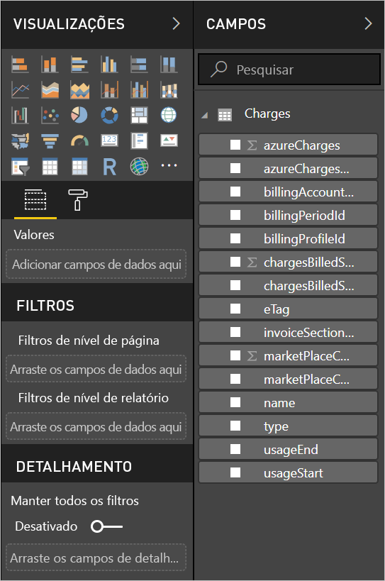

# <a name="analyze-azure-cost-and-usage-data-in-power-bi-desktop"></a>Analisar dados de uso e custo do Azure no Power BI Desktop

Você pode usar o Power BI Desktop para se conectar ao Azure e obter dados detalhados sobre o uso do serviço do Azure de sua organização. Com esses dados, você pode criar medidas e relatórios personalizados para entender melhor e analisar seus gastos do Azure.

Atualmente, o Power BI dá suporte à conexão com contas de cobrança do Contrato Enterprise e do Contrato de Cliente.

* Os usuários do **Contrato Enterprise** devem se conectar com o **conector do Azure Consumption Insights** (abaixo).

* Os usuários do **contrato de cliente** devem se conectar com o [**conector do Gerenciamento de Custos do Azure**](#connect-with-azure-cost-management).

> [!NOTE]
> Se você for um cliente do Contrato Enterprise que usa o conector do Gerenciamento de Custos do Azure e não vir a *ID do Perfil de Cobrança* na folha do Gerenciamento de Custos, você não estará na Modern Commerce Platform. Nesses casos, use o conector do Azure Consumption Insights, que solicita o número de registro no EA em vez da *ID do Perfil de Cobrança*.


## <a name="connect-with-azure-consumption-insights"></a>Conectar-se com o Azure Consumption Insights

O Azure Consumption Insights permite que você se conecte às contas de cobrança do Contrato Enterprise do Azure.

Nesta seção, você aprenderá a obter os dados que precisa migrar usando o Conector do Azure Enterprise. Você também encontrará um mapeamento de *colunas de detalhes de uso* disponível na API **ACI** (Azure Consumption Insights).

Para usar com êxito o conector do **Azure Consumption Insights**, é necessário ter acesso aos recursos do Enterprise no portal do Azure.

Para usar o conector do **Azure Consumption Insights** no **Power BI Desktop**: 

1. Na faixa de opções **Página Inicial**, selecione **Obter Dados**.

1. Selecione **Serviços Online** nas categorias à esquerda.  

1. Selecione **Microsoft Azure Consumption Insights (Beta)** . 

1. Selecione **Conectar**.

   

   Na caixa de diálogo exibida, forneça seu **Número de Registro do Azure**.

   

   * Obtenha o número de registro no [Azure Enterprise Portal](https://ea.azure.com), no local mostrado na imagem a seguir:

  

   Esta versão do conector é compatível apenas com registros empresariais de https://ea.azure.com. Atualmente, não há suporte para registros da China.

   Em seguida, forneça sua *Chave de acesso* para se conectar.

   

   * Sua Chave de acesso para o registro pode ser encontrada no [Azure Enterprise Portal](https://ea.azure.com).

  

Depois de fornecer sua *Chave de acesso* e selecionar **Conectar**, uma janela **Navegador** é exibida, mostrando as nove tabelas disponíveis:

| Tabela        | Descrição |
|------------- | -------------------------------------------------------------|
| **Orçamentos** | Detalhes sobre o orçamento para ver os custos reais ou uso em relação às metas de orçamento existentes. |
| **MarketPlace** | Encargos do Azure Marketplace com base no uso. |
| **PriceSheets** | Taxas aplicáveis por medidor para um registro. |
| **RICharges** | Encargos associados às suas Instâncias Reservadas nos últimos 24 meses. |
| **RIRecommendations_Single** | Recomendações de compra de Instância Reservada fornece com base em suas tendências de uso em uma assinatura única nos últimos 7, 30 ou 60 dias. |
| **RIRecommendations_Shared** | Recomendações de compra de Instância Reservada com base nas suas tendências de uso em todas as suas assinaturas nos últimos 7, 30 ou 60 dias. |
| **RIUsage** | Detalhes de consumo para suas Instâncias Reservadas existentes no último mês. |
| **Summaries** | Um resumo mensal dos saldos, novas compras, encargos de serviço do Azure Marketplace, ajustes e encargos de excedente. |
| **UsageDetails** | Uma divisão de quantidades consumida e encargos de registro estimados. |

Selecione uma caixa de seleção ao lado de qualquer tabela para ver uma visualização. Selecione uma ou mais tabelas marcando a caixa ao lado de seu nome e, em seguida, selecione **Carregar**.


> [!NOTE]
> As tabelas *Resumo* e *Tabela de Preços* estão disponíveis apenas para a Chave de API no nível do registro. Além disso, os dados nessas tabelas têm, por padrão, dados do mês atual para *Usage* e *PriceSheet*. As tabelas *Summary* e *MarketPlace* não são restritas ao mês atual.
>
>

Quando você seleciona **Carregar**, os dados são carregados no **Power BI Desktop**.


Depois que os dados selecionados forem carregados, as tabelas e os campos selecionados poderão ser vistos no painel **Campos**.


## <a name="using-azure-consumption-insights"></a>Usando o Azure Consumption Insights
Para usar o conector do **Azure Consumption Insights**, você acessa os recursos do Enterprise no portal do Azure.

Depois de carregar os dados com êxito usando o conector do **Azure Consumption Insights**, você pode criar suas próprias medidas e colunas personalizadas usando o **Editor de Consultas**. Você também pode criar visuais, relatórios e dashboards para compartilhamento no **serviço do Power BI**.

Com uma consulta em branco, você pode recuperar uma coleção de exemplo de consultas personalizadas do Azure. Há duas maneiras de fazer essa recuperação: 

No **Power BI Desktop**: 

1. Selecione a faixa de opções **Página Inicial** 
2. Selecione **Obter Dados** > **Consulta em Branco** 

Ou, no **Editor de Consultas**: 

1. Clique com o botão direito do mouse no painel esquerdo **Consultas** 
2. Selecione **Nova Consulta > Consulta em Branco** no menu que aparece

Na **Barra de fórmulas**, digite:

    = MicrosoftAzureConsumptionInsights.Contents

A imagem a seguir mostra uma coleção de amostras que é exibida.


Ao trabalhar com relatórios e criar consultas, é possível:

* Para definir o número de meses a partir da data atual, use *numberOfMonth*
  * Usar um valor entre um e 36. Representar o número de meses, a partir da data atual, que você deseja importar. É recomendável não obter mais do que 12 meses de dados. Esse limite evita restrições de importação de consulta e limites de volume de dados do Power BI.
* Para definir um período de meses em uma janela de tempo histórico, use *startBillingDataWindow* e *endBillingDataWindow*
* Não use *numberOfMonth* junto com *startBillingDataWindow* ou *endBillingDataWindow*

## <a name="migrate-from-the-azure-enterprise-connector"></a>Migrar do Conector do Azure Enterprise

Alguns clientes criaram visuais usando o *Conector do Azure Enterprise (Beta)* . Eventualmente, ele será substituído pelo conector do **Azure Consumption Insights**. O novo conector tem recursos e aprimoramentos que incluem:

* Fontes de dados adicionais disponíveis para *Resumo de Saldo* e *Compras do Marketplace*
* Novos e avançados parâmetros, como *startBillingDataWindow* e *endBillingDataWindow*
* Melhor desempenho e capacidade de resposta

As próximas etapas mostram como fazer a transição para o conector do **Azure Consumption Insights**. Essas etapas preservam o trabalho que você já realizou para criar dashboards ou relatórios personalizados.

### <a name="step-1-connect-to-azure-using-the-new-connector"></a>Etapa 1: Conectar-se ao Azure usando o novo conector
A primeira etapa é usar o conector do **Azure Consumption Insights**, descrito anteriormente neste artigo em detalhes. Nesta etapa, selecione **Obter Dados > Consulta em Branco** na faixa de opções **Página Inicial** no **Power BI Desktop**.

### <a name="step-2-create-a-query-in-advanced-editor"></a>Etapa 2: Criar uma consulta no Editor Avançado
No **Editor de Consultas**, selecione **Editor Avançado** na seção **Consulta** da faixa de opções **Página Inicial**. Na janela do **Editor Avançado** exibida, insira a consulta a seguir:

    let    
        enrollmentNumber = "100",
        optionalParameters = [ numberOfMonth = 6, dataType="DetailCharges" ],
        data = MicrosoftAzureConsumptionInsights.Contents(enrollmentNumber, optionalParameters)   
    in     
        data


Você precisará substituir o valor de *enrollmentNumber* pelo seu número de registro. Você pode obter o número do [Portal do Azure Enterprise](https://ea.azure.com). O parâmetro *numberOfMonth* é o número de meses de dados aos quais você deseja voltar dos dados atuais. Use zero (0) para o mês atual.

Depois de selecionar **Concluído** na janela do **Editor Avançado**, a visualização é atualizada e você verá os dados do intervalo de meses especificado na tabela. Selecione **Fechar e Aplicar** e retorne.

### <a name="step-3-move-measures-and-custom-columns-to-the-new-report"></a>Etapa 3: Mover medidas e colunas personalizadas para o novo relatório
Em seguida, você precisará mover as medidas e colunas personalizadas que você criou para a nova tabela de detalhes. Veja abaixo as etapas.

1. Abra o Bloco de notas (ou outro editor de texto).
2. Selecione a medida que você deseja mover, copie o texto do campo *Fórmula* e coloque-o no Bloco de notas.

   
3. Renomeie *Query1* com o nome da tabela de detalhes original.
4. Para criar novas medidas de tabela e colunas personalizadas, clique com o botão direito do mouse na tabela e escolha **Nova Medida**. Em seguida, recorte e cole suas medidas e colunas armazenadas até que todas sejam concluídas.

### <a name="step-4-relink-tables-that-had-relationships"></a>Etapa 4: Vincular novamente as tabelas que tinham relações
Muitos dashboards têm tabelas adicionais que são usadas para pesquisa ou filtragem, tabelas de data ou tabelas, tais como essas usadas para projetos personalizados. O restabelecimento dessas relações resolve a maioria dos problemas restantes. Veja como fazer isso.

- Na guia **Modelagem** no **Power BI Desktop**, selecione **Gerenciar Relações** para exibir uma janela que permite gerenciar relações no modelo. Vincule novamente as tabelas, conforme necessário.

    

### <a name="step-5-verify-your-visuals-and-adjust-field-formatting-as-needed"></a>Etapa 5: Verificar os visuais e ajustar a formatação do campo, conforme necessário
Depois de chegar até aqui, a maioria dos visuais, das tabelas e drill downs originais deverá funcionar conforme esperado. Alguns ajustes secundários podem ser necessários, no entanto, para formatar precisamente a aparência. Reserve algum tempo para examinar cada um dos dashboards e visuais, para garantir que eles tenham a aparência desejada.

## <a name="using-the-azure-consumption-and-insights-aci-api-to-get-consumption-data"></a>Usando a API do ACI (Azure Consumption and Insights) para obter dados de consumo
O Azure também fornece a [**API do ACI (Azure Consumption and Insights)** ](https://azure.microsoft.com/blog/announcing-general-availability-of-consumption-and-charge-apis-for-enterprise-azure-customers/). Crie suas próprias soluções personalizadas para coleta, relatório e visualização de informações de consumo do Azure usando a API do ACI.

### <a name="mapping-names-and-usage-details-between-the-portal-the-connector-and-the-api"></a>Mapeamento de nomes e detalhes de uso entre o portal, o conector e a API
As colunas e os nomes dos detalhes no portal do Azure são semelhantes na API e no conector, mas não são sempre idênticos. Para ajudar a esclarecer, a tabela a seguir fornece um mapeamento. Também é indicado se a coluna é obsoleta. Para obter mais informações e definições desses termos, examine o [dicionário de dados de cobrança do Azure](https://docs.microsoft.com/azure/billing/billing-enterprise-api-usage-detail).

| Conector do ACI/ColumnName do ContentPack | Nome da Coluna de API do ACI | Nome da Coluna do EA | Obsoleto/presente para compatibilidade com versões anteriores |
| --- | --- | --- | --- |
| AccountName |accountName |Nome da conta |Não |
| AccountId |accountId | |Sim |
| AcccountOwnerId |accountOwnerEmail |AccountOwnerId |Não |
| AdditionalInfo |additionalInfo |AdditionalInfo |Não |
| AdditionalInfold | | |Sim |
| Quantidade Consumida |consumedQuantity |Quantidade Consumida |Não |
| Serviço Consumido |consumedService |Serviço Consumido |Não |
| ConsumedServiceId |consumedServiceId | |Sim |
| Custo |cost |ExtendedCost |Não |
| Centro de Custo |costCenter |Centro de Custo |Não |
| Data |data |Data |Não |
| Dia | |Dia |Não |
| DepartmentName |departmentName |Nome do Departamento |Não |
| DepartmentID |departmentId | |Sim |
| ID da Instância | | |Sim |
| InstanceId |instanceId |ID da Instância |Não |
| Localização | | |Sim |
| Categoria de Medidor |meterCategory |Categoria de Medidor |Não |
| ID de Medidor | | |Sim |
| Nome do Medidor |meterName |Nome do Medidor |Não |
| Região do Medidor |meterRegion |Região do Medidor |Não |
| Subcategoria de Medidor |meterSubCategory |Subcategoria de Medidor |Não |
| MeterId |meterId |ID de Medidor |Não |
| Mês | |Mês |Não |
| Produto |produto |Produto |Não |
| ProductId |productId | |Sim |
| Grupo de recursos |resourceGroup |Grupo de recursos |Não |
| Local do Recurso |resourceLocation |Local do Recurso |Não |
| ResourceGroupId | | |Sim |
| ResourceLocationId |resourceLocationId | |Sim |
| ResourceRate |resourceRate |ResourceRate |Não |
| ServiceAdministratorId |serviceAdministratorId |ServiceAdministratorId |Não |
| ServiceInfo1 |serviceInfo1 |ServiceInfo1 |Não |
| ServiceInfo1Id | | |Sim |
| ServiceInfo2 |serviceInfo2 |ServiceInfo2 |Não |
| ServiceInfo2Id | | |Sim |
| Identificador de Serviço de Repositório |storeServiceIdentifier |Identificador de Serviço de Repositório |Não |
| StoreServiceIdentifierId | | |Sim |
| Nome da assinatura |subscriptionName |Nome da assinatura |Não |
| Marcas |tags |Marcas |Não |
| TagsId | | |Sim |
| Unidade de Medida |unitOfMeasure |Unidade de Medida |Não |
| Ano | |Ano |Não |
| SubscriptionId |subscriptionId |SubscriptionId |Sim |
| SubscriptionGuid |subscriptionGuid |SubscriptionGuid |Não |

## <a name="connect-with-azure-cost-management"></a>Conectar-se com o Gerenciamento de Custos do Azure

Nesta seção, você aprenderá a se conectar à sua conta de cobrança do Contrato de Cliente.

> [!NOTE]
> Atualmente, o conector do Gerenciamento de Custos do Azure dá suporte aos clientes no **contrato de cliente**.  Os clientes do **Contrato Enterprise** devem usar o conector do Microsoft Azure Consumption Insights.
>
>

Para usar o conector do **Gerenciamento de Custos do Azure** no **Power BI Desktop**:

1. Na faixa de opções **Página Inicial**, selecione **Obter Dados**.

1. Nas categorias à esquerda, selecione **Azure**.

1. Selecione **Gerenciamento de Custos do Azure (Beta)** à direita.

1. Selecione **Conectar**.


   

   Na caixa de diálogo exibida, insira sua **ID do perfil de cobrança**.

   

Você pode obter a ID do [portal do Azure](https://portal.azure.com):

1. Navegue até **Gerenciamento de Custos + Cobrança**.

1. Selecione sua conta de cobrança.

1. Selecione **Perfis de cobrança** na barra lateral.

1. Selecione seu perfil de cobrança.

1. Selecione **Propriedades** na barra lateral.

1. Copie sua ID do perfil de cobrança.

   

   Será solicitado que você entre com seu email do Azure e a senha.  Após a autenticação, será exibida uma janela **Navegador** com as 12 tabelas disponíveis:

| Tabela        | Descrição |
|-------------------- | -------------------------------------------------------------|
| **Eventos de cobrança** | Um log de eventos do novas faturas, compras de crédito, entre outros. |
| **Orçamentos** | Detalhes sobre o orçamento para ver os custos reais ou uso em relação às metas de orçamento existentes. |
| **Encargos** | Um resumo mensal do uso do Azure, encargos do marketplace e encargos cobrados separadamente. |
| **Lotes de crédito** | Detalhes da compra de lote do crédito Azure para o perfil de cobrança fornecido. |
| **Resumo de crédito** | O resumo de crédito para o perfil de cobrança fornecido. |
| **Marketplace** | Encargos do Azure Marketplace com base no uso. |
| **Pricesheets** | As taxas aplicáveis por medidor para o perfil de cobrança fornecido. |
| **Encargos de RI** | Encargos associados às suas Instâncias Reservadas nos últimos 24 meses. |
| **Recomendações de RI (única)** | Recomendações de compra de Instância Reservada fornece com base em suas tendências de uso em uma assinatura única nos últimos 7, 30 ou 60 dias. |
| **Recomendações de RI (compartilhada)** | Recomendações de compra de Instância Reservada fornece com base em todas as tendências de uso de assinatura nos últimos 7, 30 ou 60 dias. |
| **Uso de RI** | Detalhes de consumo para suas Instâncias Reservadas existentes no último mês. |
| **Detalhes de uso** | Um detalhamento das quantidades consumidas e dos encargos estimados para a ID do perfil de cobrança fornecida. |

Selecione uma caixa de seleção de tabela para ver uma versão prévia.  Selecione uma ou mais tabelas marcando a caixa ao lado de seu nome e selecionando **Carregar**.


Quando você seleciona **Carregar**, os dados são carregados no **Power BI Desktop**.


Depois que os dados selecionados forem carregados, as tabelas e os campos selecionados poderão ser vistos no painel **Campos**.



Assista a [Como analisar os gastos no Power BI com o Azure Consumption Insights](https://www.youtube.com/watch?v=QKBMXXrlpEk). Este vídeo explica como examinar os dados de custo no Power BI Desktop usando o conector do Azure Consumption Insights.

## <a name="writing-custom-queries"></a>Escrevendo consultas personalizadas

Você pode criar uma [consulta M](/powerquery-m/power-query-m-reference) personalizada para personalizar o número de meses, alterar a versão da API ou realizar uma lógica mais avançada nos dados retornados.

No **Power BI Desktop**:

1. Selecione a faixa de opções **Página Inicial**
2. Selecione **Obter Dados** > **Consulta em Branco**

Ou, no **Editor de Consultas**:

1. Clique com o botão direito do mouse no painel esquerdo **Consultas**
2. Selecione **Nova Consulta > Menu em Branco** no menu que aparece

Na **Barra de fórmulas**, digite os valores mostrados a seguir, substituindo `billingProfileId` pela ID real e "encargos" por qualquer nome de tabela válido (lista acima).

```
let
    Source = AzureCostManagement.Tables(billingProfileId, [ numberOfMonths = 3 ]),
    charges = Source{[Key="charges"]}[Data]
in
    charges
```

Além de modificar o `numberOfMonths` para qualquer valor entre 1 e 36, você também pode fornecer:

* `apiVersion` para personalizar qual versão de API a consulta chama.
* `lookbackWindow`, a fim de obter recomendações de RI (única ou compartilhada), para modificar a janela na qual as recomendações serão geradas (opções válidas: 7, 30 ou 60 dias).

## <a name="next-steps"></a>Próximas etapas

Você pode se conectar a vários tipos diferentes de fontes de dados com o Power BI Desktop. Para obter mais informações, consulte os seguintes artigos:

* [O que é o Power BI Desktop?](desktop-what-is-desktop.md)
* [Fontes de dados no Power BI Desktop](desktop-data-sources.md)
* [Formatar e combinar dados com o Power BI Desktop](desktop-shape-and-combine-data.md)
* [Conectar-se a pastas de trabalho do Excel no Power BI Desktop](desktop-connect-excel.md)   
* [Inserir dados diretamente no Power BI Desktop](desktop-enter-data-directly-into-desktop.md)   
