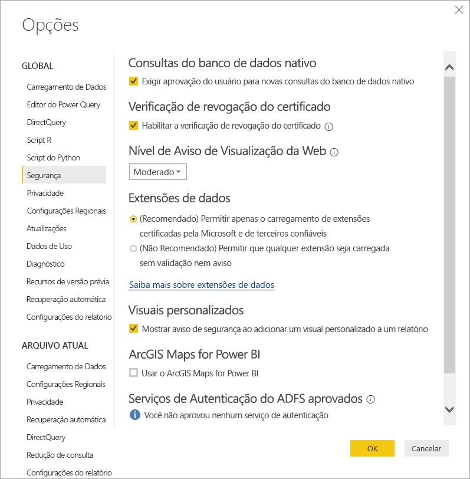

# Extensibilidade do conector no Power BI

No Power BI, clientes e desenvolvedores podem estender as fontes de dados às quais se conectam de muitas maneiras. Eles usam conectores existentes e fontes de dados genéricas (como ODBC, OData, Oledb, Web, CSV, XML, JSON). Ou os desenvolvedores criam extensões de dados, denominadas **Conectores Personalizados**, e as tornam **Conectores Certificados**.

No momento, habilite **Conectores Personalizados** usando um menu que permite que você controle com segurança o nível do código personalizado cuja execução você deseja permitir em seu sistema. É possível escolher todos os conectores ou apenas conectores certificados e distribuídos pela Microsoft na caixa de diálogo **Obter Dados**.

## Conectores personalizados

Os **Conectores Personalizados** podem incluir uma ampla gama de possibilidades, que variam de pequenas APIs essenciais para os negócios até grandes serviços específicos do setor para os quais a Microsoft ainda não lançou um conector. Muitos conectores são distribuídos pelo fornecedor. Se você precisar de um conector de dados específico, contate um fornecedor.

Para usar um **Conector Personalizado**, coloque-o na pasta *\[Documentos\\Power BI Desktop\\Conectores Personalizados* e ajuste as configurações de segurança, conforme descrito na seção a seguir.

Você não precisa ajustar as configurações de segurança para usar **Conectores Certificados**.

## Segurança da extensão de dados

Para alterar as configurações de segurança da extensão de dados, em **Power BI Desktop** selecione **Arquivo > Opções e configurações > Opções > Segurança**.

Em **Extensões de Dados**, você pode selecionar dois níveis de segurança:

* (Recomendado) Permitir o carregamento somente de extensões certificadas
* (Não recomendado) Permitir o carregamento de qualquer extensão sem aviso

Se planeja usar **Conectores Personalizados** ou conectores que você ou terceiros desenvolveram, selecione **“(Não recomendado) Permitir o carregamento de qualquer extensão sem aviso”** . Não recomendamos essa configuração de segurança, a menos que você confie completamente em seus Conectores Personalizados. Porque o código lá pode lidar com credenciais, incluindo seu envio por HTTP, e ignorar níveis de privacidade.

Na configuração de segurança **"(Recomendado)"** , se houver conectores personalizados em seu sistema, você receberá o erro “O seguinte conector não foi certificado e não foi possível verificar se é seguro usar” seguido por uma lista de conectores que não podem ser carregados com segurança.

Para resolver o erro sem alterar a segurança, remova os conectores não assinados da pasta 'Conectores Personalizados'.

Para resolver o erro e usar esses conectores, altere suas configurações de segurança para **“(Não recomendado) Permitir o carregamento de qualquer extensão sem aviso”** , conforme descrito anteriormente. Em seguida, reinicie o **Power BI Desktop**.

## Conectores certificados

Um subconjunto limitado de extensões de dados é considerado **Certificado**. Acesse os conectores certificados na caixa de diálogo **Obter Dados**. Mas, o desenvolvedor de terceiros que criou o conector é responsável por sua manutenção e suporte. Embora a Microsoft distribua os conectores, ela não é responsável por seu desempenho ou função contínua.

Se você deseja que um conector personalizado seja certificado, solicite que seu fornecedor contate dataconnectors@microsoft.com.
