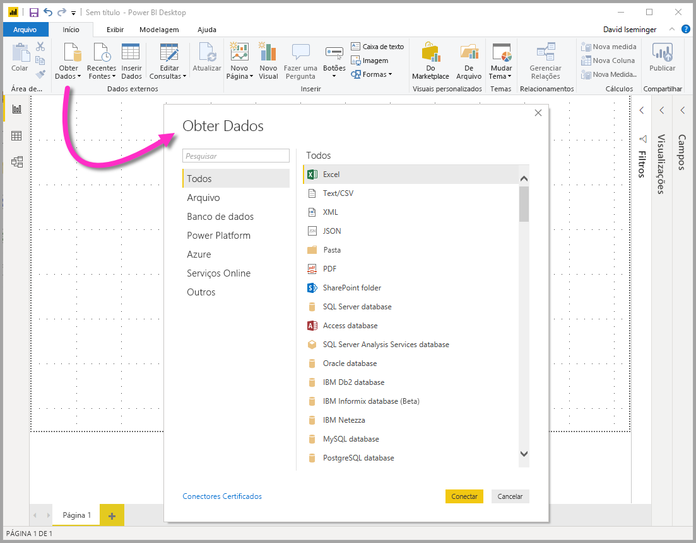
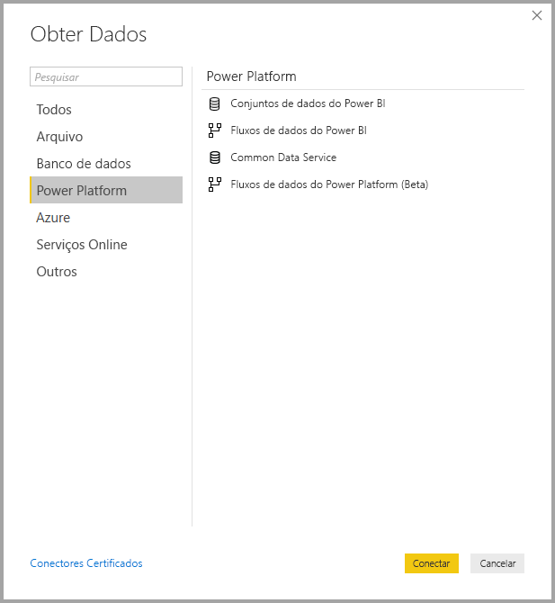
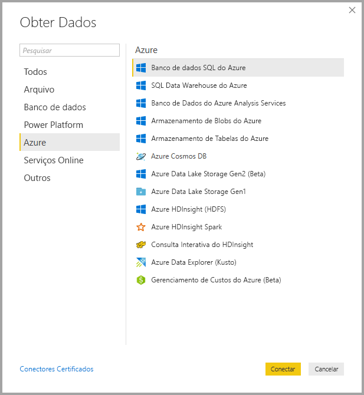
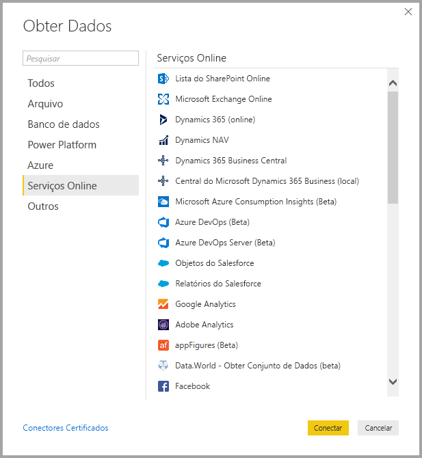
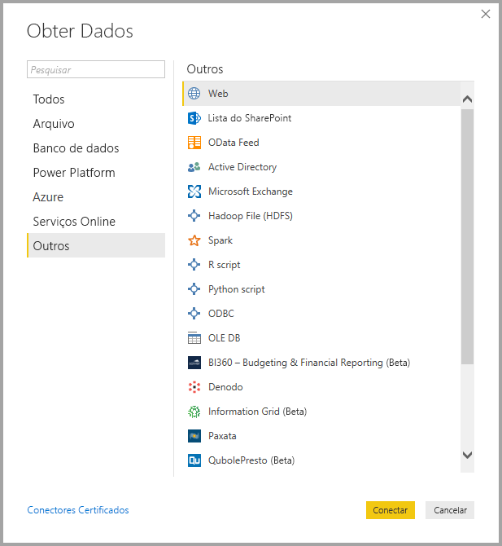
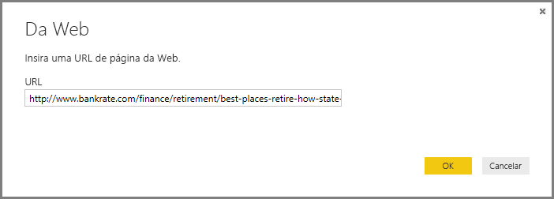
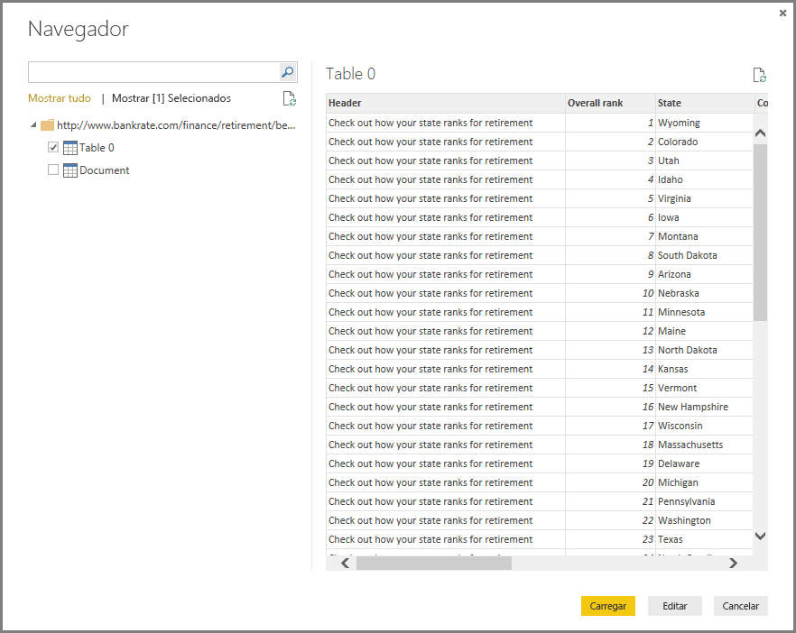

# <a name="data-sources-in-power-bi-desktop"></a>Fontes de dados no Power BI Desktop

O Power BI Desktop permite se conectar a dados de várias fontes diferentes. Para obter uma lista completa de fontes de dados disponíveis, confira [Fontes de dados do Power BI](power-bi-data-sources.md).

Para se conectar a dados, selecione **Obter Dados** na faixa de opções **Página Inicial** . Selecionar a seta para baixo ou o texto **Obter Dados** no botão exibe o menu de tipos de dados **Mais Comuns** mostrado na imagem a seguir:


Selecionar **Mais...** no menu **Mais Comuns** exibe a janela **Obter Dados**. Você também pode abrir a janela **Obter Dados** (e ignorar o menu **Mais Comuns** ) selecionando diretamente o **botão do ícone** **Obter Dados** .



> [!NOTE]
> A equipe do Power BI está sempre expandindo as fontes de dados disponíveis para o **Power BI Desktop** e o **serviço do Power BI**. Assim, você verá com frequência as versões anteriores das fontes de dados de trabalho em andamento marcadas como *Beta* ou *Visualização*. Toda fonte de dados marcada como *Beta* ou *Visualização* tem suporte e funcionalidade limitados e não deve ser usada em ambientes de produção. 

> Além disso, qualquer fonte de dados marcada como *Beta* ou *Versão prévia* para o **Power BI Desktop** pode não estar disponível para uso no **serviço do Power BI** ou outros serviços da Microsoft até que a fonte de dados esteja em GA (em disponibilidade geral).

## <a name="data-sources"></a>Fontes de Dados
Tipos de dados são organizados nas categorias a seguir:

* Todos
* Arquivo
* Banco de dados
* Power BI
* Azure
* Serviços online
* Outros

A categoria **Todos** inclui todos os tipos de conexão de dados de todas as categorias.

A categoria **Arquivo** fornece as seguintes conexões de dados:

* Excel
* Texto/CSV
* XML
* JSON
* Pasta
* PDF
* Pasta do SharePoint

A imagem a seguir mostra a janela **Obter Dados** para **Arquivo**.


A categoria **Banco de dados** fornece as seguintes conexões de dados:

* Banco de dados do SQL Server
* Banco de dados do Access
* Banco de dados do SQL Server Analysis Services
* Banco de dados Oracle
* Banco de dados IBM DB2
* Banco de dados IBM Informix (Beta)
* IBM Netezza
* Banco de dados MySQL
* Banco de dados PostgreSQL
* Banco de dados Sybase
* Teradata
* Banco de dados do SAP HANA
* Servidor de Aplicativos SAP Business Warehouse
* Servidor de Mensagens SAP Business Warehouse
* Amazon Redshift
* Impala
* Google BigQuery
* Vertica
* Snowflake
* Essbase
* Cubos do AtScale (Beta)
* Conector do BI
* Dremio
* Exasol
* Indexima (Beta)
* InterSystems IRIS (Beta)
* Jethro (Beta)
* Kyligence Enterprise (Beta)
* MarkLogic (Beta)

> [!NOTE]
> Alguns conectores de banco de dados exigem que você os habilite selecionando **Arquivo > Opções e configurações > Opções**, em seguida, **Recursos de Visualização** e habilitando o conector. Se você não vir alguns dos conectores mencionados acima e quiser usá-los, verifique suas configurações de **Recursos de Visualização**. Observe também que toda fonte de dados marcada como *Beta* ou *Visualização* tem suporte e funcionalidade limitados e não deve ser usada em ambientes de produção.

A imagem a seguir mostra a janela **Obter Dados** para **Banco de dados**.


A categoria **Power Platform** fornece as seguintes conexões de dados:

* Conjuntos de dados do Power BI
* Fluxos de dados do Power BI
* Common Data Service
* Fluxos de dados do Power Platform (Beta)

A imagem a seguir mostra a janela **Obter Dados** do **Power Platform**.



A categoria **Azure** fornece as seguintes conexões de dados:

* Banco de dados SQL do Azure
* SQL Data Warehouse do Azure
* Banco de Dados do Azure Analysis Services
* Armazenamento de Blobs do Azure
* Armazenamento de Tabelas do Azure
* Azure Cosmos DB
* Azure Data Lake Storage Gen2 (Beta)
* Azure Data Lake Storage Gen1
* Azure HDInsight (HDFS)
* Azure HDInsight Spark
* Consulta Interativa do HDInsight
* Azure Data Explorer (Kusto)
* Gerenciamento de Custos do Azure (Beta)

A imagem a seguir mostra a janela **Obter Dados** para **Azure**.



A categoria **Serviços Online** fornece as seguintes conexões de dados:

* Lista do SharePoint Online
* Microsoft Exchange Online
* Dynamics 365 (online)
* Dynamics NAV
* Dynamics 365 Business Central
* Central do Microsoft Dynamics 365 Business (local)
* Microsoft Azure Consumption Insights (Beta)
* Azure DevOps (Beta)
* Azure DevOps Server (Beta)
* Objetos do Salesforce
* Relatórios do Salesforce
* Google Analytics
* Adobe Analytics
* appFigures (Beta)
* Data.World – Obter Conjunto de Dados (Beta)
* Facebook
* GitHub (Beta)
* MailChimp (Beta)
* Merketo (Beta)
* Mixpanel (Beta)
* Planview Enterprise One – PRM (Beta)
* Planview Projectplace (Beta)
* QuickBooks Online (Beta)
* Smartsheet
* SparkPost (Beta)
* Stripe (Beta)
* SweetIQ (Beta)
* Planview Enterprise One – CMT (Beta)
* Twilio (Beta)
* tyGraph (Beta)
* Webtrends (Beta)
* ZenDesk (Beta)
* Dynamics 365 Customer Insights (beta)
* Fonte de dados do Emigo (Beta)
* Entersoft Business Suite (Beta)
* Industrial App Store
* Intune Data Warehouse (Beta)
* Segurança do Microsoft Graph (Beta)
* Quick Base
* TeamDesk (Beta)


A imagem a seguir mostra a janela **Obter Dados** para **Online Services**.



A categoria **Outros** fornece as seguintes conexões de dados:

* Web
* Lista do SharePoint
* Feed OData
* Active Directory
* Microsoft Exchange
* HDFS (Arquivo do Hadoop)
* Spark
* Script do R
* Script do Python
* ODBC
* OLE DB
* BI360 – Relatórios Financeiros e Orçamento (Beta)
* Denodo
* Grade de Informações (Beta)
* Paxata 
* QubolePresto (Beta)
* Roamler (Beta)
* SurveyMonkey (Beta)
* Tenforce (Smart)List (Beta)
* Workforce Dimensions (Beta)
* Consulta em Branco

A imagem a seguir mostra a janela **Obter Dados** para **Outros**.



> [!NOTE]
> Neste momento, não é possível se conectar a fontes de dados personalizadas protegidas usando o Azure Active Directory.

## <a name="connecting-to-a-data-source"></a>Conectando a uma Fonte de Dados
Para se conectar a uma fonte de dados, selecione a fonte de dados na janela **Obter Dados** e selecione **Conectar**. Na imagem a seguir, a opção **Web** é selecionada na categoria de conexão de dados **Outros** .


É exibida uma janela de conexão específica para o tipo de conexão de dados usado. Se as credenciais forem necessárias, será solicitado que você as forneça. A imagem a seguir mostra uma URL sendo inserida para conectar a uma fonte de dados da Web.



Quando a URL ou as informações de conexão de recurso forem inseridas, selecione **OK**. O Power BI Desktop estabelece a conexão à fonte de dados e apresenta as fontes de dados disponíveis no **Navegador**.



Você pode carregar os dados selecionando o botão **Carregar** na parte inferior do painel **Navegador** , ou editar a consulta antes de carregar dados selecionando o botão **Editar Consulta** .

Isso é tudo que é necessário para conectar a fontes de dados no Power BI Desktop. Tente se conectar aos dados da nossa crescente lista de fontes de dados e volte com frequência – continuamos aumentando à lista o tempo todo.

## <a name="using-pbids-files-to-get-data"></a>Usando arquivos PBIDS para obter dados

Os arquivos PBIDS são arquivos do Power BI Desktop que têm uma estrutura específica e a extensão .PBIDS para identificá-lo como um arquivo de fonte de dados do Power BI.

Você pode criar um arquivo .PBIDS para simplificar a experiência de **Obter dados** para criadores de relatórios em sua organização. É recomendável que os administradores criem esses arquivos para conexões usadas com frequência, para facilitar o uso de arquivos PBIDS para novos autores de relatório. 

Quando um autor abre um arquivo .PBIDS, o Power BI Desktop é aberto e solicita ao usuário as credenciais para autenticar e conectar-se à fonte de dados especificada no arquivo. A caixa de diálogo de Navegação é exibida e o usuário deve selecionar as tabelas da fonte de dados a serem carregadas no modelo. Os usuários também podem precisar selecionar os bancos de dados se um não estiver especificado no arquivo .PBIDS. 

Desse ponto em diante, o usuário pode começar a criar visualizações ou revisitar *Fontes recentes* para carregar um novo conjunto de tabelas no modelo. 

Atualmente, os arquivos .PBIDS dão suporte apenas a uma única fonte de dados em um arquivo. A especificação de mais de uma fonte de dados resulta em um erro. 

Para criar o arquivo .PBIDS, os administradores devem especificar as entradas necessárias para uma única conexão e podem especificar o modo da conexão, como **DirectQuery** ou **Importar**. Se o**modo** estiver ausente ou for nulo no arquivo, o usuário que abrir o arquivo no Power BI Desktop será solicitado a selecionar DirectQuery ou Importar. 

### <a name="pbids-file-examples"></a>Exemplos de arquivos PBIDS

Esta seção fornece alguns exemplos de fontes de dados usadas com frequência. O tipo de arquivo .PBIDS dá suporte apenas a conexões de dados que também têm suporte no Power BI Desktop, com duas exceções: Live Connect e consulta em branco. 

O arquivo .PBIDS *não* inclui informações de autenticação nem de tabela e esquema.  

A seguir estão exemplos comuns para o arquivo .PBIDS, que não são completos ou abrangentes. Para outras fontes de dados, você pode consultar o [Formato DSR (Fonte de Referência de Dados) para informações de protocolo e endereços](https://docs.microsoft.com/azure/data-catalog/data-catalog-dsr#data-source-reference-specification).

Esses exemplos são apenas para conveniência, não têm a intenção de ser abrangentes e não incluem todos os conectores com suporte no formato DSR. Os administradores ou as organizações podem criar suas próprias fontes de dados usando esses exemplos como guias, a partir dos quais podem criar e dar suporte a seus próprios arquivos de fonte de dados. 


**Azure AS**
```
{ 
    "version": "0.1", 
    "connections": [ 
    { 
        "details": { 
        "protocol": "analysis-services", 
        "address": { 
            "server": "server-here" 
        }, 
        } 
    } 
    ] 
}
```


 

**Pasta**
```
{ 
  "version": "0.1", 
  "connections": [ 
    { 
      "details": { 
        "protocol": "folder", 
        "address": { 
            "path": "folder-path-here" 
        } 
      } 
    } 
  ] 
} 
```

**OData**
```
{ 
  "version": "0.1", 
  "connections": [ 
    { 
      "details": { 
        "protocol": "odata", 
        "address": { 
            "url": "URL-here" 
        } 
      } 
    } 
  ] 
} 
```
 
**SAP BW**
```
{ 
  "version": "0.1", 
  "connections": [ 
    { 
      "details": { 
        "protocol": "sap-bw-olap", 
        "address": { 
          "server": "server-name-here", 
          "systemNumber": "system-number-here", 
          "clientId": "client-id-here" 
        }, 
      } 
    } 
  ] 
} 
```
 
**SAP Hana**
```
{ 
  "version": "0.1", 
  "connections": [ 
    { 
      "details": { 
        "protocol": "sap-hana-sql", 
        "address": { 
          "server": "server-name-here:port-here" 
        }, 
      } 
    } 
  ] 
} 
```

**Lista do SharePoint**

A URL deve indicar o site do SharePoint em si e não uma lista dentro do site. Os usuários obtêm um navegador que permite que eles selecionem uma ou mais listas desse site e cada uma delas se torna uma tabela no modelo. 
```
{ 
  "version": "0.1", 
  "connections": [ 
    { 
      "details": { 
        "protocol": "sharepoint-list", 
        "address": { 
          "url": "URL-here" 
        }, 
       } 
    } 
  ] 
} 
```
 
 
**SQL Server**
```
{ 
  "version": "0.1", 
  "connections": [ 
    { 
      "details": { 
        "protocol": "tds", 
        "address": { 
          "server": "server-name-here", 
          "database": "db-name-here (optional) "
        } 
      }, 
      "options": {}, 
      "mode": "DirectQuery" 
    } 
  ] 
} 
```
 

**Arquivo de Texto**
```
{ 
  "version": "0.1", 
  "connections": [ 
    { 
      "details": { 
        "protocol": "file", 
        "address": { 
            "path": "path-here" 
        } 
      } 
    } 
  ] 
} 
```
 

**Web**
```
{ 
  "version": "0.1", 
  "connections": [ 
    { 
      "details": { 
        "protocol": "http", 
        "address": { 
            "url": "URL-here" 
        } 
      } 
    } 
  ] 
} 
```
 

**Fluxo de dados**
```
{
  "version": "0.1",
  "connections": [
    {
      "details": {
        "protocol": "powerbi-dataflows",
        "address": {
          "workspace":"workspace id (Guid)",
          "dataflow":"optional dataflow id (Guid)",
          "entity":"optional entity name"
        }
       }
    }
  ]
}
```


## <a name="next-steps"></a>Próximas etapas
Há inúmeras coisas que você pode fazer com o Power BI Desktop. Para obter mais informações sobre seus recursos, consulte as seguintes fontes:

* [O que é o Power BI Desktop?](desktop-what-is-desktop.md)
* [Visão geral de Consulta com o Power BI Desktop](desktop-query-overview.md)
* [Tipos de dados no Power BI Desktop](desktop-data-types.md)
* [Formatar e combinar dados com o Power BI Desktop](desktop-shape-and-combine-data.md)
* [Tarefas comuns de consulta no Power BI Desktop](desktop-common-query-tasks.md)    
