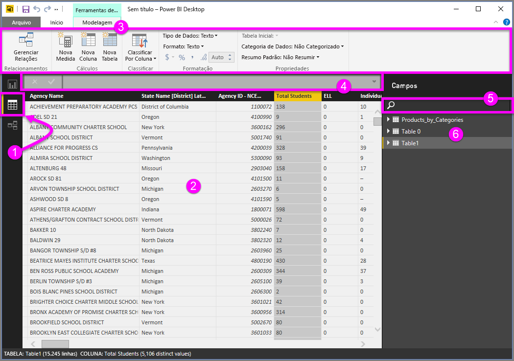
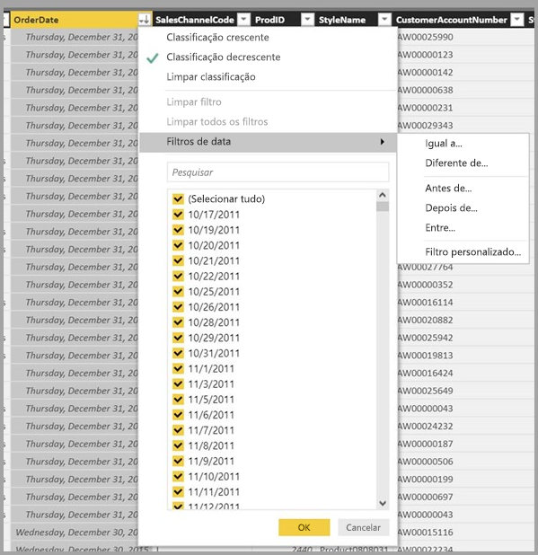

# Trabalhar com a exibição Dados no Power BI Desktop

A *exibição de Dados* ajuda você a inspecionar, explorar e compreender os dados no modelo do *Power BI Desktop*. É diferente do modo como você vê tabelas, colunas e dados no *Editor do Power Query*. Com a exibição de Dados, você examina seus dados *depois* que eles são carregados no modelo.

Quando está modelando seus dados, às vezes, você deseja ver o que está realmente em uma tabela ou uma coluna, sem criar um visual na tela de relatório. Talvez você queira ver imediatamente abaixo do nível de linha. Essa habilidade é especialmente útil quando você está criando medidas e colunas calculadas ou precisa identificar um tipo ou uma categoria de dados.

Vamos examinar mais detalhadamente alguns dos elementos encontrados na exibição de Dados.

1. **Ícone da exibição de Dados**. Selecione esse ícone para entrar na exibição de Dados.

2. **Grade de Dados**. Essa área mostra a tabela selecionada e todas as colunas e linhas presentes nela. As colunas ocultadas na exibição de *Relatório* ficam esmaecidas. Você pode clicar com o botão direito do mouse em uma coluna para ver as opções.

3. **Faixa de opções de modelagem**. Aqui, você pode gerenciar relações, criar cálculos e alterar o tipo de dados, o formato e a categoria de dados de uma coluna.

4. **Barra de fórmulas**. Insira fórmulas DAX (Data Analysis Expression) para medidas e colunas calculadas.

5. **Pesquisa**. Pesquise uma tabela ou uma coluna no modelo.

6. **Lista de campos**. Selecione uma tabela ou uma coluna a ser exibida na grade de dados.

## Filtragem na exibição de Dados

Você também pode filtrar e classificar dados na exibição de Dados. Cada coluna mostra um ícone que identifica a direção de classificação, se aplicada.

Você pode filtrar valores individuais ou usar a filtragem avançada com base nos dados da coluna.

> [!NOTE]
> Quando um modelo do Power BI for criado em uma cultura diferente da interface do usuário atual, a caixa de pesquisa não será exibida na interface do usuário da exibição de Dados em nenhum item que não seja um campo de texto. Por exemplo, isso se aplica a um modelo criado no inglês dos EUA que você vê em espanhol.
