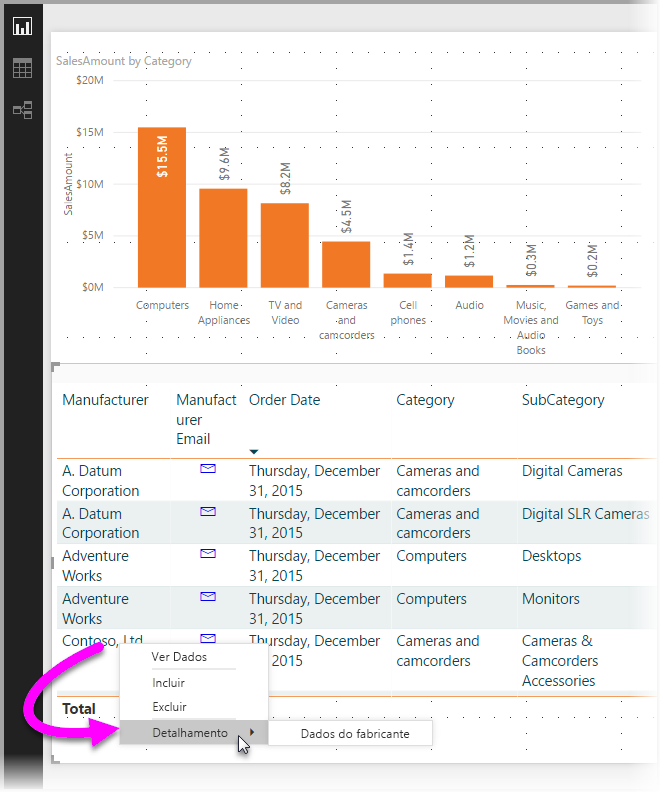

# Usar o detalhamento no Power BI Desktop
Com o *detalhamento* no Power BI Desktop, você pode criar uma página em seu relatório que tenha como foco uma entidade específica, como um fornecedor, cliente ou fabricante. Para usar o detalhamento, selecione-o clicando com o botão direito do mouse em um ponto de dados em outras páginas de relatório e fazendo uma busca detalhada para a página de foco para obter detalhes filtrados para esse contexto.

## Usando o detalhamento
1. Para usar o detalhamento, crie uma página de relatório que tenha os visuais desejados para o tipo de entidade para o qual fornecerá o detalhamento. 

    Por exemplo, vamos supor que você deseje fornecer detalhamento para fabricantes. Nesse caso, você poderá criar uma página de detalhamento com visuais que mostram o total de vendas, o total de unidades enviadas, vendas por categoria, vendas por região e assim por diante. Dessa forma, quando você executar uma consulta drill-through para a página, os visuais serão específicos do fabricante selecionado.

2. Em seguida, na página de detalhamento, na seção **Campos** do painel **Visualizações**, arraste o campo para o qual você deseja habilitar o detalhamento no contêiner **Filtros de detalhamento**.

    

    Quando você adiciona um campo à caixa **Filtros de detalhamento**, o Power BI Desktop cria automaticamente um visual do botão *voltar*. Esse elemento visual transforma-se em um botão nos relatórios publicados. Os usuários que consomem seu relatório no serviço do Power BI usam esse botão para voltar para a página do relatório de origem.

    

> [!IMPORTANT]
> Você pode configurar e fazer o detalhamento em uma página do mesmo relatório, no entanto, não é possível detalhar uma página em um relatório diferente.  

## Use sua própria imagem para um botão Voltar    
 Como o botão Voltar é uma imagem, você pode substituir a imagem desse elemento visual por qualquer imagem desejada. Ele ainda funcionará como um botão Voltar para que os consumidores do relatório possam voltar para a página original. 

Para usar sua própria imagem para um botão voltar, siga estas etapas:

1. Na guia **Página Inicial**, selecione **Imagem**. Em seguida, localize a imagem e coloque-a na página de detalhamento.

2. Selecione a nova imagem na página de detalhamento. No painel **Formatar imagem**, defina o controle deslizante **Ação** como **Ativado** e, em seguida, defina o **Tipo** como **Voltar**. Sua imagem agora funciona como um botão Voltar.

    

    
     Agora os usuários podem clicar com o botão direito em um ponto de dados no seu relatório e obter um menu de contexto que dá suporte ao detalhamento para essa página. 

    

    Quando os consumidores do relatório escolherem o detalhamento, a página é filtrada para mostrar informações sobre o ponto de dados de origem do clique com o botão direito do mouse. Por exemplo, vamos supor que eles clicaram com o botão direito do mouse em um ponto de dados sobre a Contoso, um fabricante e selecionaram para detalhar. A página de detalhamento para a qual eles vão está filtrada para Contoso.

## Passar todos os filtros no detalhamento

Você pode passar todos os filtros aplicados para a janela de detalhamento. Por exemplo, você pode selecionar apenas uma determinada categoria de produtos e os visuais filtrados para essa categoria e, em seguida, selecionar o detalhamento. Provavelmente você vai querer saber como esse detalhamento ficará com todos esses filtros aplicados.

Para manter todos os filtros aplicados, na seção **Detalhamento** do painel **Visualizações**, defina o **Manter todos os filtros** como **Ativado**. 

Em seguida, ao fazer o detalhamento em um visual, você poderá ver quais filtros foram aplicados como resultado da aplicação de filtros temporários no visual de origem. Na seção **Detalhamento** do painel **Visualização**, esses filtros transitórios são mostrados em itálico. 

Embora você pudesse fazer isso com páginas de dicas de ferramenta, essa seria uma experiência estranha, porque a dica de ferramenta não pareceria estar funcionando corretamente. Por esse motivo, fazer isso com dicas de ferramenta não é recomendado.

## Adicionar uma medida ao detalhamento

Além de passar todos os filtros para a janela de detalhamento, você também pode adicionar uma medida ou uma coluna numérica resumida para a área de detalhamento. Arraste o campo de detalhamento para o cartão **Detalhamento** a fim de aplicá-lo. 

Quando você adiciona uma medida ou uma coluna numérica resumida, você pode fazer uma busca detalhada até a página quando o campo é usado na área *Valor* de um visual.

E isso é tudo o que é necessário para usar o detalhamento em seus relatórios. É uma ótima maneira de obter uma exibição expandida das informações de entidade selecionadas para o filtro de detalhamento.

## Próximas etapas

Você também pode estar interessado nos seguintes artigos:

* [Usar o detalhamento no Power BI Desktop](desktop-cross-report-drill-through.md)
* [Usando segmentações no Power BI Desktop](visuals/power-bi-visualization-slicers.md)

