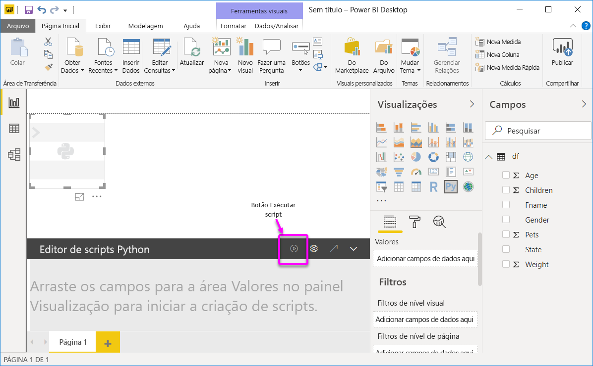
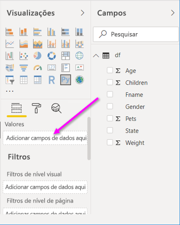

# <a name="create-power-bi-visuals-by-using-python"></a>Criar visuais do Power BI usando o Python
Com o **Power BI Desktop**, é possível usar o **Python** para visualizar seus dados.

## <a name="prerequisites"></a>Pré-requisitos

Trabalhe com o tutorial [Executar scripts Python no Power BI Desktop](desktop-python-scripts.md) usando o seguinte script Python:

```python
import pandas as pd 
df = pd.DataFrame({ 
    'Fname':['Harry','Sally','Paul','Abe','June','Mike','Tom'], 
    'Age':[21,34,42,18,24,80,22], 
    'Weight': [180, 130, 200, 140, 176, 142, 210], 
    'Gender':['M','F','M','M','F','M','M'], 
    'State':['Washington','Oregon','California','Washington','Nevada','Texas','Nevada'],
    'Children':[4,1,2,3,0,2,0],
    'Pets':[3,2,2,5,0,1,5] 
}) 
print (df) 
```
O artigo [Executar scripts do Python no Power BI Desktop](desktop-python-scripts.md) mostra como instalar o Python em seu computador local e habilitá-lo para scripts do Python no **Power BI Desktop**. Este tutorial usa dados do script acima para ilustrar a criação de visuais do Python.

## <a name="create-python-visuals-in-power-bi-desktop"></a>Criar Visuais do Python no Power BI Desktop
1. Selecione o ícone **Visual do Python** no painel **Visualização**.
   
   

1.  Na caixa de diálogo **Habilitar visuais de script** que aparece, selecione **Habilitar**. 

    Quando você adiciona um visual do Python a um relatório, o **Power BI Desktop** executa as seguintes ações:
   
     - Uma imagem do visual do Python no espaço reservado aparece na tela de relatório.
   
     - O **editor de script Python** aparece na parte inferior do painel central.
   
    

1. Em seguida, arraste os campos **Idade**, **Crianças**, **Nome**, **Gênero**, **Animais de estimação**, **Estado** e **Peso** para a seção **Valores** em que diz "**Adicionar campos de dados aqui**". 

    

   Seu script do Python só pode usar campos adicionados à seção **Valores**. Você pode adicionar ou remover campos da seção **Valores** enquanto trabalha em seu script Python. O **Power BI Desktop** detecta automaticamente as alterações de campo.
   
   > [!NOTE]
   > O tipo de agregação padrão para visuais do Python é *não resumir*.
   > 
   > 
   
1. Agora você pode usar os dados selecionados para plotar. 

    Ao selecionar ou remover campos, o suporte de código no editor de script Python é automaticamente gerado ou removido. 
    
    Como resultado de suas seleções, o editor de script Python gerou o seguinte código de associação.

    * O editor criou um dataframe de **conjunto de dados** com os campos que você adicionou. 
    * A agregação padrão é *não resumir*.
    * Semelhantes aos elementos visuais de tabela, os campos são agrupados e as linhas duplicadas aparecem somente uma vez.

        
   
     > [!TIP] 
     > Em certos casos, talvez você não queira que ocorra um agrupamento automático ou talvez queira exibir todas as linhas, incluindo duplicatas. Se for o caso, você poderá adicionar um campo de índice ao conjunto de dados que faz com que todas as linhas sejam consideradas exclusivas, impedindo o agrupamento.
   
   Você pode acessar colunas no conjunto de dados usando seus respectivos nomes. Por exemplo, você pode codificar o conjunto de código ["Age"] em seu script do Python para acessar o campo idade.

1. Com o dataframe gerado automaticamente pelos campos selecionados, você está pronto para escrever um script Python que resulta em plotar ao dispositivo padrão do Python. Quando o script estiver concluído, selecione **Executar** na barra de título do **Editor de script do Python**.

   O **Power BI Desktop** plota novamente o visual se qualquer um dos seguintes eventos ocorre:
   
   * Ao selecionar **Executar** na barra de título **Editor de script Python**
   * Sempre que ocorre uma alteração de dados, devido à atualização de dados, filtragem ou realce
   
   Quando você executa um script do Python que resulta em um erro, o visual do Python não é plotado e uma mensagem de erro na tela é exibida. Para obter detalhes do erro, selecione **Ver detalhes** na mensagem.

   Para obter uma exibição ampliada das visualizações, você pode minimizar a **editor de script Python**.

Certo, vamos criar alguns visuais.

## <a name="create-a-scatter-plot"></a>Criar um gráfico de dispersão

Vamos criar um gráfico de dispersão para ver se há uma correlação entre idade e peso. 

1. Em **Cole ou digite seu código de script aqui**, insira este código:

   ```python
   import matplotlib.pyplot as plt 
   dataset.plot(kind='scatter', x='Age', y='Weight', color='red')
   plt.show() 
   ```  
   O painel do editor de script do Python agora deve ser assim:

   

   A biblioteca **matplotlib** é importada para plotar e criar nossos visuais.

1. Quando você seleciona o botão de script **Executar**, o seguinte gráfico de dispersão é gerado na imagem visual do Python do espaço reservado.

   

## <a name="create-a-line-plot-with-multiple-columns"></a>Criar um gráfico de linhas com várias colunas

 Vamos criar um gráfico de linhas para cada pessoa mostrando seu número de filhos e animais de estimação. Remova ou comente o código em **Colar ou digitar seu código de script aqui** e insira este código Python:

 ```python
 import matplotlib.pyplot as plt 
ax = plt.gca() 
dataset.plot(kind='line',x='Fname',y='Children',ax=ax) 
dataset.plot(kind='line',x='Fname',y='Pets', color='red', ax=ax) 
plt.show() 
```
Quando você seleciona o botão de script **Executar**, o seguinte gráfico de linhas com várias colunas é gerado.

 

## <a name="create-a-bar-plot"></a>Criar um gráfico de barras

Vamos criar um gráfico de barras para a idade de cada pessoa. Remova ou comente o código em **Colar ou digitar seu código de script aqui** e insira este código Python:

```python
import matplotlib.pyplot as plt 
dataset.plot(kind='bar',x='Fname',y='Age') 
plt.show() 
```

Quando você seleciona o botão de script **Executar**, o gráfico de barras a seguir gera:

 

## <a name="security"></a>Segurança

> [!IMPORTANT] 
  > **Segurança de scripts do Python:** os visuais do Python são criados com base em scripts Python, que podem conter códigos com riscos de segurança ou privacidade. Ao tentar exibir ou interagir com um visual do Python pela primeira vez, o usuário recebe uma mensagem de aviso de segurança. Habilite visuais do Python somente se você confiar no autor e na fonte ou após examinar e compreender o script Python. 
  >  

## <a name="more-information-about-plotting-with-matprolib-pandas-and-python"></a>Mais informações sobre a plotagem com Matprolib, Pandas e Python

Este tutorial foi criado para ajudá-lo a começar a criar visuais com o Python no **Power BI Desktop**. Isso mal toca a superfície das muitas opções e funcionalidades para criar relatórios visuais usando Python, Pandas e a biblioteca Matprolib. Há muito mais informações por aí e aqui estão alguns links para você começar.

* Documentação no site do [Matplotlib](https://matplotlib.org/). 
* [Tutorial do Matplotlib: um guia básico para usar o Matplotlib com Python](https://www.datasciencelearner.com/matplotlib-tutorial-complete-guide-to-use-matplotlib-with-python/) 
* [Tutorial do Matplotlib – biblioteca Matplotlib do Python com exemplos](https://www.edureka.co/blog/python-matplotlib-tutorial/) 
* [Referência da API do Pandas](https://pandas.pydata.org/pandas-docs/stable/reference/index.html) 
* [Visualizações do Python no Serviço Power BI](https://powerbi.microsoft.com/blog/python-visualizations-in-power-bi-service/) 
* [Usando visuais do Python no Power BI ](https://www.absentdata.com/how-to-user-python-and-power-bi/)


## <a name="known-limitations"></a>Limitações conhecidas

Os visuais do Python no **Power BI Desktop** apresentam algumas limitações:

* Limitações de tamanho de dados – os dados usados pelo visual do Python para plotar são limitados a 150 mil linhas. Se mais de 150.000 linhas forem selecionadas, somente as primeiras 150.000 linhas serão usadas e uma mensagem será exibida na imagem.
* Resolução: todos os visuais do Python são exibidos com 72 dpi.
* Limite de tempo de cálculo – se um cálculo do visual do Python exceder 5 minutos, a execução atingirá o tempo limite, resultando em um erro.
* Relacionamentos – assim como acontece com outros visuais do Power BI Desktop, se os campos de dados de tabelas diferentes sem uma relação definida entre eles forem selecionados, ocorrerá um erro.
* Visuais do Python são atualizados após atualizações de dados, filtragem e realce. No entanto, a própria imagem não é interativa e não pode ser a origem da filtragem cruzada.
* Visuais do Python respondem ao realce de outros elementos visuais, mas você não pode clicar em elementos no visual do Python para fazer filtragem cruzada de outros elementos.
* Somente plotagens realizadas no dispositivo de vídeo padrão do Python são exibidos corretamente na tela. Evite o uso explícito de um dispositivo de vídeo diferente do Python.

## <a name="next-steps"></a>Próximas etapas

Dê uma olhada nas informações adicionais a seguir sobre o Python no Power BI.

* [Executar scripts do Python no Power BI Desktop](desktop-python-scripts.md)
* [Usar um IDE do Python externo com o Power BI](desktop-python-ide.md)

