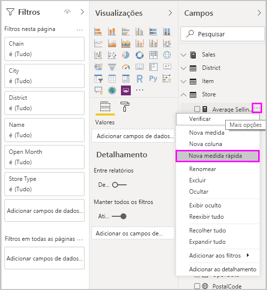
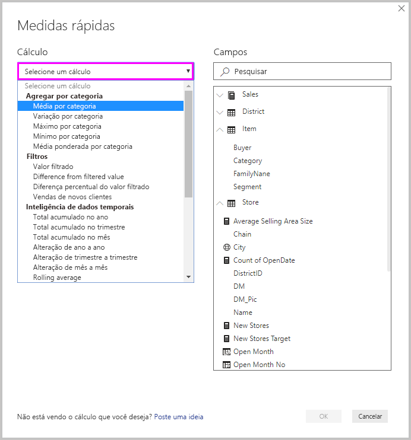
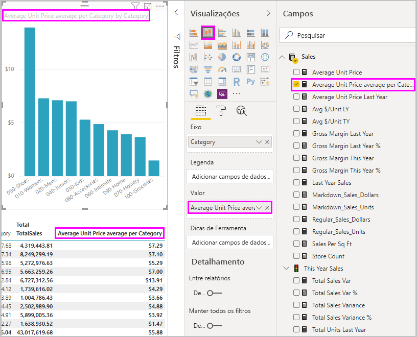
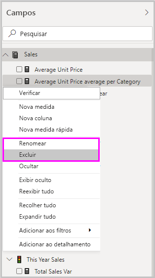

# Usar medidas rápidas para cálculos comuns
Você pode usar *medidas rápidas* para executar cálculos comuns e avançados com rapidez e praticidade. Uma medida rápida executa um conjunto de comandos DAX (Data Analysis Expressions) nos bastidores e apresenta os resultados para você usar no relatório. Você não precisa escrever o DAX. Isso é feito para você com base na entrada que você fornece em uma caixa de diálogo. Há muitas categorias de cálculos disponíveis, bem como maneiras de modificar cada cálculo para atender às suas necessidades. Talvez o melhor de tudo seja poder ver o DAX executado pela medida rápida e estimular ou expandir seu próprio conhecimento do DAX.

## Criar uma medida rápida

Para criar uma medida rápida no Power BI Desktop, clique com o botão direito do mouse ou selecione as reticências **...** ao lado de qualquer item no painel **Campos** e selecione **Nova medida rápida** no menu exibido. 

Você também pode clicar com o botão direito do mouse ou selecionar a seta suspensa ao lado de qualquer valor na caixa **Valores** para um visual existente e selecionar **Nova medida rápida** no menu. 

Quando você seleciona **Nova medida rápida**, a janela **Medidas rápidas** é exibida, permitindo que você selecione o cálculo desejado e os campos nos quais executar o cálculo. 

Selecione o campo **Selecionar um cálculo** para ver uma longa lista de mensagens rápidas disponíveis. 

Os cinco tipos de cálculo de medida rápida, com seus cálculos, são:

* **Agregar por categoria**
  * Média por categoria
  * Variação por categoria
  * Máximo por categoria
  * Mínimo por categoria
  * Média ponderada por categoria
* **Filtros**
  * Valor filtrado
  * Diferença do valor filtrado
  * Diferença percentual do valor filtrado
  * Vendas de novos clientes
* **Inteligência de dados temporais**
  * Total acumulado no ano
  * Total acumulado no trimestre
  * Total acumulado no mês
  * Alteração de ano a ano
  * Alteração de trimestre a trimestre
  * Alteração de mês a mês
  * Média móvel
* **Totais**
  * Total acumulado
  * Total da categoria (filtros aplicados)
  * Total da categoria (filtros não aplicados)
* **Operações matemáticas**
  * Addition
  * Subtração
  * Multiplicação
  * Divisão
  * Diferença percentual
  * Coeficiente de correlação
* **Texto**
  * Classificação por estrelas
  * Lista de valores concatenados

Para enviar suas ideias sobre novas medidas rápidas que você gostaria de ver, fórmulas DAX subjacentes ou outras ideias de medidas rápidas para consideração, confira o final deste artigo.

> [!NOTE]
> Ao usar conexões dinâmicas do SSAS (SQL Server Analysis Services), algumas medidas rápidas estão disponíveis. O Power BI Desktop exibe apenas as medidas rápidas compatíveis com a versão do SSAS à qual você está se conectando. Se você está conectado a uma fonte de dados dinâmica do SAAS e não vê determinadas medidas rápidas na lista, é porque a versão do SAAS à qual você está conectado não dá suporte aos comandos do DAX usados para implementar essas medidas rápidas.

Depois que você selecionar os cálculos e os campos que você deseja para sua medida rápida, selecione **OK**. A nova medida rápida é exibida no painel **Campos** e a fórmula DAX subjacente aparece na barra de fórmulas. 

## Exemplo de medida rápida
Vamos examinar uma medida rápida em prática.

O seguinte visual de matriz mostra uma tabela e vendas para vários produtos. É uma tabela básica que inclui os totais de vendas para cada categoria.

Com o visual de matriz selecionado, selecione a seta suspensa ao lado de **TotalSales** na caixa **Valores** e selecione **Nova medida rápida**. 

Na janela **Medidas rápidas**, em **Cálculo**, selecione **Média por categoria**. 

Arraste **Preço Unitário Médio** no painel **Campos** no campo **Valor de base**. Deixe **Categoria** no campo **Categoria** e selecione **OK**. 

Quando você seleciona **OK**, várias coisas interessantes acontecem.

1. O visual da matriz tem uma nova coluna que mostra o **Preço Unitário Médio por Categoria** calculado.
   
2. A fórmula DAX da nova medida rápida é exibida na barra de fórmulas. Confira a [próxima seção](#learn-dax-by-using-quick-measures) para saber mais sobre a fórmula DAX.
   
3. A nova medida rápida aparece selecionada e realçada no painel **Campos**. 

Essa nova medida rápida está disponível para qualquer visual no relatório, não apenas o visual para o qual você criou. A imagem a seguir mostra um visual de gráfico de coluna rápida criado usando o campo nova medida rápida.

## Conhecer o DAX usando medidas rápidas
Uma grande vantagem das medidas rápidas é que elas mostram a fórmula DAX que implementa a medida. Quando você seleciona uma medida rápida no painel **Campos**, a **Barra de fórmulas** é exibida, mostrando a fórmula DAX que o Power BI criou para implementar a medida.

A barra de fórmulas não mostra apenas a fórmula por trás da medida, como também, e talvez o mais importante, permite que você veja como criar as fórmulas DAX subjacentes às medidas rápidas.

Imagine que você tenha de efetuar um cálculo comparativo ano a ano, mas está em dúvida sobre como estruturar a fórmula DAX ou não tem ideia por onde começar. Em vez de quebrar a cabeça, você pode criar uma medida rápida usando o cálculo **Alteração em relação ao ano anterior** e ver como ela é exibida em seu visual e como a fórmula DAX funciona. Em seguida, você pode fazer alterações diretamente na fórmula DAX ou criar uma mensagem semelhante que atenda às suas necessidades e expectativas. É como ter um professor que responde imediatamente às suas perguntas hipotéticas com apenas alguns cliques. 

Você sempre poderá excluir medidas rápidas de seu modelo se não gostar delas. Isso é tão fácil quanto clicar com o botão direito do mouse ou selecionar **...** ao lado da medida e selecionar **Excluir**. Você também poderá renomear uma medida rápida sempre quiser selecionando **Renomear** no menu. 

## Limitações e considerações
Há algumas limitações e considerações para se ter em mente.

- Você pode usar medidas rápidas adicionadas ao painel **campos** com qualquer visual no relatório.
- Você sempre pode ver o DAX associado a uma medida rápida selecionando-a na lista **Campos** e examinando a fórmula na barra de fórmulas.
- As medidas rápidas só estarão disponíveis se você puder modificar o modelo. Esse não é o caso quando você está trabalhando com algumas conexões dinâmicas. Há suporte a conexões dinâmicas tabulares do SSAS, conforme descrito anteriormente.
- Você não pode criar medidas rápidas de inteligência de tempo ao trabalhar no modo DirectQuery. As funções DAX usadas nessas medidas rápidas tem implicações no desempenho quando convertidas nas instruções T-SQL que são enviadas à fonte de dados.

> [!IMPORTANT]
> As instruções DAX para medidas rápidas usam apenas vírgulas para separadores de argumento. Se sua versão do Power BI Desktop estiver em um idioma que usa vírgulas como separadores decimais, as medidas rápidas não funcionarão corretamente.

### Inteligência de dados temporais e medidas rápidas
Você pode usar suas próprias tabelas de data personalizadas com medidas rápidas de inteligência de dados temporais. Se estiver usando um modelo tabular externo, verifique se, quando o modelo foi criado, a coluna de dados primária na tabela foi marcada como uma tabela de data, conforme descrito em [Especificar Marcar como Tabela de Data para uso com inteligência de dados temporais](https://docs.microsoft.com/sql/analysis-services/tabular-models/specify-mark-as-date-table-for-use-with-time-intelligence-ssas-tabular). Se você estiver importando sua própria tabela de data, marque-a como uma tabela de data, conforme descrito em [Definir e usar tabelas de data no Power BI Desktop](desktop-date-tables.md).

### Exemplos e informações adicionais
Você tem uma ideia para uma medida rápida que ainda não foi fornecida? Ótimo! Confira a página [Ideias do Power BI](https://go.microsoft.com/fwlink/?linkid=842906) e envie suas ideias e fórmulas DAX para medidas rápidas que você gostaria de ver no Power BI Desktop. Consideraremos adicioná-las à lista de medidas rápidas em uma versão futura.

