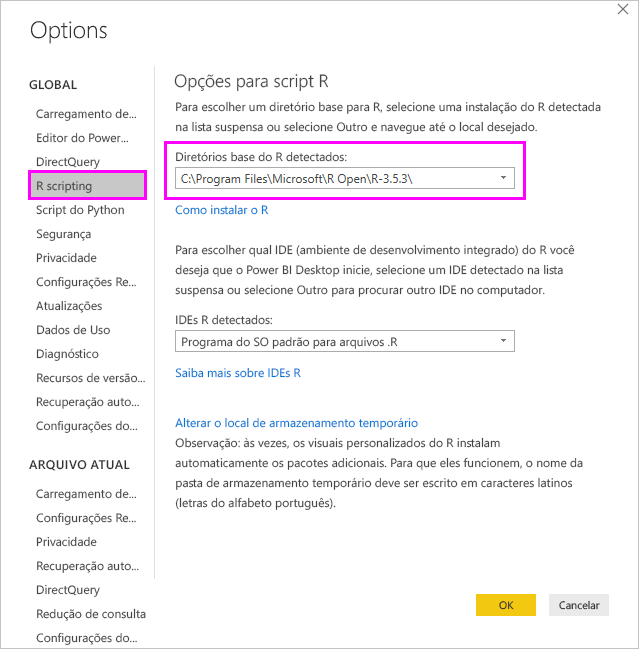
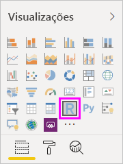
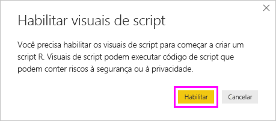

# <a name="create-power-bi-visuals-using-r"></a>Criar visuais do Power BI usando o R
Com o Power BI Desktop, é possível usar o *R* para visualizar seus dados. O [R](https://mran.revolutionanalytics.com/documents/what-is-r) é uma linguagem e um ambiente para gráficos e computação estatística.

## <a name="install-r"></a>Instalar o R
Por padrão, o Power BI Desktop não inclui, implanta ou instala o mecanismo do R. Para executar scripts R no Power BI Desktop, é necessário instalar o R em seu computador local separadamente. É possível baixar e instalar o R gratuitamente em vários locais, incluindo a [página de download do Revolution Open](https://mran.revolutionanalytics.com/download/) e o [Repositório CRAN](https://cran.r-project.org/bin/windows/base/). A versão atual do script R no Power BI Desktop dá suporte a caracteres Unicode, bem como espaços (caracteres vazios) no caminho de instalação.

## <a name="enable-r-visuals-in-power-bi-desktop"></a>Habilitar visuais R no Power BI Desktop
Após instalar o R, o Power BI Desktop o habilita automaticamente. Para verificar se o Power BI Desktop habilitou o R no local correto, siga estas etapas: 

1. No menu do Power BI Desktop, selecione **Arquivo** > **Opções e configurações** > **Opções**. 

2. No lado esquerdo da página **Opções**, em **Global**, selecione **Script R**. 

3. Nas **Opções de script R**, verifique se sua instalação local do R foi especificada nos **Diretórios base do R detectados** e se ela reflete adequadamente a instalação local do R que você deseja que o Power BI Desktop use. Na imagem a seguir, o caminho para a instalação local do R é **C:\Arquivos de Programas\R Open\R-3.5.3\\** .
   
   

Após verificar sua instalação do R, você já poderá começar a criar visuais do R.

## <a name="create-r-visuals-in-power-bi-desktop"></a>Criar visuais R no Power BI Desktop
1. Selecione o ícone **Visual do R** no painel **Visualização** para adicionar um visual do R.
   
   

2. Na janela **Habilitar visuais de script** exibida, selecione **Habilitar**.

   

   Quando você adiciona um visual do R a um relatório, o Power BI Desktop realiza as seguintes alterações:
   
   - Uma imagem do visual do R no espaço reservado aparece na tela de relatório.
   
   - O **editor de script R** aparece na parte inferior do painel central.
   
   

3. Na seção **Valores** do painel **Visualização**, arraste os campos do painel **Campos** que você deseja consumir em seu script R, assim como você faria com qualquer outro visual do Power BI Desktop. Ou você também pode selecionar os campos diretamente no painel **Campos**.
    
    Somente os campos que você adicionou à seção **Valores** estão disponíveis para o seu script R. Você pode adicionar novos campos ou remover os desnecessários da seção **Valores** ao trabalhar em seu script R no **editor do script R**. O Power BI Desktop detecta automaticamente os campos que você adicionou ou removeu.
   
   > [!NOTE]
   > O tipo de agregação padrão para visuais R é *não resumir*.
   > 
   > 
   
4. Agora você pode usar os dados selecionados para plotar: 

    - Ao selecionar campos, o **editor de script R** gera um código de associação de script R com suporte para esses campos na seção cinza na parte superior do painel do editor.
    - Se você remover um campo, o **editor do script R** removerá automaticamente o código de suporte para esse campo.
   
   No exemplo mostrado na imagem a seguir, três campos são selecionados: hp, gear e drat. Em decorrência dessas seleções, o editor de script R gera código de associação, que é resumido da seguinte maneira:
   
   * Crie um dataframe denominado **dataset**, composto pelos diferentes campos selecionados pelo usuário.
   * A agregação padrão é: *não resumir*.
   * Semelhantes aos elementos visuais de tabela, os campos são agrupados e as linhas duplicadas aparecem somente uma vez.
   
   
   
   > [!TIP]
   > Em certos casos, talvez você não queira que ocorra um agrupamento automático, ou talvez queira exibir todas as linhas, incluindo duplicatas. Nesse caso, adicione um campo de índice ao conjunto de dados que faz com que todas as linhas sejam consideradas exclusivas, impedindo o agrupamento.
   > 
   > 
   
   O dataframe gerado é chamado de **conjunto de dados** e você acessa as colunas selecionadas por seus respectivos nomes. Por exemplo, acesse o campo de engrenagem adicionando *dataset$gear* ao script R. Para campos com espaços ou caracteres especiais, use aspas simples.

5. Como o dataframe gerado automaticamente pelos campos selecionados, você poderá escrever um script R, que o Power BI Desktop plota para o dispositivo padrão R. Depois que você tiver concluído o script, selecione **Executar script** à direita da barra de título do **Editor de script R**.
   
    Ao selecionar **Executar script**, o Power BI Desktop identifica a plotagem e a apresenta na tela. Como o processo é executado em sua instalação local do R, verifique se os pacotes necessários estão instalados.
   
   O Power BI Desktop plota novamente o visual quando qualquer um dos seguintes eventos ocorre:
   
   * Selecione **Executar script** na barra de título do **Editor de script R**.
   * Uma alteração na data ocorre devido à atualização, à filtragem ou ao realce dos dados.

     A imagem a seguir mostra um exemplo de código de plotagem da correlação, que plota as correlações entre atributos de tipos diferentes de carros.

     

6. Para obter uma exibição ampliada das visualizações, minimize o **editor de script R**. Como outros visuais no Power BI Desktop, você pode realizar filtragem cruzada da plotagem da correlação selecionando uma seção específica (como carros esportivos) no visual em forma de rosca (o visual redondo à direita).

    

7. Modifique o script R para personalizar o visual e aproveitar o poder do R, adicionando parâmetros ao comando de plotagem.

    O comando original de plotagem é:

    ```
    corrplot(M, method = "color",  tl.cex=0.6, tl.srt = 45, tl.col = "black")
    ```

    Altere o script R para que o comando de plotagem seja o seguinte:

    ```
    corrplot(M, method = "circle", tl.cex=0.6, tl.srt = 45, tl.col = "black", type= "upper", order="hclust")
    ```

    Como resultado, o visual do R agora plota círculos, só considera na metade superior e reorganiza a matriz para agrupar atributos correlacionados.

    

    Quando você executa um script R que resulta em um erro, uma mensagem de erro é exibida na tela, em vez da plotagem do visual do R. Para obter detalhes sobre o erro, selecione **Ver detalhes** no erro do visual do R.

    

## <a name="r-scripts-security"></a>Segurança de scripts do R 
Os visuais do R são criados com base nos scripts R, que podem conter código com riscos de segurança ou privacidade. Ao tentar exibir ou interagir com um visual R pela primeira vez, o usuário recebe uma mensagem de aviso de segurança. Habilite visuais R somente se você confiar no autor e na fonte ou após examinar e compreender o script R.


## <a name="known-limitations"></a>Limitações conhecidas
Os visuais do R no Power BI Desktop têm as seguintes limitações:

* Tamanhos de dados: Dados usados por um visual do R para plotar estão limitados a 150 mil linhas. Se mais de 150.000 linhas forem selecionadas, somente as primeiras 150.000 linhas serão usadas e uma mensagem será exibida na imagem.

* Resolução: todos os visuais do R são exibidos com 72 dpi.

* Dispositivo de plotagem: somente a plotagem para o dispositivo padrão é compatível. 

* Tempos de cálculo: se um cálculo de visual do R exceder cinco minutos, causará um erro de tempo limite.

* Relacionamentos: assim como acontece com outros visuais do Power BI Desktop, se os campos de dados de tabelas diferentes sem uma relação definida entre eles forem selecionados, ocorrerá um erro.

* Atualizações: Visuais R são atualizados após atualizações de dados, filtragem e realce. No entanto, a própria imagem não é interativa e não pode ser a origem da filtragem cruzada.

* Realces: os visuais do R responderão se você realçar outros visuais, mas não puder selecionar elementos no visual do R para realizar filtragem cruzada de outros elementos.

* Exibir dispositivos: Somente plotagens realizadas no dispositivo de vídeo padrão R são exibidos corretamente na tela. Evite o uso explícito de um dispositivo de vídeo diferente do R.

* Instalações do RRO: nesta versão, a versão de 32 bits do Power BI Desktop não identifica automaticamente as instalações do RRO; você deve fornecer manualmente o caminho para o diretório da instalação do R em **Opções e configurações** > **Opções** > **Script do R**.

## <a name="next-steps"></a>Próximas etapas
Para obter informações sobre o R no Power BI, confira os seguintes artigos:

* [Executando scripts do R no Power BI Desktop](desktop-r-scripts.md)
* [Usar um IDE R externo com o Power BI](desktop-r-ide.md)

