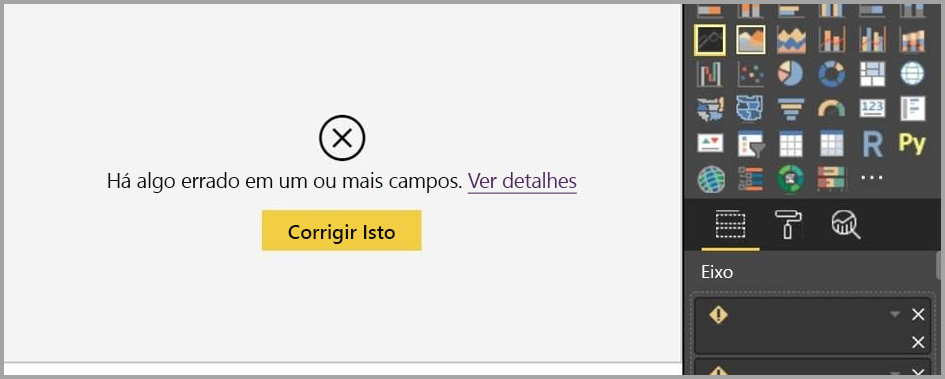

# Trabalhar com a exibição de Relatório no Power BI Desktop

Se você já trabalhou com o Power BI, saberá como é fácil criar relatórios que fornecem ideias e perspectivas dinâmicas sobre seus dados. O Power BI também conta com recursos mais avançados no Power BI Desktop. Com o Power BI Desktop, crie consultas avançadas, efetue mashup de dados provenientes de várias fontes, crie relações entre tabelas e muito mais.

O Power BI Desktop inclui um *Modo de exibição de Relatório*, no qual você pode criar quantas páginas de relatório quiser com visualizações. O modo de exibição de Relatório no Power BI Desktop oferece uma experiência de design parecida com a encontrada no modo de exibição de Edição do relatório no *serviço do Power BI*. Você pode mover as visualizações de um lugar para outro, copiar e colar, mesclar, etc.

A diferença entre eles é que ao usar o Power BI Desktop, você pode trabalhar com suas consultas e modelar seus dados para garantir que os dados deem suporte às melhores ideias em seus relatórios. Você pode, então, salvar o seu arquivo do Power BI Desktop onde quiser, seja em sua unidade local ou na nuvem.

## Vamos dar uma olhada!

Ao carregar dados pela primeira vez no Power BI Desktop, você verá o modo de exibição de Relatório com uma tela em branco.

É possível alternar entre os modos de exibição de **Relatório**, **Dados** e **Relação** selecionando os ícones na barra de navegação à esquerda:

Depois de adicionar alguns dados, você poderá adicionar campos a uma nova visualização na tela.

Para alterar o tipo de visualização, você pode selecioná-lo na tela e, em seguida, selecionar um novo tipo em **Visualizações**.

> [!TIP]
> Certifique-se de experimentar os diferentes tipos de visualização. É importante que sua visualização transmita com clareza as informações presentes em seus dados.

Um relatório terá pelo menos uma página em branco para ser iniciado. As páginas são exibidas no painel de navegação à esquerda da tela. Você pode adicionar todos os tipos de visualizações a uma página, mas é importante não exagerar. O excesso de visualizações em uma página dá a ela uma aparência congestionada e dificulta a localização das informações corretas. Você pode adicionar novas páginas ao seu relatório. Basta clicar em **Nova Página** na faixa de opções.

Para excluir uma página, clique no **X** na guia da página na parte inferior do modo de exibição de Relatório.

> [!NOTE]
> Visualizações e relatórios não podem ser anexados a um painel por meio do Power BI Desktop. Para fazer isso, você precisará publicar em seu site do Power BI. Para saber mais, confira [Publicar conjuntos de dados e relatórios no Power BI Desktop](desktop-upload-desktop-files.md).

## Copiar e colar entre relatórios

Você pode usar um elemento visual de um relatório do Power BI Desktop em outro, simplesmente copiando e colando-o em outro relatório. Basta usar o atalho de teclado Ctrl+C para copiar o visual do relatório. No outro relatório do Power BI Desktop, use Ctrl+V para colar o visual no outro relatório. Selecione para copiar um elemento visual por vez, ou todos de uma página, e cole no relatório de destino do Power BI Desktop.

A capacidade de copiar e colar elementos visuais é útil para pessoas que criam e atualizam vários relatórios frequentemente. Ao copiar entre arquivos, as configurações e formatação definidas explicitamente no painel de formatação serão utilizadas, enquanto os elementos visuais que dependem do tema ou das configurações padrão são atualizados automaticamente de acordo com o tema do relatório de destino. Portanto, quando você consegue deixar a formatação do visual exatamente como quer, pode copiar e colar esse visual em novos relatórios e preservar todo o trabalho de formatação.

Se os campos do modelo forem diferentes, você verá um erro no visual e um aviso sobre quais campos não existem. O erro é semelhante à experiência exibida ao excluir um campo no modelo usado por um visual.

Para corrigir o erro, basta substituir os campos inválidos pelos campos que você deseja usar do modelo do relatório no qual você colou o visual. Se você estiver usando um visual personalizado, também deverá importar esse visual personalizado para o relatório de destino.

## Ocultar páginas de relatório

Quando você cria um relatório, também poderá ocultar as páginas de um relatório. Essa abordagem poderá ser útil se você precisar criar dados subjacentes ou elementos visuais em um relatório, mas não quiser que essas páginas fiquem visíveis para outras pessoas, como quando você cria tabelas ou elementos visuais de suporte que são usados em outras páginas do relatório. Há muitas outras razões criativas para você talvez querer criar uma página de relatório e, em seguida, ocultá-la de um relatório que quiser publicar.

Ocultar uma página de relatório é fácil. Basta clicar na guia da página de relatório e selecionar **Ocultar** no menu que é exibido.

Há algumas considerações para ter em mente ao ocultar uma página de relatório:

* Você ainda pode ver um relatório oculto quando estiver no Power BI Desktop, embora o título da página esteja esmaecido. Na imagem a seguir, a página 4 estará oculta.

    

* Você *não pode* ver uma página de relatório oculta ao exibir o relatório no serviço do Power BI.

* Ocultar uma página de relatório *não* é uma medida de segurança. A página ainda pode ser acessada por usuários e seu conteúdo ainda será acessível usando o detalhamento e outros métodos.

* Quando uma página está oculta, quando está no modo de Visualização, nenhuma seta de navegação do modo de exibição é exibida.
