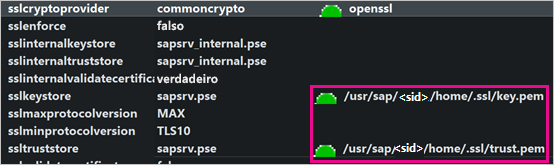
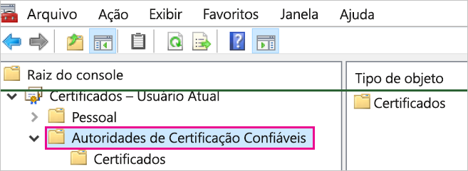
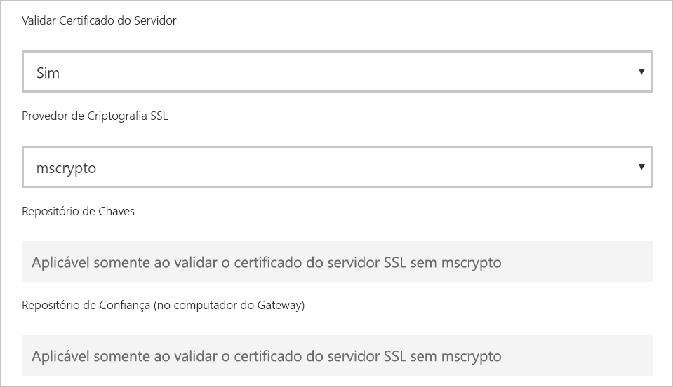

# <a name="enable-encryption-for-sap-hana"></a>Habilitar a criptografia para SAP HANA

É recomendável criptografar conexões com um servidor SAP HANA no Power BI Desktop e no serviço do Power BI. É possível habilitar a criptografia do HANA usando a biblioteca CommonCryptoLib (conhecida anteriormente como sapcrypto) proprietária do SAP e do OpenSSL. O SAP recomenda o uso do CommonCryptoLib, mas os recursos básicos de criptografia estão disponíveis usando qualquer uma das bibliotecas.

Este artigo fornece uma visão geral de como habilitar a criptografia usando o OpenSSL e faz referência a algumas áreas específicas da documentação do SAP. Atualizamos o conteúdo e os links periodicamente, mas para obter instruções e suporte abrangentes, consulte sempre a documentação oficial do SAP. Se você quiser configurar a criptografia usando o CommonCryptoLib em vez do OpenSSL, confira [Como configurar o TLS/SSL no SAP HANA 2.0](https://blogs.sap.com/2018/11/13/how-to-configure-tlsssl-in-sap-hana-2.0/). Para ver as etapas de migração do OpenSSL para o CommonCryptoLib, confira [Nota SAP 2093286](https://launchpad.support.sap.com/#/notes/2093286) (usuário s necessário).

> [!NOTE]
> As etapas de configuração de criptografia detalhadas neste artigo se sobrepõem às etapas de instalação e configuração do SSO do SAML. Independentemente de você escolher o OpenSSL ou o CommonCryptoLib como o provedor de criptografia do servidor HANA, certifique-se de que sua escolha seja consistente entre as configurações de criptografia e SAML.

Há quatro fases para habilitar a criptografia do SAP HANA usando o OpenSSL. Abordaremos essas fases em seguida.  Para saber mais, confira [Proteger a comunicação entre o SAP HANA Studio e o servidor do SAP HANA com SSL](https://blogs.sap.com/2015/09/28/securing-the-communication-between-sap-hana-studio-and-sap-hana-server-through-ssl/).

## <a name="use-openssl"></a>Usar o OpenSSL

Verifique se o servidor HANA está configurado para usar o OpenSSL como provedor criptográfico. Substitua as informações de caminho ausentes abaixo pela ID do servidor (SID) HANA.



## <a name="create-a-certificate-signing-request"></a>Criar uma solicitação de assinatura de certificado

Crie uma solicitação de assinatura de certificado X509 para o servidor HANA.

1. Com o SSH, conecte-se ao computador Linux em que o servidor HANA é executado como \<sid\>adm.

1. Vá para o diretório base _/__usr/sap/\<sid\>/home_.

1. Crie um diretório oculto com o nome _.__ssl_if se ainda não houver um.

1. Execute o seguinte comando:

    ```
    openssl req -newkey rsa:2048 -days 365 -sha256 -keyout Server\_Key.pem -out Server\_Req.pem -nodes
    ```

Este comando cria uma solicitação de assinatura de certificado e uma chave privada. Depois de assinado, o certificado é válido por um ano (consulte o parâmetro -days). Quando for solicitado o CN (nome comum), insira o FQDN (nome de domínio totalmente qualificado) do computador em que o servidor HANA está instalado.

## <a name="get-the-certificate-signed"></a>Obter uma assinatura para o certificado

Obtenha o certificado assinado por uma AC (autoridade de certificação) que seja confiável para os clientes que você usará para se conectar ao servidor HANA.

1. Se você já tiver um AC de empresa confiável (representado por CA\_Cert.pem e CA\_Key.pem no exemplo a seguir), assine a solicitação de certificado executando o seguinte comando:

    ```
    openssl x509 -req -days 365 -in Server\_Req.pem -sha256 -extfile /etc/ssl/openssl.cnf -extensions usr\_cert -CA CA\_Cert.pem -CAkey CA\_Key.pem -CAcreateserial -out Server\_Cert.pem
    ```

    Se você ainda não tiver um AC que possa ser usado, crie um AC raiz seguindo as etapas descritas em[Proteger a comunicação entre o SAP HANA Studio e o servidor SAP HANA com SSL](https://blogs.sap.com/2015/09/28/securing-the-communication-between-sap-hana-studio-and-sap-hana-server-through-ssl/).

1. Crie a cadeia de certificados do servidor HANA combinando o certificado do servidor, a chave e o certificado da AC (o nome key.pem é a convenção para o SAP HANA):

    ```
    cat Server\_Cert.pem Server\_Key.pem CA\_Cert.pem \> key.pem
    ```

1. Crie uma cópia de CA\_CERT.pem chamada trust.pem (o nome trust.pem é a convenção para SAP HANA):

    ```
    cp CA\_Cert.pem trust.pem
    ```

1. Reinicie o servidor HANA.

1. Verifique a relação de confiança entre um cliente e a AC usada para assinar o certificado do servidor SAP HANA.

    O cliente deve confiar na AC usada para assinar o certificado X509 do servidor HANA antes que uma conexão criptografada possa ser feita com servidor HANA do computador do cliente.

    Há várias maneiras de garantir que essa relação de confiança exista usando o MMC (Console de Gerenciamento Microsoft) ou a linha de comando. É possível importar o certificado X509 da AC (trust.pem) para a pasta **Autoridades de Certificação Confiáveis** do usuário que estabelecerá a conexão ou para a mesma pasta do computador cliente, se isso for desejável.

    

    Primeiro, converta trust.pem em um arquivo .crt antes de importar o certificado para a pasta Autoridades de Certificação Confiáveis, por exemplo, executando o seguinte comando do OpenSSL:

    ```
    openssl x509 -outform der -in your-cert.pem -out your-cert.crt
    ```
    
    Para saber mais sobre como usar o OpenSSL para a conversão, confira a [documentação do OpenSSL](https://www.openssl.org/docs/manmaster/man1/x509.html).

## <a name="test-the-connection"></a>Testar a conexão

Teste a conexão no Power BI Desktop ou no serviço do Power BI.

1. No Power BI Desktop ou na página **Gerenciar gateways** do serviço do Power BI, verifique se a opção **Validar certificado do servidor** está habilitada antes de tentar estabelecer uma conexão com o servidor SAP HANA. Em **Provedor de criptografia SSL**, selecione mscrypto se tiver seguido as etapas de configuração do OpenSSL e commoncrypto se tiver configurado a biblioteca como provedor de criptografia. Deixe os campos "Repositório de chaves SSL" e "Repositório confiável SSL" em branco.

    - Power BI Desktop

        

    - Serviço do Power BI

        

1. Verifique se é possível estabelecer com êxito uma conexão criptografada com o servidor com a opção **Validar certificado do servidor** habilitada, carregando dados no Power BI Desktop ou atualizando um relatório publicado no serviço do Power BI.
