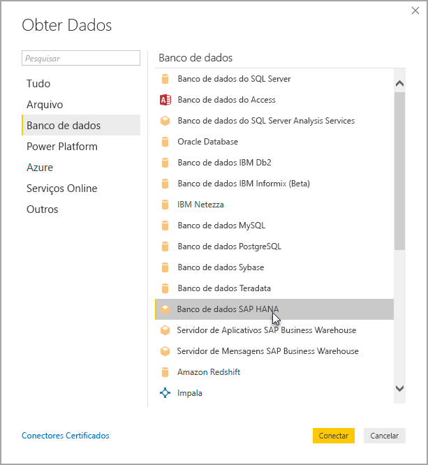

# Usar o SAP HANA no Power BI Desktop
Com o Power BI Desktop, agora você pode acessar bancos de dados do **SAP HANA** . Para usar o **SAP HANA**, o driver ODBC do SAP HANA deve ser instalado no computador cliente local para que a conexão de dados do **SAP HANA** para o Power BI Desktop funcione corretamente. É possível baixar o driver ODBC do SAP HANA no [Centro de Download de Software SAP](https://support.sap.com/swdc). Estando nele, pesquise os computadores com Windows em SAP HANA CLIENT. Como o **Centro de Download de Software SAP** altera sua estrutura com frequência, não estão disponíveis diretrizes mais específicas para navegar nesse site.

Para se conectar a um banco de dados **SAP HANA**, selecione **Obter Dados > Banco de Dados > Banco de Dados SAP HANA**, conforme mostrado na imagem a seguir:

Ao se conectar a um banco de dados do SAP HANA, especifique o nome do servidor e a porta no formato *servidor:porta* - a imagem a seguir mostra um exemplo com um servidor chamado *ServerXYZ* e a porta *30015*.

Nesta versão, o **SAP HANA** no modo [DirectQuery](desktop-directquery-sap-hana.md) é compatível com o Power BI Desktop e no serviço do Power BI, e é possível publicar e carregar relatórios que usam o **SAP HANA** no modo DirectQuery no serviço do Power BI. Você também pode publicar e carregar relatórios no Serviço do Power BI quando não estiver usando o **SAP HANA** no modo DirectQuery.

## Recursos com suporte para o SAP HANA
Esta versão contém vários recursos para o **SAP HANA**, como mostrado na lista a seguir:

* O conector do Power BI para o **SAP HANA** usa o driver ODBC do SAP, para fornecer a melhor experiência de usuário
* O **SAP HANA** dá suporte às opções de Importação e do DirectQuery
* O Power BI é compatível com modelos de informação do HANA (como Exibições de Cálculo e Análise) e tem uma navegação otimizada
* Com o **SAP HANA**, você também pode usar o recurso direto do SQL para se conectar às Tabelas de Linhas e Colunas
* Inclui Navegação Otimizada para modelos do HANA
* O Power BI dá suporte a parâmetros de Variáveis e Entrada do **SAP HANA**
* Exibições de Cálculo baseadas em contêiner do HDI
  * O suporte para Exibições de Cálculo baseadas em contêiner do HDI está em versão prévia pública na versão de agosto de 2019 do Power BI Desktop. Para acessar suas Exibições de Cálculo baseadas em contêiner do HDI no Power BI, verifique se os usuários do banco de dados do HANA que você usa com o Power BI têm permissão para acessar o contêiner de runtime do HDI que armazena as exibições que você deseja acessar. Para conceder esse acesso, você deve criar uma função que permita o acesso a seu contêiner do HDI e atribuir a função ao usuário do banco de dados HANA que será usado com o Power BI (esse usuário também deve ter permissão para ler as tabelas do sistema no esquema \_SYS\_BI, como é o normal). Leia a documentação oficial do SAP para obter instruções detalhadas sobre como criar e atribuir funções de banco de dados. [Esta postagem no blog do SAP](https://nam06.safelinks.protection.outlook.com/?url=https%3A%2F%2Fblogs.sap.com%2F2018%2F01%2F24%2Fthe-easy-way-to-make-your-hdi-container-accessible-to-a-classic-database-user%2F&data=02%7C01%7Cv-adbold%40microsoft.com%7Cf7e0a405fe334598ba0608d7096ef5b4%7C72f988bf86f141af91ab2d7cd011db47%7C1%7C0%7C636988244476739316&sdata=PuRu61GPRYp34mLuGbQk6gdbRikdgbxfqo8q1RBQtm0%3D&reserved=0) pode ser um bom ponto de partida.
  * Observe que atualmente há algumas limitações às variáveis do HANA anexadas a Exibições de Cálculo baseadas em HDI. Essas limitações devem-se a erros no lado do HANA e serão abordadas em versões futuras do SAP HANA. Primeiro, não é possível aplicar uma variável do HANA a uma coluna compartilhada de uma Exibição de Cálculo baseada em contêiner do HDI. Essa limitação pode ser corrigida Atualizando para o HANA 2 versão 37.02 e posteriores ou HANA 2 versão 42 e posteriores. Segundo, valores padrão de várias entradas para variáveis e parâmetros atualmente não aparecem na interface do usuário do Power BI. Isso também ocorre devido a um erro no SAP HANA; no entanto, a SAP ainda não anunciou um conserto.

## Limitações do SAP HANA
Também há algumas limitações no uso do **SAP HANA**, conforme mostrado abaixo:

* Cadeias de caracteres NVARCHAR são truncadas para o comprimento máximo de 4.000 caracteres Unicode
* Não há suporte para SMALLDECIMAL
* Não há suporte para VARBINARY
* As Datas Válidas estão entre 30/12/1899 e 31/12/9999

## Próximas etapas
Para obter mais informações sobre o SAP HANA e o DirectQuery, confira os seguintes recursos:

* [DirectQuery e SAP HANA](desktop-directquery-sap-hana.md)
* [DirectQuery no Power BI](desktop-directquery-about.md)
* [Fontes de dados com suporte do DirectQuery](desktop-directquery-data-sources.md)
* [Habilitar a criptografia para SAP HANA](desktop-sap-hana-encryption.md)

