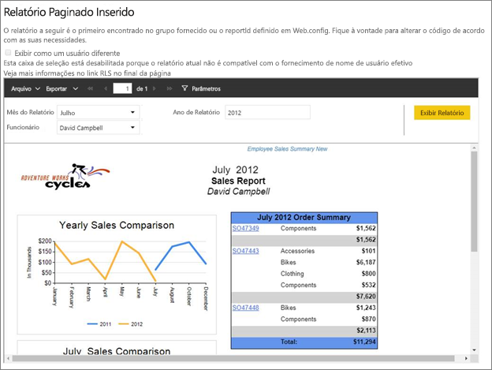
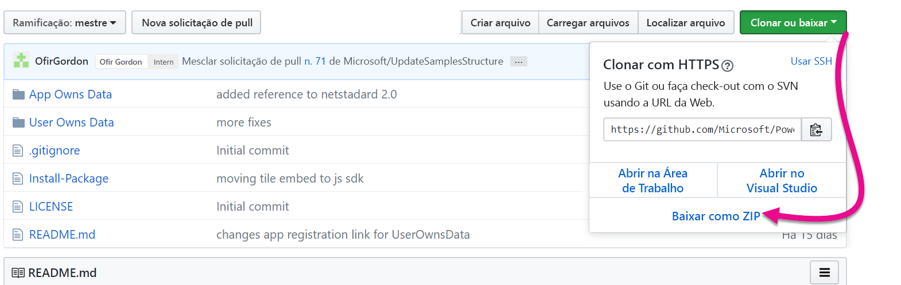
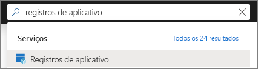
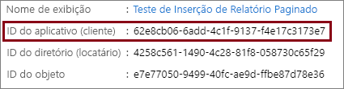
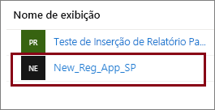
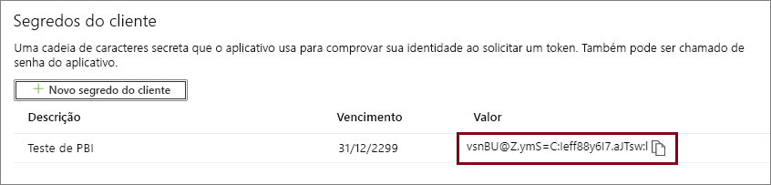
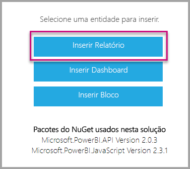

# <a name="tutorial-embed-power-bi-paginated-reports-into-an-application-for-your-customers-preview"></a>Tutorial: Inserir relatórios paginados do Power BI em um aplicativo para seus clientes (versão prévia)

Com o **Power BI Embedded no Azure** ou a **Inserção do Power BI no Office**, você pode inserir relatórios paginados em um aplicativo usando app owns data. **App owns data** representa um aplicativo que usa o Power BI como sua plataforma de análise incorporada. Como um **ISV** ou um **desenvolvedor**, é possível criar conteúdo do Power BI que exiba relatórios paginados em um aplicativo totalmente integrado e interativo, sem precisar que os usuários tenham uma licença do Power BI. Este tutorial demonstra como integrar um relatório paginado em um aplicativo usando o SDK do .NET do Power BI com a API JavaScript do Power BI.



Neste tutorial, você aprenderá a:
> [!div class="checklist"]
> * Registrar um aplicativo no Azure.
> * Insira um relatório paginado do Power BI em um aplicativo.

## <a name="prerequisites"></a>Pré-requisitos

Para começar, você precisa ter:

* Uma [entidade de serviço (app-only token)](embed-service-principal.md)
* Uma assinatura do [Microsoft Azure](https://azure.microsoft.com/)
* Configuração de seu próprio [locatário do Azure Active Directory](create-an-azure-active-directory-tenant.md)
* Pelo menos uma [capacidade](#create-a-dedicated-capacity) A4 ou P1, com a carga de trabalho [relatórios paginados](../../admin/service-admin-premium-workloads.md#paginated-reports) habilitada

Se você não tiver uma assinatura do Azure, crie uma [conta gratuita](https://azure.microsoft.com/free/?WT.mc_id=A261C142F) antes de começar.

> [!IMPORTANT]
> * Você deve usar uma **entidade de serviço**. Não há suporte para o usuário mestre.
> * Não há suporte para fontes de dados que exigem SSO (logon único).
> * Não há suporte para o conjunto de dados do Power BI como uma [fonte de dados](../../connect-data/service-get-data.md).

## <a name="set-up-your-power-bi-environment"></a>Configurar seu ambiente do Power BI

A inserção de um relatório paginado requer a atribuição de um workspace a uma capacidade dedicada e o carregamento do relatório no workspace.

### <a name="create-an-app-workspace"></a>Criar um workspace de aplicativo

Uma vez que você está usando uma [entidade de serviço](embed-service-principal.md) para entrar em seu aplicativo, é necessário usar os [novos workspaces](../../collaborate-share/service-create-the-new-workspaces.md). Como uma *entidade de serviço*, você também deve ser um administrador ou membro dos workspaces do aplicativo envolvidos em seu aplicativo.

### <a name="create-a-dedicated-capacity"></a>Criar uma capacidade dedicada

Antes de importar ou carregar um relatório paginado para inserir, o workspace que contém o relatório deve ser atribuído a pelo menos uma capacidade A4 ou P1. Há dois tipos de capacidade dentre as quais você pode escolher:
* **Power BI Premium** – para inserir um relatório paginado, é necessário ter uma capacidade *P* SKU. Ao inserir conteúdo do Power BI, essa solução é conhecida como *inserção do Power BI*. Para obter mais informação sobre essa assinatura, consulte [o que é Power BI Premium?](../../admin/service-premium-what-is.md)
* **Azure Power BI Embedded** – é possível comprar uma capacidade dedicada no [portal do Microsoft Azure](https://portal.azure.com). Essa assinatura usa os SKUs *A*. Para inserir relatórios paginados, você precisa de pelo menos uma assinatura *A4*. Para obter detalhes sobre como criar uma capacidade do Power BI Embedded, veja [Criar capacidade do Power BI Embedded no portal do Azure](azure-pbie-create-capacity.md).

A tabela a seguir descreve os recursos e limites de cada SKU. Para determinar qual capacidade atende melhor às suas necessidades, consulte a tabela [Qual SKU devo comprar para meu cenário](https://docs.microsoft.com/power-bi/developer/embedded-faq#which-solution-should-i-choose).

| Nós de Capacidade | Total de núcleos virtuais | Núcleos virtuais de back-end | RAM (GB) | Núcleos virtuais de front-end | 
| --- | --- | --- | --- | --- |
| P1/A4 | 8 | 4 | 25 | 4 |
| P2/A5 | 16 | 8 | 50 | 8 |
| P3/A6 | 32 | 16 | 100 | 16 |
| | | | | |

### <a name="assign-an-app-workspace-to-a-dedicated-capacity"></a>Atribua um workspace de aplicativo a uma capacidade dedicada

Depois de criar uma capacidade dedicada, você pode atribuir o workspace do aplicativo a uma capacidade dedicada.

Para atribuir uma capacidade dedicada a um workspace usando [entidade de serviço](embed-service-principal.md), use a [API REST do Power BI](https://docs.microsoft.com/rest/api/power-bi/capacities/groups_assigntocapacity). Quando você estiver usando as APIs REST do Power BI, use a [ID de objeto de entidade de serviço](embed-service-principal.md).

### <a name="create-and-upload-your-paginated-reports"></a>Criar e carregar relatórios paginados

Você pode criar seu relatório paginado usando o [Construtor de Relatórios do Power BI](../../paginated-reports/paginated-reports-report-builder-power-bi.md#create-reports-in-power-bi-report-builder) e, em seguida, [carregar o relatório no serviço](../../paginated-reports/paginated-reports-quickstart-aw.md#upload-the-report-to-the-service).

Você pode importar relatórios paginados para os novos workspaces usando as APIs REST do [Power BI](https://docs.microsoft.com/rest/api/power-bi/imports/postimportingroup).

## <a name="embed-content-using-the-sample-application"></a>Insira conteúdo usando o aplicativo de exemplo

Este exemplo é deliberadamente mantido simples para fins de demonstração. Cabe a você ou a seus desenvolvedores proteger o segredo do aplicativo.

Siga as etapas abaixo para começar a inserir seu conteúdo usando o aplicativo de exemplo.

1. Baixe o [Visual Studio](https://www.visualstudio.com/) (versão 2013 ou posterior). Baixe a versão mais recente do [pacote do NuGet](https://www.nuget.org/profiles/powerbi).

2. Baixe o [exemplo App Owns Data](https://github.com/Microsoft/PowerBI-Developer-Samples) do GitHub para começar.

    

3. Abra o arquivo **Web.config** no aplicativo de exemplo. Há campos que você precisa preencher para executar o aplicativo. Escolha **ServicePrincipal** para o **AuthenticationType**.

    Preencha os campos a seguir:
    * [applicationId](#application-id)
    * [workspaceId](#workspace-id)
    * [reportId](#report-id)
    * [applicationsecret](#application-secret)
    * [tenant](#tenant)

    > [!Note]
    > O padrão **AuthenticationType** neste exemplo é MasterUser. Altere-o para **ServicePrincipal**. 


    

### <a name="application-id"></a>ID do aplicativo

Preencha as informações de **applicationId** com a **ID do Aplicativo** do **Azure**. A **applicationId** é usada pelo aplicativo para identificar-se aos usuários para os quais você está solicitando permissões.

Para obter a **applicationId**, siga estas etapas:

1. Entre no [Portal do Azure](https://portal.azure.com).

2. No painel de navegação esquerdo, escolha **Todos os serviços** e pesquise **Registros de Aplicativo**.

    

3. Selecione o aplicativo que precisa usar a **applicationId**.

    

4. Há uma **ID do Aplicativo** listada como GUID. Use essa **ID do aplicativo** como a **applicationId** do aplicativo.

    

### <a name="workspace-id"></a>ID do workspace

Preencha as informações de **workspaceId** com o GUID do workspace (grupo) do aplicativo do Power BI. Você pode obter essas informações da URL, quando estiver conectado ao serviço do Power BI ou quando estiver usando o PowerShell.

URL <br>


PowerShell <br>

```powershell
Get-PowerBIworkspace -name "Paginated Report Embed"
```

   

### <a name="report-id"></a>ID do Relatório

Preencha as informações de **reportId** com o GUID de relatório do Power BI. Você pode obter essas informações da URL, quando estiver conectado ao serviço do Power BI ou quando estiver usando o PowerShell.

URL<br>


PowerShell <br>

```powershell
Get-PowerBIworkspace -name "Paginated Report Embed" | Get-PowerBIReport
```


### <a name="application-secret"></a>Segredo do aplicativo

Preencha as informações de **ApplicationSecret** da seção **Chaves** na seção **Registros de aplicativo** no **Azure**.

Para obter o **ApplicationSecret**, siga estas etapas:

1. Entre no [portal do Azure](https://portal.azure.com).

2. No painel de navegação esquerdo, selecione **Todos os serviços** e pesquise **Registros de aplicativo**.

    

3. Selecione o aplicativo que precisa usar o **ApplicationSecret**.

    

4. Selecione **Certificados e segredos** em **Gerenciar**.

5. Selecione **Segredos do novo cliente**.

6. Insira um nome na caixa **Descrição** e selecione uma duração. Em seguida, selecione **Salvar** para obter o **Valor** para seu aplicativo. Quando você fecha o painel **Chaves** depois de salvar o valor da chave, o campo de valor é mostrado como oculto. Neste ponto, você não pode recuperar o valor da chave. Se você perder o valor da chave, crie uma nova no portal do Azure.

    

### <a name="tenant"></a>Locatário

Preencha as informações do **locatário** com sua ID de locatário do Azure. Essas informações estão disponíveis no [Centro de administração do Microsoft Azure AD](/onedrive/find-your-office-365-tenant-id), quando você está conectado ao serviço do Power BI ou quando está usando o PowerShell.

### <a name="run-the-application"></a>Execute o aplicativo

1. Selecione **Executar** no **Visual Studio**.

    

2. Selecione **Inserir Relatório**.

    

3. Agora, você pode exibir o relatório no aplicativo de exemplo.

    

## <a name="embed-power-bi-paginated-reports-within-your-application"></a>Inserir relatórios paginados do Power BI em seu aplicativo

Embora as etapas para inserir seus relatórios paginados do Power BI sejam feitas com as [APIs REST do Power BI](https://docs.microsoft.com/rest/api/power-bi/), os códigos de exemplo descritos neste artigo são feitos com o **SDK do .NET**.

A inserção dos relatórios paginados do Power BI para seus clientes em seu aplicativo exige que você tenha uma **entidade de serviço** [do Azure AD](embed-service-principal.md) e obtenha um [token de acesso do Azure AD](get-azuread-access-token.md#access-token-for-non-power-bi-users-app-owns-data) para seu aplicativo Power BI antes de fazer chamadas para as [APIs REST do Power BI](https://docs.microsoft.com/rest/api/power-bi/).

Para criar o cliente do Power BI com o **token de acesso**, crie um objeto de cliente do Power BI que permitirá interagir com as [APIs REST do Power BI](https://docs.microsoft.com/rest/api/power-bi/). Crie o objeto do cliente do Power BI encapsulando o **AccessToken** com um objeto ***Microsoft.Rest.TokenCredentials***.

```csharp
using Microsoft.IdentityModel.Clients.ActiveDirectory;
using Microsoft.Rest;
using Microsoft.PowerBI.Api.V2;

var tokenCredentials = new TokenCredentials(authenticationResult.AccessToken, "Bearer");

// Create a Power BI Client object. it's used to call Power BI APIs.
using (var client = new PowerBIClient(new Uri(ApiUrl), tokenCredentials))
{
    // Your code to embed items.
}
```

### <a name="get-the-paginated-report-you-want-to-embed"></a>Obter o relatório paginado que você deseja inserir

É possível usar o objeto do cliente do Power BI para recuperar uma referência ao item que deseja inserir.

Veja um exemplo de código de como recuperar o primeiro relatório de um workspace específico.

*Um exemplo de obtenção de um item de conteúdo, seja um bloco, um relatório ou um dashboard que você deseja inserir, está disponível no arquivo Services\EmbedService.cs no [aplicativo de exemplo](https://github.com/Microsoft/PowerBI-Developer-Samples).*

```csharp
using Microsoft.PowerBI.Api.V2;
using Microsoft.PowerBI.Api.V2.Models;

// You need to provide the workspaceId where the dashboard resides.
ODataResponseListReport reports = await client.Reports.GetReportsInGroupAsync(workspaceId);

// Get the first report in the group.
Report report = reports.Value.FirstOrDefault();
```

### <a name="create-the-embed-token"></a>Criar o token de inserção

Gere um token de inserção, que pode ser usado por meio da API do JavaScript. Para criar um token inserido para inserir relatórios paginados do Power BI, use a API [Reports GenerateTokenInGroup](https://docs.microsoft.com/rest/api/power-bi/embedtoken/reports_generatetokeningroup).

Um exemplo de criação de um token de inserção está disponível no arquivo *Services\EmbedService.cs* no [aplicativo de exemplo](https://github.com/Microsoft/PowerBI-Developer-Samples).

```csharp
using Microsoft.PowerBI.Api.V2;
using Microsoft.PowerBI.Api.V2.Models;

// Generate Embed Token.
var generateTokenRequestParameters = new GenerateTokenRequest(accessLevel: "view");
EmbedToken tokenResponse = client.Reports.GenerateTokenInGroup(workspaceId, report.Id, generateTokenRequestParameters);

// Generate Embed Configuration.
var embedConfig = new EmbedConfig()
{
    EmbedToken = tokenResponse,
    EmbedUrl = report.EmbedUrl,
    Id = report.Id
};
```

### <a name="load-an-item-using-javascript"></a>Carregar um item usando o JavaScript

Use o JavaScript para carregar um relatório paginado em um elemento div na página da Web.

Para obter um exemplo completo de como usar a API JavaScript, use a [ferramenta de Playground](https://microsoft.github.io/PowerBI-JavaScript/demo). A ferramenta de Playground é uma maneira rápida de experimentar diferentes tipos de exemplos do Power BI Embedded. Também é possível obter mais informações sobre a API de JavaScript, acessando a página da [wiki PowerBI-JavaScript](https://github.com/Microsoft/powerbi-javascript/wiki).

## <a name="next-steps"></a>Próximas etapas

Neste tutorial, você aprendeu como inserir relatórios paginados do Power BI em um aplicativo para seus clientes. Você também pode tentar inserir o conteúdo do Power BI para seus clientes ou sua organização.

> [!div class="nextstepaction"]
>[Inserir o conteúdo para seus clientes](embed-sample-for-customers.md)

> [!div class="nextstepaction"]
>[Inserir o conteúdo para sua organização](embed-sample-for-your-organization.md)

Mais perguntas? [Experimente perguntar à Comunidade do Power BI](https://community.powerbi.com/)
