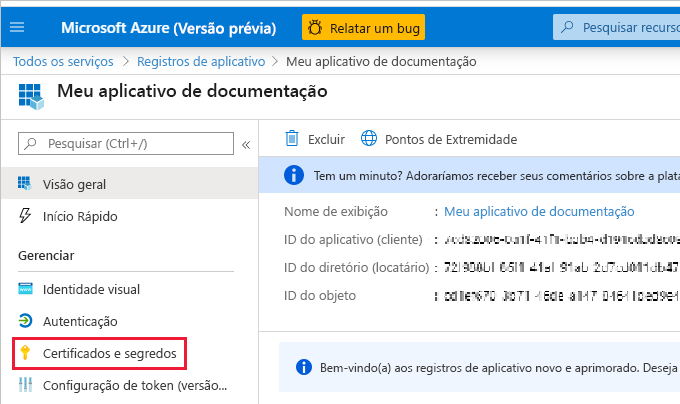
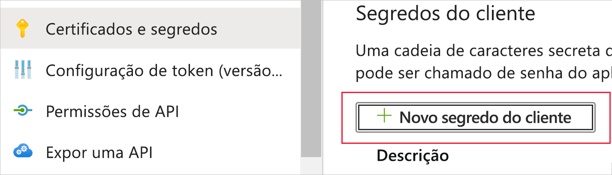
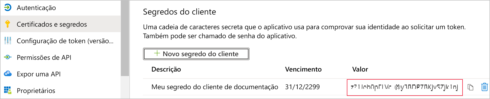
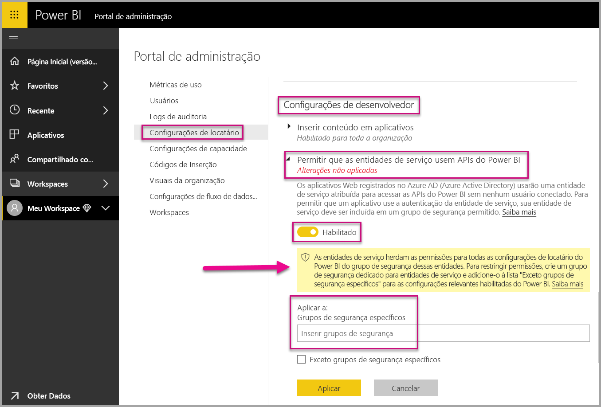
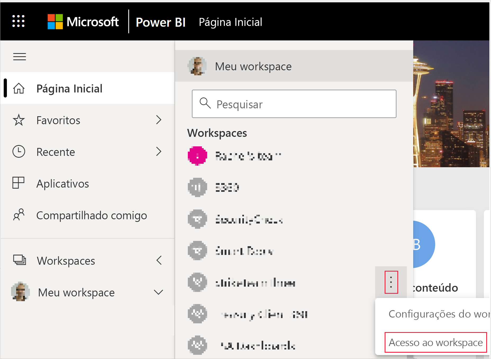
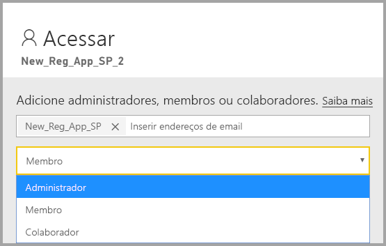

# <a name="embed-power-bi-content-with-service-principal-and-an-application-secret"></a>Conteúdo inserido do Power BI com a entidade de serviço e um segredo do aplicativo

[!INCLUDE[service principal overview](../../includes/service-principal-overview.md)]

Este artigo descreve como a autenticação da entidade de serviço usa a *ID do Aplicativo* e o *Segredo do aplicativo*.

>[!NOTE]
>Recomendamos que você proteja os seus serviços de back-end usando certificados, em vez de chaves secretas.
>* [Saiba mais sobre como obter tokens de acesso do Azure AD usando chaves secretas ou certificados](https://docs.microsoft.com/azure/architecture/multitenant-identity/client-assertion).
>* [Conteúdo inserido do Power BI com a entidade de serviço e um certificado](embed-service-principal-certificate.md).

## <a name="method"></a>Método

Para usar a entidade de serviço e uma ID de aplicativo com as análises inseridas, siga estas etapas:

1. Crie um [aplicativo Azure AD](https://docs.microsoft.com/azure/active-directory/manage-apps/what-is-application-management).

    1. Crie um segredo do aplicativo do Azure AD.
    
    2. Obtenha a *ID do Aplicativo* e o *Segredo do aplicativo*.

    >[!NOTE]
    >Todas essas etapas são descritas na **etapa 1**. Para obter mais informações, confira o artigo [Criar um aplicativo do Azure AD](https://docs.microsoft.com/azure/active-directory/develop/howto-create-service-principal-portal).

2. Crie um grupo de segurança do Azure AD.

3. Habilite as configurações de administração do serviço do Power BI.

4. Adicione a entidade de serviço ao seu espaço de trabalho.

5. Insira seu conteúdo.

> [!IMPORTANT]
> Depois que você habilita a entidade de serviço para ser usada com o Power BI, as permissões do aplicativo do AD não estão mais em vigor. As permissões do aplicativo então são gerenciadas por meio do portal de administração do Power BI.

## <a name="step-1---create-an-azure-ad-app"></a>Etapa 1 – Criar um aplicativo do Azure AD

Crie um aplicativo do Azure AD usando um destes métodos:
* Crie o aplicativo no [portal do Microsoft Azure](https://portal.azure.com/#allservices)
* Crie um trabalho usando o [PowerShell](https://docs.microsoft.com/powershell/azure/create-azure-service-principal-azureps?view=azps-3.6.1).

### <a name="creating-an-azure-ad-app-in-the-microsoft-azure-portal"></a>Como criar o aplicativo do Azure AD no portal do Microsoft Azure

[!INCLUDE[service create app](../../includes/service-principal-create-app.md)]

7. Clique na guia **Certificados e segredos**.

     


8. Clique em **Novo segredo do cliente**

    

9. Na janela *Adicionar um segredo do cliente*, insira uma descrição, especifique quando deseja que o segredo do cliente expire e clique em **Adicionar**.

10. Copie e salve o valor do *Segredo do cliente*.

    

    >[!NOTE]
    >Depois de sair dessa janela, o valor do segredo do cliente ficará oculto e você não poderá exibi-lo ou copiá-lo novamente.

### <a name="creating-an-azure-ad-app-using-powershell"></a>Criar um aplicativo do Azure AD usando o PowerShell

Esta seção inclui um script de exemplo para criar um novo aplicativo do Azure AD usando o [PowerShell](https://docs.microsoft.com/powershell/azure/create-azure-service-principal-azureps?view=azps-1.1.0).

```powershell
# The app ID - $app.appid
# The service principal object ID - $sp.objectId
# The app key - $key.value

# Sign in as a user that's allowed to create an app
Connect-AzureAD

# Create a new Azure AD web application
$app = New-AzureADApplication -DisplayName "testApp1" -Homepage "https://localhost:44322" -ReplyUrls "https://localhost:44322"

# Creates a service principal
$sp = New-AzureADServicePrincipal -AppId $app.AppId

# Get the service principal key
$key = New-AzureADServicePrincipalPasswordCredential -ObjectId $sp.ObjectId
```

## <a name="step-2---create-an-azure-ad-security-group"></a>Etapa 2 – Criar um grupo de segurança do Azure AD

Sua entidade de serviço não tem acesso a nenhum de seus conteúdo e APIs do Power BI. Para dar acesso à entidade de serviço, crie um grupo de segurança no Azure AD e adicione a entidade de serviço que você criou a esse grupo de segurança.

Há duas maneiras de criar um grupo de segurança do Azure AD:
* Manualmente (no Azure)
* Usar o PowerShell

### <a name="create-a-security-group-manually"></a>Criar manualmente um grupo de segurança

Para criar manualmente um grupo de segurança no Azure, siga as instruções no artigo [Criar um grupo básico e adicionar membros usando o Azure Active Directory](https://docs.microsoft.com/azure/active-directory/fundamentals/active-directory-groups-create-azure-portal). 

### <a name="create-a-security-group-using-powershell"></a>Criar um grupo de segurança usando o PowerShell

Abaixo está um exemplo de script para criar um novo grupo de segurança e adicionar um aplicativo ao grupo de segurança.

>[!NOTE]
>Caso queira habilitar o acesso à entidade de serviço para toda a organização, ignore essa etapa.

```powershell
# Required to sign in as a tenant admin
Connect-AzureAD

# Create an Azure AD security group
$group = New-AzureADGroup -DisplayName <Group display name> -SecurityEnabled $true -MailEnabled $false -MailNickName notSet

# Add the service principal to the group
Add-AzureADGroupMember -ObjectId $($group.ObjectId) -RefObjectId $($sp.ObjectId)
```

## <a name="step-3---enable-the-power-bi-service-admin-settings"></a>Etapa 3 – Habilitar as configurações de administração do serviço do Power BI

Para que um aplicativo do Azure AD possa acessar o conteúdo e as APIs do Power BI, um administrador de Power BI precisa habilitar o acesso à entidade de serviço no portal de administração do Power BI.

Adicione o grupo de segurança que você criou no Azure AD à seção de grupo de segurança específica nas **Configurações do desenvolvedor**.

>[!IMPORTANT]
>As entidades de serviço têm acesso a quaisquer configurações de locatário para as quais estejam habilitadas. Dependendo das configurações de administrador, isso inclui grupos de segurança específicos ou de toda a organização.
>
>Para restringir o acesso da entidade de serviço a configurações de locatário específicas, permita o acesso somente a grupos de segurança específicos. Como alternativa, você pode criar um grupo de segurança dedicado para entidades de serviço e excluí-lo das configurações de locatário desejadas.



## <a name="step-4---add-the-service-principal-to-your-workspace"></a>Etapa 4 – Adicione a entidade de serviço ao seu workspace

Para habilitar seus artefatos de acesso do aplicativo do Azure AD, como relatórios, painéis e conjuntos de dados no serviço do Power BI, adicione a entidade de serviço como um membro ou administrador do seu espaço de trabalho.

>[!NOTE]
>Esta seção fornece instruções para a interface do usuário. Você também pode adicionar uma entidade de serviço a um espaço de trabalho usando [Grupos – adicionar API de usuário de grupo](https://docs.microsoft.com/rest/api/power-bi/groups/addgroupuser).

1. Role até o espaço de trabalho para o qual você deseja habilitar o acesso e, no menu **Mais**, selecione **Acesso do espaço de trabalho**.

    

2. Adicione a entidade de serviço como **Administrador** ou **Membro** do espaço de trabalho.

    

## <a name="step-5---embed-your-content"></a>Etapa 5 – Inserir seu conteúdo

Você pode inserir o conteúdo em um aplicativo de exemplo ou em seu próprio aplicativo.

* [Insira conteúdo usando o aplicativo de exemplo](embed-sample-for-customers.md#embed-content-using-the-sample-application)
* [Inserir conteúdo em seu aplicativo](embed-sample-for-customers.md#embed-content-within-your-application)

Depois de inserir o conteúdo, você estará pronto para [passar para a produção](embed-sample-for-customers.md#move-to-production).

[!INCLUDE[service principal limitations](../../includes/service-principal-limitations.md)]

## <a name="next-steps"></a>Próximas etapas

>[!div class="nextstepaction"]
>[Registrar um aplicativo](register-app.md)

> [!div class="nextstepaction"]
>[Power BI Embedded para seus clientes](embed-sample-for-customers.md)

>[!div class="nextstepaction"]
>[Aplicativo e objetos de entidade de serviço no Azure Active Directory](https://docs.microsoft.com/azure/active-directory/develop/app-objects-and-service-principals)

>[!div class="nextstepaction"]
>[Segurança em nível de linha usando o gateway de dados local com a entidade de serviço](embedded-row-level-security.md#on-premises-data-gateway-with-service-principal)

>[!div class="nextstepaction"]
>[Conteúdo inserido do Power BI com a entidade de serviço e um certificado](embed-service-principal-certificate.md)
