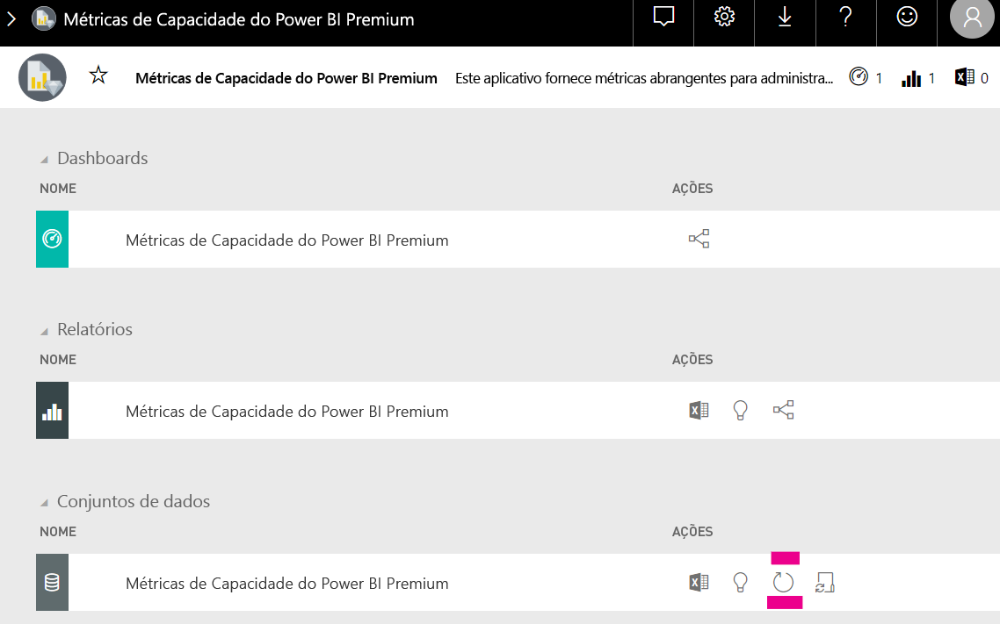

# Planejamento da capacidade em análise integrada do Power BI

Pode ser complicado calcular o tipo de capacidade necessário para uma implantação de análise integrada do Power BI. Isso ocorre porque esse cálculo tem base em vários parâmetros, sendo que alguns deles são difíceis de prever.

Confira alguns aspectos a levar em consideração ao planejar sua capacidade:

* Os modelos de dados que você está usando
* O número e a complexidade das consultas necessárias
* A distribuição por hora do uso do seu aplicativo
* Taxas de atualização de dados
* Padrões de uso adicionais difíceis de prever.

Este artigo foi desenvolvido para facilitar o planejamento da capacidade de análise integrada do Power BI por meio da introdução da [Ferramenta de Avaliação de Carga de Capacidade Dedicada do Power BI](https://github.com/microsoft/PowerBI-Tools-For-Capacities/tree/master/LoadTestingPowerShellTool/), criada para automatizar o teste de carga para capacidades de análise integrada do Power BI (SKUs *A*, *EM* ou *P*).

## Ferramenta de planejamento

 A [Ferramenta de Avaliação de Carga de Capacidade Dedicada do Power BI](https://github.com/microsoft/PowerBI-Tools-For-Capacities/tree/master/LoadTestingPowerShellTool/) pode ajudar você a entender a quantidade de carga de usuário que sua capacidade pode manipular. Ela usa o PowerShell para criar testes de carga automatizados em suas capacidades e permite que você escolha quais relatórios testar e quantos usuários simultâneos simular.

A ferramenta gera carga em uma capacidade renderizando continuamente cada relatório com novos valores de filtro (para evitar um desempenho irreal devido ao cache de relatórios), até que o token necessário para autenticar a ferramenta no serviço expire.

### Usar a ferramenta de planejamento

Ao executar a ferramenta, fique atento à carga existente em suas capacidades e não execute testes de carga durante os horários de pico.

Confira alguns exemplos de como usar a ferramenta de planejamento.

* Os administradores de capacidade podem entender melhor quantos usuários a capacidade deles pode aceitar em determinado período.
* Os autores de relatório podem entender o efeito da carga do usuário, conforme medido com o [Analisador de Desempenho](https://docs.microsoft.com/power-bi/desktop-performance-analyzer) do Power BI Desktop.
* Você pode ver renderizações acontecendo em tempo real em seu navegador.
* Usando o SQL Server Profiler, você pode [se conectar aos pontos de extremidade XMLA](https://powerbi.microsoft.com/blog/power-bi-open-platform-connectivity-with-xmla-endpoints-public-preview/) das capacidades que estão sendo avaliadas para ver as consultas que estão sendo executadas.
* Os efeitos do teste de carga são visíveis na página Conjuntos de dados do aplicativo de métricas de capacidade Premium. Os administradores de capacidade podem usar essa ferramenta para gerar carga e ver como essa carga é exibida.

### Analisar os resultados do teste

Para ver os efeitos do teste de carga no aplicativo de métricas após a execução do teste, siga as instruções abaixo. Espere um atraso de até 15 minutos desde o momento em que o teste começa a gerar carga até o momento em que a carga fica visível nas métricas.

1. Expanda a guia **Conjuntos** da página de aterrissagem do [aplicativo de métricas](../../admin/service-admin-premium-monitor-capacity.md).
2. Inicie uma atualização sob demanda clicando em **atualizar agora**. Os administradores devem.

    

## Repositório GitHub de ferramentas de capacidade do Power BI

O [repositório GitHub de ferramentas de capacidade do Power BI](https://github.com/microsoft/PowerBI-Tools-For-Capacities) foi criado para hospedar a ferramenta de planejamento de capacidade e outras ferramentas e utilitários futuros.

O repositório é um software livre e os usuários são incentivados a contribuir, adicionar outras ferramentas relacionadas às capacidades do Power BI Premium e Integradas e aprimorar as existentes.

## Próximas etapas

> [!div class="nextstepaction"]
>[Capacidade e SKUs em análises integradas do Power BI](embedded-capacity.md)

> [!div class="nextstepaction"]
>[Práticas recomendadas de desempenho de Power BI Embedded](embedded-performance-best-practices.md)