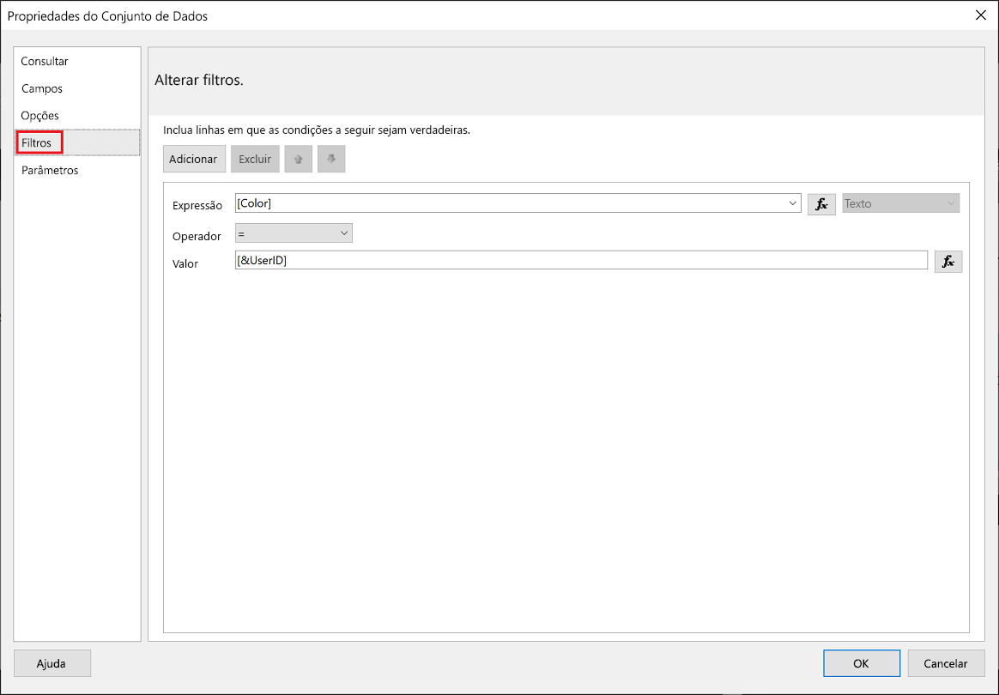
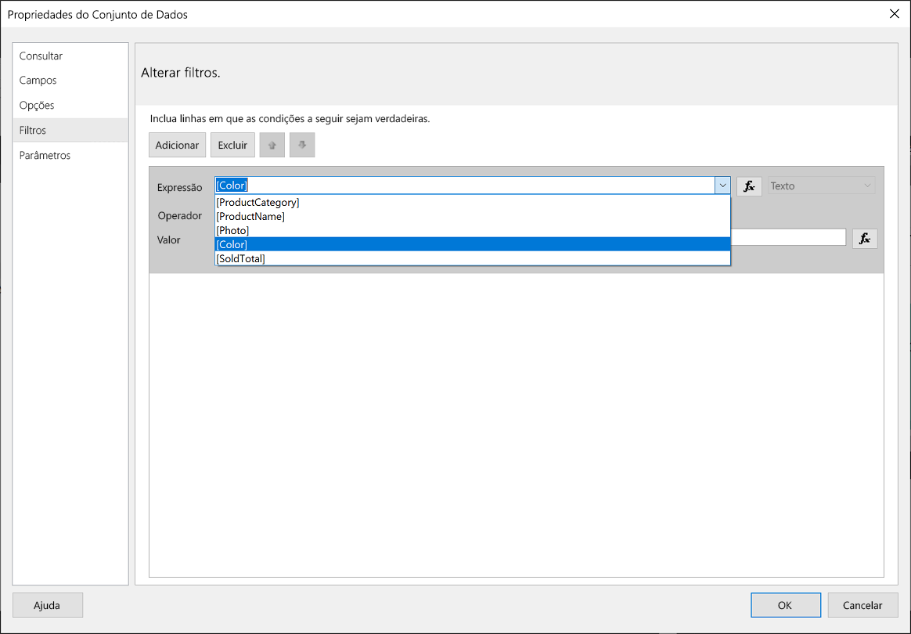
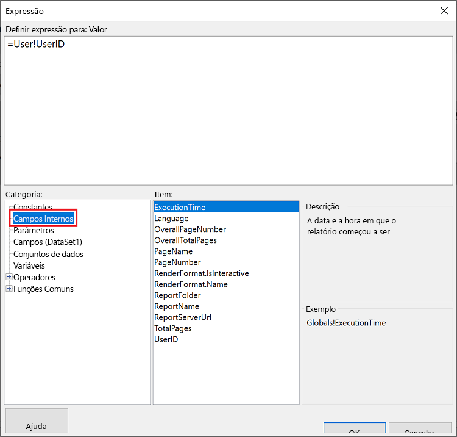
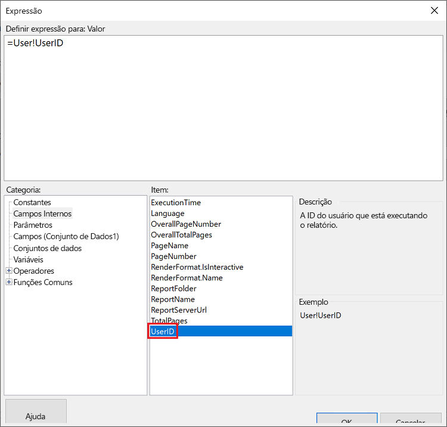
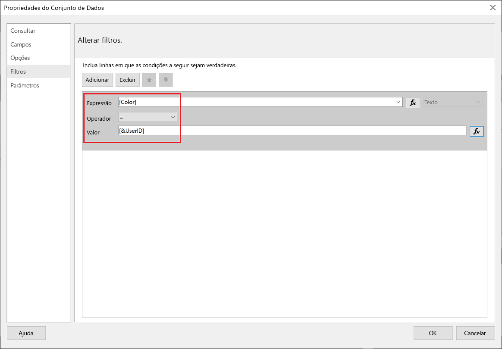
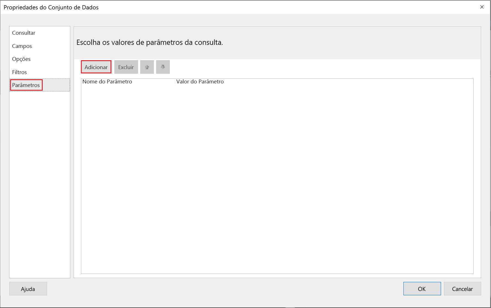
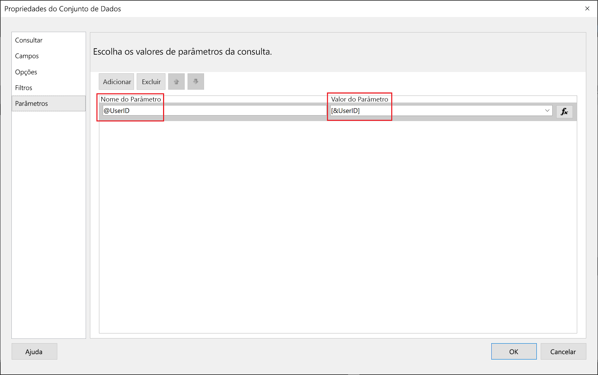
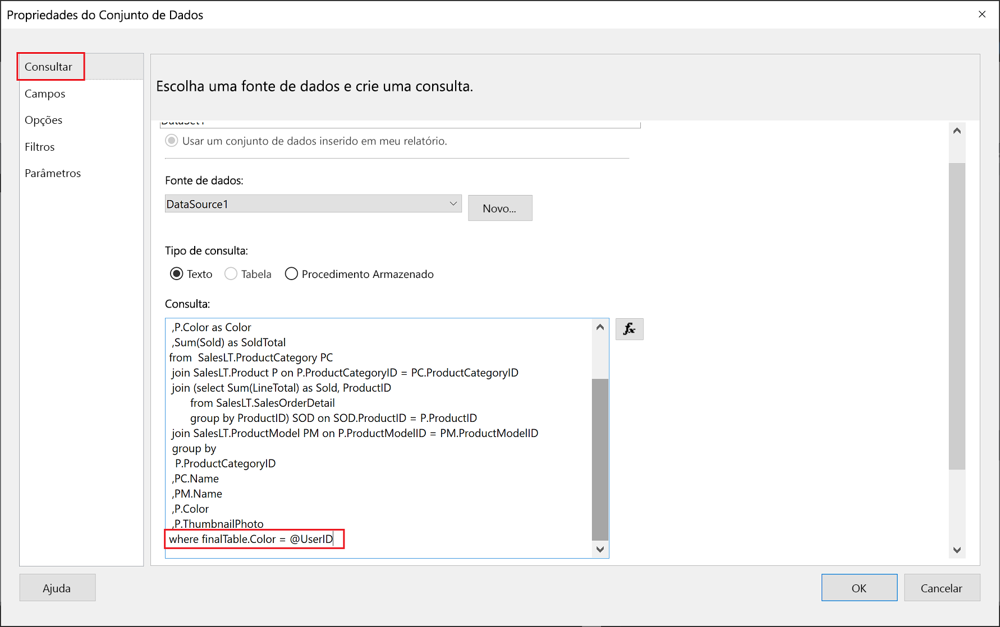

# <a name="implementing-row-level-security-in-embedded-paginated-reports-preview"></a>Implementando segurança em nível de linha em relatórios paginados inseridos (versão prévia)

Ao inserir um relatório paginado, você pode controlar quais dados são exibidos. Isso permite a personalização das informações exibidas por usuário. Por exemplo, se você tiver um relatório paginado do Power BI que inclua resultados de vendas globais, você poderá inseri-lo para que apenas os resultados da venda de uma determinada região estejam disponíveis.

Esse recurso fornece uma maneira segura de exibir um subconjunto dos dados de forma que não comprometa o restante dos dados. Ele é semelhante ao recurso [RLS (Segurança em Nível de Linha)](embedded-row-level-security.md), que fornece uma maneira segura de exibir dados em relatórios do Power BI (que não são paginados), dashboards, blocos e conjuntos de dados.  

> [!NOTE]
> Esse recurso funciona com a inserção de relatórios paginados para clientes.

## <a name="configuring-a-parameter-to-filter-the-dataset"></a>Como configurar um parâmetro para filtrar o conjunto de dados

Ao aplicar a segurança em nível de linha a um relatório paginado do Power BI, você precisa atribuir um [parâmetro](../../paginated-reports/report-builder-parameters.md) ao atributo **UserID**. Esse parâmetro restringirá os dados extraídos do conjunto antes que o relatório seja inserido.

Depois de atribuir o parâmetro a **UserID**, use a API [Reports GenerateTokenForCreateInGroup](https://docs.microsoft.com/rest/api/power-bi/embedtoken/reports_generatetokenforcreateingroup) para obter o token de inserção.

## <a name="use-userid-as-a-filter-at-report-or-query-level"></a>Usar UserID como um filtro no nível do relatório ou da consulta

Você pode usar **UserId** como *filtro* ou em uma *consulta* para a fonte de dados no [Power BI Report Builder](../../paginated-reports/report-builder-power-bi.md).

### <a name="using-the-filter"></a>Como usar o filtro

1. Na janela **Propriedades do Conjunto de Dados**, no painel esquerdo, selecione **Filtro**.

    

2. No menu suspenso **Expressão**, selecione o parâmetro que você deseja usar para filtrar os dados.

     

3. Clique no botão de função **Valor**. 

    

4. Na janela **Expressão**, na lista **Categoria**, selecione **Campos Integrados**.

    

5. Na lista **Item**, selecione **UserID** e clique em **OK**.

    

6. Na janela **Propriedades do Conjunto de Dados**, verifique se a expressão é *seu parâmetro selecionado = UserID* e clique em **OK**.

    

### <a name="using-a-query"></a>Como usar uma consulta

1. Na janela **Propriedades do Conjunto de Dados**, no painel esquerdo, selecione **Parâmetros** e clique em **Adicionar**.

    

2. No **Nome do Parâmetro**, insira **\@UserID** e, no **Valor do Parâmetro**, adicione **[&UserID]** .

     

3. No painel esquerdo, selecione **Consulta**. Na Consulta, adicione o parâmetro **UserID** como parte de sua consulta e clique em **OK**.
    > [!NOTE]
    > Na captura de tela abaixo, o parâmetro color é usado como um exemplo (whereFinalTable.Color = @UserID). Se necessário, é possível criar uma consulta mais complexa.

    

## <a name="passing-the-configured-parameter-using-the-embed-token"></a>Como passar o parâmetro configurado usando o token de inserção

Ao inserir um relatório paginado para seus clientes, a API [Reports GenerateTokenForCreateInGroup](https://docs.microsoft.com/rest/api/power-bi/embedtoken/reports_generatetokenforcreateingroup) é usada para obter o token de inserção. Esse token também pode ser usado para filtrar alguns dos dados extraídos do relatório paginado.

Para expor apenas alguns dos dados, atribua o campo `username` com as informações que você deseja exibir. Por exemplo, em um relatório paginado que tem um parâmetro de color, se você inserir *verde* no campo `username`, o token de inserção restringirá os dados inseridos para exibir somente os dados que têm o valor *verde* na coluna de cores.

```JSON
{
    "accessLevel": "View",
    "reportId": "cfafbeb1-8037-4d0c-896e-a46fb27ff229",
    "identities": [
            {
                    // Replace the 'username' with a paginated report parameter
                    "username":     "...",
                    "reports: [
                        "cfafbeb1-8037-4d0c-896e-a46fb27ff229"
                    ]
            }
    ]
}
```
