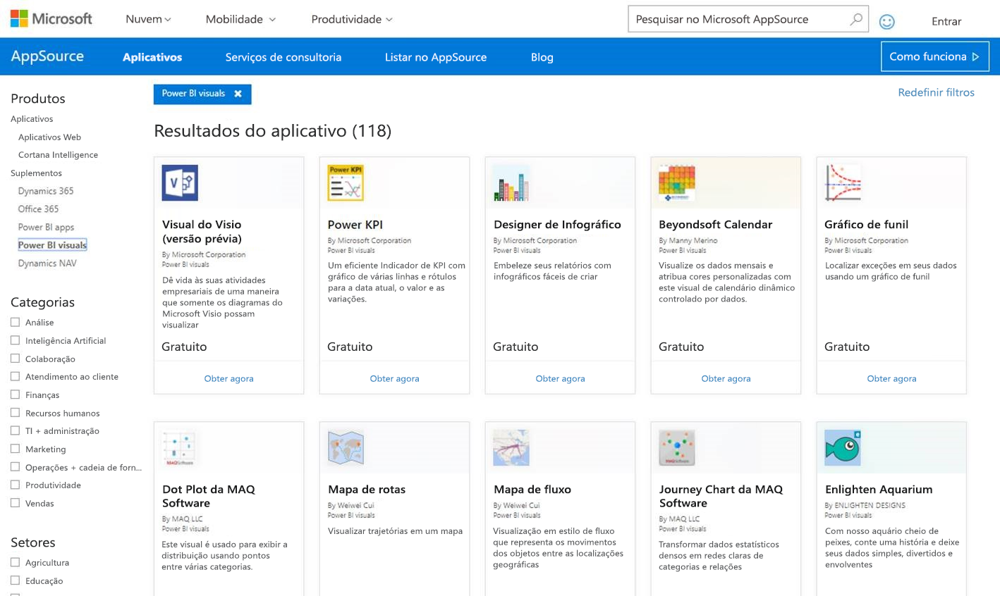

# Publicar visuais do Power BI no Partner Center

Depois de criar seu visual do Power BI, talvez você queira publicá-lo no AppSource para que outras pessoas possam descobri-lo e usá-lo. Confira mais informações sobre como criar um visual do Power BI em [Desenvolver um visual do Power BI](visuals/custom-visual-develop-tutorial.md).

## O que é o AppSource?

O [AppSource](https://appsource.microsoft.com/marketplace/apps?product=power-bi-visuals) é o lugar para encontrar suplementos e aplicativos SaaS para seus produtos e serviços da Microsoft.

## Preparação para envio de seu visual do Power BI

Antes de enviar um visual do Power BI para o AppSource, verifique se leu as [diretrizes de visuais do Power BI](guidelines-powerbi-visuals.md) e [testou seu visual personalizado](https://github.com/Microsoft/PowerBI-visuals/blob/master/Tutorial/SubmissionTesting.md).

Quando estiver pronto para enviar o visual do Power BI, verifique se o visual atende a todos os requisitos listados abaixo.

| Item | Obrigatório | Descrição |
| --- | --- | --- |
| Pacote Pbiviz |Sim |Empacote seu visual do Power BI em um pacote Pbiviz que contenha todos os metadados necessários. Nome do visual Nome de exibição GUID Versão Descrição Email e nome do autor |
| Arquivo de relatório .pbix de exemplo |Sim |Para demonstrar seu visual, você deverá ajudar os usuários a se familiarizar com ele. Destaque o valor que o visual traz para o usuário e dê exemplos de uso e opções de formatação. Você também pode adicionar uma página de *"dicas"* no final com alguns macetes, truques e aspectos a evitar. O arquivo de relatório .pbix de exemplo deve trabalhar offline, sem nenhuma conexão externa. |
| Ícone |Sim |Você deve incluir o logotipo visual personalizado que será exibido na frente da loja. O formato pode ser .png, .jpg, .jpeg ou .gif. Ele deve ter exatamente 300 px (largura) x 300 px (altura). **Importante!** Examine cuidadosamente o [guia de imagens da loja do AppSource](https://docs.microsoft.com/office/dev/store/craft-effective-appsource-store-images) antes de enviar o ícone. |
| Capturas de tela |Sim |Forneça pelo menos uma captura de tela. O formato pode ser .png, .jpg, .jpeg ou .gif. As dimensões devem ter exatamente 1.366 px (largura) por 768 px (altura). O tamanho do arquivo não pode ser maior que 1.024 KB. Para melhor utilização, adicione balões de texto para articular a proposição de valores dos principais recursos mostrados em cada captura de tela. |
| Link de download de suporte |Sim |Forneça uma URL de suporte para seus clientes. Esse link é inserido como parte da listagem do Centro de Parceiros e fica visível para os usuários quando eles acessam a listagem no visual no AppSource. O formato da URL deve incluir https:// ou http://. |
| Link do documento de privacidade |Sim |Forneça um link para a política de privacidade do visual. Esse link é inserido como parte da listagem do Centro de Parceiros e fica visível para os usuários quando eles acessam a listagem no visual no AppSource. O formato do link deve incluir https:// ou http://. |
| EULA (Contrato de licença de usuário final) |Sim |Você deve fornecer um arquivo de EULA ao seu visual do Power BI. |
| Link do vídeo |Não |Para aumentar o interesse dos usuários pelo seu visual personalizado, forneça um link para um vídeo sobre o visual. O formato da URL deve incluir https:// ou http://. |
| Repositório GitHub |Não |Compartilhe um link público para um repositório [GitHub](https://www.github.com) com fontes do seu visual do Power BI e dados de exemplo. Isso permite que outros desenvolvedores tenham oportunidade de fornecer comentários e propor melhorias ao seu código. |

## Obter um XML de pacote do aplicativo

Para enviar um visual do Power BI, você precisa de um XML de pacote do aplicativo da equipe do Power BI. Para obter o XML de pacote do aplicativo, envie um email à equipe de envio de visuais do Power BI ([pbivizsubmit@microsoft.com](mailto:pbivizsubmit@microsoft.com)).

Antes de criar o pacote **pbiviz**, é preciso preencher os seguintes campos no arquivo **pbiviz.json**:
* descrição
* URL de suporte
* autor
* Nome
* email

Anexe o **arquivo pbiviz** e o **arquivo de relatório pbix de exemplo** ao seu email. A equipe do Power BI responderá com instruções e um arquivo XML do pacote do aplicativo para upload. Esse pacote do aplicativo XML é necessário para enviar seu visual por meio da Central de desenvolvedores do Office.

> [!NOTE]
> Para melhorar a qualidade e garantir que os relatórios existentes não sejam danificados, as atualizações para os visuais existentes precisarão de um período adicional de duas semanas para alcançarem o ambiente de produção após a aprovação na loja.

## Enviar para AppSource

Para enviar seu visual do Power BI ao AppSource, você precisa obter um pacote de aplicativo da equipe do Power BI e enviá-lo ao Partner Center. 

### Obter o pacote do aplicativo

Envie um email com os arquivos **pbiviz** e **pbix** à equipe do Power BI antes de enviar para o AppSource. Isso permite à equipe do Power BI carregar os arquivos para o servidor de compartilhamento público. Caso contrário, a loja não poderá recuperar os arquivos. 

A equipe do Power BI tem que verificar os arquivos quanto a novos envios de visuais do Power BI, atualizações em visuais do Power BI existentes e correções de envios rejeitados.

### Enviar ao Partner Center

Para enviar seu visual do Power BI ao Partner Center, você precisa estar registrado no Partner Center. Se ainda não estiver, [Abra uma conta de desenvolvedor no Partner Center](https://docs.microsoft.com/office/dev/store/open-a-developer-account).

Siga as etapas abaixo para enviar seu visual do Power BI ao Partner Center. Confira mais informações sobre o processo de envio em [Enviar sua solução do Office ao AppSource por meio do Partner Center](https://docs.microsoft.com/office/dev/store/use-partner-center-to-submit-to-appsource).

1. Faça logon no **Partner Center**.

2. No painel esquerdo, selecione **OFFICE STORE**.

3. Selecione **Visão geral**.

4. Selecione **Criar um novo** e, no menu suspenso, selecione **Visual do Power BI**.

    

5. Na janela **Criar um novo visual do Power BI**, insira um nome para o seu visual do Power BI e selecione **Criar**.

6. Selecione **Pacotes** e carregue seu pacote de aplicativo XML do visual do Power BI.

7. Selecione **Propriedades** e forneça as informações necessárias.

8. Se o produto exigir uma compra adicional, selecione **Configuração do produto** e marque a caixa de seleção **Compra de serviço associado**.

9. (Opcional) Se você quiser [certificar](power-bi-custom-visuals-certified.md) seu visual, selecione **Configuração do produto** e marque a caixa de seleção **Certificação do Power BI**.
    >[!TIP]
    >O processo de certificação do Power BI pode demorar um pouco. Se você estiver criando um novo visual do Power BI, recomendamos que o publique por meio do Partner Center antes de solicitar a certificação do Power BI. Isso garante que a publicação do seu visual não seja adiada.

10. Selecione **Configuração do produto** e clique em **Examinar e publicar**.

## Acompanhamento do uso e do status do envio

Você pode examinar as [políticas de validação](https://dev.office.com/officestore/docs/validation-policies#13-power-bi-custom-visuals).

Após o envio, você poderá exibir o status do envio no [dashboard de aplicativos](https://sellerdashboard.microsoft.com/Application/Summary/).

## Certificar seu visual

Depois de criar seu visual, você tem a opção de [certificá-lo](../developer/power-bi-custom-visuals-certified.md).

## Próximas etapas

[Desenvolvimento de um visual personalizado do Power BI](visuals/custom-visual-develop-tutorial.md)  
[Visualizações no Power BI](../visuals/power-bi-report-visualizations.md)  
[Visualizações personalizadas no Power BI](../developer/power-bi-custom-visuals.md)  
[Obter um visual do Power BI certificado](../developer/power-bi-custom-visuals-certified.md)

Mais perguntas? [Experimente perguntar à Comunidade do Power BI](https://community.powerbi.com/)
