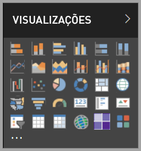

# Visuais no Power BI

O Power BI vem com muitos visuais prontos para uso. Esses visuais estão disponíveis no painel de visualização do [Power BI Desktop](https://powerbi.microsoft.com/desktop/) e do [serviço do Power BI](https://app.powerbi.com) e podem ser usados para criar e editar o conteúdo do Power BI.

Muitos outros visuais do Power BI estão disponíveis no Microsoft [AppSource](https://nam06.safelinks.protection.outlook.com/?url=https%3A%2F%2Fappsource.microsoft.com%2Fen-us%2Fmarketplace%2Fapps%3Fpage%3D1%26product%3Dpower-bi-visuals&data=02%7C01%7CKesem.Sharabi%40microsoft.com%7C6d9286afacb3468d4cde08d740b76694%7C72f988bf86f141af91ab2d7cd011db47%7C1%7C0%7C637049028749147718&sdata=igWm0e1vXdgGcbyvngQBrHQVAkahPnxPC1ZhUPntGI8%3D&reserved=0) ou por meio do Power BI. Esses visuais são criados pela Microsoft e por parceiros da Microsoft e são testados e validados pela equipe de validação do AppSource.

Você também pode desenvolver seu próprio visual do Power BI, a ser usado por você, sua organização ou pela comunidade inteira do Power BI.

## Visuais padrão do Power BI

Estes são os visuais prontos para uso do Power BI disponíveis no painel de visualização do *Power BI Desktop* e do *serviço do Power BI*.

Para desafixar um visual do Power BI do painel de visualização, clique com o botão direito do mouse nele e selecione **Desafixar**.

Para restaurar os visuais padrão do Power BI no painel de visualização, clique em **Importar um visual personalizado** e selecione **Restaurar visuais padrão**. 

## Visuais do Power BI no AppSource

A Microsoft e os membros da comunidade contribuem com visuais do Power BI para o benefício público e os publicam no [AppSource](https://appsource.microsoft.com/marketplace/apps?product=power-bi-visuals). Baixe esses visuais e adicione-os aos seus relatórios do Power BI. A Microsoft testou e aprovou esses visuais do Power BI com relação à funcionalidade e à qualidade.

### O que é o AppSource?

O [AppSource](office-store.md) é o lugar para encontrar aplicativos, suplementos e extensões para seu software Microsoft. O AppSource conecta milhões de usuários de produtos como Office 365, Azure, Dynamics 365, Cortana e Power BI a soluções que os ajudam a realizar o trabalho com mais eficiência e insights do que antes.

### Visuais do Power BI certificados

Os visuais certificados do Power BI são visuais do [AppSource](https://nam06.safelinks.protection.outlook.com/?url=https%3A%2F%2Fappsource.microsoft.com%2Fen-us%2Fmarketplace%2Fapps%3Fpage%3D1%26product%3Dpower-bi-visuals&data=02%7C01%7CKesem.Sharabi%40microsoft.com%7C6d9286afacb3468d4cde08d740b76694%7C72f988bf86f141af91ab2d7cd011db47%7C1%7C0%7C637049028749147718&sdata=igWm0e1vXdgGcbyvngQBrHQVAkahPnxPC1ZhUPntGI8%3D&reserved=0) testados e aprovados pela equipe do Microsoft Power BI que atendem a determinados requisitos de código especificados. Os testes foram criados para verificar se o visual não acessa serviços ou recursos externos.

Para ver a lista de visuais certificados do Power BI ou para enviar seus próprios, confira [Visuais certificados do Power BI](power-bi-custom-visuals-certified.md).

### Amostras de visuais do Power BI

Cada visual do Power BI no AppSource tem uma amostra de dados que ilustra como ele funciona. Para baixar a amostra, no [AppSource](https://nam06.safelinks.protection.outlook.com/?url=https%3A%2F%2Fappsource.microsoft.com%2Fen-us%2Fmarketplace%2Fapps%3Fpage%3D1%26product%3Dpower-bi-visuals&data=02%7C01%7CKesem.Sharabi%40microsoft.com%7C6d9286afacb3468d4cde08d740b76694%7C72f988bf86f141af91ab2d7cd011db47%7C1%7C0%7C637049028749147718&sdata=igWm0e1vXdgGcbyvngQBrHQVAkahPnxPC1ZhUPntGI8%3D&reserved=0), selecione um visual do Power BI e, na seção *Experimentar uma amostra*, clique no link **Relatório de exemplo**.

## Repositório organizacional

Os administradores do Power BI aprovam e implantam visuais do Power BI em sua organização. Isso permite que os autores de relatórios descubram, atualizem e usem esses visuais do Power BI com facilidade. Os administradores podem gerenciar esses visuais com facilidade por meio de ações como atualizar versões, desabilitar e habilitar visuais do Power BI.

Para acessar o repositório organizacional, no painel *Visualização*, clique em **Importar um visual personalizado**, selecione **Importar do marketplace** e, na parte superior da janela *Visuais do Power BI*, selecione a guia **Minha organização**.

[Leia mais sobre visuais da organização](power-bi-custom-visuals-organization.md).

## Arquivos visuais

Os visuais do Power BI são pacotes que incluem o código para renderizar os dados fornecidos a eles. Qualquer pessoa pode criar um visual personalizado e empacotá-lo como um único arquivo `.pbiviz`, que pode ser importado em um relatório do Power BI.

Para importar um visual do Power BI, no painel *Visualização*, clique em **Importar um visual personalizado** e selecione **Importar do arquivo**.

Se você é desenvolvedor da Web e está interessado em criar seu próprio visual e adicioná-lo ao AppSource, saiba como [desenvolver um visual do Power BI](visuals/custom-visual-develop-tutorial.md) e [publicar um visual do Power BI no AppSource](office-store.md).

> [!WARNING]
> Um visual do Power BI pode conter código com riscos de segurança ou de privacidade. É importante confiar no autor e na fonte do visual do Power BI antes de importá-lo para o relatório.

## Próximas etapas

* Se você é desenvolvedor, comece com o tutorial [Como desenvolver um visual do Power BI](./visuals/custom-visual-develop-tutorial.md).

* Saiba como um [projeto de visuais do Power BI é estruturado](./visuals/visual-project-structure.md).

* Explore as [diretrizes para visuais do Power BI](guidelines-powerbi-visuals.md).

Mais perguntas? Experimente acessar as [Perguntas frequentes sobre o Power BI na página Visuais do Power BI](power-bi-custom-visuals-faq.md) ou a [Comunidade do Power BI](http://community.powerbi.com/).