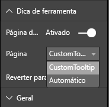

# <a name="tooltips-in-power-bi-visuals"></a>Dicas de ferramenta em visuais do Power BI

Os visuais agora podem se beneficiar do suporte a dicas de ferramenta do Power BI. As dicas de ferramenta do Power BI são responsáveis pelas seguintes interações:

* mostrar uma dica de ferramenta;
* ocultar uma dica de ferramenta;
* mover uma dica de ferramenta.

Dicas de ferramenta podem exibir um elemento textual com um título, um valor em uma determinada cor e opacidade em um conjunto especificado de coordenadas. Esses dados são fornecidos à API e o host do Power BI renderiza-os do mesmo modo que renderiza dicas de ferramenta para visuais nativos.

Uma dica de ferramenta em um gráfico de barras de exemplo é mostrada na imagem a seguir:


A imagem de dica de ferramenta anterior ilustra uma única categoria de barra e valor. Você pode estender uma única dica de ferramenta para exibir vários valores.

## <a name="manage-tooltips"></a>Gerenciar dicas de ferramenta

A interface por meio da qual você gerencia dicas de ferramenta é a "ITooltipService". É usada para notificar o host de que uma dica de ferramenta precisa ser exibida, removida ou movida.

```typescript
    interface ITooltipService {
        enabled(): boolean;
        show(options: TooltipShowOptions): void;
        move(options: TooltipMoveOptions): void;
        hide(options: TooltipHideOptions): void;
    }
```

O visual precisa escutar os eventos de mouse que ocorrerem nele e chamar os delegados `show()`, `move()` e `hide()` conforme necessário, com o conteúdo apropriado populado nos objetos `Tooltip****Options`.
`TooltipShowOptions` e `TooltipHideOptions`, por sua vez, definiriam o que exibir e como se comportar caso esses eventos ocorressem.

Já que a chamada desses métodos envolve eventos do usuário, como movimentos do mouse ou eventos de toque, é uma boa ideia criar ouvintes para esses eventos, que, por sua vez, invocam os membros `TooltipService`.
Nossas agregações de exemplo em uma classe chamada `TooltipServiceWrapper`.

### <a name="the-tooltipservicewrapper-class"></a>A classe TooltipServiceWrapper

O propósito básico dessa classe é manter a instância do `TooltipService`, ouvir eventos de mouse D3 em elementos relevantes e, em seguida, fazer as chamadas para os elementos `hide()` e `show()` quando necessário.

A classe mantém e gerencia qualquer estado e lógica relevantes para esses eventos, que são voltados principalmente para a interface com o código D3 subjacente. A interface e a conversão de D3 estão fora do escopo deste artigo.

Você pode encontrar o código de exemplo completo no [repositório do visual SampleBarChart](https://github.com/Microsoft/PowerBI-visuals-sampleBarChart/commit/981b021612d7b333adffe9f723ab27783c76fb14).

### <a name="create-tooltipservicewrapper"></a>Criar TooltipServiceWrapper

O construtor de gráfico de barras agora tem um membro `TooltipServiceWrapper`, que é instanciado no construtor com a instância de host `tooltipService`.

```typescript
        private tooltipServiceWrapper: ITooltipServiceWrapper;

        this.tooltipServiceWrapper = createTooltipServiceWrapper(this.host.tooltipService, options.element);
```

A classe `TooltipServiceWrapper` contém a instância `tooltipService`, também como o elemento raiz D3 dos parâmetros visuais e de toque.

```typescript
    class TooltipServiceWrapper implements ITooltipServiceWrapper {
        private handleTouchTimeoutId: number;
        private visualHostTooltipService: ITooltipService;
        private rootElement: Element;
        private handleTouchDelay: number;

        constructor(tooltipService: ITooltipService, rootElement: Element, handleTouchDelay: number) {
            this.visualHostTooltipService = tooltipService;
            this.handleTouchDelay = handleTouchDelay;
            this.rootElement = rootElement;
        }
        .
        .
        .
    }
```

O ponto de entrada único para essa classe registrar ouvintes de evento é o método `addTooltip`.

### <a name="the-addtooltip-method"></a>O método addTooltip

```typescript
        public addTooltip<T>(
            selection: d3.Selection<Element>,
            getTooltipInfoDelegate: (args: TooltipEventArgs<T>) => VisualTooltipDataItem[],
            getDataPointIdentity: (args: TooltipEventArgs<T>) => ISelectionId,
            reloadTooltipDataOnMouseMove?: boolean): void {

            if (!selection || !this.visualHostTooltipService.enabled()) {
                return;
            }
        ...
        ...
        }
```

* **selection: d3.Selection<Element>** : Os elementos d3 sobre quais dicas de ferramenta são manipuladas.

* **getTooltipInfoDelegate: (args: TooltipEventArgs<T>) => VisualTooltipDataItem[]** : O delegado para popular o conteúdo da dica de ferramenta (o que exibir) segundo o contexto.

* **getDataPointIdentity: (args: TooltipEventArgs<T>) => ISelectionId**: O delegado para recuperar a ID do ponto de dados (não usado neste exemplo). 

* **Booliano reloadTooltipDataOnMouseMove?** : Um booliano indicando se os dados da dica de ferramenta devem ser atualizados durante um evento MouseMove (não usado neste exemplo).

Como você pode ver, `addTooltip` sairá sem realizar nenhuma ação se o `tooltipService` estiver desabilitado ou se não houver nenhuma seleção real.

### <a name="call-the-show-method-to-display-a-tooltip"></a>Chame o método show para exibir uma dica de ferramenta

O método `addTooltip` em seguida ouve o evento D3 `mouseover`, conforme mostrado no código a seguir:

```typescript
        ...
        ...
        selection.on("mouseover.tooltip", () => {
            // Ignore mouseover while handling touch events
            if (!this.canDisplayTooltip(d3.event))
                return;

            let tooltipEventArgs = this.makeTooltipEventArgs<T>(rootNode, true, false);
            if (!tooltipEventArgs)
                return;

            let tooltipInfo = getTooltipInfoDelegate(tooltipEventArgs);
            if (tooltipInfo == null)
                return;

            let selectionId = getDataPointIdentity(tooltipEventArgs);

            this.visualHostTooltipService.show({
                coordinates: tooltipEventArgs.coordinates,
                isTouchEvent: false,
                dataItems: tooltipInfo,
                identities: selectionId ? [selectionId] : [],
            });
        });
```

* **makeTooltipEventArgs**: Extrai o contexto dos elementos D3 selecionados em um ToolTipEventArgs. Também calcula as coordenadas.

* **getTooltipInfoDelegate**: em seguida, ele cria o conteúdo da dica de ferramenta com base em tooltipEventArgs. É um retorno de chamada para a classe BarChart, pois representa a lógica do visual. É o conteúdo de texto real a ser exibido na dica de ferramenta.

* **getDataPointIdentity**: não usado neste exemplo.

* **this.visualHostTooltipService.show**: a chamada para exibir a dica de ferramenta.  

Tratamento adicional pode ser encontrado no exemplo para os eventos `mouseout` e `mousemove`.

Para obter mais informações, confira o [repositório visual SampleBarChart](https://github.com/Microsoft/PowerBI-visuals-sampleBarChart/commit/981b021612d7b333adffe9f723ab27783c76fb14).

### <a name="populate-the-tooltip-content-by-the-gettooltipdata-method"></a>Preencher o conteúdo da dica de ferramenta pelo método getTooltipData

A classe BarChart foi adicionada com um membro `getTooltipData` que simplesmente extrai `category`, `value` e `color` do ponto de dados para um elemento VisualTooltipDataItem[].

```typescript
        private static getTooltipData(value: any): VisualTooltipDataItem[] {
            return [{
                displayName: value.category,
                value: value.value.toString(),
                color: value.color,
                header: 'ToolTip Title'
            }];
        }
```

Na implementação anterior, o membro `header` é constante, mas você pode usá-lo para implementações mais complexas que exigem valores dinâmicos. Você pode preencher o `VisualTooltipDataItem[]` com mais de um elemento, o que adiciona várias linhas à dica de ferramenta. Isso pode ser útil em visuais como gráficos de barras empilhadas, em que a dica de ferramenta pode exibir dados de mais do que um único ponto de dados.

### <a name="call-the-addtooltip-method"></a>Chamar o método addTooltip

A etapa final é chamar o método `addTooltip` quando os dados reais podem mudar. Essa chamada ocorre no método `BarChart.update()`. É feita uma chamada para monitorar a seleção de todos os elementos 'bar', passando apenas o `BarChart.getTooltipData()`, conforme já mencionado.

```typescript
        this.tooltipServiceWrapper.addTooltip(this.barContainer.selectAll('.bar'),
            (tooltipEvent: TooltipEventArgs<number>) => BarChart.getTooltipData(tooltipEvent.data),
            (tooltipEvent: TooltipEventArgs<number>) => null);
```

## <a name="add-report-page-tooltips"></a>Adicionar dicas de ferramentas de página de relatório

Para adicionar dicas de ferramentas de página de relatório, você encontrará a maioria das alterações no arquivo *capabilities.json*.

Um exemplo de esquema é

```json
{
    "tooltips": {
        "supportedTypes": {
            "default": true,
            "canvas": true
        },
        "roles": [
            "tooltips"
        ]
    }
}
```

Você pode definir dicas de ferramenta da página de relatório no painel **Formatar**.



* `supportedTypes`: A configuração da dica de ferramenta com suporte no visual e refletida no contêiner de campos. 
   * `default`: Especifica se a associação de dicas de ferramenta "automática" por meio do campo de dados é compatível. 
   * `canvas`: Especifica se as dicas de ferramenta de página de relatório são compatíveis.

* `roles`: (Opcional) Depois de definido, ele instrui quais funções de dados estão associadas à opção de dica de ferramenta selecionada no contêiner de campos.

Para obter mais informações, confira [Diretrizes de uso de dicas de ferramenta deda página de relatório](https://powerbi.microsoft.com/blog/power-bi-desktop-march-2018-feature-summary/#tooltips).

Para exibir a dica de ferramenta da página de relatório, depois que o host do Power BI chama `ITooltipService.Show(options: TooltipShowOptions)` ou `ITooltipService.Move(options: TooltipMoveOptions)`, ele consome selectionId (propriedade `identities` do argumento `options` anterior). A ser recuperada pela dica de ferramenta, SelectionId deve representar os dados selecionados (categoria, série e assim por diante) do item que você focalizou.

Um exemplo de envio de selectionId para chamadas de exibição de dica de ferramenta é mostrado no código a seguir:

```typescript
    this.tooltipServiceWrapper.addTooltip(this.barContainer.selectAll('.bar'),
        (tooltipEvent: TooltipEventArgs<number>) => BarChart.getTooltipData(tooltipEvent.data),
        (tooltipEvent: TooltipEventArgs<number>) => tooltipEvent.data.selectionID);
```
