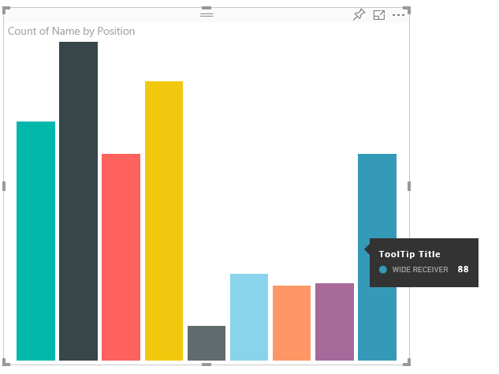
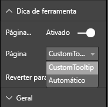

# <a name="power-bi-visuals-tooltips"></a>Dicas de ferramentas de visuais do Power BI

Os visuais agora podem se beneficiar do suporte a dicas de ferramenta do Power BI. As dicas de ferramenta do Power BI são responsáveis pelas seguintes interações:

mostrar uma dica de ferramenta;
ocultar uma dica de ferramenta;
mover uma dica de ferramenta.

Dicas de ferramenta podem exibir um elemento textual com um título, um valor em uma determinada cor e opacidade em um conjunto especificado de coordenadas. Esses dados são fornecidos à API. O host do Power BI renderiza-os do mesmo modo que renderiza dicas de ferramenta para visuais nativos.

Por exemplo, dicas de ferramenta no BarChart de exemplo.



A dica de ferramenta acima ilustra uma única categoria de barra e valor. Ela pode ser estendida para exibir vários valores em uma única dica de ferramenta.

## <a name="handling-tooltips"></a>Manipulando dicas de ferramenta

A interface por meio da qual você gerencia dicas de ferramenta é a 'ITooltipService'. Essa interface é usada para notificar o host de que uma dica de ferramenta precisa ser exibida, removida ou movida.

```typescript
    interface ITooltipService {
        enabled(): boolean;
        show(options: TooltipShowOptions): void;
        move(options: TooltipMoveOptions): void;
        hide(options: TooltipHideOptions): void;
    }
```

O visual precisará escutar os eventos de mouse que ocorrerem nele e chamar os delegados `show()`, `move()` e `hide()` conforme necessário, com o conteúdo apropriado populado nos objetos `Tooltip****Options`.
`TooltipShowOptions` e `TooltipHideOptions`, por sua vez, definiriam o que exibir e como se comportar caso esses eventos ocorressem.
Já que a chamada desses métodos envolveria eventos do usuário, tais como movimentos do mouse ou eventos de toque, seria uma boa ideia criar ouvintes para esses eventos, que por sua vez invocariam os membros `TooltipService`.
Nossas agregações de exemplo em uma classe chamada `TooltipServiceWrapper`.

### <a name="tooltipservicewrapper-class"></a>Classe TooltipServiceWrapper

O propósito básico dessa classe é manter a instância do `TooltipService`, ouvir eventos de mouse D3 em elementos relevantes e, em seguida, fazer as chamadas para `hide()` e `show()` quando necessário.
A classe mantém e gerencia qualquer estado e lógica relevantes para esses eventos e é voltada principalmente para a interface com o código D3 subjacente. A interface e a conversão de D3 estão fora do escopo deste documento.

Você pode encontrar o código de exemplo completo no [repositório do visual SampleBarChart](https://github.com/Microsoft/PowerBI-visuals-sampleBarChart/commit/981b021612d7b333adffe9f723ab27783c76fb14)

### <a name="creating-tooltipservicewrapper"></a>Criar TooltipServiceWrapper

O construtor BarChart agora tem um membro `tooltipServiceWrapper`, que é instanciado no construtor com a instância de host `tooltipService`.

```typescript
        private tooltipServiceWrapper: ITooltipServiceWrapper;

        this.tooltipServiceWrapper = createTooltipServiceWrapper(this.host.tooltipService, options.element);
```

A classe `TooltipServiceWrapper` contém a instância `tooltipService`, também como o elemento raiz D3 dos parâmetros visuais e de toque.

```typescript
    class TooltipServiceWrapper implements ITooltipServiceWrapper {
        private handleTouchTimeoutId: number;
        private visualHostTooltipService: ITooltipService;
        private rootElement: Element;
        private handleTouchDelay: number;

        constructor(tooltipService: ITooltipService, rootElement: Element, handleTouchDelay: number) {
            this.visualHostTooltipService = tooltipService;
            this.handleTouchDelay = handleTouchDelay;
            this.rootElement = rootElement;
        }
        .
        .
        .
    }
```

O ponto de entrada único para essa classe registrar ouvintes de evento é o método `addTooltip`.

### <a name="addtooltip-method"></a>Método addTooltip

```typescript
        public addTooltip<T>(
            selection: d3.Selection<Element>,
            getTooltipInfoDelegate: (args: TooltipEventArgs<T>) => VisualTooltipDataItem[],
            getDataPointIdentity: (args: TooltipEventArgs<T>) => ISelectionId,
            reloadTooltipDataOnMouseMove?: boolean): void {

            if (!selection || !this.visualHostTooltipService.enabled()) {
                return;
            }
        ...
        ...
        }
```

* **selection: d3.Selection<Element>**
* Os elementos D3 sobre quais dicas de ferramenta são manipuladas
* **getTooltipInfoDelegate: (args: TooltipEventArgs<T>) => VisualTooltipDataItem[]**
* Delegado para popular o conteúdo da dica de ferramenta (o que exibir) segundo o contexto
* **getDataPointIdentity: (args: TooltipEventArgs<T>) => ISelectionId**
* Delegado para recuperar a ID do ponto de dados – não usado neste exemplo 
* **reloadTooltipDataOnMouseMove?: boolean**
* booliano que indica se os dados da dica de ferramenta devem ser atualizados durante um evento mouseMove – não usado neste exemplo

Como você pode ver, `addTooltip` encerrará sem realizar nenhuma ação se o `tooltipService` estiver desabilitado ou se não houver nenhuma seleção real.

### <a name="call-of-show-method-to-display-a-tooltip"></a>Chamada do método show para exibir uma dica de ferramenta

`addTooltip` em seguida escuta o evento `mouseover` D3.

```typescript
        ...
        ...
        selection.on("mouseover.tooltip", () => {
            // Ignore mouseover while handling touch events
            if (!this.canDisplayTooltip(d3.event))
                return;

            let tooltipEventArgs = this.makeTooltipEventArgs<T>(rootNode, true, false);
            if (!tooltipEventArgs)
                return;

            let tooltipInfo = getTooltipInfoDelegate(tooltipEventArgs);
            if (tooltipInfo == null)
                return;

            let selectionId = getDataPointIdentity(tooltipEventArgs);

            this.visualHostTooltipService.show({
                coordinates: tooltipEventArgs.coordinates,
                isTouchEvent: false,
                dataItems: tooltipInfo,
                identities: selectionId ? [selectionId] : [],
            });
        });
```

* **makeTooltipEventArgs**
* Extrai o contexto dos elementos D3 selecionados em um ToolTipEventArgs. Ele também calculará as coordenadas.
* **getTooltipInfoDelegate**
* Em seguida, ele cria o conteúdo da dica de ferramenta com base em ToolTipEventArgs. É um retorno de chamada para a classe BarChart, já que ela representa a lógica do visual. É o conteúdo de texto real a ser exibido na dica de ferramenta.
* **getDataPointIdentity**
* Não usado neste exemplo
* **this.visualHostTooltipService.show**
* A chamada para exibir a dica de ferramenta  

Tratamento adicional pode ser encontrado no exemplo para os eventos `mouseout` e `mousemove`.

Para obter mais informações, confira o [repositório visual SampleBarChart](https://github.com/Microsoft/PowerBI-visuals-sampleBarChart/commit/981b021612d7b333adffe9f723ab27783c76fb14).

### <a name="populating-the-tooltip-content-by-gettooltipdata-method"></a>Popular o conteúdo da dica de ferramenta pelo método getTooltipData

O `BarChart` foi adicionado com um membro `getTooltipData` que simplesmente extrai a categoria, o valor e a cor do ponto de dados em um elemento VisualTooltipDataItem[].

```typescript
        private static getTooltipData(value: any): VisualTooltipDataItem[] {
            return [{
                displayName: value.category,
                value: value.value.toString(),
                color: value.color,
                header: 'ToolTip Title'
            }];
        }
```

Na implementação acima, o membro `header` é constante, mas pode ser usado para implementações mais complexas que exigem valores dinâmicos. Você pode preencher o `VisualTooltipDataItem[]` com mais de um elemento, o que adicionará várias linhas à dica de ferramenta. Isso pode ser útil em visuais como gráficos de barras empilhadas, em que a dica de ferramenta pode exibir dados de mais do que um único ponto de dados.

### <a name="calling-addtooltip-method"></a>Chamar o método addTooltip

A etapa final é chamar `addTooltip` quando os dados reais podem sofrer alteração. Essa chamada ocorreria no método `BarChart.update()`. Portanto, é feita uma chamada para monitorar a seleção de todos os elementos ' bar ', passando apenas o `BarChart.getTooltipData()` conforme mencionado acima.

```typescript
        this.tooltipServiceWrapper.addTooltip(this.barContainer.selectAll('.bar'),
            (tooltipEvent: TooltipEventArgs<number>) => BarChart.getTooltipData(tooltipEvent.data),
            (tooltipEvent: TooltipEventArgs<number>) => null);
```

## <a name="adding-report-page-tooltips"></a>Adicionar dicas de página de relatório

Para adicionar dicas de ferramenta de página de relatório, a maioria das alterações estará localizada em capabilities.json.

Um exemplo de esquema é

```json
{
    "tooltips": {
        "supportedTypes": {
            "default": true,
            "canvas": true
        },
        "roles": [
            "tooltips"
        ]
    }
}
```

A definição de dicas de ferramentas de página de relatório pode ser feita no painel Formatar.



`supportedTypes` é a configuração de dicas de ferramenta compatível com o visual e refletida no conjunto de campos. `default` especifica se a associação de dicas de ferramenta "automática" por meio do campo de dados é compatível. canvas especifica se as dicas de ferramenta de página de relatório são compatíveis.

`roles` é opcional. Uma vez definido, instrui quais funções de dados serão associadas à opção de dica de ferramenta selecionada no conjunto de campos.

Para obter mais informações, consulte as diretrizes de uso de dicas de ferramenta da página de relatório [Dicas de ferramenta da página de relatório](https://powerbi.microsoft.com/blog/power-bi-desktop-march-2018-feature-summary/#tooltips)

Para exibir a dica de ferramenta da página de relatório, ao chamar `ITooltipService.Show(options: TooltipShowOptions)` ou `ITooltipService.Move(options: TooltipMoveOptions)`, o host do Power BI consumirá a selectionId (a propriedade `identities` do argumento `options` acima). A SelectionId deve representar os dados selecionados (categoria, série e assim por diante) do item que você focalizou acima a serem recuperados pela dica de ferramenta.

Exemplo de envio da selectionId para chamadas de exibição de dica de ferramenta:

```typescript
    this.tooltipServiceWrapper.addTooltip(this.barContainer.selectAll('.bar'),
        (tooltipEvent: TooltipEventArgs<number>) => BarChart.getTooltipData(tooltipEvent.data),
        (tooltipEvent: TooltipEventArgs<number>) => tooltipEvent.data.selectionID);
```
