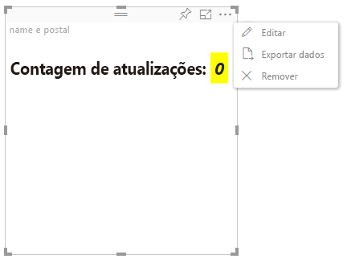

# Modo de edição avançada

Os visuais que exigem controles de interface do usuário avançados podem declarar suporte ao modo de edição avançada.
Se esse modo for compatível, quando se estiver no modo de edição de relatório, um botão `Edit` será exibido no menu do visual.
Quando o `Edit` botão é clicado, EditMode é definido para `Advanced`.
O visual pode usar o sinalizador EditMode para determinar que esses controles de interface do usuário devem ser exibidos.

Por padrão, o visual não é compatível com o modo de edição avançada.
Se um comportamento diferente for necessário, ele deverá ser declarado explicitamente no arquivo `capabilities.json` do visual, definindo-se a propriedade `advancedEditModeSupport`.

Os valores possíveis são:

- 0 – NotSupported

- 1 – SupportedNoAction

- 2 – SupportedInFocus

## Entrar no modo de edição avançada

O botão `Edit` ficará visível se:

 1 – a propriedade `advancedEditModeSupport` for definida em capabilities.json para `SupportedNoAction` ou `SupportedInFocus`;

 2 – o visual for exibido no modo de edição de relatório.

Se a propriedade `advancedEditModeSupport` estiver ausente em capabilities.json ou definida para `NotSupported`, o botão 'Editar' desaparecerá.

Quando o usuário clica em `Edit`, o visual recebe uma chamada update() com EditMode definido para `Advanced`.
De acordo com o valor definido nas funcionalidades, as seguintes ações ocorrerão:

* `SupportedNoAction` – nenhuma ação adicional pelo host;
* `SupportedInFocus` – o host abre o visual no modo de foco.

## Sair do modo de edição avançada

O botão `Back to report` ficará visível se:

1 – a propriedade `advancedEditModeSupport` for definida em capabilities.json para `SupportedInFocus`.
