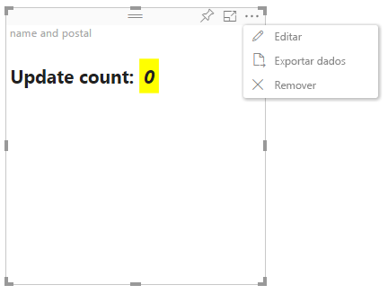

# Modo de edição avançada em visuais do Power BI

Se você precisar de controles avançados de interface do usuário em seu visual do Power BI, aproveite o modo de edição avançado. Quando você estiver no modo de edição de relatório, selecione o botão **Editar** para definir o modo de edição como **Avançado**. O visual pode usar o sinalizador `EditMode` para determinar se ele deve exibir esse controle de interface do usuário.

Por padrão, o visual não é compatível com o modo de edição avançada. Se um comportamento diferente for necessário, você poderá declarar explicitamente isso no arquivo *capabilities.json* configurando a propriedade `advancedEditModeSupport`.

Os valores possíveis são:

- `0` – NotSupported

- `1` – SupportedNoAction

- `2` – SupportedInFocus

## Entrar no modo de edição avançada

Um botão **Editar** será exibido se:

* A propriedade `advancedEditModeSupport` estiver definida no arquivo *capabilities.json* para `SupportedNoAction` ou `SupportedInFocus`.

* O visual é exibido no modo de edição de relatório.

Se a propriedade `advancedEditModeSupport` estiver ausente no arquivo *capabilities.json* ou definida como `NotSupported`, o botão **Editar** não será exibido.

Quando você seleciona **Editar**, o visual obtém uma chamada update() com EditMode definido como `Advanced`. Dependendo do valor definido no arquivo *capabilities.json*, as seguintes ações ocorrerão:

* `SupportedNoAction`: Mais nenhuma ação adicional é exigida pelo host.
* `SupportedInFocus`: O host abre o visual no modo de foco.

## Sair do modo de edição avançada

O botão **Voltar para o relatório** será exibido se:

* A propriedade `advancedEditModeSupport` estiver definida no arquivo *capabilities.json* como `SupportedInFocus`.
