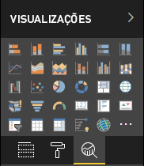

# <a name="the-analytics-pane-in-power-bi-visuals"></a>O painel Análise em visuais do Power BI

O painel **Análise** foi introduzido para [visuais nativos](https://docs.microsoft.com/power-bi/desktop-analytics-pane) em novembro de 2018.
Este artigo discute como visuais do Power BI com a API v2.5.0 podem apresentar e gerenciar suas propriedades no painel **Análise**.



## <a name="manage-the-analytics-pane"></a>Gerenciar o painel Análise

Assim como você gerenciaria as propriedades no [painel **Formato**](https://docs.microsoft.com/power-bi/developer/custom-visual-develop-tutorial-format-options), você gerencia o painel **Análise** definindo um objeto no arquivo *capabilities.json* no visual. 

Para o painel **Análise**, as diferenças são as seguintes:

* Na definição do objeto, você adiciona um campo **objectCategory** com um valor de 2.

    > [!NOTE]
    > O campo `objectCategory` opcional foi introduzido na API 2.5.0. Ele define o aspecto do visual que o objeto controla (1 = Formatação, 2 = Análise). `Formatting` é usado para elementos como aparência, cores, eixos e rótulos. `Analytics` é usado para elementos como previsões, linhas de tendência, linhas de referência e formas.
    >
    > Se o valor não for especificado, `objectCategory` usará "Formatting" como padrão.

* O objeto precisa ter as duas propriedades a seguir:
    * `show` do tipo `bool`, com um valor padrão de `false`.
    * `displayName` do tipo `text`. O valor padrão que você escolhe se torna o nome de exibição inicial da instância.

```json
{
  "objects": {
    "YourAnalyticsPropertiesCard": {
      "displayName": "Your analytics properties card's name",
      "objectCategory": 2,
      "properties": {
        "show": {
          "type": {
            "bool": true
          }
        },
        "displayName": {
          "type": {
            "text": true
          }
        },
      ... //any other properties for your Analytics card
      }
    }
  ...
  }
}
```

Você pode definir outras propriedades da mesma maneira que faz para objetos de **Formato**. E você pode enumerar objetos da mesma forma que no painel **Formato**.

## <a name="known-limitations-and-issues-of-the-analytics-pane"></a>Limitações e problemas conhecidos do painel Análise

* O painel **Análise** ainda não tem suporte para várias instâncias. Os objetos não podem ter um [seletor](https://microsoft.github.io/PowerBI-visuals/docs/concepts/objects-and-properties/#selector) que não seja estático (ou seja, "selector": null) e visuais do Power BI não podem ter várias instâncias de um cartão definidas pelo usuário.
* Propriedades do tipo `integer` não são exibidas corretamente. Como alternativa, use o tipo `numeric` em vez delas.

> [!NOTE]
> * Use o painel **Análise** somente para objetos que adicionam novas informações ou esclarecem as informações apresentadas (por exemplo, linhas de referência dinâmica que ilustram tendências importantes).
> * Todas as opções que controlam a aparência do visual (ou seja, a formatação), devem ser mantidas no painel **Formatação**.
