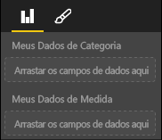

# <a name="power-bi-visual-capabilities"></a>Funcionalidades de visuais do Power BI

Funcionalidades fornecem informações para o host sobre seu visual. Todas as propriedades no modelo de Funcionalidades são `optional`

Os objetos raiz das funcionalidades do visual são `dataRoles`, `dataViewMappings` e assim por diante.

```json
{
    "dataRoles": [ ... ],
    "dataViewMappings": [ ... ],
    "objects":  { ... },
    "supportsHighlight": true|false,
    "advancedEditModeSupport": 0|1|2,
    "sorting": { ... }
}

```

## <a name="define-the-data-fields-your-visual-expects---dataroles"></a>Definir os campos de dados esperados pelo visual – `dataRoles`

Para definir campos que podem ser associados a dados, usamos `dataRoles`, que usa uma matriz de objetos `DataViewRole`, a qual por sua vez define todas as propriedades necessárias.

### <a name="properties"></a>Propriedades

* **name** – o nome interno deste campo de dados (deve ser exclusivo)
* **kind** – o tipo de campo:
    * `Grouping` – valores discretos usados para o agrupamento de campos de medida
    * `Measure` – tipos de dados numéricos
    * `GroupingOrMeasure` – pode ser usado como um agrupamento ou uma medida
* **displayName** – o nome exibido para o usuário no painel Propriedades
* **description** – uma breve descrição do campo (opcional)
* **requiredTypes** – o tipo de dados necessário para essa função de dados. Quaisquer valores que não correspondam serão definidos como null (opcional)
* **preferredTypes** – o tipo de dados preferencial para essa função de dados (opcional)

### <a name="valid-data-types-in-requiredtypes-and-preferredtypes"></a>Tipos de dados válidos em "requiredTypes" e "preferredTypes"

* **bool** – um valor booliano
* **integer** – um valor inteiro (número inteiro)
* **numeric** – um valor numérico
* **text** – um valor de texto
* **geography** – dados geográficos

### <a name="example"></a>Exemplo

```json
"dataRoles": [
    {
        "displayName": "My Category Data",
        "name": "myCategory",
        "kind": "Grouping",
        "requiredTypes": [
            {
                "text": true
            },
            {
                "numeric": true
            },
            {
                "integer": true
            }
        ],
        "preferredTypes": [
            {
                "text": true
            }
        ]
    },
    {
        "displayName": "My Measure Data",
        "name": "myMeasure",
        "kind": "Measure",
        "requiredTypes": [
            {
                "integer": true
            },
            {
                "numeric": true
            }
        ],
        "preferredTypes": [
            {
                "integer": true
            }
        ]
    },
    {
        "displayNameKey": "Visual_Location",
        "name": "Locations",
        "kind": "Measure",
        "displayName": "Locations",
        "requiredTypes": [
            {
                "geography": {
                    "address": true
                }
            },
            {
                "geography": {
                    "city": true
                }
            },
            {
                "geography": {
                    "continent": true
                }
            },
            {
                "geography": {
                    "country": true
                }
            },
            {
                "geography": {
                    "county": true
                }
            },
            {
                "geography": {
                    "place": true
                }
            },
            {
                "geography": {
                    "postalCode": true
                }
            },
            {
                "geography": {
                    "region": true
                }
            },
            {
                "geography": {
                    "stateOrProvince": true
                }
            }
        ]
    }
]
```

As funções de dados acima criariam os campos a seguir



## <a name="define-how-you-want-the-data-mapped---dataviewmappings"></a>Definir como você deseja mapear os dados – `dataViewMappings`

Um DataViewMapping descreve como as funções de dados se relacionam entre si e permite que você especifique requisitos condicionais para elas.

A maioria dos visuais fornece um mapeamento único, mas você pode fornecer vários DataViewMappings. Cada mapeamento válido produzirá um DataView. 

```json
"dataViewMappings": [
    {
        "conditions": [ ... ],
        "categorical": { ... },
        "table": { ... },
        "single": { ... },
        "matrix": { ... }
    }
]
```

[Saiba mais sobre DataViewMappings](dataview-mappings.md)

## <a name="define-property-pane-options---objects"></a>Definir opções do painel Propriedades – `objects`

Objetos descrevem propriedades personalizáveis associadas ao visual.
Cada objeto pode ter várias propriedades e cada propriedade tem um tipo associado a ela.
Os tipos referem-se ao que será essa propriedade. Veja abaixo mais informações sobre tipos.

```json
"objects": {
    "myCustomObject": {
        "displayName": "My Object Name",
        "properties": { ... }
    }
}
```

[Saiba mais sobre objetos](objects-properties.md)

## <a name="handle-partial-highlighting---supportshighlight"></a>Processar realce parcial – `supportsHighlight`

Por padrão, esse valor é definido como false, o que significa que seus "valores" serão automaticamente filtrados quando algo na página for selecionado, o que, por sua vez, atualizará o visual para exibir apenas o valor selecionado. Se quiser exibir os dados completos, mas apenas realçar os itens selecionados, você precisará definir `supportsHighlight` como true em capabilities.json.

[Saiba mais sobre realce](highlight.md)

## <a name="handle-advanced-edit-mode---advancededitmodesupport"></a>Manipular o modo de edição avançada – `advancedEditModeSupport`

Um visual pode declarar seu suporte ao modo de edição avançada.
Por padrão, um visual não dá suporte ao modo de edição avançada, a menos que declarado de outra forma em capabilities.json.

[Saiba mais sobre o advancedEditModeSupport](advanced-edit-mode.md)

## <a name="data-sorting-options-for-visual---sorting"></a>Opções de classificação de dados para visual – `sorting`

Um visual pode definir o próprio comportamento de classificação por meio de suas funcionalidades.
Por padrão, um visual não dá suporte à modificação de sua ordem de classificação, a menos que declarado de outra forma em capabilities.json.

[Saiba mais sobre classificação](sort-options.md)
