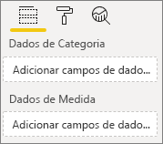
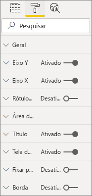
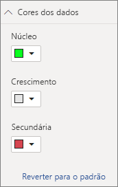

# <a name="build-a-bar-chart"></a>Criar um gráfico de barras

Este artigo é um guia passo a passo para criar um exemplo de visual de gráfico de barras do Power BI com código. Você pode obter o exemplo de código completo em [https://github.com/Microsoft/PowerBI-visuals-sampleBarChart](https://github.com/Microsoft/PowerBI-visuals-sampleBarChart).

## <a name="view-model"></a>Exibir modelo
É importante primeiro definir o modelo de exibição do gráfico de barras e iterar o que é exposto ao seu visual à medida que você o cria.

```typescript
/**
 * Interface for BarCharts viewmodel.
 *
 * @interface
 * @property {BarChartDataPoint[]} dataPoints - Set of data points the visual will render.
 * @property {number} dataMax                 - Maximum data value in the set of data points.
 */
interface BarChartViewModel {
    dataPoints: BarChartDataPoint[];
    dataMax: number;
};

/**
 * Interface for BarChart data points.
 *
 * @interface
 * @property {number} value    - Data value for the point.
 * @property {string} category - Corresponding category of the data value.
 */
interface BarChartDataPoint {
    value: number;
    category: string;
};
```

### <a name="use-static-data"></a>Usar dados estáticos

O uso de dados estáticos é uma ótima maneira de testar seu visual sem associar dados. O modelo de exibição não será alterado, mesmo depois que você adicionar a associação de dados em uma etapa posterior.

```typescript
let testData: BarChartDataPoint[] = [
    {
        value: 10,
        category: 'a'
    },
    {
        value: 20,
        category: 'b'
    },
    {
        value: 1,
        category: 'c'
    },
    {
        value: 100,
        category: 'd'
    },
    {
        value: 500,
        category: 'e'
    }];

let viewModel: BarChartViewModel = {
    dataPoints: testData,
    dataMax: d3.max(testData.map((dataPoint) => dataPoint.value))
};
```

## <a name="data-binding"></a>Associação de dados 
Para adicionar associação de dados, defina seus recursos de visuais em *capabilities.json*. O código de exemplo já tem um esquema para você usar.

A associação de dados age em um compartimento **Campo** no Power BI.



### <a name="add-data-roles"></a>Adicionar funções de dados
O código de exemplo já tem funções de dados, mas você pode personalizá-las.

- `displayName` é o nome mostrado no compartimento **Campo**.
- `name` é o nome interno usado para fazer referência à função de dados.
- `kind` é para o tipo de campo. Campos de *Agrupamento* (0) têm valores discretos. Campos de *Medida* (1) têm valores de dados numéricos.

```json
"dataRoles": [
    {
        "displayName": "Category Data",
        "name": "category",
        "kind": 0
    },
    {
        "displayName": "Measure Data",
        "name": "measure",
        "kind": 1
    }
],
```

Para saber mais, confira [Funções de dados](./capabilities.md#define-the-data-fields-that-your-visual-expects-dataroles).

### <a name="add-conditions-to-dataviewmapping"></a>Adicionar condições a DataViewMapping
Defina as condições dentro de `dataViewMappings` para definir quantos campos cada compartimento de campos pode associar. Use o `name` interno da função de dados para fazer referência a cada campo.

```json
    "dataViewMappings": [
        {
            "conditions": [
                {
                    "category": {
                        "max": 1
                    },
                    "measure": {
                        "max": 1
                    }
                }
            ],
        }
    ]
```

Para saber mais, confira [Mapeamento da exibição de dados](./dataview-mappings.md).

### <a name="define-and-use-visualtransform"></a>Definir e usar visualTransform
O `DataView` é a estrutura que o Power BI fornece ao seu visual, que contém os dados consultados a serem visualizados. No entanto, `DataView` pode fornecer dados em diferentes formatos, como categóricos e tabulares. Para criar um visual categórico como um gráfico de barras, você só precisa usar a propriedade categórica no `DataView`. Definir `visualTransform` permite que você converta `DataView` em um modelo de exibição que seu visual usará.

Para atribuir cores e selecioná-las ao definir pontos de dados individuais, use `IVisualHost`. 

```typescript
/**
 * Function that converts queried data into a view model that will be used by the visual
 *
 * @function
 * @param {VisualUpdateOptions} options - Contains references to the size of the container
 *                                        and the dataView which contains all the data
 *                                        the visual had queried.
 * @param {IVisualHost} host            - Contains references to the host which contains services
 */
function visualTransform(options: VisualUpdateOptions, host: IVisualHost): BarChartViewModel {
    /*Convert dataView to your viewModel*/
}

```

## <a name="color"></a>Cor 
A cor é exposta como um dos serviços disponíveis no `IVisualHost`.

### <a name="add-color-to-data-points"></a>Adicionar cor a pontos de dados
Cada ponto de dados é representado por uma cor diferente. Você adiciona cor à interface `BarChartDataPoint`.

```typescript
/**
 * Interface for BarChart data points.
 *
 * @interface
 * @property {number} value    - Data value for the point.
 * @property {string} category - Corresponding category of the data value.
 * @property {string} color    - Color corresponding to the data point.
 */
interface BarChartDataPoint {
    value: number;
    category: string;
    color: string;
};
```

### <a name="the-colorpalette-service"></a>O serviço colorPalette
O serviço `colorPalette` gerencia as cores usadas em seu visual. A instância dele está disponível em `IVisualHost`.

### <a name="assign-color-to-data-points"></a>Atribuir cor a pontos de dados
Você definiu `visualTransform` como um constructo para converter `dataView` em um modelo de exibição que um gráfico de barras pode usar. Como você itera por meio dos pontos de dados em `visualTransform`, ele também é o lugar ideal para atribuir cores.

```typescript
let colorPalette: IColorPalette = host.colorPalette; // host: IVisualHost
for (let i = 0, len = Math.max(category.values.length, dataValue.values.length); i < len; i++) {
    barChartDataPoints.push({
        category: category.values[i],
        value: dataValue.values[i],
        color: colorPalette.getColor(category.values[i]).value,
    });
}
```

## <a name="selection-and-interactions"></a>Seleção e interações
A seleção permite que o usuário interaja com seu visual e com outros visuais. 

### <a name="add-selection-to-each-data-point"></a>Adicionar seleção a cada ponto de dados
Como cada ponto de dados é exclusivo, adicione seleção a cada um deles. Adicione a propriedade de seleção na interface `BarChartDataPoint`.

```typescript
/**
 * Interface for BarChart data points.
 *
 * @interface
 * @property {number} value             - Data value for the point.
 * @property {string} category          - Corresponding category of data value.
 * @property {string} color             - Color corresponding to data point.
 * @property {ISelectionId} selectionId - Id assigned to data point for cross filtering
 *                                        and visual interaction.
 */
interface BarChartDataPoint {
    value: number;
    category: string;
    color: string;
    selectionId: ISelectionId;
};
```

### <a name="assign-selection-ids-to-each-data-point"></a>Atribuir IDs de seleção a cada ponto de dados
Como você itera por meio dos pontos de dados em `visualTransform`, ele também é o lugar ideal para criar IDs de seleção. A variável de host é um `IVisualHost`, que contém serviços que o visual pode usar, como o construtor de cores e de seleção. 

Use o método de fábrica `createSelectionIdBuilder` em `IVisualHost` para criar uma ID de seleção. Crie um novo construtor de seleção para cada ponto de dados.

Como você está fazendo seleções com base apenas na categoria, só precisa definir seleções `withCategory`.

```typescript
for (let i = 0, len = Math.max(category.values.length, dataValue.values.length); i < len; i++) {
    barChartDataPoints.push({
        category: category.values[i],
        value: dataValue.values[i],
        color: colorPalette.getColor(category.values[i]).value,
        selectionId: host.createSelectionIdBuilder()
            .withCategory(category, i)
            .createSelectionId()
    });
}
```

Para saber mais, confira [Criar instância do construtor de seleção](./selection-api.md#create-an-instance-of-the-selection-builder).

### <a name="interact-with-data-points"></a>Interagir com pontos de dados
Você pode interagir com cada barra do gráfico de barras quando uma ID de seleção é atribuída ao ponto de dados. O gráfico de barras escuta eventos `click`.

Use o método de fábrica `selectionManager` em `IVisualHost` para criar um gerenciador de seleção para filtragem cruzada e limpeza de seleções.

```typescript
let selectionManager = this.selectionManager;

//This must be an anonymous function instead of a lambda because
//d3 uses 'this' as the reference to the element that was clicked.
bars.on('click', function(d) {
    selectionManager.select(d.selectionId).then((ids: ISelectionId[]) => {
        bars.attr({
            'fill-opacity': ids.length > 0 ? BarChart.Config.transparentOpacity : BarChart.Config.solidOpacity
        });

        d3.select(this).attr({
            'fill-opacity': BarChart.Config.solidOpacity
        });
    });

    (<Event>d3.event).stopPropagation();
});
```

Para saber mais, confira [Como usar SelectionManager](./selection-api.md#how-to-use-selectionmanager-to-select-data-points).

## <a name="static-objects"></a>Objetos estáticos

Você pode adicionar objetos ao painel **Propriedade** para personalizar ainda mais o visual. Essas personalizações podem ser alterações de interface do usuário ou alterações relacionadas aos dados que foram consultados. O exemplo usa objetos estáticos para renderizar o eixo X do gráfico de barras.

Você pode ativar ou desativar objetos no painel **Propriedade**.



### <a name="define-objects-in-capabilities"></a>Definir objetos em capacidades
Defina uma propriedade `objects` dentro de seu arquivo *capabilities.json* para objetos a serem exibidos no painel **Propriedade**.
- `enableAxis` é o nome interno que `dataView` referencia. 
- `displayName` é o nome mostrado no painel **Propriedade**.
- `bool` é um valor primitivo que normalmente é usado com objetos estáticos, como caixas de texto ou botões.
- `show` é uma propriedade especial de `properties` que habilita o botão `show` no objeto. Como `show` é um botão, ele é digitado como um `bool`.


```typescript
"objects": {
    "enableAxis": {
        "displayName": "Enable Axis",
        "properties": {
            "show": {
                "displayName": "Enable Axis",
                "type": { "bool": true }
            }
        }
    }
}
```

Para saber mais, confira [Objetos](./objects-properties.md).

### <a name="define-property-settings"></a>Definir configurações de propriedades

As seções a seguir descrevem os princípios básicos da definição de configurações de propriedade. Você também pode usar as classes de utilitário definidas no pacote `powerbi-visuals-utils-dataviewutils` para definir as configurações de propriedade. Para saber mais, confira a documentação e os exemplos da classe [DataViewObjectsParser](https://github.com/Microsoft/powerbi-visuals-utils-dataviewutils/blob/master/docs/api/data-view-objects-parser.md).


Embora seja opcional, é melhor localizar a maioria das configurações em um único objeto para facilitar a referência.

```typescript
/**
 * Interface for BarCharts viewmodel.
 *
 * @interface
 * @property {BarChartDataPoint[]} dataPoints - Set of data points the visual will render.
 * @property {number} dataMax                 - Maximum data value in the set of data points.
 * @property {BarChartSettings} settings      - Object property settings
 */
interface BarChartViewModel {
    dataPoints: BarChartDataPoint[];
    dataMax: number;
    settings: BarChartSettings;
};

/**
 * Interface for BarChart settings.
 *
 * @interface
 * @property "show" enableAxis - Object property that allows axis to be enabled.
 */
interface BarChartSettings {
    enableAxis: {
        show: boolean;
    };
}
```

### <a name="define-and-use-objectenumerationutility"></a>Definir e usar ObjectEnumerationUtility
Os valores de propriedade de objeto estão disponíveis como metadados no `dataView`, mas não existe um serviço para ajudar a recuperar essas propriedades. `ObjectEnumerationUtility` é um conjunto de funções estáticas que você pode usar para recuperar valores de objeto do `dataView` e para outros projetos de visuais. O `ObjectEnumerationUtility` é opcional, mas é ótimo para iterar por meio do `dataView` para recuperar propriedades de objeto.

```typescript
/**
 * Gets property value for a particular object.
 *
 * @function
 * @param {DataViewObjects} objects - Map of defined objects.
 * @param {string} objectName       - Name of desired object.
 * @param {string} propertyName     - Name of desired property.
 * @param {T} defaultValue          - Default value of desired property.
 */
export function getValue<T>(objects: DataViewObjects, objectName: string, propertyName: string, defaultValue: T ): T {
    if(objects) {
        let object = objects[objectName];
        if(object) {
            let property: T = object[propertyName];
            if(property !== undefined) {
                return property;
            }
        }
    }
    return defaultValue;
}
```

Confira [objectEnumerationUtility.ts](https://github.com/Microsoft/PowerBI-visuals-sampleBarChart/blob/master/src/objectEnumerationUtility.ts) para o código-fonte.

### <a name="retrieve-property-values-from-dataview"></a>Recuperar valores de propriedade de dataView
O `visualTransform` é o lugar ideal para manipular o modelo de exibição do visual. Para continuar esse padrão, recupere as propriedades de objeto do `dataView`.

Defina o estado padrão da propriedade e use `getValue` para recuperar a propriedade do `dataView`.

```typescript
let defaultSettings: BarChartSettings = {
    enableAxis: {
        show: false,
    }
};

let barChartSettings: BarChartSettings = {
    enableAxis: {
        show: getValue<boolean>(objects, 'enableAxis', 'show', defaultSettings.enableAxis.show),
    }
}
```

### <a name="populate-property-pane-with-enumerateobjectinstances"></a>Preencher o painel Propriedade com enumerateObjectInstances
O método opcional `enumerateObjectInstances` em `IVisual` enumera todos os objetos e os coloca no painel **Propriedade**. Cada objeto é chamado com `enumerateObjectInstances`. O nome do objeto está disponível em `EnumerateVisualObjectInstancesOptions`.

Para cada objeto, defina a propriedade com seu estado atual.

```typescript
/**
 * Enumerates through the objects defined in the capabilities and adds the properties to the format pane
 *
 * @function
 * @param {EnumerateVisualObjectInstancesOptions} options - Map of defined objects
 */
public enumerateObjectInstances(options: EnumerateVisualObjectInstancesOptions): VisualObjectInstanceEnumeration {
    let objectName = options.objectName;
    let objectEnumeration: VisualObjectInstance[] = [];

    switch(objectName) {
        case 'enableAxis':
            objectEnumeration.push({
                objectName: objectName,
                properties: {
                    show: this.barChartSettings.enableAxis.show,
                },
                selector: null
            });
    };

    return objectEnumeration;
}
```

### <a name="control-property-update-logic"></a>Lógica de atualização da propriedade de controle
Depois que um objeto é adicionado ao painel **Propriedade**, cada alternância dispara uma atualização. Adicione lógica de objeto específica em blocos de `if`:

```typescript
if(settings.enableAxis.show) {
    let margins = BarChart.Config.margins;
    height -= margins.bottom;
}
```

## <a name="databound-objects"></a>Objetos com associação de dados
Os objetos com associação de dados são semelhantes aos objetos estáticos, mas normalmente lidam com a seleção de dados. Por exemplo, você pode alterar a cor associada ao ponto de dados.



### <a name="define-object-in-capabilities"></a>Definir objeto em capacidades
Assim como nos objetos estáticos, defina outro objeto no *capabilities.json*. 
- `colorSelector` é o nome interno que `dataView` referencia.
- `displayName` é o nome mostrado no painel **Propriedade**.
- `fill` é um valor de objeto estrutural não associado a um tipo primitivo.

```typescript
"colorSelector": {
    "displayName": "Data Colors",
    "properties": {
        "fill": {
            "displayName": "Color",
            "type": {
                "fill": {
                    "solid": {
                        "color": true
                    }
                }
            }
        }
    }
}
```

Para saber mais, confira [Objetos](./objects-properties.md).

### <a name="use-objectenumerationutility"></a>Usar ObjectEnumerationUtility
Assim como acontece com objetos estáticos, você precisa recuperar detalhes de objeto do `dataView`. No entanto, em vez dos valores de objeto estarem dentro dos metadados, os valores de objeto são associados a cada categoria.

```typescript
/**
 * Gets property value for a particular object in a category.
 *
 * @function
 * @param {DataViewCategoryColumn} category - List of category objects.
 * @param {number} index                    - Index of category object.
 * @param {string} objectName               - Name of desired object.
 * @param {string} propertyName             - Name of desired property.
 * @param {T} defaultValue                  - Default value of desired property.
 */
export function getCategoricalObjectValue<T>(category: DataViewCategoryColumn, index: number, objectName: string, propertyName: string, defaultValue: T): T {
    let categoryObjects = category.objects;

    if(categoryObjects) {
        let categoryObject: DataViewObject = categoryObjects[index];
        if(categoryObject) {
            let object = categoryObject[objectName];
            if(object) {
                let property: T = object[propertyName];
                if(property !== undefined) {
                    return property;
                }
            }
        }
    }
    return defaultValue;
}
```

Confira [objectEnumerationUtility.ts](https://github.com/Microsoft/PowerBI-visuals-sampleBarChart/blob/master/src/objectEnumerationUtility.ts) para o código-fonte.

### <a name="define-default-color-and-retrieve-categorical-object-from-dataview"></a>Definir a cor padrão e recuperar o objeto categórico de dataView
Cada cor agora está associada a cada categoria dentro de `dataView`. Você pode definir cada ponto de dados para sua cor correspondente.

```typescript
for (let i = 0, len = Math.max(category.values.length, dataValue.values.length); i < len; i++) {
    let defaultColor: Fill = {
        solid: {
            color: colorPalette.getColor(category.values[i]).value
        }
    }

    barChartDataPoints.push({
        category: category.values[i],
        value: dataValue.values[i],
        color: getCategoricalObjectValue<Fill>(category, i, 'colorSelector', 'fill', defaultColor).solid.color,
        selectionId: host.createSelectionIdBuilder()
            .withCategory(category, i)
            .createSelectionId()
    });
}
```

### <a name="populate-property-pane-with-enumerateobjectinstances"></a>Preencher o painel Propriedade com enumerateObjectInstances
Use `enumerateObjectInstances` para preencher o painel **Propriedade** com objetos. 

Para essa instância, adicione um seletor de cores para renderizar cada categoria no painel **Propriedade**. Para fazer isso, adicione um caso extra à instrução `switch` para `colorSelector` e itere em cada ponto de dados com a cor associada. 

A seleção é necessária para associar a cor ao ponto de dados.

```typescript
/**
 * Enumerates through the objects defined in the capabilities and adds the properties to the format pane
 *
 * @function
 * @param {EnumerateVisualObjectInstancesOptions} options - Map of defined objects
 */
public enumerateObjectInstances(options: EnumerateVisualObjectInstancesOptions): VisualObjectInstanceEnumeration {
    let objectName = options.objectName;
    let objectEnumeration: VisualObjectInstance[] = [];

    switch(objectName) {
        case 'enableAxis':
            objectEnumeration.push({
                objectName: objectName,
                properties: {
                    show: this.barChartSettings.enableAxis.show,
                },
                selector: null
            });
            break;
        case 'colorSelector':
            for(let barDataPoint of this.barDataPoints) {
                objectEnumeration.push({
                    objectName: objectName,
                    displayName: barDataPoint.category,
                    properties: {
                        fill: {
                            solid: {
                                color: barDataPoint.color
                            }
                        }
                    },
                    selector: barDataPoint.selectionId.getSelector()
                });
            }
            break;
    };

    return objectEnumeration;
}
```

Depois de fornecer um seletor para cada propriedade, você obtém a seguinte matriz de objeto `dataView`:


Cada item na matriz `dataViews[0].categorical.categories[0].objects` corresponde à categoria concreta do conjunto de dados.

A função `getCategoricalObjectValue` apenas fornece uma maneira conveniente de acessar as propriedades por seu índice de categoria. Você deve fornecer um `objectName` e `propertyName` que correspondam ao objeto e à propriedade em *capabilities.json*.

## <a name="other-features"></a>Outros recursos 
Você pode adicionar um controle deslizante ou dicas de ferramenta ao gráfico de barras. Para o código a ser adicionado, confira os commits em [Adicionar um painel de propriedade para controlar a opacidade](https://github.com/Microsoft/PowerBI-visuals-sampleBarChart/commit/e2e0bc5888d9a3ca305a7a7af5046068645c8b30) e [Adicionar suporte para dicas de ferramentas](https://github.com/Microsoft/PowerBI-visuals-sampleBarChart/commit/981b021612d7b333adffe9f723ab27783c76fb14). Para saber mais, confira [Dicas de ferramentas em visuais do Power BI](./add-tooltips.md).

## <a name="packaging"></a>Empacotamento

Antes de carregar seu visual no [Power BI Desktop](https://powerbi.microsoft.com/desktop/) ou compartilhá-lo com a comunidade na [Galeria de Visuais do Power BI](https://visuals.powerbi.com/), é necessário empacotá-lo. Navegue até a pasta raiz do seu projeto de visual, que contém o arquivo *pbiviz.json*, e use o seguinte comando para gerar um arquivo *pbiviz*:

```bash
pbiviz package
```
Esse comando cria um arquivo *pbiviz* no diretório *dist/* do seu projeto de visual e substitui qualquer arquivo *pbiviz* de operações de pacote anteriores.

## <a name="next-steps"></a>Próximas etapas
Você pode adicionar as seguintes habilidades ao seu visual:
* [Adicionar um menu de contexto a um visual](./context-menu.md)
* [Página de aterrissagem](./landing-page.md)
* [URL de inicialização](./launch-url.md)
* [Suporte à localidade](./localization.md)