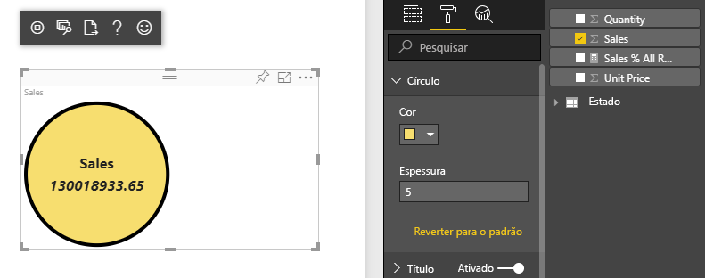
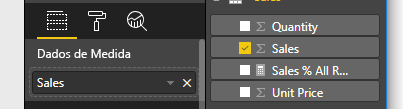

# <a name="tutorial-create-a-react-based-visual"></a>Tutorial: Criar visuais baseados em React

Este tutorial explica como criar um visual do Power BI usando [React](https://reactjs.org/). O visual exibe um valor em um círculo. O visual tem tamanho e configurações adaptáveis para personalizá-lo. Com as informações apresentadas neste artigo, você poderá criar seus próprios visuais do Power BI com React.



Neste tutorial, você aprenderá a:

> [!div class="checklist"]
>
> * Configurar seu ambiente de desenvolvimento
> * Criar um visual React
> * Configurar capacidades para o visual
> * Renderizar dados do Power BI
> * Redimensionar o visual
> * Tornar o visual personalizável

## <a name="prerequisites"></a>Pré-requisitos

* Uma conta do **Power BI Pro**. Antes de começar, [inscreva-se para uma avaliação gratuita](https://powerbi.microsoft.com/pricing/).
* [Visual Studio Code](https://www.visualstudio.com/).
* Usuários do Windows precisam ter a versão 4 ou posterior do [Windows PowerShell](https://docs.microsoft.com/powershell/scripting/install/installing-windows-powershell?view=powershell-6). Usuários do OSX precisam do [Terminal](https://macpaw.com/how-to/use-terminal-on-mac).
* Um ambiente descrito em [Configurar o ambiente do desenvolvedor](custom-visual-develop-tutorial.md#setting-up-the-developer-environment).

## <a name="getting-started"></a>Introdução

Para começar, crie um visual mínimo do Power BI usando `pbiviz`. Para obter mais informações sobre projetos e estrutura de projetos, confira [Estrutura do projeto do visual do Power BI](visual-project-structure.md). Para obter o código-fonte completo desse visual, confira o [Visual Circle Card React](https://github.com/Microsoft/powerbi-visuals-circlecard-react).

Você pode clonar ou baixar o código-fonte completo do visual pelo [GitHub](https://github.com/Microsoft/powerbi-visuals-circlecard-react).

1. Abra o PowerShell e execute o seguinte comando:

   ```powershell
   pbiviz new ReactCircleCard
   ```

   O comando cria uma pasta chamada *ReactCircleCard*.

1. Altere os diretórios dessa pasta e abra o Visual Studio Code.

   ```powershell
   cd ./ReactCircleCard
   code .
   ```

1. Inicie o servidor de desenvolvedor para seu visual.

   ```powershell
   pbiviz start
   ```

   

Esse visual básico representa a contagem de atualizações. Vamos transformá-lo em um cartão de círculo na próxima etapa.

## <a name="change-the-visual-to-a-circle-card"></a>Alterar o visual para um cartão de círculo

Esse visual básico representa uma contagem de atualizações. Em seguida, transforme-o em um cartão de círculo, que representa uma medida e seu título.

1. Execute o seguinte comando para instalar as dependências obrigatórias:

   ```powershell
   npm i react react-dom
   ```

1. Execute o comando a seguir para instalar o React 16 e as versões correspondentes do `react-dom` e os tipos:

   ```powershell
   npm i @types/react @types/react-dom
   ```

1. Crie uma classe de componente React. No Visual Studio Code, escolha **Arquivo** > **Novo Arquivo**. Copie o código a seguir para esse arquivo.

    ```typescript
    import * as React from "react";

    export class ReactCircleCard extends React.Component<{}>{
        render(){
            return (
                <div className="circleCard">
                    Hello, React!
                </div>
            )
        }
    }

    export default ReactCircleCard;
    ```

1. Selecione **Salvar como**. Vá para o diretório *src*. Insira o nome *component*. Para **Salvar como tipo**, selecione **TypeScript React**.

1. Abra *src/visual.ts*. Substitua o código atual pelo seguinte:

    ```typescript
    "use strict";
    import powerbi from "powerbi-visuals-api";

    import DataView = powerbi.DataView;
    import VisualConstructorOptions = powerbi.extensibility.visual.VisualConstructorOptions;
    import VisualUpdateOptions = powerbi.extensibility.visual.VisualUpdateOptions;
    import IVisual = powerbi.extensibility.visual.IVisual;

    import "./../style/visual.less";

    export class Visual implements IVisual {

        constructor(options: VisualConstructorOptions) {

        }

        public update(options: VisualUpdateOptions) {

        }
    }
    ```

1. Importe as dependências do React e o componente que você acabou de adicionar.

    ```typescript
    import * as React from "react";
    import * as ReactDOM from "react-dom";
    ...
    import ReactCircleCard from "./component";
    ```

   As configurações padrão de TypeScript do Power BI não aceitam arquivos React *tsx*. O Visual Studio Code realça `component` como um erro.

1. Abra o arquivo *tsconfig.json* e adicione duas linhas ao início do item `compilerOptions`.

    ```json
    {
      "compilerOptions": {
        "jsx": "react",
        "types": ["react", "react-dom"],
        //...
      }
    }
    ```

   O erro em `component` deve desaparecer.

   Para renderizar o componente, adicione o elemento HTML de destino. Esse elemento é `HTMLElement` em `VisualConstructorOptions`, que é passado para o construtor.

1. Modifique a classe `Visual`, como no seguinte código:

    ```typescript
      private target: HTMLElement;
      private reactRoot: React.ComponentElement<any, any>;

      constructor(options: VisualConstructorOptions) {
          this.reactRoot = React.createElement(ReactCircleCard, {});
          this.target = options.element;

          ReactDOM.render(this.reactRoot, this.target);
      }
    ```

1. Salve as alterações e execute o código existente usando este comando:

    ```bash
    pbiviz start
    ```

   > [!NOTE]
   > Se você executou o `pbiviz` anteriormente, deverá reiniciá-lo para aplicar as alterações em *tsconfig.json*.

  

## <a name="configure-capabilities"></a>Configurar capacidades

É possível configurar as capacidades do visual.

1. Abra `capabilities.json`. Remova o objeto `Category Data` de `dataRoles`. O `ReactCircleCard` exibe um único valor, portanto, precisamos apenas de `Measure Data`. A chave `dataRoles` agora tem esta aparência:

    ```json
    "dataRoles": [
        {
            "displayName": "Measure Data",
            "name": "measure",
            "kind": "Measure"
        }
    ],
    ```

1. Remova todo o conteúdo da chave `objects`. Você a preencherá posteriormente.

    ```json
        "objects": {},
    ```

1. Copie o código a seguir da propriedade `dataViewMappings`. O valor de `max: 1` significa que apenas uma coluna de medida pode ser enviada.

    ```json
        "dataViewMappings": [
            {
                "conditions": [
                    {
                        "measure": {
                            "max": 1
                        }
                    }
                ],
                "single": {
                    "role": "measure"
                }
            }
        ]
    ```

Agora, você pode trazer dados do painel de `Fields` para as configurações do visual.



## <a name="receive-properties-from-power-bi"></a>Receber propriedades do Power BI

Você pode renderizar dados usando o React. O componente pode exibir dados de seu próprio estado.

1. Modifique *src/component.tsx*.

    ```javascript
    export interface State {
        textLabel: string,
        textValue: string
    }

    export const initialState: State = {
        textLabel: "",
        textValue: ""
    }

    export class ReactCircleCard extends React.Component<{}, State>{
        constructor(props: any){
            super(props);
            this.state = initialState;
        }

        render(){
            const { textLabel, textValue } = this.state;

            return (
                <div className="circleCard">
                    <p>
                        {textLabel}
                        <br/>
                        <em>{textValue}</em>
                    </p>
                </div>
            )
        }
    }
    ```

1. Adicione estilos para nova marcação ao editar *styles/visual.less*.

    ```css
    .circleCard {
        position: relative;
        box-sizing: border-box;
        border: 1px solid #000;
        border-radius: 50%;
        width: 200px;
        height: 200px;
    }

    p {
        text-align: center;
        line-height: 30px;
        font-size: 20px;
        font-weight: bold;

        position: relative;
        top: -30px;
        margin: 50% 0 0 0;
    }
    ```

1. Os visuais recebem dados atuais como um argumento do método `update`. Abra *src/visual.ts* e adicione código a `ReactCircleCard.update`.

    ```typescript
    //...
    import { ReactCircleCard, initialState } from "./component";
    //...

    export class Visual implements IVisual {
        //...
        public update(options: VisualUpdateOptions) {

            if(options.dataViews && options.dataViews[0]){
                const dataView: DataView = options.dataViews[0];

                ReactCircleCard.update({
                    textLabel: dataView.metadata.columns[0].displayName,
                    textValue: dataView.single.value.toString()
                });
            }
            } else {
                this.clear();
            }
        }

        private clear() {
            ReactCircleCard.update(initialState);
        }
    }
    ```

    O código seleciona `textLabel` e `textValue` de `DataView` e, caso os dados existam, atualiza o estado do componente.

1. Para enviar atualizações para a instância do componente, insira o seguinte código na classe `ReactCircleCard`:

    ```typescript
        private static updateCallback: (data: object) => void = null;

        public static update(newState: State) {
            if(typeof ReactCircleCard.updateCallback === 'function'){
                ReactCircleCard.updateCallback(newState);
            }
        }

        public state: State = initialState;

        public componentWillMount() {
            ReactCircleCard.updateCallback = (newState: State): void => { this.setState(newState); };
        }

        public componentWillUnmount() {
            ReactCircleCard.updateCallback = null;
        }
    ```

1. Teste o visual. Verifique se `pbiviz start` foi executado e salve todos os arquivos. Atualize o visual.

   

## <a name="make-component-resizable"></a>Tornar componente redimensionável

Nesta seção, você tornará o componente redimensionável. Atualmente, o componente tem largura e altura fixas.

Obtenha o tamanho atual do visor do visual do objeto `options`.

1. Abra *src/visual.ts*. Importe a interface `IViewport` e adicione a propriedade `viewport` à classe `visual`.

    ```typescript
    import IViewport = powerbi.IViewport;

    //...

    export class Visual implements IVisual {
        private viewport: IViewport;
        //...
    }
    ```

1. Adicione o código a seguir ao método `update` de `visual`.

    ```typescript
      if (options.dataViews && options.dataViews[0]) {
          const dataView: DataView = options.dataViews[0];

          this.viewport = options.viewport;
          const { width, height } = this.viewport;
          const size = Math.min(width, height);

          ReactCircleCard.update({
              size,
              //...
          });
      }
    ```

1. Adicione propriedades à interface `State` em *src/component.tsx*.

    ```typescript
    export interface State {
        //...
        size: number
    }

    const initialState: State = {
        //...
        size: 200
    }
    ```

1. Faça as seguintes alterações no método `render` em *src/component.tsx*:

    ```typescript
        render() {
            const { textLabel, textValue, size } = this.state;

            const style: React.CSSProperties = { width: size, height: size };

            return (
                <div className="circleCard" style={style}>
                    {/* ... */}
                </div>
            )
        }
    ```

1. Substitua as regras de `width` e `height` em *style/visual.less* por `min-width` e `min-height`.

    ```css
        min-width: 200px;
        min-height: 200px;
    ```

Agora você pode redimensionar o visor. O diâmetro do círculo corresponde ao tamanho mínimo de largura ou altura.

## <a name="make-your-power-bi-visual-customizable"></a>Tornar o visual do Power BI personalizável

Nesta seção, você tornará o visual personalizável.

1. Abra *capabilities.json*. Adicione as seguintes configurações à propriedade `objects`.

    ```json
    //...
        "objects": {
            "circle": {
                "displayName": "Circle",
                "properties": {
                    "circleColor": {
                        "displayName": "Color",
                        "description": "The fill color of the circle.",
                        "type": {
                            "fill": {
                                "solid": {
                                    "color": true
                                }
                            }
                        }
                    },
                    "circleThickness": {
                        "displayName": "Thickness",
                        "description": "The circle thickness.",
                        "type": {
                            "numeric": true
                        }
                    }
                }
            }
        },
    //...
    ```

1. Substitua o código existente em *src/settings.ts* por este código:

    ```typescript
    "use strict";

    import { dataViewObjectsParser } from "powerbi-visuals-utils-dataviewutils";
    import DataViewObjectsParser = dataViewObjectsParser.DataViewObjectsParser;

    export class CircleSettings {
        public circleColor: string = "white";
        public circleThickness: number = 2;
    }

    export class VisualSettings extends DataViewObjectsParser {
        public circle: CircleSettings = new CircleSettings();
    }
    ```

1. Adicione essas instruções `import` na parte superior de *src/visual.ts*:

    ```typescript
    import VisualObjectInstance = powerbi.VisualObjectInstance;
    import EnumerateVisualObjectInstancesOptions = powerbi.EnumerateVisualObjectInstancesOptions;
    import VisualObjectInstanceEnumerationObject = powerbi.VisualObjectInstanceEnumerationObject;

    import { VisualSettings } from "./settings";

    ```

1. Adicione o método `enumerateObjectInstances` a *src/visual.ts*. Esse método é usado para aplicar as configurações do visual.

    ```typescript
    export class Visual implements IVisual {
        private settings: VisualSettings;

        //...

        public enumerateObjectInstances(
            options: EnumerateVisualObjectInstancesOptions
        ): VisualObjectInstance[] | VisualObjectInstanceEnumerationObject {

            return VisualSettings.enumerateObjectInstances(this.settings || VisualSettings.getDefault(), options);
        }
    }
    ```

1. Adicione o código para que o objeto `dataView` agora possa receber configurações.

    ```typescript
        public update(options: VisualUpdateOptions) {

            if(options.dataViews && options.dataViews[0]){
                //...
                this.settings = VisualSettings.parse(dataView) as VisualSettings;
                const object = this.settings.circle;

                ReactCircleCard.update({
                    borderWidth: object && object.circleThickness ? object.circleThickness : undefined,
                    background: object && object.circleColor ? object.circleColor : undefined,
                    //...
                });
            }
        }
    }
    ```

1. Aplique as alterações correspondentes a *src/component.tsx*, primeiro adicionando estes valores a `State`:

    ```typescript
    export interface State {
        //...
        background?: string,
        borderWidth?: number
    }
    ```

1. Em seguida, adicione o seguinte código ao método `render`:

    ```typescript
        const { /*...*/ background, borderWidth } = this.state;

        const style: React.CSSProperties = { /*...*/ background, borderWidth };
    ```

    

## <a name="next-steps"></a>Próximas etapas

Para obter mais informações sobre o desenvolvimento no Power BI, confira [Diretrizes para visuais do Power BI](guidelines-powerbi-visuals.md) e [Visuais no Power BI](power-bi-visuals-concept.md).