# <a name="tutorial-developing-a-power-bi-visual"></a>Tutorial: Desenvolver um visual do Power BI

Estamos permitindo aos desenvolvedores adicionar facilmente visuais do Power BI no Power BI para uso no painel e nos relatórios. Para ajudá-lo a começar, publicamos o código de todas as nossas visualizações no GitHub.

Juntamente com a estrutura de visualização, fornecemos nosso conjunto de testes e ferramentas para ajudar a comunidade a criar visuais do Power BI de alta qualidade para o Power BI.

Este tutorial mostra como desenvolver um visual personalizado do Power BI chamado Cartão de círculo para exibir um valor de medida formatado dentro de um círculo. O visual Cartão de círculo dá suporte à personalização da cor de preenchimento e à espessura do seu contorno.

No relatório do Power BI Desktop, os cartões são modificados para se tornar Cartões de círculo.

  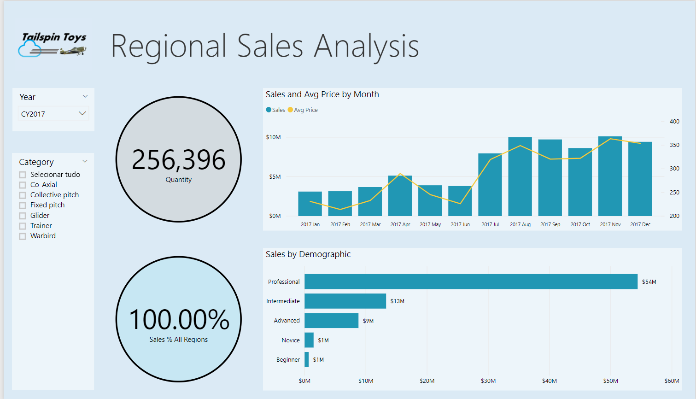

Neste tutorial, você aprenderá a:
> [!div class="checklist"]
> * Crie um visual personalizado do Power BI.
> * Desenvolva o visual personalizado com elementos visuais D3.
> * Configure a associação de dados aos elementos visuais.
> * Formate os valores de dados.

## <a name="prerequisites"></a>Pré-requisitos

* Se não estiver inscrito no **Power BI Pro**, [inscreva-se para uma avaliação gratuita](https://powerbi.microsoft.com/pricing/) antes de começar.
* É necessário ter o [Visual Studio Code](https://www.visualstudio.com/) instalado.
* Usuários do Windows precisam ter a versão 4 ou posterior do [Windows PowerShell](https://docs.microsoft.com/powershell/scripting/setup/installing-windows-powershell?view=powershell-6). Usuários do OSX precisam do [Terminal](https://macpaw.com/how-to/use-terminal-on-mac).

## <a name="setting-up-the-developer-environment"></a>Configurando o ambiente de desenvolvedor

Além dos pré-requisitos, há algumas ferramentas mais que você precisa instalar.

### <a name="installing-nodejs"></a>Instalando o Node.js

1. Para instalar o Node.js, em um navegador da Web, navegue até [Node.js](https://nodejs.org).

2. Baixe o instalador MSI mais recente do recurso.

3. Execute o instalador e, em seguida, siga as etapas de instalação. Aceite os termos do contrato de licença e todos os padrões.

   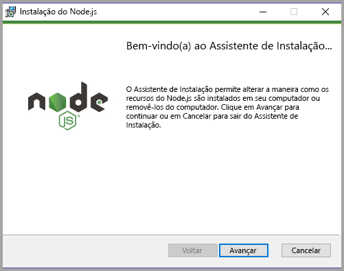

4. Reinicie o computador.

### <a name="installing-packages"></a>Instalando pacotes

Agora, é necessário instalar o pacote **pbiviz**.

1. Abra o Windows PowerShell após o computador ter sido reiniciado.

2. Para instalar o pbiviz, digite o comando a seguir.

    ```powershell
    npm i -g powerbi-visuals-tools
    ```

### <a name="creating-and-installing-a-certificate"></a>Criando e instalando um certificado

#### <a name="windows"></a>Windows

1. Para criar e instalar um certificado, digite o seguinte comando.

    ```powershell
    pbiviz --install-cert
    ```

    Ele retorna um resultado que produz uma *frase secreta*. Nesse caso, a *frase secreta* é **_15105661266553327_**. Também inicia o assistente para importação de certificados.

    

2. No Assistente de Importação de Certificado, verifique se a localização do armazenamento está definida como o Usuário Atual. Em seguida, selecione *Avançar*.

      

3. Na etapa **Arquivo a ser importado**, selecione *Avançar*.

4. Na etapa **Proteção de chave privada**, na caixa de senha, cole a frase secreta recebida da criação do certificado.  Novamente, nesse caso, ela é **_15105661266553327_**.

      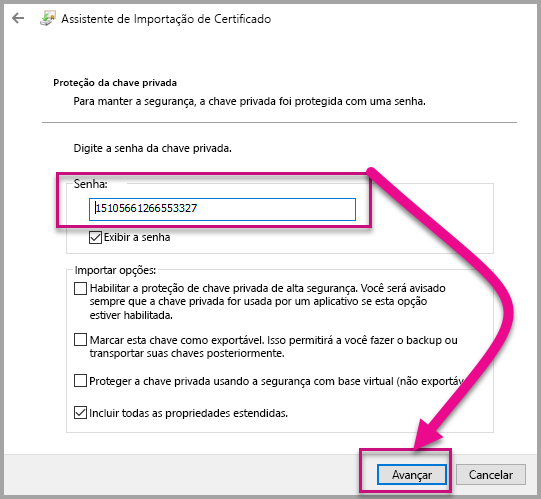

5. Na etapa **Repositório de certificados**, selecione a opção **Colocar todos os certificados no repositório a seguir**. Em seguida, selecione *Procurar*.

      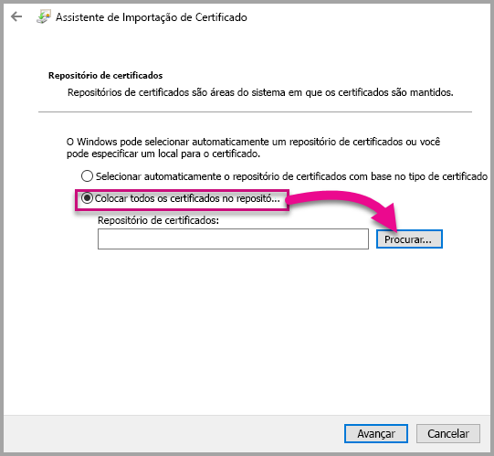

6. Na janela **Selecionar repositório de certificados**, selecione **Autoridades de Certificação Confiáveis** e selecione *OK*. Em seguida, selecione *Avançar* na tela **Repositório de certificados**.

      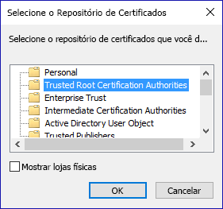

7. Para concluir a importação, selecione **Concluir**.

8. Se você receber um aviso de segurança, selecione **Sim**.

    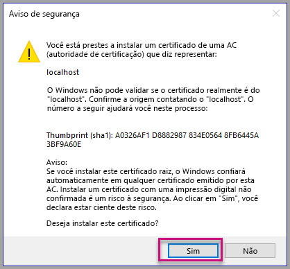

9. Quando notificado que a importação foi bem-sucedida, selecione **OK**.

    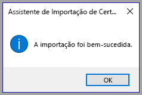

> [!Important]
> Não feche a sessão do Windows PowerShell.

#### <a name="osx"></a>OSX

1. Se o bloqueio na parte superior esquerda estiver bloqueado, selecione-o para desbloquear. Pesquise *localhost* e clique duas vezes no certificado.

    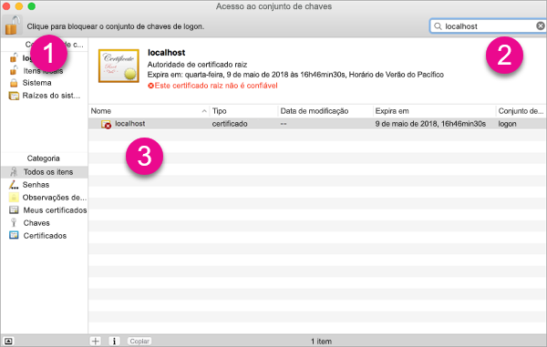

2. Selecione **Sempre Confiar** e feche a janela.

    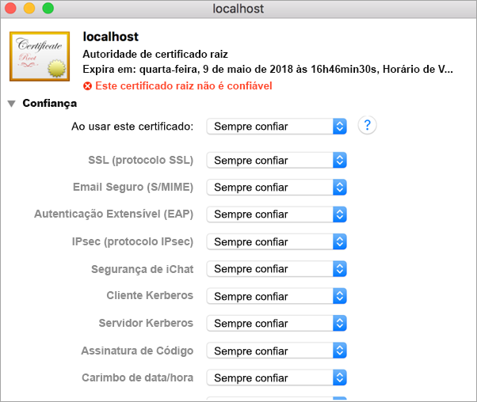

3. Insira seu nome de usuário e sua senha. Selecione **Atualizar Configurações**.

    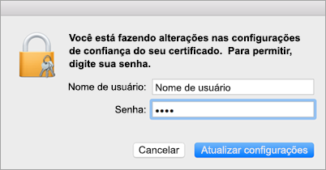

4. Feche todos os navegadores que estiverem abertos.

> [!NOTE]
> Se o certificado não for reconhecido, poderá ser necessário reiniciar o computador.

## <a name="creating-a-custom-visual"></a>Criando um visual personalizado

Agora que você configurou seu ambiente, é hora de criar seu visual personalizado.

É possível [baixar](https://github.com/Microsoft/PowerBI-visuals-circlecard) o código-fonte completo para este tutorial.

1. Verifique se o pacote de Ferramentas de Visual do Power BI foi instalado.

    ```powershell
    pbiviz
    ```
    Você verá a saída da ajuda.

    <pre><code>
        +syyso+/
    oms/+osyhdhyso/
    ym/       /+oshddhys+/
    ym/              /+oyhddhyo+/
    ym/                     /osyhdho
    ym/                           sm+
    ym/               yddy        om+
    ym/         shho /mmmm/       om+
        /    oys/ +mmmm /mmmm/       om+
    oso  ommmh +mmmm /mmmm/       om+
    ymmmy smmmh +mmmm /mmmm/       om+
    ymmmy smmmh +mmmm /mmmm/       om+
    ymmmy smmmh +mmmm /mmmm/       om+
    +dmd+ smmmh +mmmm /mmmm/       om+
            /hmdo +mmmm /mmmm/ /so+//ym/
                /dmmh /mmmm/ /osyhhy/
                    //   dmmd
                        ++

        PowerBI Custom Visual Tool

    Usage: pbiviz [options] [command]

    Commands:

    new [name]        Create a new visual
    info              Display info about the current visual
    start             Start the current visual
    package           Package the current visual into a pbiviz file
    update [version]  Updates the api definitions and schemas in the current visual. Changes the version if specified
    help [cmd]        display help for [cmd]

    Options:

    -h, --help      output usage information
    -V, --version   output the version number
    --install-cert  Install localhost certificate
    </code></pre>

    <a name="ssl-setup"></a>

2. Examine a saída, incluindo a lista de comandos compatíveis.

    

3. Para criar um projeto de visual personalizado, insira o comando a seguir. **CircleCard** é o nome do projeto.

    ```PowerShell
    pbiviz new CircleCard
    ```
    

    > [!Note]
    > Deve-se criar o projeto no local atual do prompt.

4. Navegue até a pasta do projeto.

    ```powershell
    cd CircleCard
    ```
5. Inicie o visual personalizado. Agora seu visual CircleCard está sendo executado enquanto é hospedado em seu computador.

    ```powershell
    pbiviz start
    ```

    

> [!Important]
> Não feche a sessão do Windows PowerShell.

### <a name="testing-the-custom-visual"></a>Testando o visual personalizado

Nesta seção, testaremos o visual personalizado CircleCard carregando um relatório do Power BI Desktop e, em seguida, editando o relatório para exibir o visual personalizado.

1. Entre em [PowerBI.com](https://powerbi.microsoft.com/) > acesse o **ícone de engrenagem** > e, em seguida, selecione **Configurações**.

      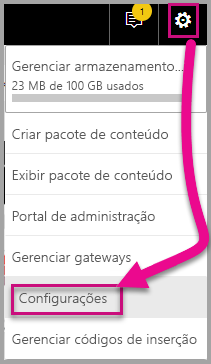

2. Selecione **Desenvolvedor** e, em seguida, marque a caixa de seleção **Habilitar visual do desenvolvedor para teste**.

    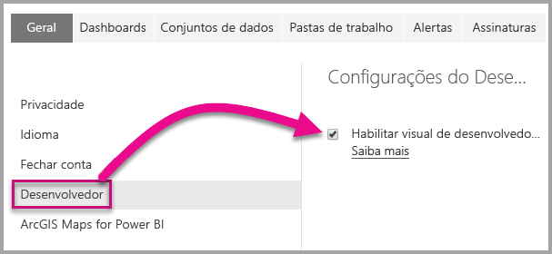

3. Faça upload de um relatório do Power BI Desktop.  

    Obtenha dados > Arquivos > Arquivo Local.

    Será possível [baixar](https://microsoft.github.io/PowerBI-visuals/docs/step-by-step-lab/images/US_Sales_Analysis.pbix) um relatório de exemplo do Power BI Desktop se você ainda não tiver criado um.

    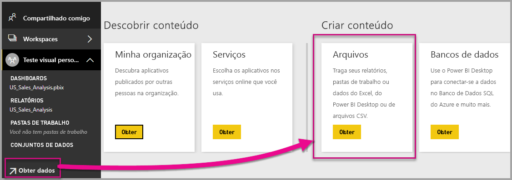 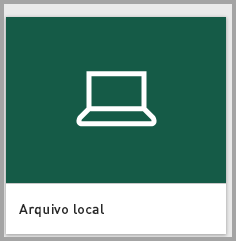

    Agora, para exibir o relatório, selecione **US_Sales_Analysis** da seção **Relatório** no painel de navegação à esquerda.

    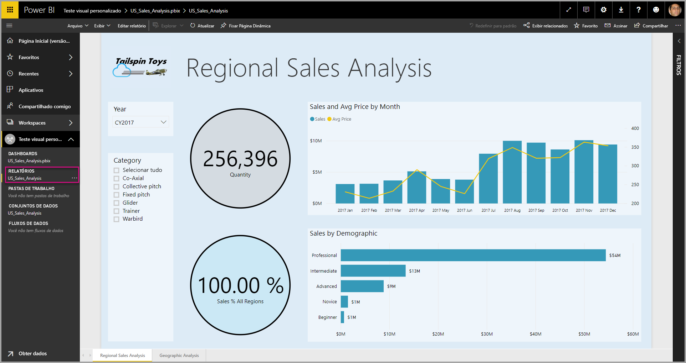

4. Agora, é necessário editar o relatório no serviço do Power BI.

    Acesse **Editar relatório**.

    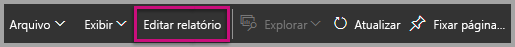

5. Selecione o **Visual do Desenvolvedor** no painel **Visualizações**.

    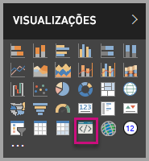

    > [!Note]
    > A visualização representa o visual personalizado que você iniciou em seu computador. Ela só estará disponível quando as configurações do desenvolvedor tiverem sido habilitadas.

6. Observe que uma visualização foi adicionada à tela do relatório.

    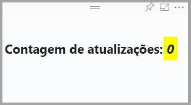

    > [!Note]
    > Esse é um visual muito simples que exibe o número de vezes que o método de atualização foi chamado. Nesse estágio, o visual ainda não recupera nenhum dado.

7. Ao selecionar o novo visual no relatório, acesse o painel Campos > expanda Vendas > selecione Quantidade.

    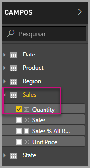

8. Em seguida, para testar o novo visual, redimensione o visual e observe os incrementos de valor da atualização.

    

Para interromper a execução do visual personalizado no PowerShell, digite Ctrl+C. Quando solicitado para finalizar o trabalho em lotes, digite Y e pressione Enter.

## <a name="adding-visual-elements"></a>Adicionando elementos visuais

Agora é necessário instalar a **biblioteca de JavaScript D3**. A D3 é uma biblioteca de JavaScript para a produção de visualizações de dados dinâmicos e interativos em navegadores da Web. Ela faz uso de padrões CSS e HTML5 SVG amplamente implementados.

Agora é possível desenvolver o visual personalizado para exibir um círculo com texto.

> [!Note]
> Muitas entradas de texto neste tutorial podem ser copiadas [aqui](https://github.com/Microsoft/powerbi-visuals-circlecard).

1. Para instalar a **biblioteca de D3** no PowerShell, digite o comando a seguir.

    ```powershell
    npm i d3@^5.0.0 --save
    ```

    ```powershell
    PS C:\circlecard>npm i d3@^5.0.0 --save
    + d3@5.11.0
    added 179 packages from 169 contributors and audited 306 packages in 33.25s
    found 0 vulnerabilities

    PS C:\circlecard>
    ```

2. Para instalar as definições de tipo para a **biblioteca de D3**, digite o comando abaixo.

    ```powershell
    npm i @types/d3@^5.0.0 --save
    ```

    ```powershell
    PS C:\circlecard>npm i @types/d3@^5.0.0 --save
    + @types/d3@5.7.2
    updated 1 package and audited 306 packages in 2.217s
    found 0 vulnerabilities

    PS C:\circlecard>
    ```

    Este comando instala as definições TypeScript com base em arquivos JavaScript, permitindo que você desenvolva o visual personalizado no TypeScript (que é um superconjunto de JavaScript). O Visual Studio Code é um IDE ideal para desenvolver aplicativos TypeScript.

3. Para instalar a biblioteca **core-js** no PowerShell, digite o comando a seguir.

    ```powershell
    npm i core-js@3.2.1 --save
    ```

    ```powershell
    PS C:\circlecard> npm i core-js@3.2.1 --save

    > core-js@3.2.1 postinstall F:\circlecard\node_modules\core-js
    > node scripts/postinstall || echo "ignore"

    Thank you for using core-js ( https://github.com/zloirock/core-js ) for polyfilling JavaScript standard library!

    The project needs your help! Please consider supporting of core-js on Open Collective or Patreon:
    > https://opencollective.com/core-js
    > https://www.patreon.com/zloirock

    + core-js@3.2.1
    updated 1 package and audited 306 packages in 6.051s
    found 0 vulnerabilities

    PS C:\circlecard>
    ```

    Esse comando instala a biblioteca padrão modular para JavaScript. Ele inclui polyfills para ECMAScript até 2019. Saiba mais sobre [`core-js`](https://www.npmjs.com/package/core-js)

4. Para instalar a biblioteca **powerbi-visual-api** no PowerShell, digite o comando a seguir.

    ```powershell
    npm i powerbi-visuals-api --save-dev
    ```

    ```powershell
    PS C:\circlecard>npm i powerbi-visuals-api --save-dev

    + powerbi-visuals-api@2.6.1
    updated 1 package and audited 306 packages in 2.139s
    found 0 vulnerabilities

    PS C:\circlecard>
    ```

    Esse comando instala definições de API de visuais do Power BI.

5. Inicie o [Visual Studio Code](https://code.visualstudio.com/).

    É possível iniciar o **Visual Studio Code** do PowerShell usando o comando a seguir.

    ```powershell
    code .
    ```

6. No **painel do Explorer**, expanda a pasta **node_modules** para verificar se a **biblioteca de d3** foi instalada.

    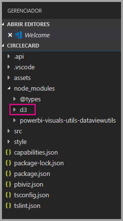

7. Verifique se o arquivo **index.d.ts** foi adicionado, expandindo node_modules > @types > d3 no **painel do Explorer**.

    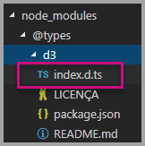

### <a name="developing-the-visual-elements"></a>Desenvolvendo os elementos visuais

Agora podemos explorar como desenvolver o visual personalizado para mostrar um círculo e um texto de exemplo.

1. No **painel do Explorer**, expanda a pasta **src** e, em seguida, selecione **visual.ts**.

    > [!Note]
    > Observe os comentários na parte superior do arquivo **visual.ts**. Uma permissão para usar os pacotes de visual personalizados do Power BI é concedida gratuitamente de acordo com os termos de licença do MIT. Como parte do contrato, é necessário deixar os comentários na parte superior do arquivo.

2. Remova a seguinte lógica de visual personalizado padrão da classe do visual.
    * As quatro declarações de variável privada de nível de classe.
    * Todas as linhas de código do construtor.
    * Todas as linhas de código do método de atualização.
    * Todas as linhas restantes dentro do módulo, incluindo os métodos parseSettings e enumerateObjectInstances.

    Verifique se o código do módulo tem a seguinte aparência.

    ```typescript
    "use strict";
    import "core-js/stable";
    import "../style/visual.less";
    import powerbi from "powerbi-visuals-api";
    import IVisual = powerbi.extensibility.IVisual;
    import VisualConstructorOptions = powerbi.extensibility.visual.VisualConstructorOptions;
    import VisualUpdateOptions = powerbi.extensibility.visual.VisualUpdateOptions;

    import * as d3 from "d3";
    type Selection<T extends d3.BaseType> = d3.Selection<T, any,any, any>;

    export class Visual implements IVisual {

        constructor(options: VisualConstructorOptions) {

        }

        public update(options: VisualUpdateOptions) {

        }
    }
    ```

3. Atrás da declaração de classe do *Visual*, insira as seguintes propriedades de nível de classe.

    ```typescript
    export class Visual implements IVisual {
        // ...
        private host: IVisualHost;
        private svg: Selection<SVGElement>;
        private container: Selection<SVGElement>;
        private circle: Selection<SVGElement>;
        private textValue: Selection<SVGElement>;
        private textLabel: Selection<SVGElement>;
        // ...
    }
    ```

    

4. Adicione o seguinte código ao *construtor*.

    ```typescript
    this.svg = d3.select(options.element)
        .append('svg')
        .classed('circleCard', true);
    this.container = this.svg.append("g")
        .classed('container', true);
    this.circle = this.container.append("circle")
        .classed('circle', true);
    this.textValue = this.container.append("text")
        .classed("textValue", true);
    this.textLabel = this.container.append("text")
        .classed("textLabel", true);
    ```

    Este código adiciona um grupo SVG dentro do visual e, em seguida, adiciona três formas: um círculo e dois elementos de texto.

    Para formatar o código no documento, selecione com o botão direito do mouse em qualquer lugar no **documento do Visual Studio Code** e, em seguida, selecione **Formatar documento**.

      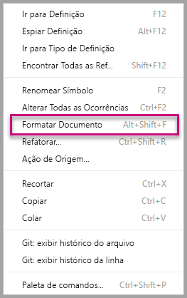

    Para melhorar a legibilidade, é recomendável formatar o documento sempre que colar snippets de código.

5. Adicione o seguinte código ao método de *atualização*.

    ```typescript
    let width: number = options.viewport.width;
    let height: number = options.viewport.height;
    this.svg.attr("width", width);
    this.svg.attr("height", height);
    let radius: number = Math.min(width, height) / 2.2;
    this.circle
        .style("fill", "white")
        .style("fill-opacity", 0.5)
        .style("stroke", "black")
        .style("stroke-width", 2)
        .attr("r", radius)
        .attr("cx", width / 2)
        .attr("cy", height / 2);
    let fontSizeValue: number = Math.min(width, height) / 5;
    this.textValue
        .text("Value")
        .attr("x", "50%")
        .attr("y", "50%")
        .attr("dy", "0.35em")
        .attr("text-anchor", "middle")
        .style("font-size", fontSizeValue + "px");
    let fontSizeLabel: number = fontSizeValue / 4;
    this.textLabel
        .text("Label")
        .attr("x", "50%")
        .attr("y", height / 2)
        .attr("dy", fontSizeValue / 1.2)
        .attr("text-anchor", "middle")
        .style("font-size", fontSizeLabel + "px");
    ```

    *Esse código define a largura e a altura do visual e, em seguida, inicializa os estilos e atributos dos elementos visuais.*

6. Salve o arquivo **visual.ts**.

7. Selecione o arquivo **capabilities.json**.

    Na linha 14, remova todo o elemento de objetos (linhas 14-60).

8. Salve o arquivo **capabilities.json**.

9. No PowerShell, inicie o visual personalizado.

    ```powershell
    pbiviz start
    ```

### <a name="toggle-auto-reload"></a>Ativar/desativar recarregamento automático

1. Navegue de volta para o relatório do Power BI.
2. Na barra de ferramentas flutuando em cima do visual do desenvolvedor, selecione **Ativar/Desativar Recarregamento Automático**.

    

    Essa opção garante que o visual é recarregado automaticamente sempre que você salvar as alterações no projeto.

3. No **painel Campos**, arraste o campo **Quantidade** para o visual do desenvolvedor.

4. Verifique se o visual tem a seguinte aparência.

    

5. Redimensione o visual.

    Observe que o círculo e o valor de texto são dimensionados de acordo com a dimensão disponível do visual.

    O método de atualização é chamado continuamente com o redimensionamento do visual e resulta no redimensionamento fluido dos elementos visuais.

    Agora você desenvolveu os elementos visuais.

6. Continue executando o visual.

## <a name="process-data-in-the-visual-code"></a>Processar dados no código visual

Defina as funções e os mapeamentos de exibição de dados e, em seguida, modifique a lógica do visual personalizado para exibir o valor e o nome de exibição de uma medida.

### <a name="configuring-the-capabilities"></a>Configurando as funcionalidades

Modifique o arquivo **capabilities.json** para definir a função e os mapeamentos de exibição de dados.

1. No Visual Studio Code, no arquivo **capabilities.json**, de dentro da matriz **dataRoles**, remova todo o conteúdo (linhas 3 a 12).

2. Dentro da matriz **dataRoles**, insira o código a seguir.

    ```json
    {
        "displayName": "Measure",
        "name": "measure",
        "kind": "Measure"
    }
    ```

    Agora a matriz **dataRoles** define uma função única de dados do tipo **medida**, denominada **medida** e a exibe como **Medida**. Essa função de dados permite a passagem de um campo de medida ou de um campo resumido.

3. De dentro da matriz **dataViewMappings**, remova todo o conteúdo (linhas 10-31).

4. Dentro da matriz **dataViewMappings**, insira o seguinte conteúdo.

    ```json
    {
        "conditions": [
            { "measure": { "max": 1 } }
        ],
        "single": {
            "role": "measure"
        }
    }
    ```

    Agora a matriz **dataViewMappings** define que um campo pode ser passado para a função de dados denominada **medida**.

5. Salve o arquivo **capabilities.json**.

6. No Power BI, observe que agora o visual pode ser configurado com **Medida**.

    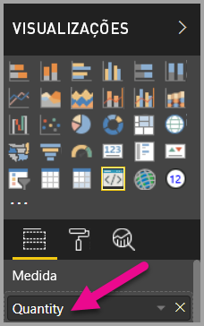

    > [!Note]
    > O projeto do visual ainda não inclui a lógica de associação de dados.

### <a name="exploring-the-dataview"></a>Explorando a exibição de dados

1. Na barra de ferramentas flutante em cima do visual, selecione **Mostrar exibição de dados**.

    

2. Expanda para baixo em **único** e, em seguida, observe o valor.

    

3. Expanda para baixo em **metadados** e, em seguida, na matriz **colunas** e, no aviso específico, os valores **format** e **displayName**.

    

4. Para alternar de volta o visual, na barra de ferramentas flutuante em cima do visual, selecione **Mostrar exibição de dados**.

    

### <a name="consume-data-in-the-visual-code"></a>Consumir dados no código visual

1. No **Visual Studio Code**, no arquivo **visual.ts**,

    importe a interface de `DataView` do módulo `powerbi`

    ```typescript
    import DataView = powerbi.DataView;
    ```

    e adicione a instrução a seguir como a primeira instrução do método de atualização.

    ```typescript
    let dataView: DataView = options.dataViews[0];
    ```

    

    Essa instrução atribui o *dataView* a uma variável para facilitar o acesso e declara a variável para referenciar o objeto *dataView*.

2. No método de **atualização**, substitua **.text("Value")** pelo seguinte.

    ```typescript
    .text(<string>dataView.single.value)
    ```

    

3. No método de **atualização**, substitua **.text("Label")** pelo seguinte.

    ```typescript
    .text(dataView.metadata.columns[0].displayName)
    ```

    

4. Salve o arquivo **visual.ts**.

5. No **Power BI**, examine o visual que agora exibe o valor e o nome de exibição.

Agora você configurou as funções de dados e associou o visual à exibição de dados.

No próximo tutorial, você aprenderá como adicionar opções de formatação ao visual personalizado.

## <a name="debugging"></a>Depuração

Para obter dicas de como depurar seu visual personalizado, veja o [guia depuração](https://microsoft.github.io/PowerBI-visuals/docs/how-to-guide/how-to-debug/).

## <a name="next-steps"></a>Próximas etapas

> [!div class="nextstepaction"]
> [Adicionando opções de formatação](custom-visual-develop-tutorial-format-options.md)
