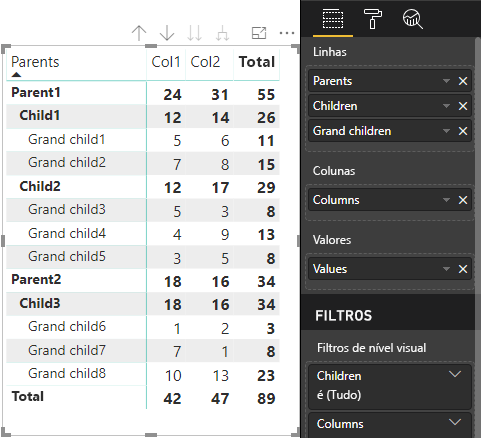

# <a name="data-view-mappings-in-power-bi-visuals"></a>Mapeamentos de exibição de dados em visuais do Power BI

Um `dataViewMappings` descreve como as funções de dados se relacionam entre si e permite que você especifique requisitos condicionais para elas.
Há uma seção para cada um dos `dataMappings`.

Cada mapeamento válido produzirá um `DataView`, mas atualmente só damos suporte à execução de uma consulta por visual, portanto, na maioria das situações, você só obterá um `DataView`. No entanto, você pode fornecer vários mapeamentos de dados com diferentes condições, os quais permitem:

```json
"dataViewMappings": [
    {
        "conditions": [ ... ],
        "categorical": { ... },
        "single": { ... },
        "table": { ... },
        "matrix": { ... }
    }
]
```

> [!NOTE]
> É importante observar que o Power BI criará um mapeamento para um DataView se e somente se o mapeamento válido estiver preenchido em `dataViewMappings`.

Em outras palavras, se `categorical` estiver definido em `dataViewMappings`, mas outros mapeamentos como `table`, `single`, etc. não estiverem, assim como no exemplo a seguir:
```json
"dataViewMappings": [
    {
        "categorical": { ... }
    }
]
```

o Power BI produzirá um `DataView` com um único mapeamento `categorical` (`table` e outros mapeamentos serão `undefined`):
```javascript
{
    "categorical": {
        "categories": [ ... ],
        "values": [ ... ]
    },
    "metadata": { ... }
}
```

## <a name="conditions"></a>Condições

Descreve as condições para um mapeamento de dados específico. Você poderá fornecer vários conjuntos de condições e, se os dados corresponderem a um dos conjuntos de condições descritos, o visual aceitará os dados como válidos.

No momento, para cada campo, você pode especificar um valor mínimo e um máximo. Representa o número de campos que podem ser associados a essa função de dados. 

> [!NOTE]
> Se uma função de dados for omitida na condição, ela poderá ter qualquer número de campos.

### <a name="example-1"></a>Exemplo 1

Você pode arrastar vários campos para cada função de dados. Neste exemplo, limitamos category a um campo de dados e measure a dois campos de dados.

```json
"conditions": [
    { "category": { "max": 1 }, "y": { "max": 2 } },
]
```

### <a name="example-2"></a>Exemplo 2

Neste exemplo, uma entre duas condições é necessária. Ou exatamente um campo de dados de categoria e exatamente duas medidas, ou então exatamente duas categorias e exatamente uma medida.

```json
"conditions": [
    { "category": { "min": 1, "max": 1 }, "measure": { "min": 2, "max": 2 } },
    { "category": { "min": 2, "max": 2 }, "measure": { "min": 1, "max": 1 } }
]
```

## <a name="single-data-mapping"></a>Mapeamento de dados único

O mapeamento de dados único é a forma mais simples de mapeamento de dados. Ele aceita um único campo measure e fornece o total. Se o campo for numérico, ele fornecerá a soma. Caso contrário, ele fornecerá uma contagem de valores exclusivos.

Para usar o mapeamento de dados único, você precisa definir o nome da função de dados que deseja mapear. Esse mapeamento funcionará apenas com um único campo de medida. Se um segundo campo for atribuído, nenhuma exibição de dados será gerada. Portanto, também é uma boa prática incluir uma condição que limite os dados a um campo single.

> [!NOTE]
> Esse mapeamento de dados não pode ser usado em conjunto com nenhum outro mapeamento de dados. Ele se destina a reduzir os dados a um valor numérico single.

### <a name="example-3"></a>Exemplo 3

```json
"dataViewMappings": {
    "conditions": [
        { "Y": { "max": 1 } }
    ],
    "single": {
        "role": "Y"
    }
}  
```

A exibição de dados resultante ainda conterá os outros tipos (tabela, categórico, assim por diante), mas cada mapeamento conterá apenas o valor único. A melhor prática é acessar apenas o valor em single.

```JSON
{
    "dataView": [
        {
            "metadata": null,
            "categorical": null,
            "matrix": null,
            "table": null,
            "tree": null,
            "single": {
                "value": 94163140.3560001
            }
        }
    ]
}
```

## <a name="categorical-data-mapping"></a>Mapeamento de dados categóricos

O mapeamento de dados categóricos é usado para obter um ou dois agrupamentos independentes de dados.

### <a name="example-4"></a>Exemplo 4

Aqui está a definição de nosso exemplo anterior em funções de dados.

```json
"dataRole":[
    {
        "displayName": "Category",
        "name": "category",
        "kind": "Grouping"
    },
    {
        "displayName": "Y Axis",
        "name": "measure",
        "kind": "Measure"
    }
]
```

Agora, o mapeamento:

```json
"dataViewMappings": {
    "categorical": {
        "categories": {
            "for": { "in": "category" }
        },
        "values": {
            "select": [
                { "bind": { "to": "measure" } }
            ]
        }
    }
}
```

Trata-se de um exemplo simples que, em inglês comum, diz: "Mapear minha função de dados `category` para que, para cada campo que eu arrastar para `category`, os respectivos dados sejam mapeados para `categorical.categories`. Mapear também a minha função de dados `measure` para `categorical.values`."

* **for...in** – para todos os itens nesta função de dados, inclua-os na consulta de dados.
* **bind...to** – produz o mesmo resultado que for...in, mas espera que a função de dados tenha uma condição que a restrinja a um campo single.

### <a name="example-5"></a>Exemplo 5

Neste exemplo, usaremos as duas primeiras DataRoles do exemplo anterior, além de definir `grouping` e `measure2`.

```json
"dataRole":[
    {
        "displayName": "Category",
        "name": "category",
        "kind": "Grouping"
    },
    {
        "displayName": "Y Axis",
        "name": "measure",
        "kind": "Measure"
    },
    {
        "displayName": "Grouping with",
        "name": "grouping",
        "kind": "Grouping"
    },
    {
        "displayName": "X Axis",
        "name": "measure2",
        "kind": "Grouping"
    }
]
```

Agora, o mapeamento:

```json
"dataViewMappings":{
    "categorical": {
        "categories": {
            "for": { "in": "category" }
        },
        "values": {
            "group": {
                "by": "grouping",
                "select":[
                    { "bind": { "to": "measure" } },
                    { "bind": { "to": "measure2" } }
                ]
            }
        }
    }
}
```

Aqui, a diferença está em como mapeamos valores categóricos. Estamos dizendo "Mapear minhas funções de dados `measure` e `measure2` a serem agrupadas pela função de dados `grouping`".

### <a name="example-6"></a>Exemplo 6

Aqui estão as funções de dados.

```json
"dataRoles": [
    {
        "displayName": "Categories",
        "name": "category",
        "kind": "Grouping"
    },
    {
        "displayName": "Measures",
        "name": "measure",
        "kind": "Measure"
    },
    {
        "displayName": "Series",
        "name": "series",
        "kind": "Measure"
    }
]
```

Aqui está o dataViewMapping.

```json
"dataViewMappings": [
    {
        "categorical": {
            "categories": {
                "for": {
                    "in": "category"
                }
            },
            "values": {
                "group": {
                    "by": "series",
                    "select": [{
                            "for": {
                                "in": "measure"
                            }
                        }
                    ]
                }
            }
        }
    }
]
```

O `dataview` categórico poderia ser visualizado desta forma.

| Categórica |  |  | | | |
|-----|-----|------|------|------|------|
| | Ano | 2013 | 2014 | 2015 | 2016 |
| País | | |
| EUA | | x | x | 125 | 100 |
| Canadá | | x | 50 | 200 | x |
| México | | 300 | x | x | x |
| REINO UNIDO | | x | x | 75 | x |

O Power BI o produzirá para você como o DataView categórico. É o conjunto de categorias.

```JSON
{
    "categorical": {
        "categories": [
            {
                "source": {...},
                "values": [
                    "Canada",
                    "Mexico",
                    "UK",
                    "USA"
                ],
                "identity": [...],
                "identityFields": [...],
            }
        ]
    }
}
```

Cada categoria é mapeada também para um conjunto de valores. Cada um desses valores é agrupado por série, que equivale a anos.

Por exemplo, as vendas no Canadá em 2013 são nulas, as vendas no Canadá em 2014 são 50.

```JSON
{
    "values": [
        {
            "source": {...},
            "values": [
                null,
                300,
                null,
                null
            ],
            "identity": [...],
        },
        {
            "source": {...},
            "values": [
                50,
                null,
                150,
                null
            ],
            "identity": [...],
        },
        {
            "source": {...},
            "values": [
                200,
                null,
                null,
                125
            ],
            "identity": [...],
        },
        {
            "source": {...},
            "values": [
                null,
                null,
                null,
                100
            ],
            "identity": [...],
        }
    ]
}
```

## <a name="table-data-mapping"></a>Mapeamento de dados de tabela

A exibição de dados de tabela é um mapeamento de dados simples. Essencialmente, é uma lista de pontos de dados em que pontos de dados numéricos podem ser agregados.

### <a name="example-7"></a>Exemplo 7

Com as funcionalidades fornecidas:

```json
"dataRoles": [
    {
        "displayName": "Values",
        "name": "values",
        "kind": "Measure"
    }
]
```

```json
"dataViewMappings": [
    {
        "table": {
            "rows": {
                "for": {
                    "in": "values"
                }
            }
        }
    }
]
```

A tabela `dataview` poderia ser visualizada desta forma.  

| País| Ano | Vendas |
|-----|-----|------|
| EUA | 2016 | 100 |
| EUA | 2015 | 50 |
| Canadá | 2015 | 200 |
| Canadá | 2015 | 50 |
| México | 2013 | 300 |
| REINO UNIDO | 2014 | 150 |
| EUA | 2015 | 75 |

O Power BI a produzirá para você como o DataView de tabela. Não presuma que há uma ordenação.

```JSON
{
    "table" : {
        "columns": [...],
        "rows": [
            [
                "Canada",
                2014,
                50
            ],
            [
                "Canada",
                2015,
                200
            ],
            [
                "Mexico",
                2013,
                300
            ],
            [
                "UK",
                2014,
                150
            ],
            [
                "USA",
                2015,
                100
            ],
            [
                "USA",
                2015,
                75
            ],
            [
                "USA",
                2016,
                100
            ]
        ]
    }
}
```

Os dados podem ser agregados selecionando o campo desejado e clicando em soma.  


## <a name="matrix-data-mapping"></a>Mapeamento de dados de matriz

O mapeamento de dados de matriz é semelhante ao mapeamento de dados de tabela, mas as linhas são apresentadas hierarquicamente. E um dos valores de `dataRole` pode ser usado como um valor de cabeçalho de coluna.

```json
{
    "dataRoles": [
        {
            "name": "Category",
            "displayName": "Category",
            "displayNameKey": "Visual_Category",
            "kind": "Grouping"
        },
        {
            "name": "Column",
            "displayName": "Column",
            "displayNameKey": "Visual_Column",
            "kind": "Grouping"
        },
        {
            "name": "Measure",
            "displayName": "Measure",
            "displayNameKey": "Visual_Values",
            "kind": "Measure"
        }
    ],
    "dataViewMappings": [
        {
            "matrix": {
                "rows": {
                    "for": {
                        "in": "Category"
                    }
                },
                "columns": {
                    "for": {
                        "in": "Column"
                    }
                },
                "values": {
                    "select": [
                        {
                            "for": {
                                "in": "Measure"
                            }
                        }
                    ]
                }
            }
        }
    ]
}
```

O Power BI cria uma estrutura de dados hierárquica. A raiz da árvore inclui os dados da primeira coluna da função de dados `Category` com filhos da segunda coluna da função de dados.

Conjunto de dados:

| Pais | Filhos | Netos | Colunas | Valores |
|-----|-----|------|-------|-------|
| Pai1 | Filho1 | Neto1 | Col1 | 5 |
| Pai1 | Filho1 | Neto1 | Col2 | 6 |
| Pai1 | Filho1 | Neto2 | Col1 | 7 |
| Pai1 | Filho1 | Neto2 | Col2 | 8 |
| Pai1 | Filho2 | Neto3 | Col1 | 5 |
| Pai1 | Filho2 | Neto3 | Col2 | 3 |
| Pai1 | Filho2 | Neto4 | Col1 | 4 |
| Pai1 | Filho2 | Neto4 | Col2 | 9 |
| Pai1 | Filho2 | Neto5 | Col1 | 3 |
| Pai1 | Filho2 | Neto5 | Col2 | 5 |
| Pai2 | Filho3 | Neto6 | Col1 | 1 |
| Pai2 | Filho3 | Neto6 | Col2 | 2 |
| Pai2 | Filho3 | Neto7 | Col1 | 7 |
| Pai2 | Filho3 | Neto7 | Col2 | 1 |
| Pai2 | Filho3 | Neto8 | Col1 | 10 |
| Pai2 | Filho3 | Neto8 | Col2 | 13 |

O visual de matriz principal do Power BI o renderiza como uma tabela.



O visual obtém a estrutura de dados conforme descrito abaixo (somente as primeiras duas linhas são apresentadas):

```json
{
    "metadata": {...},
    "matrix": {
        "rows": {
            "levels": [...],
            "root": {
                "childIdentityFields": [...],
                "children": [
                    {
                        "level": 0,
                        "levelValues": [...],
                        "value": "Parent1",
                        "identity": {...},
                        "childIdentityFields": [...],
                        "children": [
                            {
                                "level": 1,
                                "levelValues": [...],
                                "value": "Child1",
                                "identity": {...},
                                "childIdentityFields": [...],
                                "children": [
                                    {
                                        "level": 2,
                                        "levelValues": [...],
                                        "value": "Grand child1",
                                        "identity": {...},
                                        "values": {
                                            "0": {
                                                "value": 5 // value for Col1
                                            },
                                            "1": {
                                                "value": 6 // value for Col2
                                            }
                                        }
                                    },
                                    ...
                                ]
                            },
                            ...
                        ]
                    },
                    ...
                ]
            }
        },
        "columns": {
            "levels": [...],
            "root": {
                "childIdentityFields": [...],
                "children": [
                    {
                        "level": 0,
                        "levelValues": [...],
                        "value": "Col1",
                        "identity": {...}
                    },
                    {
                        "level": 0,
                        "levelValues": [...],
                        "value": "Col2",
                        "identity": {...}
                    },
                    ...
                ]
            }
        },
        "valueSources": [...]
    }
}
```

## <a name="data-reduction-algorithm"></a>Algoritmo de redução de dados

Um `DataReductionAlgorithm` poderá ser aplicado se você quiser controlar a quantidade de dados recebida no DataView.

Por padrão, todos os visuais personalizados têm o DataReductionAlgorithm principal aplicado com "count" (contagem) definida como 1.000 pontos de dados. Isso é equivalente a definir as seguintes propriedades no capabilities.json:

```json
"dataReductionAlgorithm": {
    "top": {
        "count": 1000
    }
}
```

Você pode modificar o valor de 'count' para qualquer valor inteiro até 30.000. Os visuais personalizados baseados em R podem dar suporte a até 150.000 linhas.

## <a name="data-reduction-algorithm-types"></a>Tipos de algoritmo de redução de dados

Há quatro tipos de configurações de `DataReductionAlgorithm`:

* `top` – se você quiser limitar os dados a valores extraídos da parte superior do conjunto de dados. Os primeiros valores de "count" serão obtidos do conjunto de dados.
* `bottom` – se você quiser limitar os dados a valores extraídos da parte inferior do conjunto de dados. Os últimos valores de "count" serão obtidos do conjunto de dados.
* `sample` – reduza o conjunto de um algoritmo de amostragem simples limitado a um número de itens de "count". Isso significa que o primeiro e o último itens estão incluídos e há um número de itens equivalente a "count" entre eles, com intervalos iguais.
Por exemplo, se você tiver um conjunto de dados [0, 1, 2, ... 100] e `count: 9`, você recebe os seguintes valores [0, 10, 20 ... 100]
* `window` – carrega uma 'janela' de pontos de dados de cada vez contendo elementos "count". Atualmente, `top` e `window` são equivalentes. Há trabalho em andamento para oferecer suporte total a uma configuração de janelas.

## <a name="data-reduction-algorithm-usage"></a>Uso de algoritmo de redução de dados

`DataReductionAlgorithm` pode ser usado em mapeamento de `dataview` categórico, de tabela ou de matriz.

Ele pode ser definido em `categories` e/ou na seção de grupo de `values` para mapeamento de dados categórico.

### <a name="example-8"></a>Exemplo 8

```json
"dataViewMappings": {
    "categorical": {
        "categories": {
            "for": { "in": "category" },
            "dataReductionAlgorithm": {
                "window": {
                    "count": 300
                }
            }  
        },
        "values": {
            "group": {
                "by": "series",
                "select": [{
                        "for": {
                            "in": "measure"
                        }
                    }
                ],
                "dataReductionAlgorithm": {
                    "top": {
                        "count": 100
                    }
                }  
            }
        }
    }
}
```

O algoritmo de redução de dados pode ser aplicado à seção `rows` do mapeamento de `dataview` de tabela.

### <a name="example-9"></a>Exemplo 9

```json
"dataViewMappings": [
    {
        "table": {
            "rows": {
                "for": {
                    "in": "values"
                },
                "dataReductionAlgorithm": {
                    "top": {
                        "count": 2000
                    }
                } 
            }
        }
    }
]
```

O algoritmo de redução de dados pode ser aplicado à seção `rows` e/ou `columns` do mapeamento de `matrix` `dataview`.
