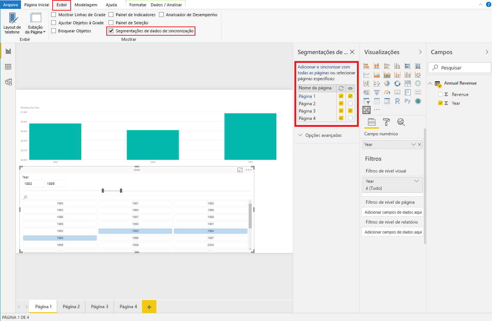

# <a name="sync-slicers-in-power-bi-visuals"></a>Sincronizar segmentação de dados em visuais do Power BI

Para dar suporte ao recurso [Sincronizar Segmentação de Dados](https://docs.microsoft.com/power-bi/desktop-slicers), o visual de segmentação personalizada deve usar a API versão 1.13 ou posterior.

Além disso, você precisa habilitar a opção no arquivo *capabilities.json* conforme mostra o código a seguir:

```json
{
    ...
    "supportsHighlight": true,
    "suppressDefaultTitle": true,
    "supportsSynchronizingFilterState": true,
    "sorting": {
        "default": {}
    }
}
```

Depois de atualizar o arquivo *capabilities.json*, você poderá exibir o painel de opções **Sincronizar segmentação de dados** quando selecionar visual de segmentação personalizada.

> [!NOTE]
> O recurso Sincronizar Segmentação de Dados não é compatível com mais de um campo. Se a segmentação tiver mais de um campo (**Categoria** ou **Medida**), o recurso será desabilitado.



No painel **Segmentação de dados de sincronização**, você pode ver que a sua visibilidade de segmentação e sua filtragem podem ser aplicadas a várias páginas de relatório.
