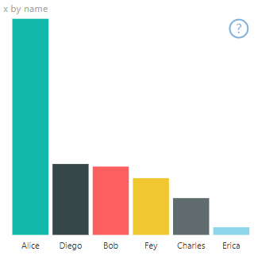
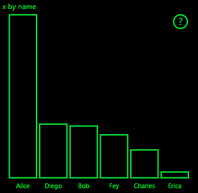
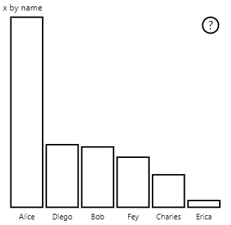

# <a name="high-contrast-mode-support"></a>Suporte ao modo de alto contraste

A configuração de *Alto contraste* do Windows torna o texto e os aplicativos mais fáceis de ver usando cores mais distintas.
Leia mais sobre [suporte de alto contraste no Power BI](https://powerbi.microsoft.com/blog/power-bi-desktop-june-2018-feature-summary/#highContrast).

Adicionar suporte de alto contraste ao seu visual exige o seguinte:

1. Na inicialização: Detectar se Power BI está no modo de alto contraste e, nesse caso, obter cores de alto contraste atuais.
2. A cada atualização: Altere a maneira como o Visual é renderizado para facilitar a visualização.

O visual PowerBI-visuals-sampleBarChart tem implementação de suporte de alto contraste.

Para obter mais informações, confira o [repositório visual do PowerBI-visuals-sampleBarChart](https://github.com/Microsoft/PowerBI-visuals-sampleBarChart/commit/61011c82b66ca0d3321868f1d089c65101ca42e6)

## <a name="on-init"></a>Na inicialização

O membro colorPalette de `options.host` tem várias propriedades para o modo de alto contraste. Use essas propriedades para determinar se o modo de alto contraste está ativo e, em caso afirmativo, quais cores usar.

### <a name="detect-that-power-bi-is-in-high-contrast-mode"></a>Detectar que o Power BI está em modo de alto contraste

Se `host.colorPalette.isHighContrast` for `true`, o modo de alto contraste estará ativo e o visual deverá se desenhar adequadamente.

### <a name="get-high-contrast-colors"></a>Obter cores de alto contraste

No modo de alto contraste, seu visual deve se limitar às seguintes cores:

* A cor do **primeiro plano** é usada para desenhar linhas, ícones, textos e contornos ou preenchimentos de formas.
* A cor do **segundo plano** é usada para o segundo plano e como a cor de preenchimento das formas contornadas.
* A cor do **Primeiro plano – selecionada** é usada para indicar um elemento selecionado ou ativo.
* A cor do **Hiperlink** é usada somente para texto de hiperlink.

> [!NOTE]
> Se for necessária uma cor secundária, a cor de primeiro plano poderá ser usada com alguma opacidade (visuais nativos do Power BI usam opacidade de 40%). Use com moderação para manter os detalhes visuais fáceis de ver.

Você pode armazenar esses valores durante a inicialização:

```typescript
private isHighContrast: boolean;

private foregroundColor: string;
private backgroundColor: string;
private foregroundSelectedColor: string;
private hyperlinkColor: string;
//...

constructor(options: VisualConstructorOptions) {
    this.host = options.host;
    let colorPalette: ISandboxExtendedColorPalette = host.colorPalette;
    //...
    this.isHighContrast = colorPalette.isHighContrast;
    if (this.isHighContrast) {
        this.foregroundColor = colorPalette.foreground.value;
        this.backgroundColor = colorPalette.background.value;
        this.foregroundSelectedColor = colorPalette.foregroundSelected.value;
        this.hyperlinkColor = colorPalette.hyperlink.value;
    }
```

Ou você pode armazenar o objeto `host` durante a inicialização e acessar as propriedades `colorPalette` relevantes durante a atualização.

## <a name="on-update"></a>Ao atualizar

As implementações específicas de suporte de alto contraste variam de visual para visual e dependem dos detalhes do design gráfico. Normalmente, o modo de alto contraste requer um design ligeiramente diferente do padrão para manter os detalhes importantes fáceis de distinguir com as cores limitadas.

Aqui estão algumas diretrizes seguidas por visuais nativos do Power BI:

* Todos os pontos de dados usam a mesma cor (primeiro plano).
* Todos os textos, eixos, setas, linhas e assim por diante. Use a cor de primeiro plano.
* As formas espessas são desenhadas como contornos, com traços espessos (pelo menos dois pixels) e preenchimento de cor da tela de fundo.
* Quando relevante, os pontos de dados são diferenciados por formas de marcador diferentes, as linhas de dados são diferenciadas por traços diferentes.
* Quando um elemento de dados é realçado, todos os outros elementos alteram sua opacidade para 40%.
* Para segmentações, os elementos de filtro ativo usam a cor selecionada em primeiro plano.

No gráfico de barras de exemplo, por exemplo, todas as barras são desenhadas com dois pixels de contorno em primeiro plano e preenchimento de segundo plano. Compare o modo com as cores padrão e com alguns temas de alto contraste:





Aqui está um lugar na função `visualTransform` que foi alterado para dar suporte a alto contraste. Ele é chamado como parte da renderização durante `update`:

### <a name="before"></a>Antes

```typescript
for (let i = 0, len = Math.max(category.values.length, dataValue.values.length); i < len; i++) {
    let defaultColor: Fill = {
        solid: {
            color: colorPalette.getColor(category.values[i] + '').value
        }
    };

    barChartDataPoints.push({
        category: category.values[i] + '',
        value: dataValue.values[i],
        color: getCategoricalObjectValue<Fill>(category, i, 'colorSelector', 'fill', defaultColor).solid.color,
        selectionId: host.createSelectionIdBuilder()
            .withCategory(category, i)
            .createSelectionId()
    });
}
```

### <a name="after"></a>Depois

```typescript
for (let i = 0, len = Math.max(category.values.length, dataValue.values.length); i < len; i++) {
    const color: string = getColumnColorByIndex(category, i, colorPalette);

    const selectionId: ISelectionId = host.createSelectionIdBuilder()
        .withCategory(category, i)
        .createSelectionId();

    barChartDataPoints.push({
        color,
        strokeColor,
        strokeWidth,
        selectionId,
        value: dataValue.values[i],
        category: `${category.values[i]}`,
    });
}

//...

function getColumnColorByIndex(
    category: DataViewCategoryColumn,
    index: number,
    colorPalette: ISandboxExtendedColorPalette,
): string {
    if (colorPalette.isHighContrast) {
        return colorPalette.background.value;
    }

    const defaultColor: Fill = {
        solid: {
            color: colorPalette.getColor(`${category.values[index]}`).value,
        }
    };

    return getCategoricalObjectValue<Fill>(category, index, 'colorSelector', 'fill', defaultColor).solid.color;
}
```
