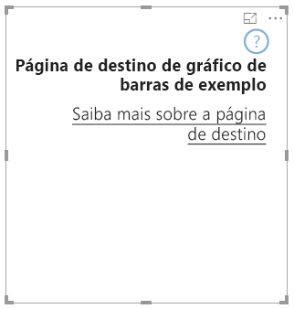

# <a name="landing-page"></a>Página de aterrissagem

Com a API 2.3.0, você pode adicionar uma página de aterrissagem ao seu visual. Para isso, adicione `supportsLandingPage` às funcionalidades e defina-o como verdadeiro, o que fará seu visual ser inicializado e atualizado mesmo antes de adicionar dados a ele (o que significa que ele não mostrará mais uma marca-d'água) para que você possa projetar o seu na página de aterrissagem para mostrar no Visual, contanto que ele não contenha dados.

```typescript
export class BarChart implements IVisual {
    //...
    private element: HTMLElement;
    private isLandingPageOn: boolean;
    private LandingPageRemoved: boolean;
    private LandingPage: d3.Selection<any>;

    constructor(options: VisualConstructorOptions) {
            //...
            this.element = options.element;
            //...
    }

    public update(options: VisualUpdateOptions) {
    //...
        this.HandleLandingPage(options);
    }

    private HandleLandingPage(options: VisualUpdateOptions) {
        if(!options.dataViews || !options.dataViews.length) {
            if(!this.isLandingPageOn) {
                this.isLandingPageOn = true;
                const SampleLandingPage: Element = this.createSampleLandingPage(); //create a landing page
                this.element.appendChild(SampleLandingPage);
                this.LandingPage = d3.select(SampleLandingPage);
            }

        } else {
                if(this.isLandingPageOn && !this.LandingPageRemoved){
                    this.LandingPageRemoved = true;
                    this.LandingPage.remove();
                }
        }
    }
```

Exemplo


