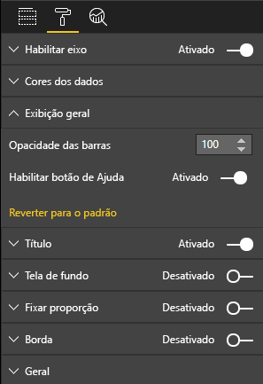

# <a name="create-a-launch-url"></a>Criar uma URL de inicialização

Ao criar uma URL de inicialização, você pode abrir uma nova guia (ou janela) do navegador delegando o trabalho real ao Power BI.

## <a name="sample"></a>Exemplo

```typescript
   this.host.launchUrl('https://powerbi.microsoft.com');
```

## <a name="usage"></a>Uso

Use a chamada à API `host.launchUrl()` passando a URL de destino como um argumento de cadeia de caracteres:

```typescript
this.host.launchUrl('http://some.link.net');
```

## <a name="restrictions"></a>Restrições

* Use apenas caminhos absolutos, não relativos. Por exemplo, use um caminho absoluto, como `http://some.link.net/subfolder/page.html`. O caminho relativo,`/page.html`, não será aberto.

* No momento, há suporte apenas para os protocolos *HTTP* e *HTTPS*. Evite *FTP*, *MAILTO* e assim por diante.

## <a name="best-practices"></a>Práticas recomendadas

* Geralmente, é melhor abrir apenas um link como resposta à ação explícita de um usuário. Facilite para o usuário entender que clicar no link ou no botão resultará na abertura de uma nova guia. Disparar uma chamada `launchUrl()` sem uma ação do usuário ou como um efeito colateral de uma ação diferente pode ser confuso ou frustrante para o usuário.

* Se o link não for crucial para o funcionamento correto do visual, recomendamos fornecer ao autor do relatório uma maneira de desabilitar e ocultar o link. Essa recomendação é especialmente relevante para casos especiais de uso do Power BI, como inserir um relatório em um aplicativo de terceiros ou publicá-lo na Web.

* Evite disparar uma chamada `launchUrl()` de dentro de um loop, da função `update` do visual ou de qualquer outro código recorrente com frequência.

## <a name="a-step-by-step-example"></a>Um exemplo passo a passo

### <a name="add-a-link-launching-element"></a>Adicionar um elemento de inicialização de link

As linhas a seguir foram adicionadas à função `constructor` do visual:

```typescript
    this.helpLinkElement = this.createHelpLinkElement();
    options.element.appendChild(this.helpLinkElement);
```

Uma função particular que cria e anexa o elemento de âncora foi adicionada:

```typescript
private createHelpLinkElement(): Element {
    let linkElement = document.createElement("a");
    linkElement.textContent = "?";
    linkElement.setAttribute("title", "Open documentation");
    linkElement.setAttribute("class", "helpLink");
    linkElement.addEventListener("click", () => {
        this.host.launchUrl("https://docs.microsoft.com/power-bi/developer/visuals/custom-visual-develop-tutorial");
    });
    return linkElement;
};
```

Por fim, uma entrada no arquivo *visual.less* define o estilo para o elemento link:

```less
.helpLink {
    position: absolute;
    top: 0px;
    right: 12px;
    display: block;
    width: 20px;
    height: 20px;
    border: 2px solid #80B0E0;
    border-radius: 20px;
    color: #80B0E0;
    text-align: center;
    font-size: 16px;
    line-height: 20px;
    background-color: #FFFFFF;
    transition: all 900ms ease;

    &:hover {
        background-color: #DDEEFF;
        color: #5080B0;
        border-color: #5080B0;
        transition: all 250ms ease;
    }

    &.hidden {
        display: none;
    }
}
```

### <a name="add-a-toggling-mechanism"></a>Adicionar um mecanismo de alternância

Para adicionar um mecanismo de alternância, você precisa adicionar um objeto estático para que o autor do relatório possa alternar a visibilidade do elemento de link. (O padrão é definido como *oculto*.) Para obter mais informações, confira o [tutorial objeto estático](https://microsoft.github.io/PowerBI-visuals/docs/concepts/objects-and-properties).

Um objeto estático booliano `showHelpLink` foi adicionado à entrada de objetos do arquivo *capabilities.json*, conforme mostrado no código a seguir:

```typescript
"objects": {
    "generalView": {
            "displayName": "General View",
            "properties":
                "showHelpLink": {
                    "displayName": "Show Help Button",
                    "type": {
                        "bool": true
                    }
                }
            }
        }
    }
```



E, na função `update` do visual, as seguintes linhas foram adicionadas:

```typescript
if (settings.generalView.showHelpLink) {
    this.helpLinkElement.classList.remove("hidden");
} else {
    this.helpLinkElement.classList.add("hidden");
}
```

A classe *oculto* é definida no arquivo *visual.less* para controlar a exibição do elemento.
