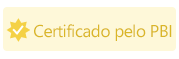

# Certificar um visual do Power BI

Os visuais certificados do Power BI são visuais do Power BI na [AppSource](https://appsource.microsoft.com/en-us/marketplace/apps?page=1&product=power-bi-visuals) que atendem aos [requisitos de código](#certification-requirements) da equipe do Microsoft Power BI. Esses visuais são testados para confirmar que não acessam serviços ou recursos externos, e que seguem diretrizes e padrões de codificação seguros.

Depois que um visual do Power BI é certificado, ele oferece mais recursos. Por exemplo, você pode [exportar para o PowerPoint](../../consumer/end-user-powerpoint.md) ou exibir o visual em emails recebidos quando um usuário [assina páginas do relatório](../../consumer/end-user-subscribe.md).

O processo de certificação é opcional. Os visuais do Power BI que não são certificados não são necessariamente inseguros. Alguns visuais do Power BI não são certificados por não atenderem a um ou mais dos [requisitos de certificação](power-bi-custom-visuals-certified.md#certification-requirements). Por exemplo, um visual do mapa do Power BI que se conecta a um serviço externo ou um visual do Power BI que usa bibliotecas comerciais.

> [!NOTE]
> A Microsoft não é a autora de visuais do Power BI de terceiros. Entre em contato diretamente com o autor para verificar a funcionalidade dos visuais de terceiros.

## Requisitos de certificação

Para [certificar](#get-a-power-bi-visual-certified) seu visual do Power BI, ele deverá estar em conformidade com os requisitos listados nesta seção. 

### Requisitos gerais

Seu visual do Power BI precisa ser aprovado pelo Partner Center. Recomendamos que o seu visual do Power BI já esteja na [AppSource](https://appsource.microsoft.com/marketplace/apps?page=1&product=power-bi-visuals). Veja como publicar um visual do Power BI na AppSource em [Publicar visuais do Power BI no Partner Center](office-store.md).

Antes de enviar o seu visual do Power BI para certificação, verifique se ele está em conformidade com as [diretrizes para visuais do Power BI](guidelines-powerbi-visuals.md).

Ao enviar o visual do Power BI, certifique-se de que o pacote compilado corresponda exatamente ao pacote enviado.

### Requisitos do repositório de códigos

Embora não seja necessário compartilhar publicamente seu código no GitHub, o repositório de códigos deverá estar disponível para análise da equipe do Power BI. A melhor maneira de fazer isso é fornecendo o código-fonte (JavaScript ou TypeScript) no GitHub.

O repositório deve conter o seguinte:
* Código para apenas um visual do Power BI. Ele não pode conter o código de vários visuais do Power BI nem de códigos não relacionados.
* Um branch chamado **certification** (é necessário que esteja em letras minúsculas). O código-fonte nessa ramificação deve corresponder ao pacote enviado. Esse código só poderá ser atualizado durante o próximo processo de envio, se você estiver reenviando seu visual do Power BI.

Se seu visual do Power BI usar pacotes npm privados ou submódulos git, você deverá fornecer acesso aos repositórios adicionais que contêm esse código.

Para entender como é a aparência de um repositório do visual do Power BI, examine o [gráfico de barras de exemplo de visuais do Power BI](https://github.com/microsoft/PowerBI-visuals-sampleBarChart) no repositório GitHub.

### Requisitos de arquivo

Use a versão mais recente da API para gravar o visual do Power BI.

O repositório deve incluir os seguintes arquivos:
* **.gitignore** – Adicione `node_modules`, `.tmp` e `dist` a este arquivo. O código não pode incluir as pastas *node_modules*, *.tmp* ou *dist*.
* **capabilities.json** – se estiver enviando uma versão mais recente do seu visual do Power BI com alterações nas propriedades desse arquivo, verifique se elas não interrompem relatórios para os usuários existentes.
* **pbiviz.json** 
* **package.json**. O visual deve ter os seguintes pacotes instalados:
   * ["tslint"](https://www.npmjs.com/package/tslint) – Versão 5.18.0 ou superior
   * ["typescript"](https://www.npmjs.com/package/typescript) – Versão 3.0.0 ou superior
   * ["tslint-microsoftcontrib"](https://www.npmjs.com/package/tslint-microsoft-contrib) – Versão 6.2.0 ou superior
   * O arquivo deve conter um comando para a execução do linter – `"lint": "tslint -c tslint.json -p tsconfig.json"`
* **package-lock.json**
* **tsconfig.json**

### Requisitos de comando

Os comandos a seguir não devem retornar erros.

* `npm install`
* `pbiviz package`
* `npm audit` – não deve retornar qualquer aviso de nível alto ou moderado.
* [TSlint da Microsoft](https://www.npmjs.com/package/tslint-microsoft-contrib) com [as configurações necessárias](https://github.com/microsoft/PowerBI-visuals-sampleBarChart/blob/master/tslint.json). Esse comando não deve retornar erros de lint.

### Requisitos de compilação

Use a versão mais recente do [powerbi-visuals-tools](https://www.npmjs.com/package/powerbi-visuals-tools) para gravar o visual do Power BI.

O visual do Power BI deve ser compilado com `pbiviz package`. Se estiver usando seus próprios scripts de compilação, forneça um comando personalizado de compilação `npm run package`.

### Requisitos do código-fonte

Verifique se está seguindo a lista de políticas de [certificação adicional de visuais do Power BI](https://docs.microsoft.com/legal/marketplace/certification-policies#1200-power-bi-visuals-additional-certification). Se o envio não seguir essas diretrizes, o email de rejeição do Partner Center incluirá os números da política listados nesse link.

Siga os requisitos de código listados abaixo para garantir que seu código esteja alinhado com as políticas de certificação do Power BI.  

**Necessário**
* Use apenas componentes públicos OSS analisáveis, como bibliotecas JavaScript ou TypeScript públicas.
* O código deve ser compatível com a [API de Renderização de Eventos](event-service.md).
* Verifique se o DOM é manipulado com segurança. Use a limpeza para os dados do usuário ou a entrada do usuário, antes de adicioná-lo ao DOM.
* Use o [relatório de exemplo](https://github.com/Microsoft/PowerBI-visuals/raw/gh-pages/assets/reports/large_data.pbix) como um conjunto de dados de teste.

**Não permitido**
* Acesso a serviços ou recursos externos. Por exemplo, nenhuma solicitação HTTP/S ou WebSocket pode sair do Power BI para outros serviços.
* Uso de `innerHTML` ou `D3.html(user data or user input)`.
* Erros ou exceções de JavaScript no console do navegador para os dados de entrada.
* Código arbitrário ou dinâmico, como `eval()`, uso inseguro de `settimeout()`, `requestAnimationFrame()`, `setinterval(user input function)` e entrada do usuário ou dados do usuário.
* Arquivos ou projetos reduzidos do JavaScript.

## Enviar um visual do Power BI para certificação

Você pode solicitar que seu visual do Power BI seja certificado pela equipe do Power BI por meio do Partner Center.

>[!TIP]
>O processo de certificação do Power BI pode demorar um pouco. Se você estiver criando um novo visual do Power BI, recomendamos que o publique por meio do Partner Center antes de solicitar a certificação do Power BI. Isso garante que a publicação do visual não seja adiada.

Para solicitar a certificação do Power BI:

1. Conecte-se ao Partner Center.
2. Na **página Visão Geral**, escolha seu visual do Power BI e vá para a página de configuração do **Produto**.
3. Marque a caixa de seleção **Solicitar a certificação do Power BI**.
4. Na página **Revisar e publicar**, na caixa de texto **Notas para certificação**, forneça um link para o código-fonte e as credenciais necessárias para acessá-lo.

### Processo de envio de repositório particular

Se você estiver usando um repositório particular, como o GitHub, para enviar seu visual do Power BI para certificação, siga as instruções nesta seção.
1. Crie uma nova conta para a equipe de validação.
2. Configure a [autenticação de dois fatores](https://help.github.com/github/authenticating-to-github/securing-your-account-with-two-factor-authentication-2fa) para a sua conta.
3. [Gere um novo conjunto de códigos de recuperação](https://help.github.com/github/authenticating-to-github/configuring-two-factor-authentication-recovery-methods#generating-a-new-set-of-recovery-codes).
4. Ao enviar o visual do Power BI, forneça o seguinte:
    * Um link para o repositório
    * Credenciais de logon (incluindo uma senha)
    * Códigos de recuperação
    * Permissões somente de leitura para nossa conta ([pbicvsupport](https://github.com/pbicvsupport))

## Selos de visuais certificados do Power BI

Quando um visual do Power BI é certificado, ele recebe um selo que indica a certificação.

### Visuais certificados do Power BI no AppSource

* Ao pesquisar online por [visuais do Power BI no AppSource](https://appsource.microsoft.com/marketplace/apps?product=power-bi-visuals), um pequeno selo amarelo no cartão do visual indicará que se trata de um visual certificado do Power BI.

    

* Quando você clica no cartão do visual do Power BI, no AppSource, um selo amarelo chamado *Certificado pelo Power BI* indica que este visual é certificado.

    

### Visuais certificados do Power BI na interface do Power BI

* Ao importar um visual do Power BI, de dentro do Power BI (área de trabalho ou serviço), um selo azul indicará que este visual é certificado.

    

* Para exibir somente visuais certificados do Power BI, selecione a opção de filtro *Certificado pelo Power BI*.

## Próximas etapas

* Se você for desenvolvedor da Web e tiver interesse em criar seus próprios visuais do Power BI e adicioná-los ao  [Microsoft AppSource](https://appsource.microsoft.com), comece pelo tutorial  [Desenvolver um visual do Power BI](custom-visual-develop-tutorial.md).

* Para obter mais informações sobre visuais, acesse [Perguntas frequentes sobre visuais certificados](power-bi-custom-visuals-faq.md#certified-power-bi-visuals).

* [Como desenvolver visuais no Power BI](custom-visual-develop-tutorial.md)

* [Playlist de visuais do Power BI da Microsoft no YouTube](https://www.youtube.com/playlist?list=PL1N57mwBHtN1vIjfvuBIzZllrmKo-Vz6x)

* [Visuais no Power BI](power-bi-custom-visuals.md)

* [Publicar visuais do Power BI no Microsoft AppSource](office-store.md)

* Mais perguntas? [Experimente a Comunidade do Power BI](https://community.powerbi.com/)