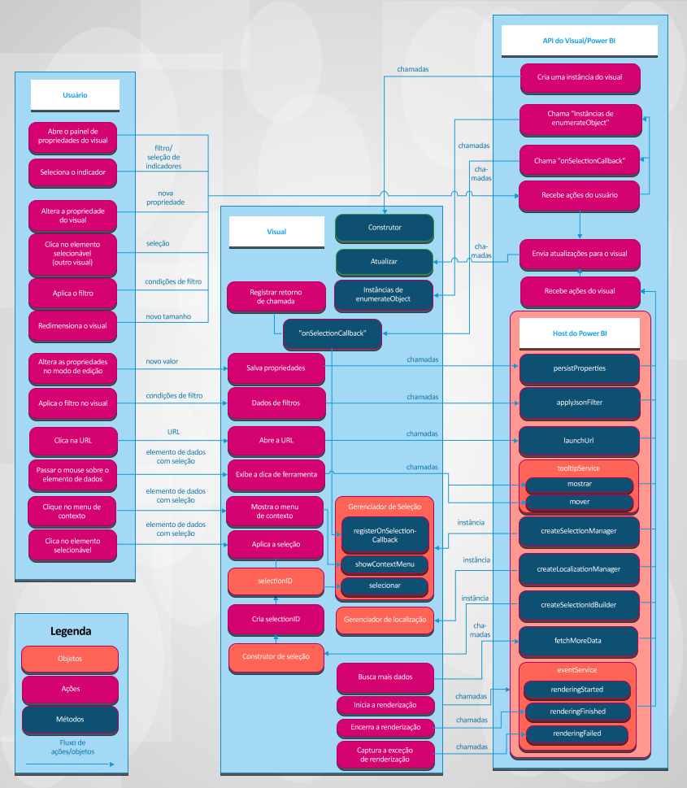

# Visuais no Power BI

O artigo descreve como os visuais se integram ao Power BI e como um usuário pode interagir com um visual no Power BI. 

A figura a seguir descreve como são processadas no Power BI as ações comuns baseadas em visuais que um usuário executa, como selecionar um indicador.

## Os visuais obtêm atualizações do Power BI

Um visual chama o método `update` para receber atualizações do Power BI. O método `update` geralmente contém a lógica principal do visual e é responsável pela renderização do gráfico ou pela visualização dos dados.

As atualizações são disparadas quando o visual chama o método `update`.

## Padrões de ações e atualizações

As ações e atualizações subsequentes nos visuais do Power BI ocorrem em um destes três padrões:

* O usuário interage com um visual por meio do Power BI.
* O usuário interage diretamente com o visual.
* O visual interage com o Power BI.

### O usuário interage com um visual por meio do Power BI

* O usuário abre o painel de propriedades do visual.

    Quando um usuário abre o painel de propriedades do visual, o Power BI busca objetos e propriedades com suporte no arquivo *capabilities.json* do visual. Para receber os valores reais de propriedades, o Power BI chama o método `enumerateObjectInstances` do visual. O visual retorna os valores reais das propriedades.

    Saiba mais em [Funcionalidades e propriedades de visuais do Power BI](capabilities.md).

* O usuário [altera uma propriedade do visual](../../visuals/power-bi-visualization-customize-title-background-and-legend.md) no painel de formato.

    Quando um usuário altera o valor de uma propriedade no painel de formato, o Power BI chama o método `update` do visual. O Power BI passa o novo objeto `options` para o método `update`. Os objetos contêm os novos valores.

    Para obter mais informações, confira [Objetos e propriedades de visuais do Power BI](objects-properties.md).

* O usuário redimensiona o visual.

    Quando um usuário altera um tamanho de um visual, o Power BI chama o método `update` com o novo objeto `options`. Os objetos `options` têm objetos `viewport` aninhados que contêm a nova largura e altura do visual.

* O usuário aplica o filtro no relatório, página ou nível do visual.

    O Power BI filtra os dados com base nas condições do filtro. O Power BI chama o método `update` do visual para atualizar o visual com novos dados.

    O visual obtém uma nova atualização dos objetos `options` quando há novos dados em um dos objetos aninhados. Como a atualização ocorrerá depende da configuração de mapeamento de exibição de dados do visual.

    Para obter mais informações, confira [Entender o mapeamento de exibição de dados em visuais do Power BI](dataview-mappings.md).

* O usuário seleciona um ponto de dados em outro visual do relatório.

    Quando um usuário seleciona um ponto de dados em outro visual do relatório, o Power BI filtra ou realça os pontos de dados selecionados e chama o método `update` do visual. O visual obtém novos dados filtrados ou os mesmos dados com a matriz dos destaques.

    Para obter mais informações, confira [Realçar pontos de dados em visuais do Power BI](highlight.md).

* O usuário seleciona um indicador no painel de indicadores do relatório.

    Quando um usuário seleciona um indicador no painel de indicadores do relatório, uma das duas ações pode ocorrer:

    * O Power BI chama uma função que é passada e registrada pelo método `registerOnSelectionCallback`. A função de retorno de chamada obtém matrizes de seleções para o indicador correspondente.

    * O Power BI chama o método `update` com um objeto `filter` correspondente dentro do objeto `options`.

    Em ambos os casos, o visual deve alterar seu estado de acordo com as seleções recebidas ou com o objeto `filter`.

    Para saber mais sobre indicadores e filtros, confira a [API de Filtros Visuais em visuais do Power BI](filter-api.md).

### O usuário interage diretamente com o visual

* Um usuário passa o mouse sobre um elemento de dados.

    O visual pode exibir mais informações sobre o ponto de dados por meio da API de Dicas de Ferramentas do Power BI. Quando um usuário passa o mouse sobre um elemento visual, o visual pode manipular o evento e exibir dados sobre o elemento ToolTip associado. O visual pode exibir a dica de ferramenta padrão ou a dica de ferramenta da página do relatório.

    Para saber mais, confira [Dicas de Ferramentas no Power BI](add-tooltips.md).

* Um usuário altera as propriedades do visual. Por exemplo, o usuário expande a árvore e o visual salva o estado nas propriedades.

    O visual pode salvar os valores das propriedades por meio da API do Power BI. Por exemplo, quando um usuário interage com o visual, que precisa salvar ou atualizar valores de propriedades, o visual pode chamar o método `presistProperties`.

* O usuário seleciona uma URL.

    Por padrão, um visual não pode abrir diretamente uma URL. Em vez disso, para abrir uma URL em uma nova guia, o visual pode chamar o método `launchUrl` e passar a URL como um parâmetro.

    Saiba mais em [Criar uma URL de inicialização](launch-url.md).

* Um usuário aplica um filtro por meio do visual.

    Um visual pode chamar o método `applyJsonFilter` e passar as condições para filtrar dados em outros visuais. Vários tipos de filtros estão disponíveis, incluindo filtros básicos, avançados e de tupla.

    Saiba mais em [API de Filtros Visuais em visuais do Power BI](filter-api.md).

* Um usuário seleciona elementos no visual.

    Saiba mais sobre seleções em visuais do Power BI em [Adicionar interatividade usando as seleções de visual do Power BI](selection-api.md).

### O visual interage com o Power BI

* O visual solicita mais dados do Power BI.

    O visual processa os dados por partes. O método `fetchMoreData` da API solicita o próximo fragmento do conjunto de dados.

    Saiba mais em [Buscar mais dados do Power BI](fetch-more-data.md).

* O serviço de evento dispara.

    O Power BI pode exportar um relatório para PDF ou enviar um relatório por email (aplica-se somente a visuais certificados). Para notificar o Power BI de que a renderização foi concluída e que o visual está pronto para ser capturado como PDF ou para email, o visual deve chamar a API de Renderização de Eventos.

    Saiba mais em [Exportar relatórios do Power BI para PDF](../../consumer/end-user-pdf.md).

    Para saber mais sobre o serviço de eventos, confira [Renderizar eventos em visuais do Power BI](event-service.md).

## Próximas etapas

Você está interessado em criar suas próprias visualizações e adicioná-las ao Microsoft AppSource? Consulte estes artigos:

* [Desenvolver um visual do Power BI](./custom-visual-develop-tutorial.md)
* [Publicar visuais do Power BI no Partner Center](office-store.md)
