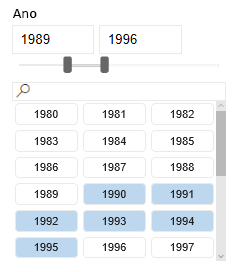
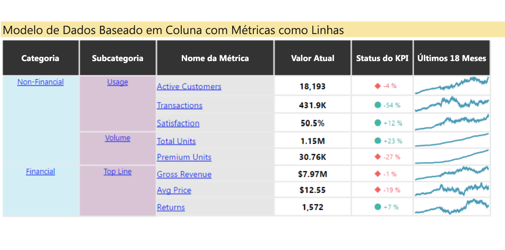
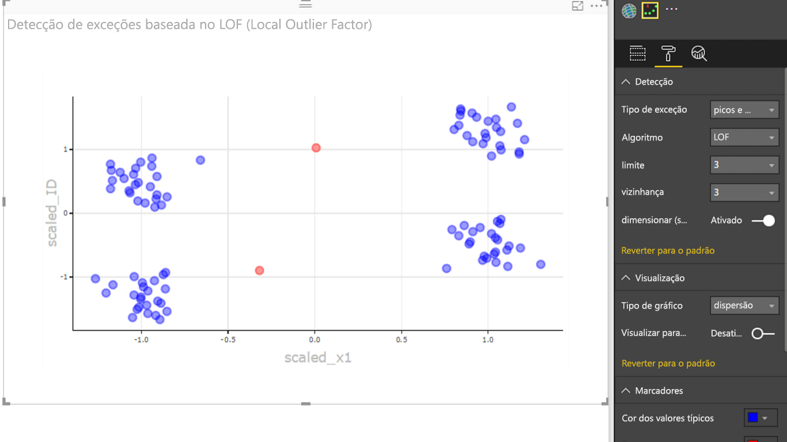

# Exemplos de visuais do Power BI

Você pode baixar, usar e modificar esses visuais do Power BI pelo GitHub. Esses exemplos ilustram como lidar com situações comuns ao desenvolver com Power BI.

## Segmentações

Uma segmentação restringe a parte dos dados que é mostrada nas outras visualizações de um relatório. As segmentações são uma das várias maneiras de filtrar dados no Power BI.

|   |  | |
| ------------- | ------------- | -------------|
| [Chiclet Slicer](https://github.com/Microsoft/powerbi-visuals-chicletslicer/)   Exibir botões de imagem ou de texto que agem como um filtro na tela nos outros visuais | [Segmentação da linha do tempo](https://github.com/Microsoft/powerbi-visuals-timeline/)  Seletor de intervalo de data gráfico que filtra por data | [Exemplo de segmentação](https://github.com/Microsoft/powerbi-visuals-sampleslicer/)  Demonstra o uso da API de Filtragem Avançada

## Gráficos

Inspire-se com nossa galeria, que inclui gráficos de barras, gráficos de pizza, Nuvem de Palavras e outros.

|   |  | |
| ------------- | ------------- | -------------|
| [Aster Plot](https://github.com/Microsoft/powerbi-visuals-asterplot/)   Uma curva em um gráfico de rosca padrão que usa um segundo valor para orientar o ângulo de flecha | [Bullet chart ](https://github.com/Microsoft/powerbi-visuals-bulletchart/)  Um gráfico de barras com elementos visuais adicionais que fornecem contexto útil para metas de controle | [Chord](https://github.com/Microsoft/powerbi-visuals-chord/)  Um método gráfico que exibe as relações entre os dados em uma matriz
|  | |  
| [Dot plot](https://github.com/Microsoft/powerbi-visuals-dotplot/)  Mostra a distribuição de frequências com uma apresentação excelente | [Dual KPI](https://github.com/Microsoft/powerbi-visuals-dualkpi/)  Visualiza com eficiência duas medidas ao longo do tempo, mostrando suas tendências em uma linha do tempo conjunta | [Enhanced Scatter](https://github.com/Microsoft/powerbi-visuals-enhancedscatter/)  Aprimoramentos no gráfico de dispersão existente
| | | 
| [Force Graph](https://github.com/Microsoft/powerbi-visuals-forcegraph/)  Diagrama de layout de forças com caminho curvado, o que é útil para mostrar conexões entre entidades | [Gantt](https://github.com/Microsoft/powerbi-visuals-gantt/)  Um gráfico de barras que ilustra uma linha do tempo ou um agendamento de projeto com recursos | [Table Heatmap](https://github.com/Microsoft/powerbi-visuals-heatmap/)  Compare dados de modo fácil e intuitivo usando cores em uma tabela
|  |  |  
| [Histogram chart](https://github.com/Microsoft/powerbi-visuals-histogram/)  Visualiza a distribuição de dados em um intervalo contínuo ou em um período determinado | [Gráfico LineDot](https://github.com/Microsoft/powerbi-visuals-linedotchart/)  Um gráfico de linhas animado com pontos animados que estimulam o envolvimento de um público com os dados | [Gráfico do Mekko](https://github.com/Microsoft/powerbi-visuals-mekkochart/)  Uma mistura de gráfico de colunas 100% empilhado e gráfico de barras 100% empilhado combinados em uma exibição
|  |  |  
| [Vários KPIs](https://github.com/microsoft/PowerBI-visuals-MultiKPI/)   Uma visualização de vários KPIs avançada com um KPI principal junto a vários minigráficos de dados de suporte | [Power KPI](https://github.com/microsoft/PowerBI-visuals-PowerKPI/)  Um eficiente Indicador de KPI com gráfico de várias linhas e rótulos para a data atual, o valor e as variações | [Power KPI Matrix](https://github.com/microsoft/PowerBI-visuals-PowerKPIMatrix/)  Monitore scorecards balanceados e um número ilimitado de métricas e KPIs em uma lista compacta e fácil de ler
| |  |  
| [Gráfico de pulso](https://github.com/Microsoft/powerbi-visuals-pulsechart/)  Esse gráfico de linhas anotado com eventos principais é perfeito para contar uma história usando dados| [Gráfico de radar](https://github.com/Microsoft/powerbi-visuals-radarchart/)  Apresente várias medidas plotadas ao longo de um eixo de categorias, o que é útil para comparar atributos | [Gráfico de Sankey](https://github.com/Microsoft/powerbi-visuals-sankey/)  Diagrama de fluxo no qual a largura da série é proporcional à quantidade do fluxo
|  | | 
| [Gráfico de fluxo](https://github.com/Microsoft/powerbi-visuals-streamgraph/)  Um gráfico de área empilhado com interpolação suave, geralmente usado para mostrar valores ao longo do tempo | [Sunburst chart](https://github.com/Microsoft/powerbi-visuals-sunburst/)  Gráfico de rosca de vários níveis para visualizar dados hierárquicos| [Tornado chart](https://github.com/Microsoft/powerbi-visuals-tornado/)  Compare a importância relativa de variáveis entre dois grupos
 | 
 | [Word Cloud](https://github.com/Microsoft/powerbi-visuals-wordcloud/)  Crie um visual divertido com o texto frequente em seus dados

## WebGL

O WebGL permite que o conteúdo da Web use uma API baseada no OpenGL ES 2.0 para fazer renderização 2D e 3D em uma tela HTML.

| |
| ------------- |
| [Globe Map](https://github.com/Microsoft/powerbi-visuals-globemap/)  Plotar locais em um mapa 3D interativo

## Visuais do R

Estes exemplos demonstram como aproveitar a capacidade analítica e visual de scripts e visuais R.

| | | |
|------------- |------------- |------------- |------------- |
| [Association rules](https://github.com/Microsoft/powerbi-visuals-assorules/)  Descobrir relações entre dados aparentemente não relacionados usando instruções if-then | [Clustering](https://github.com/Microsoft/powerbi-visuals-clustering-kmeans/)  Localize grupos de similaridade em seus dados usando o algoritmo k-means | [Clustering with outliers](https://github.com/microsoft/PowerBI-visuals-dbscan/)  Encontre grupos de semelhanças e exceções em seus dados
|  |  |  
| [Correlation plot](https://github.com/Microsoft/powerbi-visuals-corrplot/)  Realce as variáveis mais correlacionadas em uma tabela de dados | [Decision tree chart](https://github.com/Microsoft/powerbi-visuals-decision-tree/)  Diagrama esquemático em forma de árvore para determinar a probabilidade estatística usando particionamento recursivo | [Forecasting TBATS](https://github.com/Microsoft/powerbi-visuals-forcasting-tbats/)  Previsão de série temporal para séries que têm várias sazonalidades usando o modelo TBATS
|  |  |  
| [Forecasting with ARIMA](https://github.com/Microsoft/powerbi-visuals-forcastingarima/)  Preveja valores futuros com base em dados históricos usando a ARIMA (média de movimentação integrada de regressão automática) | [Funnel plot](https://github.com/Microsoft/powerbi-visuals-funnel/)  Localize exceções em seus dados usando um gráfico de funil | [Outliers detection](https://github.com/Microsoft/powerbi-visuals-outliers-det/)  Encontre exceções em seus dados usando o método e a plotagem mais apropriados
|  |  | 
| [Spline chart](https://github.com/Microsoft/powerbi-visuals-spline/)  Visualize e compreenda dados confusos | [Time series decomposition chart](https://github.com/Microsoft/powerbi-visuals-timeseriesdecomposition/)  Entenda os componentes da série temporal usando "Decomposição de tendência e sazonal usando perdas" | [Time series forecasting chart](https://github.com/Microsoft/powerbi-visuals-forcasting-exp/)  Usando um modelo de suavização exponencial para prever valores futuros com base em valores observados anteriormente

## Próximas etapas

Para experimentar a criação de visuais do Power BI, confira [Tutorial: Como desenvolver um visual no Power BI](custom-visual-develop-tutorial.md).
