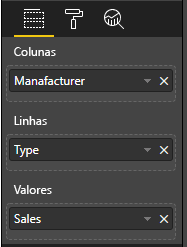

# <a name="add-interactivity-into-visual-by-power-bi-visuals-selections"></a>Adicione interatividade ao visual pelas seleções de visuais do Power BI

O Power BI oferece duas maneiras de interação entre visuais: seleção e filtragem. A amostra abaixo demonstra como selecionar itens em um visual e notificar outros visuais no relatório sobre o novo estado da seleção.

O objeto `Selection` corresponde à interface:

```typescript
export interface ISelectionId {
    equals(other: ISelectionId): boolean;
    includes(other: ISelectionId, ignoreHighlight?: boolean): boolean;
    getKey(): string;
    getSelector(): Selector;
    getSelectorsByColumn(): SelectorsByColumn;
    hasIdentity(): boolean;
}
```

## <a name="how-to-use-selectionmanager-to-select-data-points"></a>Como usar o SelectionManager para selecionar pontos de dados

O objeto de host do visual fornece um método para criar a instância do gerenciador de seleção. O gerenciador de seleção responsável por selecionar, limpar a seleção, mostrar o menu de contexto, armazenar as seleções atuais e verificar o estado da seleção. E o gerenciador de seleção possui métodos correspondentes para essas ações.

### <a name="create-instance-of-selection-manager"></a>Criar instância do gerenciador de seleção

Para usar o gerenciador de seleção, você precisa criar a instância do gerenciador de seleção. Geralmente, os visuais criam uma instância do gerenciador de seleção em `constructor` do objeto visual.

```typescript
export class Visual implements IVisual {
    private target: HTMLElement;
    private host: IVisualHost;
    private selectionManager: ISelectionManager;
    // ...
    constructor(options: VisualConstructorOptions) {
        this.host = options.host;
        // ...
        this.selectionManager = this.host.createSelectionManager();
    }
    // ...
}
```

### <a name="create-instance-of-selection-builder"></a>Criar instância do construtor de seleção

Quando a instância do gerenciador de seleção é criada, você precisa criar `selections` para cada ponto de dados do visual. O objeto de host do visual fornece o método `createSelectionIdBuilder` para gerar seleção para cada ponto de dados. Esse método retorna a instância do objeto com a interface `powerbi.visuals.ISelectionIdBuilder`:

```typescript
export interface ISelectionIdBuilder {
    withCategory(categoryColumn: DataViewCategoryColumn, index: number): this;
    withSeries(seriesColumn: DataViewValueColumns, valueColumn: DataViewValueColumn | DataViewValueColumnGroup): this;
    withMeasure(measureId: string): this;
    withMatrixNode(matrixNode: DataViewMatrixNode, levels: DataViewHierarchyLevel[]): this;
    withTable(table: DataViewTable, rowIndex: number): this;
    createSelectionId(): ISelectionId;
}
```

Esse objeto possui métodos correspondentes para criar `selections` para diferentes tipos de mapeamentos de exibição de dados.

> [!NOTE]
> Os métodos `withTable`, `withMatrixNode` foram introduzidos na API 2.5.0 dos visuais do Power BI.
> Se você precisar usar seleções para mapeamentos de exibição de dados de tabela ou matriz, precisará atualizar a versão da API para 2.5.0 ou superior.

### <a name="create-selections-for-categorical-data-view-mapping"></a>Criar seleções para o mapeamento da exibição de dados categóricos

Vamos revisar como as seleções são representadas no mapeamento de exibição de dados categóricos para o conjunto de dados de amostra:

| Fabricante | Tipo | Valor |
| - | - | - |
| Chrysler | Carro nacional | 28883 |
| Chrysler | Caminhonete nacional | 117131 |
| Chrysler | Carro importado | 0 |
| Chrysler | Caminhonete importada | 6362 |
| Ford | Carro nacional | 50032 |
| Ford | Caminhonete nacional | 122446 |
| Ford | Carro importado | 0 |
| Ford | Caminhonete importada | 0 |
| GM | Carro nacional | 65426 |
| GM | Caminhonete nacional | 138122 |
| GM | Carro importado | 197 |
| GM | Caminhonete importada | 0 |
| Honda | Carro nacional | 51450 |
| Honda | Caminhonete nacional | 46115 |
| Honda | Carro importado | 2932 |
| Honda | Caminhonete importada | 0 |
| Nissan | Carro nacional | 51476 |
| Nissan | Caminhonete nacional | 47343 |
| Nissan | Carro importado | 5485 |
| Nissan | Caminhonete importada | 1430 |
| Toyota | Carro nacional | 55643 |
| Toyota | Caminhonete nacional | 61227 |
| Toyota | Carro importado | 20799 |
| Toyota | Caminhonete importada | 23614 |

E o elemento visual usa o seguinte mapeamento de exibição de dados:

```json
{
    "dataRoles": [
        {
            "displayName": "Columns",
            "name": "columns",
            "kind": "Grouping"
        },
        {
            "displayName": "Rows",
            "name": "rows",
            "kind": "Grouping"
        },
        {
            "displayName": "Values",
            "name": "values",
            "kind": "Measure"
        }
    ],
    "dataViewMappings": [
        {
            "categorical": {
                "categories": {
                    "for": {
                        "in": "columns"
                    }
                },
                "values": {
                    "group": {
                        "by": "rows",
                        "select": [
                            {
                                "for": {
                                    "in": "values"
                                }
                            }
                        ]
                    }
                }
            }
        }
    ]
}
```

No exemplo, `Manafacturer` é `columns` e `Type` é `rows`. Há uma série criada por valores de agrupamentos por `rows` (`Type`).

E o elemento visual deve ser capaz de dividir dados por `Manafacturer` e `Type` também.

Por exemplo, quando o usuário seleciona `Chrysler` por `Manafacturer`, outros elementos visuais devem mostrar os seguintes dados:

| Fabricante | Tipo | Valor |
| - | - | - |
| **Chrysler** | Carro nacional | 28883 |
| **Chrysler** | Caminhonete nacional | 117131 |
| **Chrysler** | Carro importado | 0 |
| **Chrysler** | Caminhonete importada | 6362 |

Quando o usuário seleciona `Import Car` por `Type` (seleciona dados por série), outros elementos visuais devem mostrar os seguintes dados:

| Fabricante | Tipo | Valor |
| - | - | - |
| Chrysler | **Carro importado** | 0 |
| Ford | **Carro importado** | 0 |
| GM | **Carro importado** | 197 |
| Honda | **Carro importado** | 2932 |
| Nissan | **Carro importado** | 5485 |
| Toyota | **Carro importado** | 20799 |


É necessário preencher as cestas de dados de visuais.



Há `Manafacturer` como categoria (colunas), `Type` como série (linhas) e `Value` como `Values` para a série.

> [!NOTE]
> Os `Values` são necessários para séries, porque, de acordo com o mapeamento da exibição de dados, o visual espera que `Values` sejam agrupados pelos dados das `Rows`.

#### <a name="create-selections-for-categories"></a>Criar seleções para categorias

```typescript
// categories
const categories = dataView.categorical.categories;

// create label for 'Manafacturer' column
const p = document.createElement("p") as HTMLParagraphElement;
p.innerText = categories[0].source.displayName.toString();
this.target.appendChild(p);

// get count of category elements
const categoriesCount = categories[0].values.length;

// iterate all categories to generate selection and create button elements to use selections
for (let categoryIndex = 0; categoryIndex < categoriesCount; categoryIndex++) {
    const categoryValue: powerbi.PrimitiveValue = categories[0].values[categoryIndex];

    const categorySelectionId = this.host.createSelectionIdBuilder()
        .withCategory(categories[0], categoryIndex) // we have only one category (only one `Manafacturer` column)
        .createSelectionId();
    this.dataPoints.push({
        value: categoryValue,
        selection: categorySelectionId
    });
    console.log(categorySelectionId);

    // create button element to apply selection on click
    const button = document.createElement("button") as HTMLButtonElement;
    button.value = categoryValue.toString();
    button.innerText = categoryValue.toString();
    button.addEventListener("click", () => {
        // handle click event to apply correspond selection
        this.selectionManager.select(categorySelectionId);
    });
    this.target.appendChild(button);
}
```

No código de exemplo, você pode ver que iteramos todas as categorias. Em cada iteração, chamamos `createSelectionIdBuilder` para criar a próxima seleção para cada categoria chamando o método `withCategory` do construtor de seleção. O método `createSelectionId` é usado como um método final para retornar o objeto `selection` gerado.

No método `withCategory`, passamos a coluna de `category`, no exemplo, é `Manafacturer` e o índice do elemento da categoria.

#### <a name="create-selections-for-series"></a>Criar seleções para séries

```typescript
// get groupped values for series
const series: powerbi.DataViewValueColumnGroup[] = dataView.categorical.values.grouped();

// create label for 'Type' column
const p2 = document.createElement("p") as HTMLParagraphElement;
p2.innerText = dataView.categorical.values.source.displayName;
this.target.appendChild(p2);

// iterate all series to generate selection and create button elements to use selections
series.forEach( (ser: powerbi.DataViewValueColumnGroup) => {
    // create selection id for series
    const seriesSelectionId = this.host.createSelectionIdBuilder()
        .withSeries(dataView.categorical.values, ser)
        .createSelectionId();

    this.dataPoints.push({
        value: ser.name,
        selection: seriesSelectionId
    });

    // create button element to apply selection on click
    const button = document.createElement("button") as HTMLButtonElement;
    button.value =ser.name.toString();
    button.innerText = ser.name.toString();
    button.addEventListener("click", () => {
        // handle click event to apply correspond selection
        this.selectionManager.select(seriesSelectionId);
    });
    this.target.appendChild(button);
});
```

### <a name="create-selections-for-table-data-view-mapping"></a>Criar seleções para o mapeamento da exibição de dados da tabela

Exemplo de mapeamento de exibição de dados de tabela

```json
{
    "dataRoles": [
        {
            "displayName": "Values",
            "name": "values",
            "kind": "GroupingOrMeasure"
        }
    ],
    "dataViewMappings": [
        {
            "table": {
                "rows": {
                    "for": {
                        "in": "values"
                    }
                }
            }
        }
    ]
}
```

Para criar uma seleção para cada linha do mapeamento da visualização de dados da tabela, é necessário chamar o método `withTable` do construtor da seleção.

```typescript
public update(options: VisualUpdateOptions) {
    const dataView = options.dataViews[0];
    dataView.table.rows.forEach((row: DataViewTableRow, rowIndex: number) => {
        this.target.appendChild(rowDiv);
        const selection: ISelectionId = this.host.createSelectionIdBuilder()
            .withTable(dataView.table, rowIndex)
            .createSelectionId();
    }
}
```

O código do visual itera as linhas da tabela, e cada linha chama o método de tabela `withTable`. Os parâmetros do método `withTable` são objeto e índice `table` da linha da tabela.

### <a name="create-selections-for-matrix-data-view-mapping"></a>Criar seleções para o mapeamento da exibição de dados da matriz

```typescript
public update(options: VisualUpdateOptions) {
    const host = this.host;
    const rowLevels: powerbi.DataViewHierarchyLevel[] = dataView.matrix.rows.levels;
    const columnLevels: powerbi.DataViewHierarchyLevel[] = dataView.matrix.rows.levels;

    // iterate rows hierarchy
    nodeWalker(dataView.matrix.rows.root, rowLevels);
    // iterate columns hierarchy
    nodeWalker(dataView.matrix.columns.root, columnLevels);

    function nodeWalker(node: powerbi.DataViewMatrixNode, levels: powerbi.DataViewHierarchyLevel[]) {
        const nodeSelection = host.createSelectionIdBuilder().withMatrixNode(node, levels);

        if (node.children && node.children.length) {
            node.children.forEach(child => {
                nodeWalker(child, levels);
            });
        }
    }
}
```

Na amostra, `nodeWalker` chama recursivamente para cada nó e nós filhos.

O `nodeWalker` cria o objeto `nodeSelection` em cada chamada. E cada `nodeSelection` representa a `selection` de nós correspondentes.

## <a name="select-datapoints-to-slice-other-visuals"></a>Selecionar pontos de dados para segmentar outros visuais

Nos códigos de exemplo de seleções para o mapeamento da exibição de dados categóricos, você viu que criamos um manipulador de cliques para elementos de botão. O manipulador chama o método `select` do gerenciador de seleção e passa o objeto de seleção.

```typescript
button.addEventListener("click", () => {
    // handle click event to apply correspond selection
    this.selectionManager.select(categorySelectionId);
});
```

A interface do método `select` é

```typescript
interface ISelectionManager {
    // ...
    select(selectionId: ISelectionId | ISelectionId[], multiSelect?: boolean): IPromise<ISelectionId[]>;
    // ...
}
```

Você pode ver que `select` pode aceitar uma variedade de seleções. Isso significa que seu visual pode selecionar vários pontos de dados. O segundo parâmetro `multiSelect` responsável pela seleção múltipla. Se o valor for verdadeiro, o Power BI não limpará o estado de seleção anterior e aplicará a seleção atual; caso contrário, a seleção anterior será redefinida.

Cenário típico de uso de `multiSelect` no estado do botão CTRL no evento Clicar.

```typescript
button.addEventListener("click", (mouseEvent) => {
    const multiSelect = (mouseEvent as MouseEvent).ctrlKey;
    this.selectionManager.select(seriesSelectionId, multiSelect);
});
```

## <a name="next-steps"></a>Próximas etapas

* [Leia como usar seleções para associar propriedades de visuais a pontos de dados](objects-properties.md#objects-selector)

* [Leia como lidar com seleções na alternância de indicadores](bookmarks-support.md#visuals-with-selection)

* [Leia como adicionar o menu de contexto para pontos de dados de visuais](context-menu.md)

* [Leia como usar InteractivityUtils para adicionar seleções nos visuais do Power BI](utils-interactivity-selections.md)
