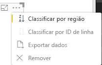

# <a name="sorting-options"></a>Opções de classificação

`Sorting` especifica o comportamento de classificação padrão para o Visual.
A funcionalidade requer um dos parâmetros descritos abaixo:

## <a name="default-sorting"></a>Classificação padrão

A opção `default` é a forma mais simples. Ela permite classificar os dados apresentados na seção 'DataMappings'.
Essa opção permite a classificação de 'DataMappings' pelo usuário e especificar a direção da classificação.

```json
    "sorting": {
        "default": {   }
    }
```



## <a name="implicit-sorting"></a>Classificação implícita

`implicit` está classificando com o parâmetro de matriz `clauses` – que descreve a classificação para cada função de dados.
`implicit` significa que o usuário do Visual não pode alterar a ordem de classificação.
O Power BI não exibirá opções de classificação no menu do Visual. No entanto, o Power BI classificará os dados de acordo com as configurações especificadas.

Parâmetros `clauses` podem conter vários objetos com dois parâmetros:

- `role` – determina `DataMapping` para classificação.

- `direction` – determina a direção da classificação (1 = crescente, 2 = decrescente).

```json
    "sorting": {
        "implicit": {
            "clauses": [
                {
                    "role": "category",
                    "direction": 1
                },
                {
                    "role": "measure",
                    "direction": 2
                }
            ]
        }
    }
```

## <a name="custom-sorting"></a>Classificação personalizada

`custom` significa que a classificação é gerenciada pelo desenvolvedor no código do Visual.
