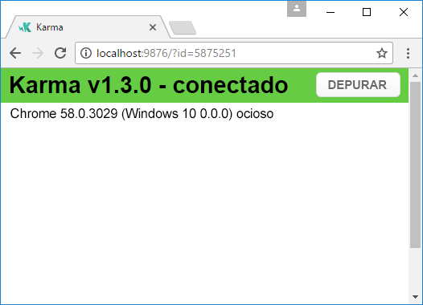
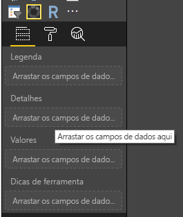
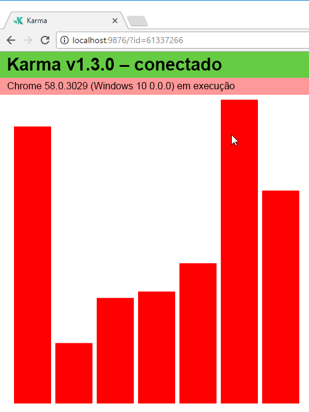
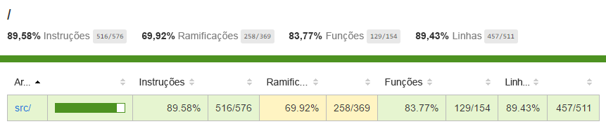
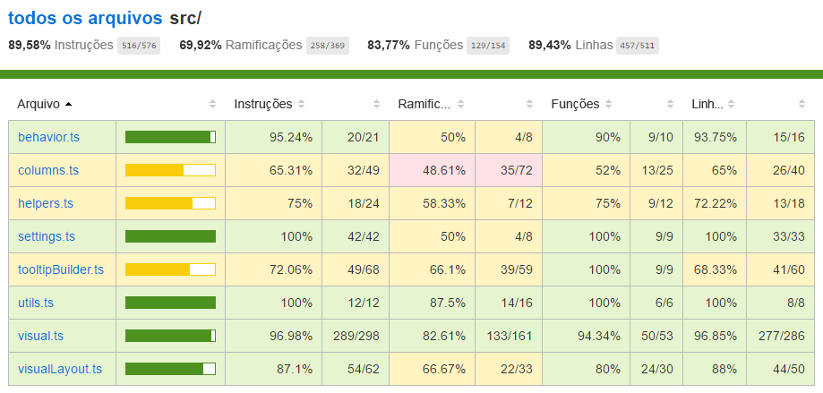

# <a name="tutorial-add-unit-tests-for-power-bi-visual-projects"></a>Tutorial: adicionar testes de unidade a projetos de visuais do Power BI

Este tutorial descreve noções básicas de como escrever testes de unidade para seus visuais do Power BI.

Neste tutorial, vamos considerar

* como usar o executor teste karma.js, testando a estrutura – jasmine.js
* como usar o pacote powerbi-visuals-utils-testutils
* como definir simulações e fakes ajuda a simplificar o teste de unidade para visuais do Power BI.

## <a name="prerequisites"></a>Pré-requisitos

* Você tem um projeto de visuais do Power BI
* Ambiente do Node.JS configurado

## <a name="install-and-configure-karmajs-and-jasmine"></a>Instalar e configurar o karma.js e o jasmine

Adicione as bibliotecas necessárias ao package.json na seção `devDependencies`:

```json
"@babel/polyfill": "^7.2.5",
"@types/d3": "5.5.0",
"@types/jasmine": "2.5.37",
"@types/jasmine-jquery": "1.5.28",
"@types/jquery": "2.0.41",
"@types/karma": "3.0.0",
"@types/lodash-es": "4.17.1",
"coveralls": "3.0.2",
"istanbul-instrumenter-loader": "^3.0.1",
"jasmine": "2.5.2",
"jasmine-core": "2.5.2",
"jasmine-jquery": "2.1.1",
"jquery": "3.1.1",
"karma": "3.1.1",
"karma-chrome-launcher": "2.2.0",
"karma-coverage": "1.1.2",
"karma-coverage-istanbul-reporter": "^2.0.4",
"karma-jasmine": "2.0.1",
"karma-junit-reporter": "^1.2.0",
"karma-sourcemap-loader": "^0.3.7",
"karma-typescript": "^3.0.13",
"karma-typescript-preprocessor": "0.4.0",
"karma-webpack": "3.0.5",
"puppeteer": "1.17.0",
"style-loader": "0.23.1",
"ts-loader": "5.3.0",
"ts-node": "7.0.1",
"tslint": "^5.12.0",
"webpack": "4.26.0"
```

Consulte a descrição abaixo para saber mais sobre o pacote.

Salve `package.json` e execute na linha de comando no local `package.json`:

```cmd
npm install
```

O gerenciador de pacotes instalará todos os novos pacotes adicionados ao `package.json`

Para executar testes de unidade, precisaremos configurar o executor de teste e a configuração `webpack`. O exemplo de configuração que você pode encontrar aqui

Exemplo de `test.webpack.config.js`:

```typescript
const path = require('path');
const webpack = require("webpack");

module.exports = {
    devtool: 'source-map',
    mode: 'development',
    optimization : {
        concatenateModules: false,
        minimize: false
    },
    module: {
        rules: [
            {
                test: /\.tsx?$/,
                use: 'ts-loader',
                exclude: /node_modules/
            },
            {
                test: /\.json$/,
                loader: 'json-loader'
            },
            {
                test: /\.tsx?$/i,
                enforce: 'post',
                include: /(src)/,
                exclude: /(node_modules|resources\/js\/vendor)/,
                loader: 'istanbul-instrumenter-loader',
                options: { esModules: true }
            },
            {
                test: /\.less$/,
                use: [
                    {
                        loader: 'style-loader'
                    },
                    {
                        loader: 'css-loader'
                    },
                    {
                        loader: 'less-loader',
                        options: {
                            paths: [path.resolve(__dirname, 'node_modules')]
                        }
                    }
                ]
            }
        ]
    },
    externals: {
        "powerbi-visuals-api": '{}'
    },
    resolve: {
        extensions: ['.tsx', '.ts', '.js', '.css']
    },
    output: {
        path: path.resolve(__dirname, ".tmp/test")
    },
    plugins: [
        new webpack.ProvidePlugin({
            'powerbi-visuals-api': null
        })
    ]
};
```

Exemplo de `karma.conf.ts`

```typescript
"use strict";

const webpackConfig = require("./test.webpack.config.js");
const tsconfig = require("./test.tsconfig.json");
const path = require("path");

const testRecursivePath = "test/visualTest.ts";
const srcOriginalRecursivePath = "src/**/*.ts";
const coverageFolder = "coverage";

process.env.CHROME_BIN = require("puppeteer").executablePath();

import { Config, ConfigOptions } from "karma";

module.exports = (config: Config) => {
    config.set(<ConfigOptions>{
        mode: "development",
        browserNoActivityTimeout: 100000,
        browsers: ["ChromeHeadless"], // or Chrome to use locally installed Chrome browser
        colors: true,
        frameworks: ["jasmine"],
        reporters: [
            "progress",
            "junit",
            "coverage-istanbul"
        ],
        junitReporter: {
            outputDir: path.join(__dirname, coverageFolder),
            outputFile: "TESTS-report.xml",
            useBrowserName: false
        },
        singleRun: true,
        plugins: [
            "karma-coverage",
            "karma-typescript",
            "karma-webpack",
            "karma-jasmine",
            "karma-sourcemap-loader",
            "karma-chrome-launcher",
            "karma-junit-reporter",
            "karma-coverage-istanbul-reporter"
        ],
        files: [
            "node_modules/jquery/dist/jquery.min.js",
            "node_modules/jasmine-jquery/lib/jasmine-jquery.js",
            {
                pattern: './capabilities.json',
                watched: false,
                served: true,
                included: false
            },
            testRecursivePath,
            {
                pattern: srcOriginalRecursivePath,
                included: false,
                served: true
            }
        ],
        preprocessors: {
            [testRecursivePath]: ["webpack", "coverage"]
        },
        typescriptPreprocessor: {
            options: tsconfig.compilerOptions
        },
        coverageIstanbulReporter: {
            reports: ["html", "lcovonly", "text-summary", "cobertura"],
            dir: path.join(__dirname, coverageFolder),
            'report-config': {
                html: {
                    subdir: 'html-report'
                }
            },
            combineBrowserReports: true,
            fixWebpackSourcePaths: true,
            verbose: false
        },
        coverageReporter: {
            dir: path.join(__dirname, coverageFolder),
            reporters: [
                // reporters not supporting the `file` property
                { type: 'html', subdir: 'html-report' },
                { type: 'lcov', subdir: 'lcov' },
                // reporters supporting the `file` property, use `subdir` to directly
                // output them in the `dir` directory
                { type: 'cobertura', subdir: '.', file: 'cobertura-coverage.xml' },
                { type: 'lcovonly', subdir: '.', file: 'report-lcovonly.txt' },
                { type: 'text-summary', subdir: '.', file: 'text-summary.txt' },
            ]
        },
        mime: {
            "text/x-typescript": ["ts", "tsx"]
        },
        webpack: webpackConfig,
        webpackMiddleware: {
            stats: "errors-only"
        }
    });
};
```

Você poderá modificar essa configuração se for necessário.

Algumas configurações de `karma.conf.js`:

* A variável `recursivePathToTests` localiza o lugar do código de testes.

* A variável `srcRecursivePath` localiza o código JS de saída após a compilação.

* A variável `srcCssRecursivePath` localiza o CSS de saída depois de compilar menos arquivo com estilos.

* A variável `srcOriginalRecursivePath` localiza o código-fonte do seu visual.

* `coverageFolder` – a variável determina um local em que o relatório de cobertura será criado.

Algumas propriedades da configuração:

* `singleRun: true` – execução de teste no sistema de CI. E é suficiente para uma única vez.
Você pode alterar para `false` para depurar seus testes. O karma continuará executando o navegador e permitirá que você use o console para depuração.

* `files: [...]` – nesta matriz, você pode definir arquivos para carregar no navegador.
Normalmente, há arquivos de origem, casos de teste, bibliotecas (utilitário de teste do jasmine). Você pode adicionar para listar outros arquivos, se necessário.

* `preprocessors` – essa seção de configuração configura ações, que são executadas antes da execução de testes de unidade. Há pré-compilação de typescript para JS e preparação de arquivos de source map e geração de relatório de cobertura de código. Você pode desabilitar `coverage` para depurar seus testes. A cobertura gera código adicional para verificar o código para a cobertura de teste e complicará os testes de depuração.

**A descrição de todas as configurações que você pode encontrar na [documentação](https://karma-runner.github.io/1.0/config/configuration-file.html) do karma.js**

Para uso conveniente, você pode adicionar o comando de teste em `scripts`:

```json
{
    "scripts": {
        "pbiviz": "pbiviz",
        "start": "pbiviz start",
        "typings":"node node_modules/typings/dist/bin.js i",
        "lint": "tslint -r \"node_modules/tslint-microsoft-contrib\"  \"+(src|test)/**/*.ts\"",
        "pretest": "pbiviz package --resources --no-minify --no-pbiviz --no-plugin",
        "test": "karma start"
    }
    ...
}
```

Portanto, você está pronto para começar a escrever seus testes de unidade.

## <a name="simple-unit-test-for-check-dom-element-of-the-visual"></a>Teste de unidade simples para verificar elemento DOM do visual

Para testar o visual, devemos criar uma instância do visual.

### <a name="creating-visual-instance-builder"></a>Criando o construtor de instâncias visuais

Adicione o arquivo `visualBuilder.ts` à pasta `test` com o próximo código:

```typescript
import {
    VisualBuilderBase
} from "powerbi-visuals-utils-testutils";

import {
    BarChart as VisualClass
} from "../src/visual";

import  powerbi from "powerbi-visuals-api";
import VisualConstructorOptions = powerbi.extensibility.visual.VisualConstructorOptions;

export class BarChartBuilder extends VisualBuilderBase<VisualClass> {
    constructor(width: number, height: number) {
        super(width, height);
    }

    protected build(options: VisualConstructorOptions) {
        return new VisualClass(options);
    }

    public get mainElement() {
        return this.element.children("svg.barChart");
    }
}
```

Há um método `build` para criar uma instância do seu visual. `mainElement` é um método Get, que retorna uma instância do elemento DOM de "raiz" em seu visual. O getter é opcional, mas facilita a gravação do teste de unidade.

Portanto, temos o construtor de uma instância do visual. Vamos escrever o caso de teste. Será um caso de teste para verificar os elementos SVG criados quando seu visual é exibido.

### <a name="creating-typescript-file-to-write-test-cases"></a>Como criar o arquivo typescript para escrever casos de teste

Adicione o arquivo `visualTest.ts` para casos de teste com estes códigos:

```typescript
import powerbi from "powerbi-visuals-api";

import { BarChartBuilder } from "./VisualBuilder";

import {
    BarChart as VisualClass
} from "../src/visual";

import VisualBuilder = powerbi.extensibility.visual.test.BarChartBuilder;

describe("BarChart", () => {
    let visualBuilder: VisualBuilder;
    let dataView: DataView;

    beforeEach(() => {
        visualBuilder = new VisualBuilder(500, 500);
    });

    it("root DOM element is created", () => {
        expect(visualBuilder.mainElement).toBeInDOM();
    });
});
```

Há uma chamada de vários métodos.

* O método [`describe`](https://jasmine.github.io/api/2.6/global.html#describe) descreve o caso de teste. Em um contexto da estrutura jasmine, geralmente chamado de conjunto ou grupo de especificações.

* O método `beforeEach` será chamado antes de cada chamada do método `it`, que foi definida dentro do método [`describe`](https://jasmine.github.io/api/2.6/global.html#beforeEach).

* `it` define uma única especificação. O método [`it`](https://jasmine.github.io/api/2.6/global.html#it) deve conter um ou mais `expectations`.

* [`expect`](https://jasmine.github.io/api/2.6/global.html#expect) – o método cria a expectativa para uma especificação. Uma especificação terá êxito se todas as expectativas forem aprovadas sem falhas.

* `toBeInDOM` – é um dos métodos de correspondência. Sobre os correspondentes existentes, você pode ler na [documentação](https://jasmine.github.io/api/2.6/matchers.html) da estrutura do jasmine.

**Leia mais sobre a estrutura do jasmine na [documentação](https://jasmine.github.io/) oficial.**

Depois disso, você pode executar o teste de unidade digitando um comando na ferramenta de linha de comando.

Esse teste verifica se o elemento SVG raiz dos visuais é criado.

### <a name="launch-unit-tests"></a>Iniciar testes de unidade

Para executar o teste de unidade, você pode digitar esse comando na ferramenta de linha de comando.

```cmd
npm run test
```

O `karma.js` executa o navegador Chrome e executará o caso de teste.



> [!NOTE]
> O Google Chrome precisa ser instalado localmente.

Na linha de comando, você obterá a seguinte saída:

```cmd
> karma start

23 05 2017 12:24:26.842:WARN [watcher]: Pattern "E:/WORKSPACE/PowerBI/PowerBI-visuals-sampleBarChart/data/*.csv" does not match any file.
23 05 2017 12:24:30.836:WARN [karma]: No captured browser, open http://localhost:9876/
23 05 2017 12:24:30.849:INFO [karma]: Karma v1.3.0 server started at http://localhost:9876/
23 05 2017 12:24:30.850:INFO [launcher]: Launching browser Chrome with unlimited concurrency
23 05 2017 12:24:31.059:INFO [launcher]: Starting browser Chrome
23 05 2017 12:24:33.160:INFO [Chrome 58.0.3029 (Windows 10 0.0.0)]: Connected on socket /#2meR6hjXFmsE_fjiAAAA with id 5875251
Chrome 58.0.3029 (Windows 10 0.0.0): Executed 1 of 1 SUCCESS (0.194 secs / 0.011 secs)

=============================== Coverage summary ===============================
Statements   : 27.43% ( 65/237 )
Branches     : 19.84% ( 25/126 )
Functions    : 43.86% ( 25/57 )
Lines        : 20.85% ( 44/211 )
================================================================================
```

### <a name="how-to-add-static-data-for-unit-tests"></a>Como adicionar dados estáticos para testes de unidade

Crie o arquivo `visualData.ts` na pasta `test`. Com estes códigos:

```typescript
import powerbi from "powerbi-visuals-api";
import DataView = powerbi.DataView;

import {
    testDataViewBuilder,
    getRandomNumbers
} from "powerbi-visuals-utils-testutils";

export class SampleBarChartDataBuilder extends TestDataViewBuilder {
    public static CategoryColumn: string = "category";
    public static MeasureColumn: string = "measure";

    public constructor() {
        super();
        ...
    }

    public getDataView(columnNames?: string[]): DataView {
        let dateView: any = this.createCategoricalDataViewBuilder([
            ...
        ],
        [
            ...
        ], columnNames).build();

        // there's client side computed maxValue
        let maxLocal = 0;
        this.valuesMeasure.forEach((item) => {
                if (item > maxLocal) {
                    maxLocal = item;
                }
        });
        (<any>dataView).categorical.values[0].maxLocal = maxLocal;
    }
}
```

A classe `SampleBarChartDataBuilder` estende `TestDataViewBuilder` e implementa o método abstrato `getDataView`.

Quando você coloca dados em buckets de campos de dados, o Power BI produz um objeto categórico `dataview` com base em seus dados.



Em testes de unidade, você não tem funções principais do Power BI para reproduzi-lo. Mas você precisa mapear seus dados estáticos para `dataview` categóricos. E a classe `TestDataViewBuilder` o ajudará.

[Leia mais sobre o DataViewMapping](https://github.com/Microsoft/PowerBI-visuals/blob/master/Capabilities/DataViewMappings.md)

No método `getDataView`, basta chamar o método `createCategoricalDataViewBuilder` com seus dados.

E, [capabilities.json](https://github.com/Microsoft/PowerBI-visuals-sampleBarChart/blob/master/capabilities.json#L2) do visual `sampleBarChart`, temos objetos dataRoles e dataViewMapping:

```json
"dataRoles": [
    {
        "displayName": "Category Data",
        "name": "category",
        "kind": "Grouping"
    },
    {
        "displayName": "Measure Data",
        "name": "measure",
        "kind": "Measure"
    }
],
"dataViewMappings": [
    {
        "conditions": [
            {
                "category": {
                    "max": 1
                },
                "measure": {
                    "max": 1
                }
            }
        ],
        "categorical": {
            "categories": {
                "for": {
                    "in": "category"
                }
            },
            "values": {
                "select": [
                    {
                        "bind": {
                            "to": "measure"
                        }
                    }
                ]
            }
        }
    }
],
```

Para gerar o mesmo mapeamento, você deve definir os seguintes parâmetros para o método `createCategoricalDataViewBuilder`:

```typescript
([
    {
        source: {
            displayName: "Category",
            queryName: SampleBarChartData.ColumnCategory,
            type: ValueType.fromDescriptor({ text: true }),
            roles: {
                Category: true
            },
        },
        values: this.valuesCategory
    }
],
[
    {
        source: {
            displayName: "Measure",
            isMeasure: true,
            queryName: SampleBarChartData.MeasureColumn,
            type: ValueType.fromDescriptor({ numeric: true }),
            roles: {
                Measure: true
            },
        },
        values: this.valuesMeasure
    },
], columnNames)
```

Em que a matriz `this.valuesCategory` de categorias.

```ts
public valuesCategory: string[] = ["Monday", "Tuesday", "Wednesday", "Thursday", "Friday", "Saturday", "Sunday"];
```

e a matriz de medida `this.valuesMeasure` para cada categoria. Exemplo:

```ts
public valuesMeasure: number[] = [742731.43, 162066.43, 283085.78, 300263.49, 376074.57, 814724.34, 570921.34];
```

Agora, você pode usar a classe `SampleBarChartDataBuilder` em seu teste de unidade.

A classe `ValueType` definida no pacote `powerbi-visuals-utils-testutils`. E o método `createCategoricalDataViewBuilder` requer a biblioteca `lodash`.

Adicione esses pacotes a dependências.

Em `package.json` na seção `devDependencies`

```json
"lodash-es": "4.17.1",
"powerbi-visuals-utils-testutils": "2.2.0"
```

Chame

```cmd
npm install
```

para instalar a biblioteca `lodash-es`.

Agora, você pode executar o teste de unidade novamente. Você deve obter essa saída

```cmd
> karma start

23 05 2017 16:19:54.318:WARN [watcher]: Pattern "E:/WORKSPACE/PowerBI/PowerBI-visuals-sampleBarChart/data/*.csv" does not match any file.
23 05 2017 16:19:58.333:WARN [karma]: No captured browser, open http://localhost:9876/
23 05 2017 16:19:58.346:INFO [karma]: Karma v1.3.0 server started at http://localhost:9876/
23 05 2017 16:19:58.346:INFO [launcher]: Launching browser Chrome with unlimited concurrency
23 05 2017 16:19:58.394:INFO [launcher]: Starting browser Chrome
23 05 2017 16:19:59.873:INFO [Chrome 58.0.3029 (Windows 10 0.0.0)]: Connected on socket /#NcNTAGH9hWfGMCuEAAAA with id 3551106
Chrome 58.0.3029 (Windows 10 0.0.0): Executed 1 of 1 SUCCESS (1.266 secs / 1.052 secs)

=============================== Coverage summary ===============================
Statements   : 56.72% ( 135/238 )
Branches     : 32.54% ( 41/126 )
Functions    : 66.67% ( 38/57 )
Lines        : 52.83% ( 112/212 )
================================================================================
```

E você deve ver o navegador Chrome iniciado com seu visual.



Aumente o resumo da cobertura de atenção. Abra `coverage\index.html` para saber mais sobre a cobertura de código atual



Ou no escopo da pasta `src`



No escopo do arquivo, você pode examinar o código-fonte. Os utilitários `Coverage` marcariam o segundo plano da linha como vermelho se um código não tivesse sido executado durante a execução de testes de unidade.


> [!IMPORTANT]
> Mas a cobertura de código não significa que você tenha boa cobertura de funcionalidade do visual. Um teste de unidade simples forneceu mais de 96% de cobertura no `src\visual.ts`.

## <a name="next-steps"></a>Próximas etapas

Quando seu visual estiver pronto, você poderá enviá-lo para publicação.

[Leia mais sobre como publicar visuais no AppSource](../office-store.md)
