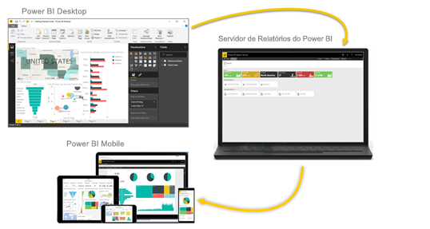

# O que é Power BI?
O **Power BI** é uma coleção de serviços de software, aplicativos e conectores que trabalham juntos para transformar suas fontes de dados não relacionadas em informações coerentes, visualmente envolventes e interativas. Os dados podem estar em uma planilha do Excel ou em uma coleção de data warehouses híbridos locais ou baseados na nuvem. Com o Power BI, você pode conectar-se facilmente a fontes de dados, visualizar e descobrir conteúdo importante e compartilhá-lo com todas as pessoas que quiser.

## As partes do Power BI
O Power BI consiste em: 
- Um aplicativo de desktop do Windows chamado **Power BI Desktop**.
- Um serviço SaaS (*software como serviço*) online chamado de **serviço do Power BI**. 
- **Aplicativos móveis** do Power BI para dispositivos Windows, iOS e Android.

Esses três elementos – &mdash;o Power BI Desktop, o serviço e os aplicativos móveis&mdash; – foram projetados para lhe permitir criar, compartilhar e consumir insights empresariais da maneira mais eficiente para você e para a sua função.

O quarto elemento, o **Servidor de Relatórios do Power BI**, permite publicar relatórios do Power BI em um servidor de relatórios local, depois de criá-los no Power BI Desktop. Leia mais sobre o [Servidor de Relatório do Power BI](#on-premises-reporting-with-power-bi-report-server).

## Como o Power BI corresponde à sua função
A forma de uso do Power BI pode depender de sua função em um projeto ou uma equipe. Outras pessoas, em outras funções, podem usar o Power BI de modo diferente.

Por exemplo, você pode usar principalmente o **serviço do Power BI** para exibir relatórios e dashboards. Seu colega de trabalho responsável pela criação de relatórios empresariais por meio de cálculos numéricos complexos pode fazer amplo uso do **Power BI Desktop** para criar relatórios e publicá-los no serviço do Power BI, no qual é possível exibi-los. Outro colega de trabalho, da área de vendas, talvez use principalmente o **aplicativo para telefone do Power BI** para monitorar o progresso das cotações de vendas e analisar detalhes sobre novas vendas potenciais.

Caso seja um desenvolvedor, você pode usar APIs do Power BI para efetuar push dos dados para conjuntos de dados ou para inserir relatórios e dashboards em seus próprios aplicativos personalizados. Ter uma ideia de um novo visual? Crie-o você mesmo e compartilhe-o com outras pessoas.  

Você também pode usar cada elemento do Power BI em momentos diferentes, dependendo do objetivo ou da função em determinado projeto.

A maneira de usar o Power BI depende do respectivo recurso ou serviço que seja mais adequado como ferramenta para o caso. Por exemplo, é possível usar o Power BI Desktop para criar relatórios para sua própria equipe sobre as estatísticas de participação do cliente e exibir o inventário e o progresso da fabricação em um dashboard em tempo real no serviço do Power BI. Todos os elementos do Power BI estão disponíveis para você. Por isso, ele é um programa tão versátil e interessante.

Explore os documentos pertinentes à sua função:
- Power BI Desktop para [*designers*](../desktop-what-is-desktop.md)
- Power BI para [*consumidores*](../consumer/end-user-consumer.md)
- Power BI para [*desenvolvedores*](../developer/what-can-you-do.md)
- Power BI para [*administradores*](../service-admin-administering-power-bi-in-your-organization.md)

## O fluxo de trabalho no Power BI
Um fluxo de trabalho comum no Power BI começa pela conexão com fontes de dados e pela criação de um relatório no Power BI Desktop. Você então publica esse relatório do Power BI Desktop no serviço do Power BI e o compartilha para que os usuários finais no serviço do Power BI e nos dispositivos móveis possam exibir e interagir com o relatório.
Esse fluxo de trabalho é comum e mostra como os três principais elementos do Power BI se complementam.

Veja uma [comparação detalhada entre o Power BI Desktop e o serviço do Power BI](../designer/service-service-vs-desktop.md).

## Relatórios locais com o Servidor de Relatório do Power BI

Mas e se você não estiver pronto para migrar para a nuvem e precisar manter seus relatórios atrás de um firewall corporativo?  Continue lendo.

Você pode criar, implantar e gerenciar os relatórios móveis e paginados do Power BI localmente com a variedade de ferramentas e serviços prontos para uso que o Servidor de Relatórios do Power BI oferece.

O Servidor de Relatórios do Power BI é uma solução que você implanta atrás do firewall e, em seguida, fornece relatórios para os usuários corretos de diferentes maneiras, seja exibindo-os em um navegador da Web, em um dispositivo móvel ou como um email. E, como o Servidor de Relatórios do Power BI é compatível com o Power BI na nuvem, você pode ir para a nuvem quando estiver pronto. 

Leia mais sobre o [Servidor de Relatório do Power BI](../report-server/get-started.md).

## Próximas etapas
- [Início Rápido: Saiba como usar o serviço do Power BI](../service-the-new-power-bi-experience.md)   
- [Tutorial: Introdução ao serviço do Power BI](../service-get-started.md)
- [Início Rápido: conectar-se a dados no Power BI Desktop](../desktop-quickstart-connect-to-data.md)
