# Tutorial: Introdução ao serviço do Power BI
Este tutorial é uma introdução a alguns dos recursos do *serviço do Power BI*. Nele, você se conecta a dados, cria um relatório e um dashboard e faz perguntas sobre seus dados. Você pode fazer muito mais com o serviço do Power BI, este tutorial é apenas uma prévia para despertar sua curiosidade. Para entender como o serviço do Power BI se adapta às outras ofertas do Power BI, recomendamos que leia [O que é Power BI](power-bi-overview.md).

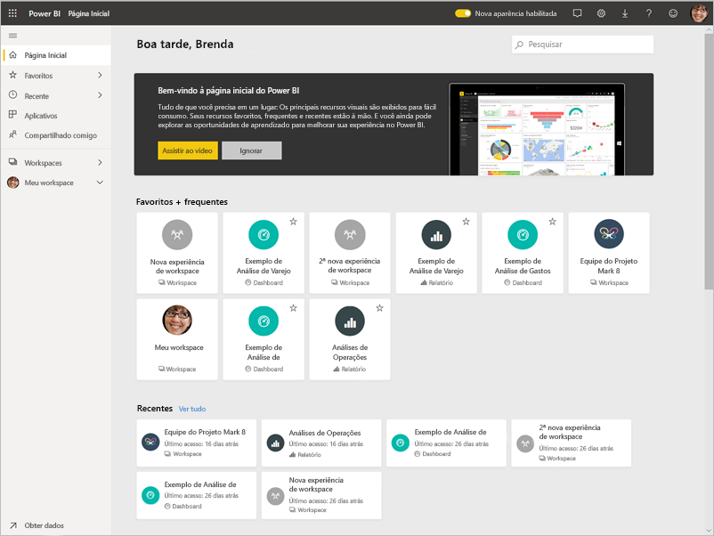

Neste tutorial, você concluirá as etapas a seguir:

> [!div class="checklist"]
> * Entrar em sua conta online do Power BI ou inscrever-se, caso ainda não tenha uma conta.
> * Abrir o serviço do Power BI.
> * Obter alguns dados e abra-os no modo de exibição de relatório.
> * Usar esses dados para criar visualizações e salvar como um relatório.
> * Criar um dashboard fixando blocos do relatório.
> * Adicionar outras visualizações ao seu dashboard usando a ferramenta de linguagem natural de P e R.
> * Redimensionar, reorganizar e interagir com os blocos do dashboard.
> * Limpar os recursos excluindo o conjunto de dados, o relatório e o dashboard.

> [!TIP]
> Prefere um curso de treinamento gratuito baseado no seu ritmo? [Registre-se em nosso curso Analisando e visualizando dados no EdX](https://aka.ms/edxpbi).

## Inscreva-se no serviço do Power BI
Se você não tiver uma conta do Power BI, [inscreva-se para uma avaliação gratuita do Power BI Pro](https://app.powerbi.com/signupredirect?pbi_source=web) antes de começar.

Depois de ter uma conta, insira *app.powerbi.com* no navegador para abrir o serviço do Power BI. 

## Etapa 1: Obter dados

Geralmente, quando queremos criar um relatório do Power BI, começamos no Power BI Desktop. Desta vez, vamos começar do zero criando um relatório no serviço do Power BI.

Neste tutorial, obtemos os dados de um arquivo CSV. Quer me acompanhar? [Baixar o arquivo CSV do Exemplo Financeiro](https://go.microsoft.com/fwlink/?LinkID=521962).

1. [Entre no Power BI](https://www.powerbi.com/). Não tem uma conta? Não se preocupe, você pode se inscrever para uma avaliação gratuita.
2. O Power BI abre no seu navegador. Selecione **Obter dados** na parte inferior do painel de navegação.

    A página **Obter Dados** é aberta.   

3. Na seção **Criar novo conteúdo**, selecione **Arquivos**. 
   
   
4.  Selecionar **Arquivo local**.
   
    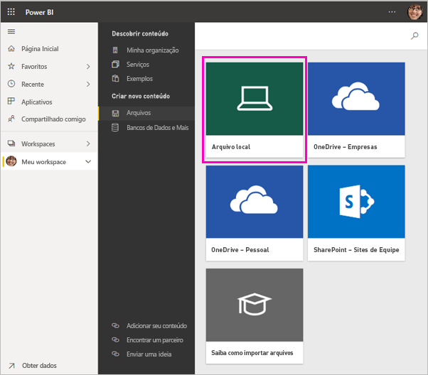

5. Navegue até o arquivo no seu computador e escolha **Abrir**.

5. Para este tutorial, selecionaremos **Importar** para adicionar o arquivo do Excel como um conjunto de dados, de modo que possamos usá-lo para criar relatórios e dashboards. Se você selecionar **Carregar**, a pasta de trabalho inteira será carregada no Power BI e você poderá abri-la e editá-la no Excel online.
   
   
6. Quando seu conjunto de dados estiver pronto, selecione **Conjuntos de dados** e, em seguida, **Criar relatório**, ao lado do **Exemplo financeiro** do conjunto de dados, para abrir o editor de relatórios. 

    

    A tela do relatório está em 	branco. Do lado direito estão os painéis **Filtros**, **Visualizações** e **Campos**.

    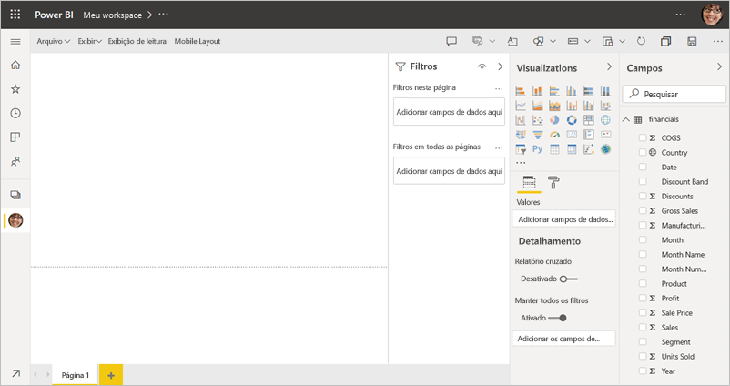

7. Observe que há uma opção para **Exibição de leitura** no painel de navegação superior. Porque você tem essa opção, isso significa que você está atualmente no modo de exibição de Edição. Uma ótima maneira de se familiarizar com o editor de relatório é [fazer um tour](../create-reports/service-the-report-editor-take-a-tour.md).

    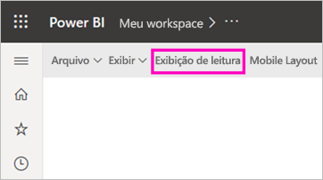

    Enquanto estiver no Modo de Exibição de Edição, você pode criar e modificar seus relatórios por ser *proprietário* do relatório. Ou seja, você é um *criador*. Quando você compartilha seu relatório com seus colegas, eles podem apenas interagir com o relatório na exibição de Leitura. Seus colegas são *consumidores*. Saiba mais sobre os [Modos de Exibição de Leitura e de Edição](../consumer/end-user-reading-view.md).

## Etapa 2: Criar um gráfico em um relatório
Agora que você se conectou aos dados, comece a explorar.  Quando encontrar algo interessante, você pode criar um dashboard para monitorá-lo e ver como ele é alterado ao longo do tempo. Vamos ver como isso funciona.
    
1. No editor de relatórios, começamos no painel **Campos**, do lado direito da página, para criar uma visualização. Marque as caixas de seleção **Vendas brutas** e **Data**.
   
   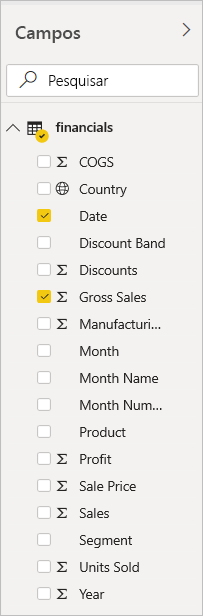

    O Power BI analisa os dados e cria um elemento de visualização. Se você selecionou **Data** primeiro, você verá uma tabela. Se você selecionou **Vendas Brutas** primeiro, verá um gráfico de colunas. 

2. Alterne para uma forma diferente de exibição dos dados. Vamos ver esses dados como um gráfico de linhas. Selecione o ícone de gráfico de linha do painel **Visualizações**.
   
   

3. Este gráfico parece interessante, então vamos *fixá-lo* em um dashboard. Focalize a visualização e selecione o ícone de alfinete. Quando fixar essa visualização, ela será armazenada em seu dashboard e mantida atualizada para que você possa acompanhar rapidamente o valor mais recente.
   
   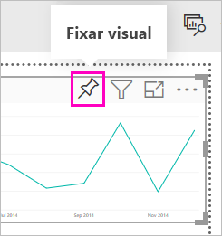

4. Como esse relatório é novo, você é solicitado a salvá-lo antes de fixar uma visualização no dashboard. Dê um nome ao seu relatório (por exemplo, *Vendas ao longo do tempo*) e selecione **Salvar**. 

5. Selecione **Novo dashboard** e dê a ele o nome *Exemplo financeiro para tutorial*. 
   
   
   
6. Selecione **Fixar**.
   
    Uma mensagem de êxito (perto do canto superior direito) informa que a visualização foi adicionada, como um bloco, ao dashboard.
   
    

7. Selecione **Ir para o dashboard** para ver o novo dashboard com o gráfico de linhas que você fixou nele como um bloco. 
   
   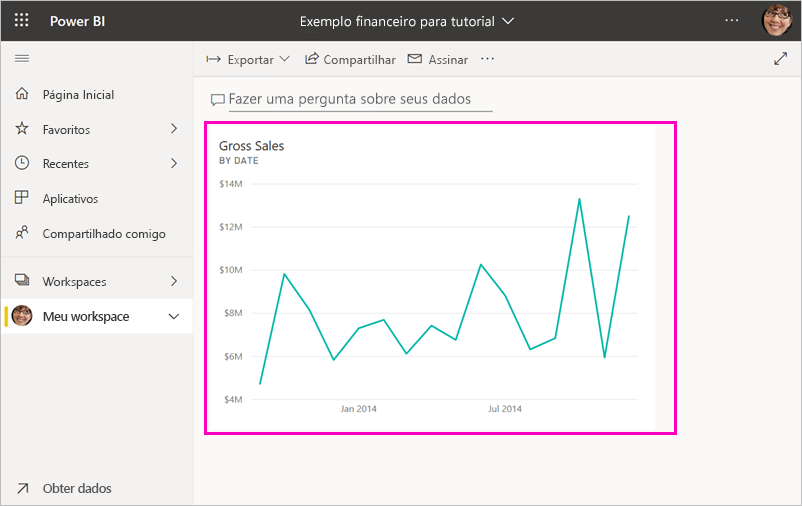
   
8. Selecione o novo bloco em seu dashboard para retornar ao relatório. O Power BI o leva de volta ao relatório no Modo de Exibição de Leitura. 

1. Para voltar ao Modo de exibição de edição, selecione **Mais opções** (...) no painel de navegação superior > **Editar**. De volta ao Modo de Exibição de Edição você pode continuar a explorar e fixar blocos.

    

## Etapa 3: Explorar com P e R

Para explorar seus dados rapidamente, tente fazer uma pergunta na caixa de P e R. As P e R criam consultas de linguagem natural sobre seus dados. Em um dashboard, a caixa de P e R fica na parte superior (**Faça uma pergunta sobre seus dados**). Em um relatório, ela fica no painel de navegação superior (**Faça uma pergunta**).

1. Para voltar ao dashboard, selecione **Meu workspace** na barra preta do **Power BI**.

    

1. Na guia **Dashboards**, selecione o seu dashboard.

    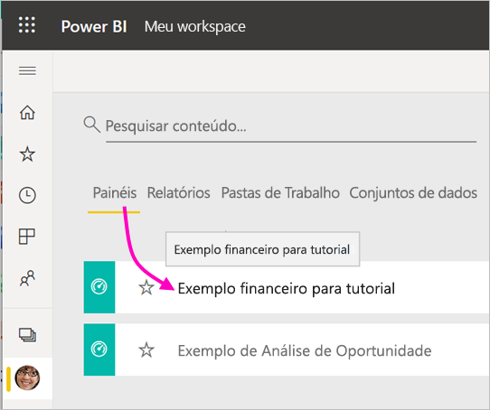

1. Selecione **Fazer uma pergunta sobre seus dados**. As P e R oferecem automaticamente uma série de sugestões.

    

    > [!NOTE]
    > Se as sugestões não forem exibidas, ative a opção **Nova experiência de P e R**.

2. Algumas das sugestões retornam um único valor. Por exemplo, selecione **venda máxima**.

    As P e R pesquisam uma resposta e a apresentam na forma de visualização de *cartão*.

    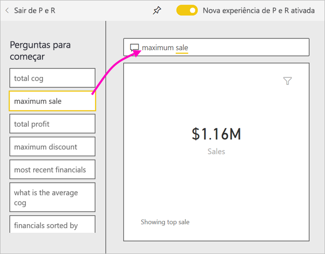

3. Selecione o ícone fixar  para mostrar essa visualização no dashboard Exemplo financeiro para tutorial.

1. Role para baixo na lista **Perguntas para começar** e selecione **média de cog em cada mês**. 

    

1. Fixe o gráfico de barras no dashboard **Exemplo financeiro para tutorial**, também.

1. Coloque o cursor depois de *por mês*, no caixa P e R e digite *como linha*. Selecione **linha (Tipo de visualização)** . 

    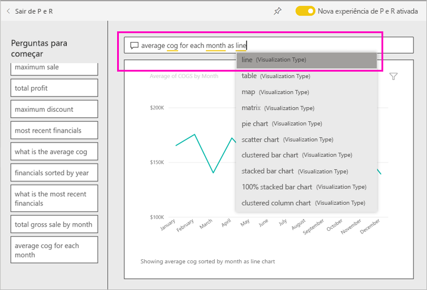

4. Selecione **Sair de P e R** para retornar ao dashboard, no qual você verá os novos blocos criados. 

   

   Observe que, embora você tenha alterado o gráfico para um gráfico de linhas, o bloco permaneceu como gráfico de barras porque estava assim quando foi fixado. 

## Etapa 4: Reposicionar blocos

O dashboard é amplo. Podemos reorganizar os blocos para fazer melhor uso do espaço do dashboard.

1. Arraste o canto inferior direito do bloco do gráfico de linhas *Vendas brutas* para cima, até que ele se ajuste na mesma altura que o bloco Vendas e, em seguida, solte-o.

    

    Agora, os dois blocos têm a mesma altura.

    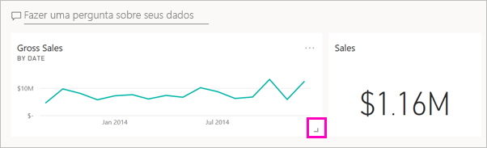

1. Arraste o bloco do gráfico de barras *Média de COGS* até que se ajuste abaixo do gráfico de linhas *Vendas brutas*.

    Ficou bem melhor.

    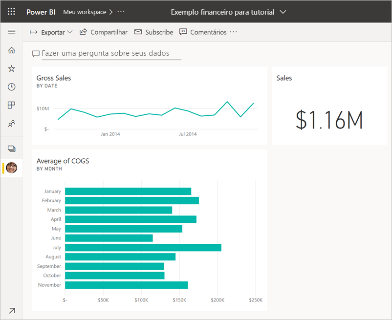

## Etapa 5: Interagir com os blocos

Aqui está uma última interação a observar, antes de começar a criar seus próprios dashboards e relatórios. Selecionar os blocos diferentes fornece resultados diferentes. 

1. Primeiro, selecione o bloco do gráfico de linhas *Vendas brutas* fixado do relatório. 

    O Power BI abre o relatório no Modo de Exibição de Leitura. 

2. Selecione o botão voltar do navegador. 

1. Agora, selecione o bloco do gráfico de barras *Média de COGS* que você criou em P e R. 

    O Power BI não abre o relatório. Em vez disso, sãos as P e R que o abrem, pois você criou esse gráfico lá.

## Limpar recursos
Agora que você já concluiu o tutorial, é possível excluir o conjunto de dados, o relatório e o dashboard. 

1. No painel de navegação, verifique se você está em **Meu Workspace**.
2. Selecione a guia **Conjuntos de dados** e localize o conjunto de dados importado para este tutorial.  
3. Selecione **Mais opções** (...) > **Excluir**.

    

    Ao excluir o conjunto de dados, você verá o aviso **Todos os relatórios e blocos de dashboard que contêm dados desse conjunto de dados também serão excluídos**.

4. Selecione **Excluir**.

## Próximas etapas

Melhore ainda mais a aparência dos dashboards adicionando mais blocos de visualização e [renomeando, redimensionando, vinculando e reposicionando os blocos existentes](../create-reports/service-dashboard-edit-tile.md).
