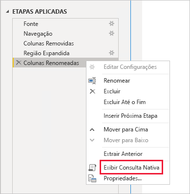
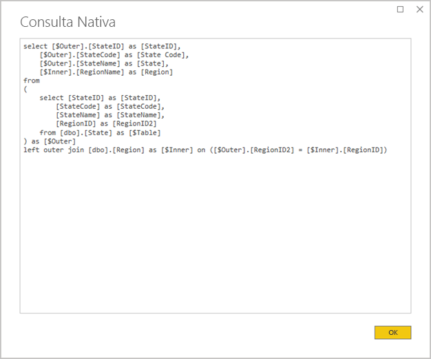
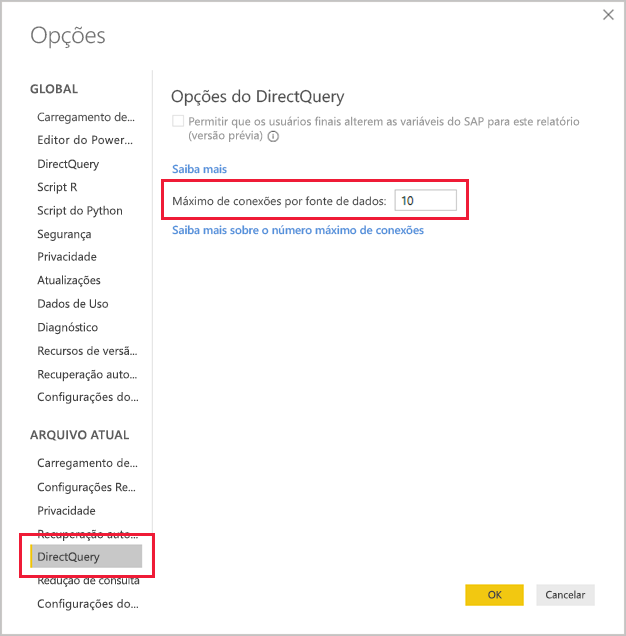
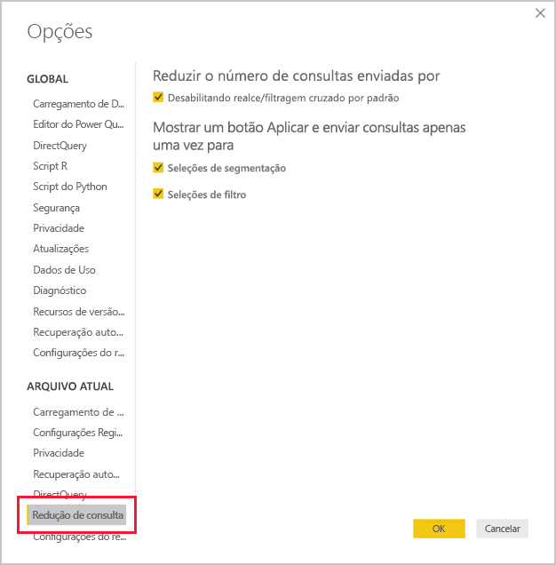
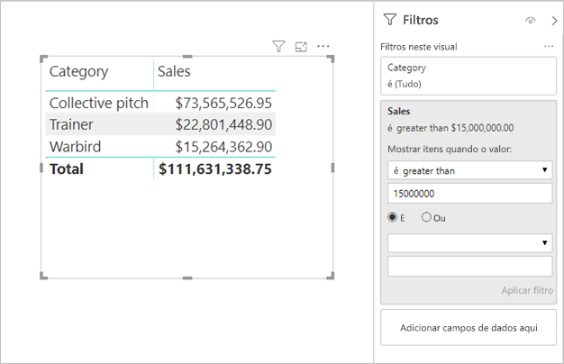

# <a name="directquery-model-guidance-in-power-bi-desktop"></a>Diretrizes sobre modelos de DirectQuery no Power BI Desktop

Este artigo destina-se a modeladores de dados que desenvolvem modelos de DirectQuery do Power BI usando o Power BI Desktop ou o serviço do Power BI. Ele descreve os casos de uso, as limitações e diretrizes do DirectQuery. Especificamente, as diretrizes têm a finalidade de ajudar você a determinar se o DirectQuery é o modo apropriado para seu modelo, bem como a melhorar o desempenho de seus relatórios com base em modelos de DirectQuery. Este artigo se aplica aos modelos de DirectQuery hospedados no serviço do Power BI ou no Servidor de Relatórios do Power BI.

Ele não tem a finalidade de apresentar uma discussão completa sobre o design de modelos de DirectQuery. Para obter uma introdução, confira o artigo [Modelos de DirectQuery no Power BI Desktop](../desktop-directquery-about.md). Para ver uma discussão mais aprofundada, consulte diretamente o white paper [DirectQuery no SQL Server 2016 Analysis Services](https://download.microsoft.com/download/F/6/F/F6FBC1FC-F956-49A1-80CD-2941C3B6E417/DirectQuery%20in%20Analysis%20Services%20-%20Whitepaper.pdf). Tenha em mente que o white paper descreve o uso do DirectQuery no SQL Server Analysis Services. No entanto, grande parte do conteúdo ainda se aplica aos modelos de DirectQuery no Power BI.

Este artigo não aborda diretamente os Modelos compostos. Um Modelo composto tem, pelo menos, uma fonte de DirectQuery e, possivelmente, mais. As diretrizes descritas neste artigo ainda são relevantes – pelo menos em parte – para o design de Modelos compostos. No entanto, as implicações de combinar Tabelas de importação e Tabelas de DirectQuery não estão no escopo deste artigo. Para obter mais informações, confira [Usar modelos compostos no Power BI Desktop](../desktop-composite-models.md).

É importante entender que os modelos de DirectQuery impõem uma carga de trabalho diferente ao ambiente do Power BI (serviço do Power BI ou Servidor de Relatórios do Power BI), bem como às fontes de dados subjacentes. Se você determinar que o DirectQuery é a abordagem de design apropriada, recomendamos que envolva as pessoas certas no projeto. Costumamos observar que implantações bem-sucedidas de modelos de DirectQuery são resultado de equipes de profissionais de TI que trabalham em conjunto. Normalmente, a equipe é composta por desenvolvedores de modelo e administradores de banco de dados de origem. Ela também pode envolver arquitetos de dados, bem como desenvolvedores de ETL e data warehouse. Muitas vezes, otimizações precisam ser aplicadas diretamente à fonte de dados para obter bons resultados de desempenho.

## <a name="design-in-power-bi-desktop"></a>Design no Power BI Desktop

É possível se conectar diretamente às fontes de dados do SQL Data Warehouse do Azure e do Azure HDInsight Spark, sem precisar usar Power BI Desktop. Isso é feito no serviço do Power BI "Obtendo dados" e escolhendo o bloco Bancos de Dados. Para obter mais informações, confira [SQL Data Warehouse do Azure com DirectQuery](../service-azure-sql-data-warehouse-with-direct-connect.md).

Embora a conexão direta seja conveniente, não recomendamos usar essa abordagem. O principal motivo é que não é possível atualizar a estrutura do modelo caso o esquema da fonte de dados subjacente seja alterado.

Recomendamos usar o Power BI Desktop para criar e gerenciar todos os seus modelos de DirectQuery. Essa abordagem fornece a você controle total para definir o modelo de que precisa, incluindo o uso de recursos com suporte, como hierarquias, colunas calculadas, medidas e muito mais. Ela também permite revisar o design do modelo caso o esquema da fonte de dados subjacente seja alterado.

## <a name="optimize-data-source-performance"></a>Otimizar o desempenho da fonte de dados

A fonte do banco de dados relacional pode ser otimizada de várias maneiras, conforme descrito na lista com marcadores a seguir.

> [!NOTE]
> Entendemos que nem todos os modeladores têm as permissões ou as habilidades necessárias para otimizar um banco de dados relacional. Embora essa seja a camada preferencial para preparar os dados para um modelo de DirectQuery, algumas otimizações também podem ser feitas no design do modelo, sem modificar o banco de dados de origem. No entanto, frequentemente os melhores resultados de otimização são obtidos aplicando otimizações ao banco de dados de origem.

- **Garantir que a integridade dos dados esteja completa:** é especialmente importante que as tabelas de tipo de dimensão contenham uma coluna de valores exclusivos (chave de dimensão) que é mapeada para as tabelas de tipo de fato. Também é importante que as colunas de dimensão de tipo de fato contenham valores de chave de dimensão válidos. Elas permitirão configurar relações de modelo mais eficientes que esperam valores correspondentes nos dois lados das relações. Quando os dados de origem não têm integridade, é recomendável que um registro de dimensão "desconhecido" seja adicionado para reparar os dados de maneira eficaz. Por exemplo, você pode adicionar uma linha à tabela **Produto** para representar um produto desconhecido e, em seguida, atribuir a ela uma chave fora do intervalo, como -1. Se as linhas na tabela **Vendas** contiverem um valor de chave do produto (Product Key) ausente, substitua-as por-1. Isso garantirá que cada valor de chave do produto (Product Key) em **Vendas** tenha uma linha correspondente na tabela **Produto**.
- **Adicionar índices:** defina índices apropriados — em tabelas ou exibições — para dar suporte à recuperação eficiente de dados para a filtragem e o agrupamento visual do relatório esperado. Para fontes do SQL Server, do Banco de Dados SQL do Azure ou do SQL Data Warehouse do Azure, confira [Guia de Arquitetura e Design de Índice do SQL Server](/sql/relational-databases/sql-server-index-design-guide?view=sql-server-2017) para obter informações úteis sobre diretrizes de design de índices. Para fontes voláteis do SQL Server ou do Banco de Dados SQL do Azure, confira [Introdução a Columnstore para análise operacional em tempo real](/sql/relational-databases/indexes/get-started-with-columnstore-for-real-time-operational-analytics?view=sql-server-2017).
- **Criar tabelas distribuídas:** Para fontes do SQL Data Warehouse do Azure, que usam a arquitetura MPP (Massively Parallel Processing), considere configurar grandes tabelas de tipo de fato como distribuídas por hash e tabelas de tipo de dimensão para réplica em todos os nós de computação. Para obter mais informações, confira [Diretrizes para criar tabelas distribuídas no SQL Data Warehouse do Azure](/azure/sql-data-warehouse/sql-data-warehouse-tables-distribute#what-is-a-distributed-table).
- **Verificar se as transformações de dados necessárias foram materializadas:** para fontes de bancos de dados relacionais do SQL Server (e outras fontes de bancos de dados relacionais), colunas computadas podem ser adicionadas a tabelas. Essas colunas se baseiam em uma expressão, como **Quantity** multiplicada por **UnitPrice**. Colunas computadas podem ser persistidas (materializadas) e, assim como colunas regulares, às vezes podem ser indexadas. Para obter mais informações, consulte [Índices em Colunas Calculadas](/sql/relational-databases/indexes/indexes-on-computed-columns?view=sql-server-2017).

    Considere também exibições indexadas que podem pré-agregar os dados da tabela de fatos com uma granulação mais alta. Por exemplo, se a tabela **Vendas** armazenar dados no nível da linha do pedido, você poderá criar uma exibição para resumir esses dados. A exibição pode ser baseada em uma instrução SELECT que agrupa os dados da tabela **Vendas** por data (no nível do mês), cliente e produto e resume valores de medidas como vendas, quantidade etc. A exibição pode, em seguida, ser indexada. Para fontes do SQL Server ou do Banco de Dados SQL do Azure, confira [Criar Exibições Indexadas](/sql/relational-databases/views/create-indexed-views?view=sql-server-2017).
- **Materializar uma tabela de datas:** um requisito de modelagem comum envolve adicionar uma tabela de datas para dar suporte à filtragem baseada em tempo. Para dar suporte aos filtros baseados em tempo conhecidos em sua organização, crie uma tabela no banco de dados de origem e verifique se ela foi carregada com um intervalo de datas que abrange as datas da tabela de fatos. Além disso, verifique se ela inclui colunas para períodos úteis, como ano, trimestre, mês, semana etc.

## <a name="optimize-model-design"></a>Otimizar o design de modelos

Um modelo de DirectQuery pode ser otimizado de várias maneiras, conforme descrito na lista com marcadores a seguir.

- **Evite consultas de Power Query complexas:** um design de modelo eficiente pode ser obtido removendo a necessidade das consultas de Power Query aplicarem transformações. Isso significa que cada consulta é mapeada para uma única tabela ou exibição de fonte de banco de dados relacional. Você pode visualizar uma representação da instrução de consulta SQL real para uma etapa de Power Query aplicada selecionando a opção **Exibir Consulta Nativa**.

    
    
    

- **Examine o uso de colunas calculadas e alterações de tipo de dados:** os modelos de DirectQuery dão suporte à adição de cálculos e etapas de Power Query para converter tipos de dados. No entanto, um melhor desempenho costuma ser obtido materializando os resultados da transformação na fonte do banco de dados relacional, quando possível.
- **Não use a filtragem de data relativa do Power Query:** é possível definir a filtragem de data relativa em uma consulta de Power Query. Por exemplo, para recuperar as ordens de venda que foram criadas no último ano (em relação à data de hoje). Esse tipo de filtro é convertido em uma consulta nativa ineficiente, da seguinte forma:

    ```SQL
    …
    from [dbo].[Sales] as [_]
    where [_].[OrderDate] >= convert(datetime2, '2018-01-01 00:00:00') and [_].[OrderDate] < convert(datetime2, '2019-01-01 00:00:00'))  
    ```
    
    Uma abordagem de design melhor é incluir colunas de tempo relativas na tabela de data. Essas colunas armazenam valores de deslocamento relativos à data atual. Por exemplo, em uma coluna **RelativeYear**, o valor zero representa o ano atual, -1 representa o ano anterior e assim por diante. É preferível que a coluna **RelativeYear** seja materializada na tabela de data. Embora seja menos eficiente, ela também pode ser adicionada como uma coluna calculada do modelo, com base na expressão usando as funções de DAX [TODAY](/dax/today-function-dax) e [DATE](/dax/date-function-dax).

- **Mantenha as medidas simples:** pelo menos inicialmente, é recomendável limitar as medidas a agregações simples. As funções de agregação incluem SUM, COUNT, MIN, MAX e AVERAGE. Em seguida, se as medidas forem suficientemente responsivas, você poderá fazer experimentos com medidas mais complexas, mas prestando atenção ao desempenho de cada uma delas. Embora a função DAX [CALCULATE](/dax/calculate-function-dax) possa ser usada para produzir expressões de medida sofisticadas que manipulam o contexto de filtro, ela pode gerar consultas nativas caras que não têm bom desempenho.
- **Evite relações em colunas calculadas:** as relações do modelo podem relacionar apenas uma única coluna em uma tabela a uma única coluna em outra tabela. No entanto, às vezes é necessário relacionar tabelas usando várias colunas. Por exemplo, as tabelas de **Vendas** e **Geografia** são relacionadas por duas colunas: **País** e **Cidade**. Para criar uma relação entre as tabelas, uma única coluna é necessária e, na tabela **Geografia**, a coluna deve conter valores exclusivos. Concatenar o país e a cidade usando um separador de hífen poderia conseguir esse resultado.

    A coluna combinada pode ser criada com uma coluna personalizada do Power Query ou no modelo como uma coluna calculada. No entanto, isso deve ser evitado, pois a expressão de cálculo será inserida nas consultas de origem. Isso não é apenas ineficiente, mas geralmente impede o uso de índices. Em vez disso, adicione colunas materializadas na fonte do banco de dados relacional e considere indexá-las. Você também pode considerar adicionar colunas de chave alternativa a tabelas de tipo de dimensão, que é uma prática comum no design de data warehouses relacionais.
    
    Há uma exceção para essa diretriz, que está relacionada ao uso da função DAX [COMBINEVALUES](/dax/combinevalues-function-dax). A finalidade dessa função é dar suporte a relações de modelo com várias colunas. Em vez de gerar uma expressão usada pela relação, ela gera um predicado de junção SQL com várias colunas.
- **Evite relações em colunas de “Identificador Exclusivo”:** o Power BI não dá suporte nativo ao tipo de dados de identificador exclusivo (GUID). Ao definir uma relação entre colunas desse tipo, o Power BI gerará uma consulta de origem com uma junção envolvendo uma conversão. Normalmente, essa conversão de dados em tempo de consulta resulta em baixo desempenho. Até que esse caso seja otimizado, a única solução alternativa seria materializar colunas de um tipo de dados alternativo no banco de dados subjacente.
- **Oculte a coluna de um lado das relações:** a coluna de um lado de uma relação deve ser ocultada. (Normalmente, essa é a coluna de chave primária das tabelas de tipo de dimensão.) Quando é ocultada, ela não fica disponível no painel **Campos** e, portanto, não pode ser usada para configurar um visual. A coluna de muitos lados poderá permanecer visível se ela for útil para agrupar ou filtrar relatórios pelos valores da coluna. Por exemplo, considere um modelo em que existe uma relação entre as tabelas de **Vendas** e **Produto**. As colunas de relação contêm os valores de SKU (unidade de manutenção de estoque) do produto. Se o SKU do produto precisar ser adicionado aos visuais, ele deverá ficar visível apenas na tabela **Vendas**. Quando essa coluna é usada para filtrar ou agrupar em um visual, o Power BI gera uma consulta que não precisa ingressar nas tabelas **Vendas** e **Produto**.
- **Defina relações para impor a integridade:** A propriedade **Pressuponha Integridade Referencial** das relações de DirectQuery determina se o Power BI gerará consultas de origem usando uma junção interna em vez de uma junção externa. Isso geralmente melhora o desempenho da consulta, embora dependa de especificidades da fonte do banco de dados relacional. Para obter mais informações, confira [Pressupor configurações de integridade referencial no Power BI Desktop](../desktop-assume-referential-integrity.md).
- **Evite o uso da filtragem de relação bidirecional:** o uso da filtragem de relação bidirecional pode levar a instruções de consulta que não têm um bom desempenho. Somente use esse recurso de relação quando necessário, e esse geralmente é o caso ao implementar uma relação de muitos para muitos em uma tabela de ponte. Para obter mais informações, confira [Relações com uma cardinalidade muitos para muitos no Power BI Desktop](../desktop-many-to-many-relationships.md).
- **Limite consultas paralelas:** você pode definir o número máximo de conexões que o DirectQuery abre para cada fonte de dados subjacente. Isso controla o número de consultas enviadas simultaneamente à fonte de dados.

    
    
    A configuração só é habilitada quando há, pelo menos, uma fonte do DirectQuery no modelo. O valor se aplica a todas as fontes do DirectQuery e às novas fontes do DirectQuery adicionadas ao modelo.

    O aumento do valor de **Máximo de Conexões por Fonte de Dados** garante que mais consultas (até o número máximo especificado) possam ser enviadas à fonte de dados subjacente, o que é útil quando vários visuais estão em uma única página ou quando vários usuários acessam um relatório ao mesmo tempo. Depois que o número máximo de conexões é atingido, as consultas seguintes são colocadas na fila até que uma conexão fique disponível. O aumento desse limite resulta em mais carga na fonte de dados subjacente e, portanto, a configuração não garante a melhoria do desempenho geral.
    
    Quando o modelo é publicado no Power BI, o número máximo de consultas simultâneas enviadas à fonte de dados subjacente também depende do ambiente. Diferentes ambientes (como o Power BI, o Power BI Premium ou o Servidor de Relatórios do Power BI) podem impor restrições de taxa de transferência distintas. Para obter mais informações sobre as limitações de capacidade do Power BI Premium, confira [Implantar e gerenciar capacidades do Power BI Premium](https://docs.microsoft.com/power-bi/whitepaper-powerbi-premium-deployment).

## <a name="optimize-report-designs"></a>Otimizar designs de relatório

Relatórios baseados em um conjunto de dados de DirectQuery podem ser otimizados de várias maneiras, conforme descrito na lista com marcadores a seguir.

- **Habilitar técnicas de redução de consulta:** as _Opções e configurações_ do Power BI Desktop incluem uma página de Redução de Consulta. Essa página tem três opções úteis. É possível desabilitar o realce cruzado e a filtragem cruzada por padrão, embora isso possa ser substituído por meio da edição de interações. Também é possível mostrar um botão Aplicar em segmentações e filtros. As opções de segmentação ou filtro não serão aplicadas até que o usuário do relatório clique no botão. Se você habilitar essas opções, recomendamos que faça isso ao criar o relatório pela primeira vez.

    
    
- **Aplique filtros primeiro:** ao criar relatórios pela primeira vez, recomendamos que você aplique todos os filtros aplicáveis – no nível do relatório, da página ou do visual – antes de mapear os campos para os campos visuais. Por exemplo, em vez de arrastar as medidas **País** e **Vendas** e, em seguida, filtrar por um ano específico, aplique o filtro no campo **Ano** primeiro. Isso ocorre porque cada etapa da criação de um visual enviará uma consulta e, embora seja possível fazer outra alteração antes que a primeira consulta seja concluída, isso ainda impõe uma carga desnecessária à fonte de dados subjacente. Ao aplicar os filtros no início, as consultas intermediárias geralmente são menos dispendiosas e mais rápidas. Além disso, deixar de aplicar os filtros antecipadamente pode fazer com que o limite de um milhão de linhas seja ultrapassado, conforme descrito acima.
- **Limite o número de visuais em uma página:** quando uma página de relatório é aberta (e quando filtros de página são aplicados), todos os visuais da página são atualizados. No entanto, há um limite para o número de consultas que podem ser enviadas em paralelo, imposto pelo ambiente do Power BI e pela configuração do modelo **Máximo de Conexões por Fonte de Dados**, conforme descrito acima. Sendo assim, à medida que o número de visuais da página aumenta, maior é a chance de que eles sejam atualizados de maneira serial. Isso aumenta o tempo necessário para atualizar a página inteira e também aumenta a chance de os visuais exibirem resultados inconsistentes (para fontes de dados voláteis). Por esses motivos, recomendamos limitar o número de visuais em qualquer página e, em vez disso, ter mais páginas mais simples. Substituir vários visuais de cartão por um único visual de cartão com várias linhas pode levar a um layout de página semelhante.
- **Desativar a interação entre visuais:** as interações com realce cruzado e filtragem cruzada exigem que as consultas sejam enviadas para a fonte subjacente. A menos que essas interações sejam necessárias, recomenda-se que sejam desativadas se o tempo necessário para responder às seleções dos usuários for excessivamente longo. Essas interações podem ser desligadas, quer seja para todo o relatório (conforme descrito acima para opções de Redução de consulta) ou caso a caso. Para obter mais informações, confira [Como os visuais realizam filtragem cruzada entre si em um relatório do Power BI](../consumer/end-user-interactions.md).

Além da lista de técnicas de otimização acima, observe que cada uma das seguintes funcionalidades de relatório pode causar problemas de desempenho:

- **Filtros de medida:** os visuais que contêm medidas (ou agregações de colunas) podem ter filtros aplicados a essas medidas. Por exemplo, o visual abaixo mostra as **Vendas** por **Categoria**, mas somente para categorias com mais de USD 15 milhões em vendas.

    
    
    
    Isso poderá fazer com que duas consultas sejam enviadas à fonte subjacente:
    
    - A primeira consulta recuperará as categorias que atendem à condição (Vendas > USD 15 milhões)
    - Em seguida, a segunda consulta recuperará os dados necessários para o visual, incluindo as categorias que atendem à condição na cláusula WHERE
    
    Isso geralmente terá um bom desempenho se houver centenas ou milhares de categorias, como neste exemplo. No entanto, o desempenho poderá ser prejudicado se o número de categorias for muito maior (e, de fato, a consulta falhará se houver mais de um milhão de categorias que atendem à condição, devido ao limite de um milhão de linhas mencionado acima).
- **Filtros TopN:** filtros avançados podem ser definidos para filtrar somente os N valores superiores (ou inferiores) classificados segundo uma medida. Por exemplo, para exibir apenas as cinco categorias principais no visual acima. Assim como os filtros de medida, isso também faria com que duas consultas fossem enviadas à fonte de dados subjacente. No entanto, a primeira consulta retornará todas as categorias da fonte subjacente e, em seguida, os N principais serão determinados com base nos resultados retornados. Dependendo da cardinalidade da coluna envolvida, isso poderá causar problemas de desempenho (ou falhas de consulta devido ao limite de um milhão de linhas).
- **Valor mediano:** geralmente, qualquer agregação (Soma, Contagem Distinta etc.) é enviada por push à fonte subjacente. No entanto, isso não é válido para a Mediana, pois não há suporte para essa agregação na fonte subjacente. Nesses casos, os dados dos detalhes são recuperados da fonte subjacente e o Power BI avalia a mediana dos resultados retornados. Isso será aceitável quando a mediana for calculada em um número relativamente pequeno de resultados, mas problemas de desempenho (ou falhas de consulta devido ao limite de um milhão de linhas) ocorrerão se a cardinalidade for grande. Por exemplo, a mediana de população do país poderia ser razoável, mas a mediana de preço de vendas não.
- **Seleção múltipla de segmentações:** permitir a seleção múltipla de segmentações e filtros pode causar problemas de desempenho. Isso ocorre porque, à medida que o usuário seleciona itens de segmentação adicionais (por exemplo, chegando a até dez produtos nos quais está interessado), cada nova seleção faz com que uma nova consulta seja enviada à fonte subjacente. Embora o usuário possa selecionar o próximo item antes da conclusão da consulta, isso resultará em carregamento extra na fonte subjacente. Essa situação pode ser evitada mostrando o botão Aplicar, conforme descrito nas técnicas de redução de consulta acima.
- **Totais do visual:** por padrão, tabelas e matrizes exibem totais e subtotais. Em muitos casos, consultas adicionais precisam ser enviadas à fonte subjacente para obter os valores dos totais. Isso se aplica sempre que as agregações Contar Distinto ou Mediana são usadas e em todos os casos em que o DirectQuery é usado no SAP HANA ou no SAP Business Warehouse. Esses totais devem ser desativados (usando o painel Formato) quando não forem necessários.

## <a name="convert-to-a-composite-model"></a>Converter em um Modelo Composto

Os benefícios dos modelos de Importação e de DirectQuery podem ser combinados em um único modelo configurando o modo de armazenamento das tabelas de modelo. O modo do armazenamento de tabela pode ser de Importação ou DirectQuery, ou ambos, que é conhecido como Duplo. Quando um modelo contém tabelas com modos de armazenamento diferentes, ele é conhecido como um modelo Composto. Para obter mais informações, confira [Usar modelos compostos no Power BI Desktop](../desktop-composite-models.md).

Muitos aprimoramentos funcionais e de desempenho podem ser obtidos com a conversão de um modelo de DirectQuery em um modelo Composto. Um modelo Composto pode integrar mais de uma fonte de DirectQuery e também pode incluir agregações. Tabelas de agregação podem ser adicionadas a tabelas de DirectQuery para importar uma representação resumida da tabela. Elas podem levar a melhorias consideráveis no desempenho quando os visuais consultam agregações de nível superior. Para obter mais informações, confira [Agregações no Power BI Desktop](../desktop-aggregations.md).

## <a name="educate-users"></a>Instruir os usuários

É importante instruir os usuários sobre como trabalhar de maneira eficiente com relatórios baseados em conjuntos de dados no DirectQuery. Os autores de relatórios devem ser instruídos sobre o conteúdo descrito em [Otimizar designs de relatório](#optimize-report-designs section).

Recomendamos que você instrua seus consumidores de relatórios sobre seus relatórios baseados em conjuntos de dados do DirectQuery. Pode ser útil para eles entenderem a arquitetura de dados geral, incluindo as limitações relevantes descritas neste artigo. Informe-os de que as respostas de atualizações e a filtragem interativa poderão, às vezes, ser lentas. Quando os usuários de relatório entendem por que ocorre a degradação do desempenho, é menos provável que eles percam a confiança nos relatórios e nos dados.

Ao entregar relatórios sobre fontes de dados voláteis, não deixe de instruir os usuários sobre o uso do botão Atualizar. Avise também que poderá ser possível ver resultados inconsistentes e que uma atualização do relatório poderá resolver inconsistências na página do relatório.

## <a name="next-steps"></a>Próximas etapas

Para obter mais informações sobre o DirectQuery, confira os seguintes recursos:

- [Modelos de DirectQuery no Power BI Desktop](../desktop-directquery-about.md)
- [Usar o DirectQuery no Power BI Desktop](../desktop-use-directquery.md)
- [Solução de problemas do modelo de DirectQuery no Power BI Desktop](../desktop-directquery-troubleshoot.md)
- Dúvidas? [Experimente perguntar à Comunidade do Power BI](https://community.powerbi.com/)
