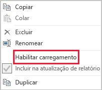

# Técnicas de redução de dados para Modelagem de importação

Este artigo se destina a modeladores de dados do Power BI Desktop que desenvolvem Modelos de importação. Ele descreve diferentes técnicas que ajudam a reduzir os dados carregados em Modelos de importação.

Os Modelos de importação são carregados com dados que são compactados e otimizados e, em seguida, armazenados em disco pelo mecanismo de armazenamento VertiPaq. Quando os dados de origem são carregados na memória, é possível ver uma compactação de 10 vezes, de forma que é razoável esperar que 10 GB de dados de origem possam ser compactados em aproximadamente 1 GB de tamanho. Além disso, quando persistidos em disco, é possível chegar a uma redução adicional de 20%.

Apesar das eficiências obtidas pelo mecanismo de armazenamento VertiPaq, é importante que você se esforce para minimizar os dados que serão carregados em seus modelos. Isso é válido especialmente para modelos grandes ou modelos que você prevê que crescerão com o passar do tempo. Quatro motivos convincentes incluem:

- Tamanhos de modelos maiores podem não ter suporte de sua capacidade. A capacidade compartilhada pode hospedar modelos de até 1 GB, enquanto capacidades Premium podem hospedar modelos de até 13 GB. Para obter mais informações, leia o artigo [Suporte do Power BI Premium para conjuntos de dados grandes](../service-premium-large-datasets.md).
- Modelos com tamanhos menores reduzem a contenção de recursos de capacidade, especificamente a memória. Isso permite que mais modelos sejam carregados simultaneamente por períodos mais longos, resultando em taxas de remoção mais baixas. Para obter mais informações, confira [Gerenciar capacidades Premium](../service-premium-capacity-manage.md).
- Modelos menores têm uma atualização de dados mais rápida, resultando em relatórios com latência mais baixa, maior taxa de transferência de atualização de conjuntos de dados e menor pressão sobre o sistema de origem e os recursos de capacidade.
- Tabelas com menos linhas podem resultar em avaliações com cálculo mais rápido, o que pode proporcionar um melhor desempenho de consulta de modo geral.

Oito técnicas de redução de dados diferentes são abordadas neste artigo. Essas técnicas incluem:

- [Remover colunas desnecessárias](#remove-unnecessary-columns)
- [Remover linhas desnecessárias](#remove-unnecessary-rows)
- [Agrupar por e resumir](#group-by-and-summarize)
- [Otimizar tipos de dados de coluna](#optimize-column-data-types)
- [Preferência por colunas personalizadas](#preference-for-custom-columns)
- [Desabilitar a carga de consulta do Power Query](#disable-power-query-query-load)
- [Desabilitar data/hora automática](#disable-auto-datetime)
- [Mudar para o modo misto](#switch-to-mixed-mode)

## Remover colunas desnecessárias

As colunas das tabela de modelo têm duas finalidades principais:

- **Relatórios**, para obter designs de relatório adequados que filtram, agrupam e resumem dados do modelo
- **Estrutura do modelo**, dando suporte a relações de modelo, cálculos de modelo, funções de segurança e até mesmo formatação de cores de dados

Colunas que não atenderem a essas finalidades poderão provavelmente ser removidas. A remoção de colunas é chamada de _filtragem vertical_.

Recomendamos que você projete modelos que tenham exatamente o número certo de colunas com base nos requisitos de relatório conhecidos. Seus requisitos podem mudar com o passar do tempo, mas lembre-se de que é mais fácil adicionar colunas mais tarde do que removê-las. A remoção de colunas pode interromper relatórios ou a estrutura do modelo.

## Remover linhas desnecessárias

As tabelas do modelo devem ser carregadas com o menor número de linhas possível. Isso pode ser feito carregando conjuntos de linhas filtrados em tabelas do modelo por dois motivos diferentes: filtrar por entidade ou por tempo. A remoção de linhas é conhecida como _filtragem horizontal_.

A **filtragem por entidade** envolve o carregamento de um subconjunto de dados de origem no modelo. Por exemplo, em vez de carregar informações de vendas referentes a todas as regiões de vendas, carregue apenas informações de uma única região. Essa abordagem de design resultará em muitos modelos menores e também pode eliminar a necessidade de definir uma segurança no nível de linha (mas exigirá a concessão de permissões específicas aos conjuntos de dados no serviço do Power BI e a criação de relatórios "duplicados" que se conectam a cada conjunto de dados). Você pode aproveitar os parâmetros do Power Query e os arquivos de modelo do Power BI para simplificar o gerenciamento e a publicação. Para obter mais informações, leia a entrada de blog [Detalhamento dos Parâmetros de Consulta e dos Modelos do Power BI](https://powerbi.microsoft.com/blog/deep-dive-into-query-parameters-and-power-bi-templates/).

A **filtragem por tempo** envolve limitar a quantidade de _histórico de dados_ carregado em tabelas de fato (e limitar as linhas de data carregadas nas tabelas de data do modelo). Sugerimos que você não carregue automaticamente todo o histórico disponível, a menos que seja um requisito de relatório conhecido. É útil entender que os filtros do Power Query baseados em tempo podem ser parametrizados, e até mesmo configurados para usar períodos relativos (em relação à data da atualização, por exemplo, os últimos cinco anos). Além disso, tenha em mente que alterações retrospectivas em filtros de tempo não interrompem os relatórios; elas apenas resultarão em menos (ou mais) histórico de dados disponível nos relatórios.

## Agrupar por e resumir

Talvez a técnica mais eficiente para reduzir o tamanho de um modelo seja carregar dados resumidos previamente. Essa técnica pode ser usada para reduzir a granularidade das tabelas de fato. No entanto, há uma compensação distinta que leva à perda de detalhes.

Por exemplo, uma tabela de fatos de vendas de origem armazena uma linha por linha de pedido. Uma redução significativa de dados pode ser obtida resumindo todas as métricas de vendas, agrupando por data, cliente e produto. Considere, em seguida, que uma redução de dados ainda mais significativa poderia ser obtida agrupando por data _no nível do mês_. Isso pode levar a uma possível redução de 99% no tamanho do modelo, mas o relatório por dia – ou por ordem individual – não está mais possível. Decidir resumir dados de fatos sempre envolve compensações. A compensação pode ser atenuada por um design de modelo misto e essa opção é descrita na técnica [Mudar para o modo misto](#switch-to-mixed-mode).

## Otimizar tipos de dados de coluna

O mecanismo de armazenamento VertiPaq usa estruturas de dados separadas para cada coluna. Por design, essas estruturas de dados atingem as maiores otimizações para dados de coluna numérica, que usam codificação de valor. Texto e outros dados não numéricos, no entanto, usam codificação de hash. Isso requer que o mecanismo de armazenamento atribua um identificador numérico a cada valor de texto exclusivo contido na coluna. O identificador numérico, em seguida, é armazenado na estrutura de dados, exigindo uma pesquisa de hash durante o armazenamento e a consulta.

Em alguns casos específicos, você pode converter os dados de texto de origem em valores numéricos. Por exemplo, um número de ordem de venda pode ser prefixado de maneira uniforme com um valor de texto (por exemplo, "SO123456"). O prefixo pode ser removido e o valor do número da ordem pode ser convertido em um número inteiro. Para tabelas grandes, isso poderá resultar em uma redução de dados significativa, especialmente quando a coluna contiver valores de cardinalidade única ou alta.

Neste exemplo, recomendamos que você defina a propriedade de Resumo Padrão da coluna como "Não Resumir". Isso ajudará a minimizar o resumo inadequado dos valores de número da ordem.

## Preferência por colunas personalizadas

O mecanismo de armazenamento VertiPaq armazena colunas calculadas do modelo (definidas no DAX) da mesma forma que colunas comuns originadas no Power Query. No entanto, as estruturas de dados são armazenadas de forma ligeiramente diferente e normalmente atingem uma compactação menos eficiente. Além disso, elas são criadas quando todas as tabelas de Power Query são carregadas, o que pode resultar em tempos de atualização de dados estendidos. Portanto, é menos eficiente adicionar colunas de tabela como colunas _calculadas_ do que como colunas _computadas_ do Power Query (definidas em M).

A preferência deve ser pela criação de colunas personalizadas no Power Query. Quando a origem é um banco de dados, você pode conquistar uma maior eficiência de carga de duas maneiras. O cálculo pode ser definido na instrução SQL (usando a linguagem de consulta nativa do provedor) ou pode ser materializado como uma coluna na fonte de dados.

No entanto, em alguns casos, as colunas calculadas do modelo podem ser a melhor opção. Esse pode ser o caso quando a fórmula envolve a avaliação de medidas ou requer uma funcionalidade de modelagem específica, com suporte apenas em funções DAX. Para obter informações sobre um exemplo desse tipo, confira o artigo [Compreender funções para hierarquias pai-filho no DAX](/dax/understanding-functions-for-parent-child-hierarchies-in-dax).

## Desabilitar a carga de consulta do Power Query

Consultas do Power Query destinadas a dar suporte à integração de dados com outras consultas não devem ser carregadas no modelo. Para evitar o carregamento da consulta no modelo, não deixe de desabilitar o carregamento de consultas nesses casos.

## Desabilitar data/hora automática

O Power BI Desktop inclui uma opção chamada de _Data/hora automática_. Quando habilitada, ela cria uma tabela de data/hora automática para colunas de dados darem suporte a autores de relatório ao configurar filtros, o agrupamento e a busca detalhada para períodos de tempo do calendário. As tabelas ocultas são, na verdade, tabelas calculadas que aumentarão o tamanho do modelo. Para obter diretrizes sobre como usar essa opção, consulte as [Diretrizes automáticas de data/hora no artigo Power BI Desktop](../desktop-auto-date-time.md).

## Mudar para o modo misto

No Power BI Desktop, um design de Modo misto produz um Modelo composto. Essencialmente, ele permite que você determine o modo de armazenamento _para cada tabela_. Portanto, cada tabela pode ter sua propriedade de Modo de Armazenamento definida como Importação ou DirectQuery (Duplo é outra opção).

Uma técnica eficaz para reduzir o tamanho do modelo é configurar a propriedade de Modo de Armazenamento para tabelas de fatos maiores como DirectQuery. Considere que essa abordagem de design pode funcionar bem em conjunto com a técnica [Agrupar por e resumir](#group-by-and-summarize) introduzida anteriormente. Por exemplo, dados de vendas resumidos podem ser usados para obter relatórios de "resumo" de alto desempenho. Uma página de detalhamento pode exibir vendas granulares para contextos de filtro específicos (e estreitos), exibindo todas as ordens de venda no contexto. Neste exemplo, a página de detalhamento incluiria visuais baseados em uma tabela do DirectQuery para recuperar os dados da ordem de vendas.

No entanto, há muitas implicações de segurança e desempenho relacionadas a Modelos compostos. Para obter mais informações, leia o artigo [Usar modelos compostos no Power BI Desktop](../desktop-composite-models.md).

## Próximas etapas

Para obter mais informações sobre o design de modelo de Importação do Power BI, confira os seguintes artigos:

- [Usar modelos compostos no Power BI Desktop](../desktop-composite-models.md)
- [Modo de armazenamento no Power BI Desktop](../desktop-storage-mode.md)
- Dúvidas? [Experimente perguntar à Comunidade do Power BI](https://community.powerbi.com/)
