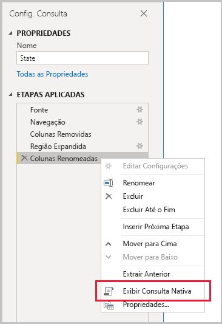
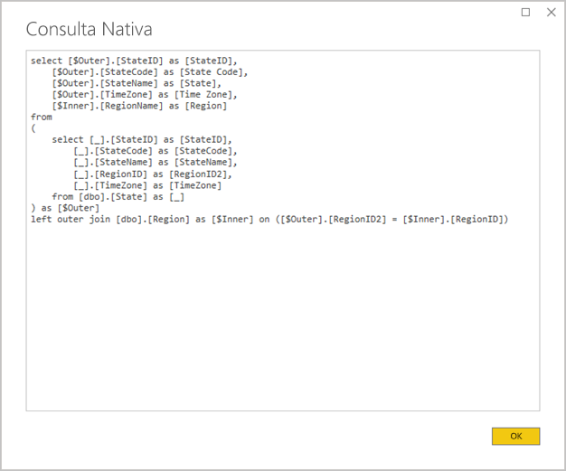
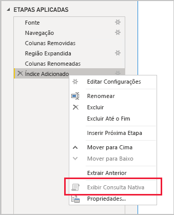

# <a name="the-importance-of-query-folding"></a>A importância da dobragem de consultas

Este artigo se destina a modeladores de dados que estão desenvolvendo modelos no Power BI Desktop. Ele descreve o que é a dobragem de consultas e por que ela é importante. Ele também descreve as fontes de dados e as transformações que podem obter a dobragem de consultas e como determinar se suas consultas de Power Query podem ser dobradas de forma completa ou parcial. Por fim, fornece orientações de melhores práticas sobre quando e como obter a dobragem de consultas.

## <a name="background"></a>Tela de fundo

A dobragem de consultas é a capacidade de uma consulta do Power Query gerar uma única instrução de consulta para recuperar e transformar dados de origem. O mecanismo de mashup do Power Query busca alcançar dobragem de consultas sempre que possível, pois resulta no caminho mais eficiente para conectar uma tabela de modelo do Power BI à sua fonte de dados subjacente.

A dobragem de consultas é um tópico importante para modelagem de dados por vários motivos:

- **Importar tabelas de modelo:** a atualização de dados ocorrerá com eficiência para tabelas de modelo de Importação em termos de utilização de recursos e duração da atualização
- **Tabelas de modo de armazenamento e Duplo e DirectQuery:** cada tabela de modo de armazenamento e Duplo DirectQuery deve ser baseada em uma consulta do Power Query que pode ser dobrada
- **Atualização incremental:** a atualização de dados incremental será eficiente em termos de utilização de recursos e duração da atualização. Na verdade, a janela de configuração de atualização incremental notificará você de um aviso caso determine que a dobragem de consultas para a tabela não pode ser alcançada. Se ela não puder ser alcançada, o objetivo da atualização incremental será perdido. O mecanismo de mashup então seria necessário para recuperar todas as linhas de origem e, em seguida, aplicar filtros para determinar as alterações incrementais.

A dobragem de consultas pode ocorrer para uma consulta do Power Query inteira ou para um subconjunto de suas etapas. Quando a dobragem de consultas não pode ser alcançada, parcial ou totalmente, o mecanismo de mashup do Power Query no Power BI deve compensar processando as transformações de dados em si. Isso pode envolver a recuperação dos resultados da consulta de origem, que, para conjuntos de dados grandes, o que consome muitos recursos e é lento.

Recomendamos que os modeladores de dados busquem alcançar eficiência nos designs de modelo de importação, garantindo que a dobragem de consultas ocorra sempre.

## <a name="sources-that-support-query-folding"></a>Fontes que dão suporte à dobragem de consultas

A maioria das fontes de dados que têm o conceito de linguagem de consulta é compatível com dobragem de consultas. Elas podem incluir bancos de dados relacionais, feeds do OData (incluindo listas do SharePoint), Exchange e Active Directory. No entanto, fontes de dados como arquivos simples, BLOBs e Web normalmente não fazem isso.

## <a name="transformations-that-can-achieve-query-folding"></a>Transformações que podem realizar a dobragem de consultas

As transformações de fonte de dados relacionais que podem consultadas dobradas são aquelas que podem ser gravadas como uma única instrução SELECT. Uma instrução SELECT pode ser construída com as cláusulas WHERE, GROUP BY e JOIN adequadas. Ele também pode conter expressões de coluna (cálculos) que usam funções internas comuns com suporte em bancos de dados SQL.

Em geral, a lista com marcadores a seguir descreve as transformações que podem ser dobradas por consulta.

- Como remover colunas
- Como renomear colunas (selecionar aliases de coluna)
- Como filtrar linhas, com valores estáticos ou parâmetros do Power Query (predicados de cláusula WHERE)
- Como agrupar e resumir (cláusula GROUP BY)
- Como expandir colunas de registro (colunas de chave estrangeira de origem) para obter uma junção de duas tabelas de origem (cláusula JOIN)
- Como realizar a mesclagem não difusa de consultas com dobras com base na mesma origem (cláusula de junção)
- Como acrescentar consultas com dobras com base na mesma fonte (operador UNION ALL)
- Como adicionar colunas personalizadas com _lógica simples_ (expressões de coluna SELECT). A lógica simples implica operações não complicadas, possivelmente incluindo o uso de funções M que têm funções equivalentes na fonte de dados SQL, como funções matemáticas ou de manipulação de texto. Por exemplo, as expressões a seguir retornam o componente year do valor da coluna **OrderDate** (para retornar um valor numérico).

    ```powerquery-m
    Date.Year([OrderDate])
    ```

- Como dinamizar e remover a dinamização (operadores PIVOT e UNPIVOT)

## <a name="transformations-that-prevent-query-folding"></a>Transformações que impedem a dobragem de consultas

Em geral, a lista com marcadores a seguir descreve as transformações que impedem a dobragem de consultas. Esta lista não se destina a exaustiva.

- Como mesclar consultas com base em fontes diferentes
- Como acrescentar consultas (unir) com base em fontes diferentes
- Como adicionar colunas personalizadas com _lógica complexa_. A lógica complexa implica o uso de funções M sem funções equivalentes na fonte de dados. Por exemplo, as expressões a seguir formatam o valor da coluna **OrderDate** (para retornar um valor de texto).

    ```powerquery-m
    Date.ToText([OrderDate], "yyyy")
    ```

- Como adicionar colunas de índice
- Como alterar um tipo de dados de coluna

Observe que, quando uma consulta do Power Query abrange várias fontes de dados, a incompatibilidade dos níveis de privacidade da fonte de dados pode impedir que a dobragem de consultas ocorra. Para obter mais informações, leia o artigo [Níveis de privacidade do Power BI Desktop](../desktop-privacy-levels.md).

## <a name="determine-when-a-query-can-be-folded"></a>Determinar quando uma consulta pode ser dobrada

Na janela do Editor do Power Query, é possível determinar quando uma consulta do Power Query pode ser dobrada. No painel **Configurações de Consulta**, ao clicar com o botão direito do mouse na última etapa aplicada, se a opção **Exibir Consulta Nativa** estiver habilitada (não esmaecida), a consulta poderá ser dobrada.



Para exibir a consulta dobrada, selecione a opção **Exibir Consulta Nativa**. Em seguida, será apresentada a você a consulta nativa que o Power Query usará para adquirir dados.



Se a opção **Exibir Consulta Nativa** não estiver habilitada (esmaecida), isso será uma prova de que não é possível dobrar todas as etapas da consulta. No entanto, poderia significar que um subconjunto de etapas ainda pode ser dobrado. Trabalhando na ordem inversa da última etapa, você poderá verificar cada etapa para ver se a opção **Exibir Consulta Nativa** está habilitada. Se esse for o caso, você aprendeu em que ponto na sequência de etapas a dobragem de consultas não pôde mais ser alcançado.



## <a name="best-practice-guidance"></a>Orientação de melhor prática

Em resumo, para uma tabela de modo de armazenamento de DirectQuery ou Duplo, a consulta de Power Query deve realizar a dobragem de consultas. Para uma tabela de importação baseada em uma fonte relacional e quando uma única instrução SELECT pode ser construída, o _melhor desempenho de atualização de dados_ é obtido garantindo que a dobragem de consultas ocorra. Se o mecanismo de mashup ainda for necessário para processar as transformações, você deverá se esforçar para minimizar o trabalho necessário, especialmente para grandes conjuntos de altos.

A lista com marcadores a seguir apresenta orientações de práticas recomendadas.

- **Delegue o máximo de processamento possível para a fonte de dados:** Quando não for possível dobrar todas as etapas de uma consulta do Power Query, descubra a etapa que impede a dobragem de consultas. Quando possível, mova as etapas posteriores mais para o início da sequência para que possam ser fatoradas na dobragem de consultas. Observe que o mecanismo de mashup do Power Query pode ser inteligente o suficiente para reordenar as etapas de consulta ao gerar a consulta de origem.

Para uma fonte de dados relacional, se a etapa que impede que a dobragem de consultas seja alcançada em uma única instrução SELECT ou na lógica de um procedimento armazenado, considere usar uma instrução de consulta nativa conforme descrito a seguir.

- **Usar uma consulta SQL nativa:** quando uma consulta Power Query recupera dados de uma fonte relacional, é possível usar uma consulta SQL nativa. A consulta pode, na verdade, ser qualquer instrução válida, incluindo uma execução de procedimento armazenado. Se a instrução produzir vários conjuntos de resultados, somente o primeiro será retornado. Os parâmetros podem ser declarados na instrução, e recomendamos que você use a função [Value.NativeQuery](/powerquery-m/value-nativequery) M para passar valores de parâmetro com segurança e conveniência. É importante entender que o mecanismo de mashup do Power Query não pode dobrar etapas de consulta subsequentes e, portanto, é importante incluir toda (ou não tanto) a lógica de transformação na instrução de consulta nativa.

    Há duas considerações importantes a lembrar ao usar consultas SQL nativas:

    - Para uma tabela de modelo DirectQuery, a consulta deve ser uma instrução SELECT e não pode usar CTEs (Expressões de Tabela Comuns) ou um procedimento armazenado
    - A atualização incremental não pode utilizar uma consulta SQL nativa e, portanto, forçaria o mecanismo de mashup do Power Query a recuperar todas as linhas de origem e depois aplicar filtros para determinar as alterações incrementais

    > [!IMPORTANT]
    > Uma consulta nativa potencialmente pode fazer mais do que recuperar dados. Qualquer instrução válida pode ser executada (e, possivelmente, várias vezes), incluindo uma que modifica ou exclui dados. É importante aplicar o princípio de privilégios mínimos para garantir que a conta usada para acessar o banco de dados tenha permissão de leitura apenas para os dados necessários.

- **Preparar e transformar dados na fonte:** se você identificar que determinadas etapas de consulta do Power Query não podem ser dobradas, talvez seja possível aplicar as transformações na fonte de dados. Isso pode ser feito criando uma exibição de banco de dados que transforme dados de origem de forma lógica ou preparando e materializando fisicamente os dados antes de o Power BI consultá-los. Um data warehouse relacional é um excelente exemplo de dados preparados, geralmente consistindo em fontes previamente integradas de dados organizacionais.

## <a name="next-steps"></a>Próximas etapas

Para obter mais informações sobre a dobragem de consultas e o tópico relacionado, confira os seguintes recursos:

- [Usar modelos compostos no Power BI Desktop](../desktop-composite-models.md)
- [Atualização incremental no Power BI Premium](../service-premium-incremental-refresh.md)
- [Como usar Table.View para implementar a dobragem de consultas](/power-query/handlingqueryfolding)
- Dúvidas? [Experimente perguntar à Comunidade do Power BI](https://community.powerbi.com/)
