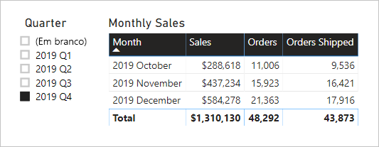

# <a name="active-vs-inactive-relationship-guidance"></a>Diretrizes de relações ativas vs inativas

Este artigo destina-se aos modeladores de dados que trabalham com o Power BI Desktop. Ele fornece diretrizes sobre quando criar relações de modelo ativas ou inativas. Por padrão, as relações ativas propagam filtros para outras tabelas. No entanto, a relação inativa só propaga filtros quando uma expressão DAX ativa (usa) a relação.

[!INCLUDE [relationships-prerequisite-reading](includes/relationships-prerequisite-reading.md)]

## <a name="active-relationships"></a>Relações ativas

Em geral, recomendamos definir relações ativas sempre que possível. Elas ampliam o escopo e o potencial de como seu modelo pode ser usado por autores de relatórios e usuários que trabalham com perguntas e respostas.

Considere um exemplo de modelo de importação projetado para analisar o OTP (desempenho no prazo) de voos da companhia aérea. O modelo tem uma tabela **Flight**, que é uma tabela do tipo fato que armazena uma linha por voo. Cada linha registra a data e o número do voo, aeroportos de partida e de chegada e qualquer tempo de atraso (em minutos). Há também uma tabela com o nome **Airport**, do tipo dimensão que armazena uma linha por aeroporto. Cada linha descreve o código, o nome e o país do aeroporto.

Confira abaixo um diagrama de modelo parcial das duas tabelas.


Existem duas relações de modelo entre as tabelas de **Flight** e **Airport**. Na tabela **Flight**, as colunas **DepartureAirport** (aeroporto de partida) e **ArrivalAirport** (aeroporto de chegada) estão relacionadas à coluna **Airport** da tabela **Airport**. No design do esquema em estrela, a tabela **Airport** é descrita como uma [dimensão com função múltipla](star-schema.md#role-playing-dimensions). Nesse modelo, as duas funções são _aeroporto de partida_ e _aeroporto de chegada_.

Embora esse design funcione bem em esquemas em estrela relacionais, ele não funciona com modelos do Power BI. Isso ocorre porque as relações de modelo são caminhos para a propagação de filtro, e esses caminhos devem ser determinísticos. Por esse motivo, um modelo não pode ter várias relações ativas entre duas tabelas. Portanto, como descrito nesse exemplo, uma relação está ativa enquanto a outro está inativa (representada pela linha tracejada). Mais especificamente a relação com a coluna **ArrivalAirport** que está ativa. Isso significa que os filtros aplicados à tabela **Airport** são propagados automaticamente para a coluna **ArrivalAirport** da tabela **Flight**.

Esse design de modelo impõe severas limitações sobre como os dados podem ser relatados. Especificamente, não é possível filtrar a tabela **Airport** para isolar automaticamente os detalhes do voo de um aeroporto de partida. Como os requisitos de relatório envolvem filtragem (ou agrupamento) pelos aeroportos de partida e chegada _ao mesmo tempo_, são necessárias duas relações ativas. Para converter esse requisito em um design de modelo do Power BI, é necessário que o modelo tenha duas tabelas de aeroporto.

Veja a seguir o modelo de design aprimorado.


O modelo agora tem duas tabelas de aeroporto: **Departure Airport** e **Arrival Airport**. As relações de modelo entre essas tabelas e a tabela **Flight** estão ativas. Observe também que os nomes das colunas nas tabelas **Departure Airport** e **Arrival Airport** estão prefixados com as palavras _Departure_ (partida) ou _Arrival_ (chegada).

O design aprimorado do modelo dá suporte à produção do design de relatório a seguir.


A página do relatório filtra por Melbourne como o aeroporto de partida, e o visual de tabela agrupa os aeroportos de chegada.

> [!NOTE]
> Para modelos de importação, a tabela adicional resultou em um tamanho de modelo aumentado e em tempos de atualização mais longos. Sendo assim, isso contradiz as recomendações descritas no artigo [Técnicas de redução de dados para modelagem de importação](import-modeling-data-reduction.md). No entanto, no exemplo, a necessidade de se ter apenas relações ativas substitui essas recomendações.
>
> Além disso, é comum que as tabelas do tipo dimensão contenham contagens de linhas baixas em relação às contagens de linhas das tabelas do tipo fato. Portanto, o aumento do tamanho do modelo e os tempos de atualização provavelmente não serão excessivamente grandes.

### <a name="refactoring-methodology"></a>Metodologia de refatoração

Veja a seguir uma metodologia de refatoração de um modelo de uma única tabela do tipo dimensão com função múltipla para um design com _uma tabela por função_.

1. Remova quaisquer relações inativas.
2. Considere renomear a tabela do tipo dimensão com função múltipla para descrever melhor sua função. No exemplo, a tabela **Airport** está relacionada à coluna **ArrivalAirport** da tabela **Flight**, portanto, ela é renomeada como **Arrival Airport**.
3. Crie uma cópia da tabela com função múltipla nomeando-a de acordo com a função. Se for uma tabela de importação, recomendamos definir uma tabela calculada. Se a tabela for do DirectQuery, será possível duplicar a consulta do Power Query.

    Neste exemplo, a tabela **Departure Airport** foi criada usando a definição de tabela calculada a seguir.

    ```dax
    Departure Airport = 'Arrival Airport'
    ```

4. Crie uma relação ativa para relacioná-la a nova tabela.
5. Considere renomear as colunas nas tabelas para que elas reflitam precisamente a função. No exemplo, todas as colunas são prefixadas com a palavra _Departure_ ou _Arrival_. Esses nomes garantem que os visuais do relatório, por padrão, tenham rótulos autoexplicativos e não ambíguos. Isso também melhora a experiência de perguntas e respostas, permitindo que os usuários façam suas perguntas facilmente.
6. Considere adicionar descrições às tabelas com função múltipla. (No painel **Campos**, é exibida uma descrição em uma dica de ferramenta quando o autor do relatório passa o cursor sobre a tabela.) Dessa forma, você pode comunicar quaisquer detalhes adicionais de propagação de filtro aos autores do relatório.

## <a name="inactive-relationships"></a>Relações inativas

Em circunstâncias específicas, as relações inativas podem atender a necessidades especiais de geração de relatórios.

Agora, vamos considerar diferentes requisitos de modelo e de relatório:

- Um modelo de vendas contém uma tabela **Sales** (vendas) que possui duas colunas de data: **OrderDate** (data do pedido) e **ShipDate** (data de envio)
- Cada linha na tabela **Sales** registra um único pedido
- Os filtros de data quase sempre são aplicados à coluna **OrderDate**, que sempre armazena uma data válida
- Apenas uma medida requer a propagação do filtro de data para a coluna **ShipDate**, que pode conter espaços EM BRANCO (até que o pedido seja enviado)
- Não há necessidade de filtrar simultaneamente (ou agrupar por) datas de pedido _e_ de envio

Confira abaixo um diagrama de modelo parcial das duas tabelas.


Existem duas relações de modelo entre as tabelas **Sales** e **Date**. Na tabela de **Sales**, as colunas **OrderDate** e **ShipDate** estão relacionadas à coluna **Date** da tabela **Date**. Nesse modelo, as duas funções da tabela **Date** são _data do pedido_ e _data de envio_. É a relação com a coluna **OrderDate** que está ativa.

Todas as seis medidas, exceto uma, devem ser filtradas pela coluna **OrderDate**. A medida de **Orders Shipped** (pedidos enviados), no entanto, deve ser filtrada pela coluna **ShipDate**.

Veja a seguir a definição da medida de **Orders**. Ela simplesmente conta as linhas da tabela **Sales** no contexto do filtro. Quaisquer filtros aplicados à tabela **Date** serão propagados para a coluna **OrderDate**.

```dax
Orders = COUNTROWS(Sales)
```

Veja a seguir a definição da medida **Orders Shipped**. Ela usa a função DAX [USERELATIONSHIP](/dax/userelationship-function-dax), que ativa a propagação de filtro para uma relação específica apenas durante a avaliação da expressão. Neste exemplo, foi usada a relação com a coluna **ShipDate**.

```dax
Orders Shipped =
CALCULATE(
    COUNTROWS(Sales)
    ,USERELATIONSHIP('Date'[Date], Sales[ShipDate])
)
```

Esse design de modelo é compatível com a produção do design de relatório a seguir.



A página do relatório é filtrada pelo 4º trimestre de 2019. O visual da tabela é agrupado por mês e exibe várias estatísticas de vendas. As medidas **Orders** e **Orders Shipped** produzem resultados diferentes. Cada uma delas usa a mesma lógica de resumo (contagem de linhas da tabela **Sales**), mas diferentes propagações de filtro da tabela **Date**.

Observe que a segmentação de trimestre inclui um item EM BRANCO. Esse item de segmentação é exibido como resultado da [expansão da tabela](../desktop-relationships-understand.md#strong-relationships). Embora cada linha da tabela **Sales** tenha uma data do pedido, algumas linhas têm uma data de envio EM BRANCO – esses pedidos ainda não foram enviados. A expansão da tabela também considera as relações inativas e, portanto, os espaços EM BRANCO podem aparecer devido a itens EM BRANCO no lado "muitos" da relação ou devido a problemas de integridade de dados.

## <a name="recommendations"></a>Recomendações

Em resumo, recomendamos definir relações ativas sempre que possível. Elas ampliam o escopo e o potencial de como seu modelo pode ser usado por autores de relatórios e usuários que trabalham com perguntas e respostas. Isso significa que as tabelas do tipo dimensão com função múltipla devem ser duplicadas no seu modelo.

Em circunstâncias específicas, no entanto, é possível definir uma ou mais relações inativas para uma tabela do tipo dimensão com função múltipla. Esse design é ideal quando:

- Não é necessário que os visuais de relatório sejam filtrados simultaneamente por diferentes funções
- A função DAX USERELATIONSHIP é usada para ativar uma relação específica para cálculos de modelo relevantes

## <a name="next-steps"></a>Próximas etapas

Para obter mais informações relacionadas a este artigo, confira os seguintes recursos:

- [Modelar relações no Power BI Desktop](../desktop-relationships-understand.md)
- [Entender o esquema em estrela e a importância para o Power BI](star-schema.md)
- [Diretrizes da solução de problemas de relação](relationships-troubleshoot.md)
- Dúvidas? [Experimente perguntar à Comunidade do Power BI](https://community.powerbi.com/)
- Sugestões? [Contribuir com ideias para aprimorar o Power BI](https://ideas.powerbi.com/)
