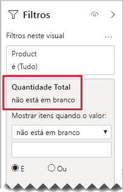

# <a name="bi-directional-relationship-guidance"></a>Diretrizes de relação bidirecional

Este artigo destina-se aos modeladores de dados que trabalham com o Power BI Desktop. Ele fornece orientação sobre quando criar relações de modelos bidirecionais. Uma relação bidirecional filtra em _ambas as direções_.

[!INCLUDE [relationships-prerequisite-reading](includes/relationships-prerequisite-reading.md)]

Geralmente, recomendamos minimizar o uso de relações bidirecionais. Elas podem causar um impacto negativo no desempenho de consulta do modelo e, possivelmente, causar experiências confusas para os usuários de relatórios.

Existem três cenários em que a filtragem bidirecional pode solucionar requisitos específicos:

- [Relações de modelos especiais](#special-model-relationships)
- [Itens de segmentação "com dados"](#slicer-items-with-data)
- [Análise de dimensão a dimensão](#dimension-to-dimension-analysis)

## <a name="special-model-relationships"></a>Relações de modelos especiais

As relações bidirecionais têm uma função importante na criação dos dois seguintes tipos de relação de modelo especial:

- **Um-para-um**: Todas as relações de um-para-um devem ser bidirecionais, e não é possível configurá-las de outra forma. Geralmente, não recomendamos a criação desses tipos de relações. Confira uma discussão completa e projetos alternativos em [Guia de relações um-para-um](relationships-one-to-one.md).
- **Muitos para muitos**: Ao relacionar tabelas do tipo bidimensional, é necessário usar uma tabela de ponte. Um filtro bidirecional é necessário para garantir que os filtros se propaguem pela tabela de ponte. Confira mais informações em [Diretrizes de relação muitos para muitos (Relacionar dimensões de muitos para muitos)](relationships-many-to-many.md#relate-many-to-many-dimensions).

## <a name="slicer-items-with-data"></a>Itens de segmentação "com dados"

As relações bidirecionais podem fornecer segmentações que limitam os itens para onde existam dados. (Se você está familiarizado com segmentações e tabelas dinâmicas do Excel, esse é o comportamento padrão ao obter dados de um conjunto de dados do Power BI ou de um modelo do Analysis Services.) Para ajudar a explicar o que isso significa, primeiro considere o diagrama do modelo a seguir.


A primeira tabela é denominada **Customer** e contém três colunas: **Country-Region**, **Customer** e **CustomerCode**. A segunda tabela é denominada **Product** e contém três colunas: **Color**, **Product** e **SKU**. A terceira tabela é denominada **Sales** e contém três colunas: **CustomerCode**, **OrderDate**, **Quantity** e **SKU**. As tabelas **Customer** e **Product** são do tipo dimensional, e cada uma tem uma relação um para muitos com a tabela **Sales**. Cada relação é filtrada em uma única direção.

Para ajudar a descrever como funciona a filtragem bidirecional, o diagrama de modelo foi modificado para revelar as linhas da tabela. Todos os exemplos deste artigo se baseiam nesses dados.

> [!NOTE]
> Não é possível exibir linhas de tabela no diagrama de modelo do Power BI Desktop. Isso é feito neste artigo a fim de contribuir com a discussão, fornecendo exemplos claros.


Os detalhes de linha das três tabelas são descritos na seguinte lista com marcadores:

- A tabela **Cliente** tem duas linhas:
  - **CustomerCode** CUST-01, **Customer** Customer-1, **Country-Region** United States
  - **CustomerCode** CUST-02, **Customer** Customer-2, **Country-Region** Australia
- A tabela **Product** tem três linhas:
  - **SKU** CL-01, **Product** T-shirt, **Color** Green
  - **SKU** CL-02, **Product** Jeans, **Color** Blue
  - **SKU** AC-01, **Product** Hat, **Color** Blue
- A tabela **Sales** tem três linhas:
  - **OrderDate** January 1 2019, **CustomerCode** CUST-01, **SKU** CL-01, **Quantity** 10
  - **OrderDate** February 2 2019, **CustomerCode** CUST-01, **SKU** CL-02, **Quantity** 20
  - **OrderDate** March 3 2019, **CustomerCode** CUST-02, **SKU** CL-01, **Quantity** 30

Agora, considere a página de relatório a seguir.


A página consiste em duas segmentações e um visual de cartão. A primeira segmentação é para **Country-Region** e tem dois itens: Australia e United States. Atualmente, está segmentado por Australia. A segunda segmentação é para **Product** e tem três itens: Hat, Jeans e T-shirt. Nenhum item está selecionado (ou seja, _nenhum produto_ está filtrado). O visual de cartão exibe uma quantidade de 30.

Quando os usuários dos relatórios segmentam por Australia, convém limitar a segmentação de **Product** para exibir itens cujos dados se _relacionam_ às vendas australianas. É isso que significa exibir os itens da segmentação "com dados". Você pode conseguir esse comportamento configurando a relação entre as tabelas **Product** e **Sales** para filtrar nas duas direções.


A segmentação **Product** agora relaciona um único item: T-shirt. Esse item representa o único produto vendido para clientes australianos.


Primeiro, sugerimos que você considere cuidadosamente se esse design funciona para os seus usuários de relatórios. Alguns usuários de relatórios consideram essa experiência confusa. Eles não entendem porque os itens são dinamicamente exibidos ou ocultados quando interagem com outras segmentações.

Caso você decida mostrar os itens de segmentação "com dados", não recomendamos a configuração de relações bidirecionais. As relações bidirecionais exigem mais processamento, o que pode afetar de forma negativa o desempenho das consultas, especialmente se houver um aumento no número de relações bidirecionais do modelo.

Aqui está a melhor maneira de obter o mesmo resultado: Em vez de usar filtros bidirecionais, você pode aplicar um filtro no nível do visual para a própria segmentação de **Product**.

Agora vamos considerar que a relação entre as tabelas **Product** e **Sales** não é mais filtrada em duas direções. E que a definição de medida a seguir foi adicionada à tabela **Sales**.

```dax
Total Quantity = SUM(Sales[Quantity])
```

Para mostrar os itens "com dados" da segmentação de **Product**, eles simplesmente precisam ser filtrados pela medida **Total Quantity** usando a condição "não está em branco".



## <a name="dimension-to-dimension-analysis"></a>Análise de dimensão a dimensão

Um cenário diferente envolvendo relações bidirecionais trata uma tabela do tipo fato como se fosse uma tabela de ponte. Dessa forma, dá suporte à análise dos dados da tabela do tipo dimensão dentro do contexto de filtro de uma tabela diferente do tipo dimensão.

Usando o exemplo de modelo deste artigo, considere como é possível responder às seguintes perguntas:

- Quantas cores foram vendidas para clientes australianos?
- Quantos países compraram jeans?

É possível responder às duas perguntas _sem_ resumir os dados em uma tabela do tipo fato de ponte. No entanto, ainda é necessário que os filtros se propaguem de uma tabela do tipo dimensão para a outra. Assim que os filtros se propagarem pela tabela do tipo fato, será possível resumir as colunas da tabela do tipo dimensão usando a função DAX [DISTINCTCOUNT](/dax/distinctcount-function-dax) – e, possivelmente, as funções DAX [MIN](/dax/min-function-dax) e [MAX](/dax/max-function-dax).

Como a tabela do tipo fato se comporta como uma tabela de ponte, você pode seguir as diretrizes da relação muitos para muitos para relacionar as duas tabelas do tipo dimensão. Será necessário configurar pelo menos uma relação para filtrar nas duas direções. Confira mais informações em [Diretrizes de relação muitos para muitos (Relacionar dimensões de muitos para muitos)](relationships-many-to-many.md#relate-many-to-many-dimensions).

No entanto, como descrito neste artigo, este design provavelmente resultará em um impacto negativo no desempenho, e o usuário experimentará as consequências relacionadas aos [itens da segmentação "com dados"](#slicer-items-with-data). Portanto, recomendamos que você ative a filtragem bidirecional _em uma definição de medida_ usando a função DAX [CROSSFILTER](/dax/crossfilter-function). É possível usar a função CROSSFILTER para modificar as direções do filtro ou até mesmo desabilitar a relação durante a avaliação de uma expressão.

Considere que a seguinte definição de medida foi adicionada à tabela **Vendas**. Neste exemplo, a relação de modelo entre as tabelas **Customer** e **Sales** foi configurada para filtrar em uma _única direção_.

```dax
Different Countries Sold =
CALCULATE(
    DISTINCTCOUNT(Customer[Country-Region]),
    CROSSFILTER(
        Customer[CustomerCode],
        Sales[CustomerCode],
        BOTH
    )
)
```

Durante a avaliação da expressão de medida **Different Countries Sold**, a relação entre as tabelas **Customer** e **Sales** é filtrada nas duas direções.

O visual da tabela a seguir apresenta as estatísticas de cada produto vendido. A coluna **Quantity** é simplesmente a soma dos valores de quantidade. A coluna **Different Countries Sold** representa a contagem distinta de valores de país-região de todos os clientes que compraram o produto.


## <a name="next-steps"></a>Próximas etapas

Para obter mais informações relacionadas a este artigo, confira os seguintes recursos:

- [Modelar relações no Power BI Desktop](../desktop-relationships-understand.md)
- [Entender o esquema em estrela e a importância para o Power BI](star-schema.md)
- [Diretrizes de relação um-para-um](relationships-one-to-one.md)
- [Diretrizes da relação muitos para muitos](relationships-many-to-many.md)
- [Diretrizes da solução de problemas de relação](relationships-troubleshoot.md)
- Dúvidas? [Experimente perguntar à Comunidade do Power BI](https://community.powerbi.com/)
- Sugestões? [Contribuir com ideias para aprimorar o Power BI](https://ideas.powerbi.com/)
