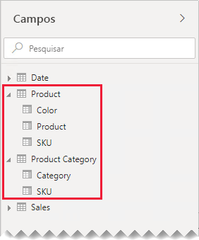
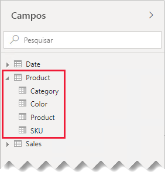
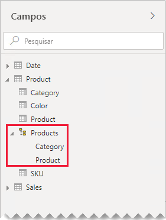
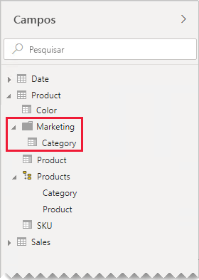

# Diretrizes de relação um-para-um

Este artigo destina-se aos modeladores de dados que trabalham com o Power BI Desktop. Ele fornece diretrizes sobre como trabalhar com relações de modelo um-para-um. Uma relação um-para-um pode ser criada quando ambas as tabelas contêm uma coluna de valores comuns e exclusivos.

[!INCLUDE [relationships-prerequisite-reading](includes/relationships-prerequisite-reading.md)]

Há dois cenários que envolvem relações um-para-um:

- [Dimensões de degeneração](#degenerate-dimensions): você pode derivar uma [dimensão de degeneração](star-schema.md#degenerate-dimensions) de uma tabela do tipo fato.
- [Os dados de linha se estendem pelas tabelas](#row-data-spans-across-tables): uma única entidade de negócios ou entidade é carregada como duas (ou mais) tabelas de modelo, possivelmente porque os dados delas são provenientes de diferentes armazenamentos de dados. Esse cenário pode ser comum para tabelas do tipo dimensão. Por exemplo, os detalhes do produto mestre são armazenados em um sistema de vendas operacionais, e os detalhes do produto suplementar são armazenados em outra fonte.

    No entanto, é incomum que você relacione duas tabelas do tipo fato com uma relação um-para-um. Isso ocorre porque as duas tabelas do tipo fato precisariam ter a mesma dimensionalidade e granularidade. Além disso, cada tabela do tipo fato precisaria de colunas exclusivas para permitir a criação da relação de modelo.

## Dimensões de degeneração

Quando colunas de uma tabela do tipo fato são usadas para filtrar ou agrupar, considere disponibilizá-las em uma tabela separada. Dessa forma, você separa as colunas usadas para filtro ou agrupamento das colunas usadas para resumir as linhas de fato. Essa separação pode:

- Reduzir o espaço de armazenamento
- Simplificar os cálculos do modelo
- Contribuir para o desempenho aprimorado da consulta
- Oferecer uma experiência mais intuitiva do painel **Campos** aos autores do relatório

Considere uma tabela de vendas de origem que armazena os detalhes do pedido de venda em duas colunas.

A coluna **OrderNumber** armazena o número do pedido, e a coluna **OrderLineNumber** armazena uma sequência de linhas no pedido.

No diagrama de modelo a seguir, observe que as colunas de número do pedido e número da linha do pedido não foram carregadas na tabela **Sales**. Em vez disso, os valores foram usados ​​para criar uma coluna de [chave alternativa](star-schema.md#surrogate-keys) denominada **SalesOrderLineID**. (O valor da chave é calculado multiplicando o número do pedido por 1000 e adicionando o número da linha do pedido.)

A tabela **Sales Order** fornece uma experiência avançada para autores de relatórios com três colunas: **Sales Order**, **Sales Order Line** e **Line Number**. Também inclui uma hierarquia. Esses recursos de tabela dão suporte a designs de relatório que precisam filtrar, agrupar ou fazer uma busca detalhada em pedidos e linhas de pedidos.

Como a tabela **Sales Order** é derivada dos dados de vendas, deve haver exatamente o mesmo número de linhas em cada tabela. Além disso, deve haver valores correspondentes entre cada coluna de **SalesOrderLineID**.

## Os dados de linha se estendem pelas tabelas

Considere um exemplo envolvendo tabelas do tipo dimensão com relação um-para-um: **Product** e **Product Category**. Cada tabela representa dados importados e tem uma coluna de **SKU** (unidade de manutenção de estoque) que contém valores exclusivos.

Confira abaixo um diagrama de modelo parcial das duas tabelas.

A primeira tabela é denominada **Product** e contém três colunas: **Color**, **Product** e **SKU**. A segunda tabela é denominada **Product Category** e contém duas colunas: **Category** e **SKU**. Uma relação um-para-um associa as duas colunas de **SKU**. A relação é filtrada em ambas as direções, que é sempre o caso para relações um-para-um.

Para ajudar a descrever como funciona a propagação do filtro de relações, o diagrama de modelo foi modificado para revelar as linhas de tabela. Todos os exemplos deste artigo se baseiam nesses dados.

> [!NOTE]
> Não é possível exibir linhas de tabela no diagrama de modelo do Power BI Desktop. Isso é feito neste artigo a fim de contribuir com a discussão, fornecendo exemplos claros.

Os detalhes de linha para as duas tabelas são descritos na seguinte lista com marcadores:

- A tabela **Product** tem três linhas:
  - **SKU** CL-01, **Product** T-shirt, **Color** Green
  - **SKU** CL-02, **Product** Jeans, **Color** Blue
  - **SKU** AC-01, **Product** Hat, **Color** Blue
- A tabela **Product Category** tem duas linhas:
  - **SKU** CL-01, **Category** Clothing
  - **SKU** AC-01, **Category** Accessories

Observe que a tabela **Product Category** não inclui uma linha para a SKU de produto RO-02. Discutiremos as consequências dessa linha ausente mais adiante neste artigo.

No painel **Fields**, os autores de relatório encontrarão campos relacionados ao produto em duas tabelas: **Product** e **Product Category**.

Vejamos o que acontece quando os campos de ambas as tabelas são adicionados a um visual de tabela. Neste exemplo, a coluna **SKU** é originada da tabela **Product**.

Observe que o valor **Category** para a SKU do produto RO-02 está em BRANCO. Isso porque não há nenhuma linha na tabela **Product Category** para esse produto.

### Recomendações

Quando possível, recomendamos que você evite criar relações de modelo um-para-um quando os dados de linha se estendem pelas tabelas de modelo. Isso porque esse design pode:

- Contribuir para a desordem do painel **​Campos**, listando mais tabelas do que o necessário
- Dificultar para os autores do relatório a localização de campos relacionados, porque estão distribuídos por várias tabelas
- Limitar a capacidade de criar hierarquias, pois seus níveis devem ser baseados em colunas da _mesma tabela_
- Gerar resultados inesperados quando não houver uma correspondência completa de linhas entre as tabelas

As recomendações específicas diferem dependendo se a relação um-para-um é _intrailha_ ou _entre ilhas_. Para obter mais informações sobre a avaliação de relação, confira [Relações de modelo no Power BI Desktop (avaliação de relação)](../desktop-relationships-understand.md#relationship-evaluation).

### Relação um-para-um intrailha

Quando existe uma relação um-para-um _intrailha_ entre as tabelas, é recomendável consolidar os dados em uma única tabela de modelo. Isso é feito por meio da mesclagem das consultas do Power Query.

As etapas a seguir apresentam uma metodologia para consolidar e modelar os dados com relação um-para-um:

1. **Mesclar consultas**: ao [combinar as duas consultas](../desktop-shape-and-combine-data.md#combine-queries), considere a integridade dos dados em cada consulta. Se uma consulta contiver um conjunto completo de linhas (como uma lista mestra), mescle a outra consulta com ela. Configure a transformação de mesclagem para usar uma _junção externa esquerda_, que é o tipo de junção padrão. Esse tipo de junção garante que você mantenha todas as linhas da primeira consulta e as complete com as linhas correspondentes da segunda consulta. Expanda todas as colunas necessárias da segunda consulta na primeira consulta.
2. **Desabilitar o carregamento de consulta**: certifique-se de [desabilitar o carregamento](import-modeling-data-reduction.md#disable-power-query-query-load) da segunda consulta. Dessa forma, não haverá o carregamento de seu resultado como uma tabela de modelo. Essa configuração reduz o tamanho do armazenamento do modelo de dados e ajuda a organizar o painel **Campos**.

    Em nosso exemplo, os autores de relatório agora encontram uma única tabela chamada **Product** no painel **Campos**. Contém todos os campos relacionados ao produto.

    
3. **Substituir valores ausentes**: se a segunda consulta tiver linhas não correspondentes, os NULOS aparecerão nas colunas introduzidas a partir dela. Quando apropriado, considere substituir os valores NULOS por um valor de token. A substituição de valores ausentes é especialmente importante quando os autores de relatório filtram ou agrupam pelos valores de coluna, pois os valores em BRANCO podem aparecer em visuais de relatório.

    No visual da tabela a seguir, observe que a categoria de SKU do produto RO-02 agora exibe _[Undefined]_ . Na consulta, as categorias nulas foram substituídas por esse valor de texto de token.

    

4. **Criar hierarquias**: se houver relações _entre as colunas_ da tabela agora consolidada, considere a criação de hierarquias. Dessa forma, os autores de relatório identificarão rapidamente as oportunidades de fazer drilling no visual do relatório.

    Em nosso exemplo, os autores de relatório agora podem usar uma hierarquia que tem dois níveis: **Category** e **Product**.

    

Caso você goste de como as tabelas separadas ajudam a organizar seus campos, ainda é recomendável consolidar em uma única tabela. Você ainda pode organizar seus campos, mas usando _pastas de exibição_ em vez disso.

Em nosso exemplo, os autores de relatório podem encontrar o campo **Category** na pasta de exibição **Marketing**.

Se você ainda decidir definir relações um-para-um intrailha em seu modelo, quando possível, verifique se há linhas correspondentes nas tabelas relacionadas. Como uma relação um-para-um intrailha é avaliada como [relação forte](../desktop-relationships-understand.md#strong-relationships), problemas de integridade de dados podem surgir nos visuais do relatório como valores em BRANCO. (Você pode ver um exemplo de um agrupamento EM BRANCO no primeiro visual da tabela apresentada neste artigo.)

### Relação um-para-um entre ilhas

Quando existe uma relação um-para-um _entre ilhas_ entre tabelas, não há design de modelo alternativo, a menos que você pré-consolide os dados em suas fontes de dados. O Power BI avaliará a relação de modelo um-para-um como uma [relação fraca](../desktop-relationships-understand.md#weak-relationships). Portanto, garanta que haja linhas correspondentes nas tabelas relacionadas, pois as linhas não correspondentes serão eliminadas dos resultados da consulta.

Vejamos o que acontece quando os campos de ambas as tabelas são adicionados a um visual de tabela e existe uma relação fraca entre as tabelas.

A tabela exibe somente duas linhas. A SKU do produto RO-02 está ausente porque não há nenhuma linha correspondente na tabela **Product Category**.

## Próximas etapas

Para obter mais informações relacionadas a este artigo, confira os seguintes recursos:

- [Modelar relações no Power BI Desktop](../desktop-relationships-understand.md)
- [Entender o esquema em estrela e a importância para o Power BI](star-schema.md)
- [Diretrizes da solução de problemas de relação](relationships-troubleshoot.md)
- Dúvidas? [Experimente perguntar à Comunidade do Power BI](https://community.powerbi.com/)
- Sugestões? [Contribuir com ideias para aprimorar o Power BI](https://ideas.powerbi.com/)
