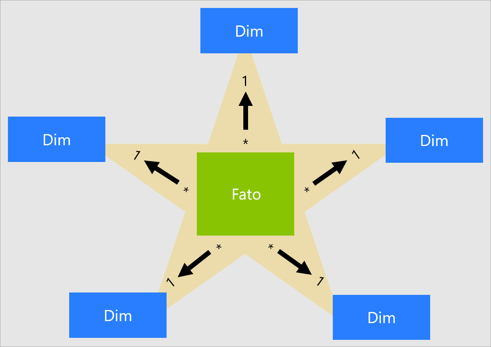
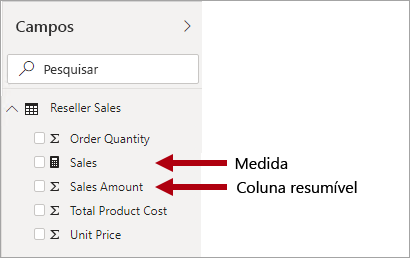
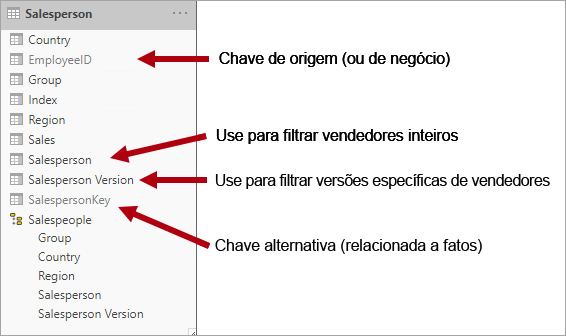
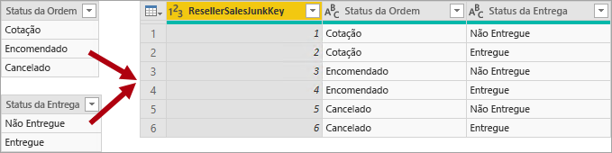
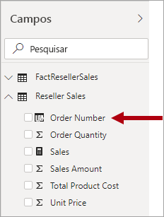

# Entenda o esquema em estrela e a importância para o Power BI

Este artigo se destina a modeladores de dados do Power BI Desktop. Descreve o design do esquema em estrela e sua relevância para desenvolver modelos de dados do Power BI otimizados para desempenho e usabilidade.

Este artigo não pretende oferecer uma discussão completa sobre o design do esquema em estrela. Para obter mais detalhes, leia diretamente o conteúdo publicado, como **The Data Warehouse Toolkit: The Definitive Guide to Dimensional Modeling** (3ª edição, 2013) de Ralph Kimball et al.

## Visão geral do esquema em estrela

O **esquema em estrela** é uma abordagem de modelagem madura amplamente adotada por data warehouses relacionais. Ele requer que os modeladores classifiquem suas tabelas de modelo como _dimensão_ ou _fato_.

**Tabelas de dimensões** descrevem as entidades de negócios – os _itens_ que você modela. As entidades podem incluir produtos, pessoas, locais e conceitos, incluindo o próprio tempo. A tabela mais consistente que você encontrará em um esquema em estrela é uma tabela de dimensão de data. Uma tabela de dimensões contém uma ou mais colunas de chave, que atuam como um identificador exclusivo, e colunas descritivas.

**Tabelas de fatos** armazenam observações ou eventos e podem ser ordens de vendas, saldos de ações, taxas de câmbio, temperaturas, etc. Uma tabela de fatos contém colunas chave de dimensão relacionadas a tabelas de dimensões e colunas de medidas numéricas. As colunas de chave de dimensão determinam a _dimensionalidade_ de uma tabela de fatos, enquanto os valores de chave de dimensão determinam a _granularidade_ de uma tabela de fatos. Por exemplo, considere uma tabela de fatos projetada para armazenar os destinos de venda que têm duas colunas de chave de dimensão **Data** e **ProductKey**. É fácil entender que a tabela tem duas dimensões. No entanto, a granularidade não pode ser determinada sem considerar os valores de chave de dimensão. Neste exemplo, considere que os valores armazenados na coluna **Data** são o primeiro dia de cada mês. Nesse caso, a granularidade está no nível do mês-produto.

Em geral, as tabelas de dimensões contêm um número relativamente pequeno de linhas. As tabelas de fatos, por outro lado, podem conter um número muito grande de linhas e continuar crescendo ao longo do tempo.

## Relevância de esquema em estrela para modelos do Power BI

O design de esquema em estrela e muitos conceitos relacionados apresentados neste artigo são altamente relevantes para o desenvolvimento de modelos do Power BI otimizados para desempenho e usabilidade.

Considere que cada elemento do visual de relatório do Power BI gera uma consulta que é enviada para o modelo do Power BI (que o serviço do Power BI chama de conjunto de dados). Essas consultas são usadas para filtrar, agrupar e resumir dados de modelo. Assim, um modelo bem projetado fornece tabelas para filtragem e agrupamento e tabelas para resumo. Esse design se ajusta bem aos princípios de esquema em estrela:

- As tabelas de dimensões são compatíveis com _filtragem_ e _agrupamento_
- Tabelas de fatos são compatíveis com _resumo_

Não há propriedades de tabela que os modeladores definem para configurar o tipo de tabela como dimensão ou fato. Na verdade, isso é determinado pelas relações de modelo. Uma relação de modelo estabelece um caminho de propagação de filtro entre duas tabelas, e é a propriedade de **Cardinalidade** da relação que determina o tipo de tabela. Uma cardinalidade em uma relação comum é uma relação de _um para muitos_ ou seu inverso, _de muitos para um_. O lado "um" é sempre uma tabela de tipo de dimensão, enquanto o lado "muitos" é sempre uma tabela de tipo de fato. Para saber mais sobre as relações, confira [Relações de modelo no Power BI Desktop](../transform-model/desktop-relationships-understand.md).

Um design de modelo bem estruturado deve incluir tabelas que sejam do tipo de dimensão ou do tipo de fato. Evite misturar os dois tipos em uma única tabela. Também recomendamos que você busque fornecer o número correto de tabelas com as relações corretas em vigor. Também é importante que as tabelas do tipo fato sempre carreguem dados em um detalhamento consistente.

Por fim, é importante entender que o design ideal de modelos é parte ciência e parte arte. Às vezes, você pode dividir com uma boa orientação quando isso faz sentido.

Há muitos conceitos adicionais relacionados ao design de um esquema em estrela que podem ser aplicados a um modelo do Power BI. Esses conceitos incluem:

- [Medidas](#measures)
- [Chaves alternativas](#surrogate-keys)
- [Dimensões de floco de neve](#snowflake-dimensions)
- [Dimensões com função múltipla](#role-playing-dimensions)
- [Dimensões de alteração lenta](#slowly-changing-dimensions)
- [Dimensões de lixo eletrônico](#junk-dimensions)
- [Dimensões de degeneração](#degenerate-dimensions)
- [Tabelas de fatos sem fatos](#factless-fact-tables)

## Medidas

No design de esquema em estrela uma **medida** é uma coluna de tabela de fatos que armazena valores a serem resumidos.

Em um modelo do Power BI, uma **medida** tem uma definição diferente, mas semelhante,. É uma fórmula escrita em [DAX (Expressões de Análise de Dados)](https://docs.microsoft.com/dax/data-analysis-expressions-dax-reference) que realiza o resumo. As expressões de medida geralmente aproveitam funções de agregação DAX como SUM, MIN, MAX, AVERAGE etc. para produzir um resultado de valor escalar no momento da consulta (os valores nunca são armazenados no modelo). A expressão de medida pode variar de agregações de coluna simples a fórmulas mais sofisticadas que substituem o contexto de filtro e/ou a propagação de relação. Para obter mais informações, leia o artigo [Noções básicas do DAX no Power BI Desktop](https://docs.microsoft.com/power-bi/desktop-quickstart-learn-dax-basics).

É importante entender que modelos do Power BI dão suporte a um segundo método de obtenção de resumo. Qualquer coluna — e normalmente colunas numéricas — pode ser resumida por um relatório visual ou P e R. Essas colunas são denominadas _medidas implícitas_. Elas oferecem uma conveniência para você como desenvolvedor de modelo, já que, em muitas instâncias, você não precisa criar medidas. Por exemplo, a coluna **Valor de Vendas** das vendas do revendedor da Adventure Works pode ser resumida de várias maneiras (soma, contagem, média, mediana, mín., máx. etc.), sem necessidade de criar uma medida para cada tipo de agregação possível.

No entanto, há três motivos convincentes para você criar medidas, mesmo para resumos simples em nível de coluna:

- Quando você souber que seus autores de relatório consultarão o modelo usando [MDX (Expressões Multidimensionais)](https://docs.microsoft.com/sql/analysis-services/multidimensional-models/mdx/mdx-query-the-basic-query?view=sql-server-2017), o modelo deverá incluir _medidas explícitas_. Medidas explícitas são definidas usando o DAX. Essa abordagem de design é altamente relevante quando um conjunto de dados do Power BI é consultado usando o MDX, porque ele não pode obter o resumo dos valores de coluna. Notavelmente, o MDX será usado ao executar [Analisar no Excel](https://docs.microsoft.com/power-bi/service-analyze-in-excel), pois as Tabelas Dinâmicas emitem consultas MDX.
- Quando você souber que os autores do relatório criarão relatórios paginados do Power BI usando o designer de consulta do MDX, o modelo deverá incluir medidas explícitas. Somente o designer de consulta MDX dá suporte a [agregações de servidor](/sql/reporting-services/report-design/report-builder-functions-aggregate-function). Portanto, se os autores de relatório precisarem ter medidas avaliadas pelo Power BI (em vez de pelo mecanismo de relatório paginado), eles deverão usar o designer de consulta MDX.
- Quando você precisar verificar se os autores de relatórios só podem resumir colunas de maneiras específicas. Por exemplo, a coluna **Preço da Unidade** de vendas do revendedor (que representa uma taxa por unidade) pode ser resumida, mas somente usando funções de agregação específicas. Ela nunca deve ser somada, mas é apropriado resumi-la usando outras funções de agregação, como mín., máx., média etc. Nessa instância, o modelador pode ocultar a coluna de **Preço Unitário** e criar medidas para todas as funções de agregação apropriadas.

Essa abordagem de design funciona bem para relatórios criados no serviço do Power BI e para P e R. No entanto, as conexões dinâmicas do Power BI Desktop permitem que os autores de relatório mostrem campos ocultos no painel **Campos**, o que pode resultar em contornar essa abordagem de design.

## Chaves alternativas

Uma **chave alternativa** é um identificador exclusivo que você adiciona a uma tabela para dar suporte à modelagem de esquema em estrela. Por definição, não é definida nem armazenada nos dados de origem. Normalmente, as chaves substitutas são adicionadas às tabelas de dimensões relacionais do data warehouse para fornecer um identificador exclusivo para cada linha da tabela de dimensões.

As relações de modelo do Power BI baseiam-se em uma única coluna exclusiva em uma tabela, que propaga filtros para uma única coluna em uma tabela diferente. Quando uma tabela de tipo de dimensão em seu modelo não inclui uma única coluna exclusiva, você deve adicionar um identificador exclusivo para se tornar o lado "um" de um relacionamento. No Power BI Desktop, você pode facilmente atender a esse requisito criando uma [coluna de índice do Power Query](https://docs.microsoft.com/powerquery-m/table-addindexcolumn).

Você deve mesclar essa consulta com a consulta do lado "muitos" para poder adicionar a coluna de índice a ela também. Ao carregar essas consultas para o modelo, você pode criar uma relação de um para muitos entre as tabelas de modelo.

## Dimensões de floco de neve

Uma **dimensão de floco de neve** é um conjunto de tabelas normalizadas para uma única entidade de negócios. Por exemplo, a Adventure Works classifica produtos por categoria e subcategoria. As categorias são atribuídas a subcategorias e os produtos, por sua vez, são atribuídos a subcategorias. No data warehouse relacional da Adventure Works, a dimensão de produto é normalizada e armazenada em três tabelas relacionadas: **DimProductCategory**, **DimProductSubcategory** e **DimProduct**.

Se você usar sua imaginação, poderá modelar as tabelas normalizadas posicionadas para cima da tabela de fatos, formando um design de floco de neve.

No Power BI Desktop, você pode optar por similar um design de dimensão floco de neve (talvez porque seus dados de origem fazem isso) ou integrar (desnormalizar) as tabelas de origem em uma única tabela de modelo. Em geral, os benefícios de uma tabela de modelo única superam os benefícios de várias tabelas de modelo. A decisão mais ideal pode depender dos volumes de dados e dos requisitos de usabilidade para o modelo.

Quando você opta por imitar um design de dimensão floco de neve:

- O Power BI carrega mais tabelas, o que é menos eficiente das perspectivas de armazenamento e desempenho. Essas tabelas devem incluir colunas para dar suporte a relações de modelo e isso pode resultar em um tamanho de modelo maior.
- Cadeias de propagação de filtro de relação mais longas precisarão ser atravessadas, o que provavelmente será menos eficiente do que os filtros aplicados a uma única tabela.
- O painel **Campos** apresenta mais tabelas de modelo a autores do relatório, o que pode resultar em uma experiência menos intuitiva, especialmente quando as tabelas de dimensões de flocos de neve contêm apenas uma ou duas colunas.
- Não é possível criar uma hierarquia que abranja as tabelas.

Quando você opta por integrar em uma única tabela de modelo, também pode definir uma hierarquia que abrange as granularidades mais alta e mais baixa da dimensão. Possivelmente, o armazenamento de dados desnormalizados redundantes pode resultar em maior tamanho de armazenamento de modelo, especialmente para tabelas de dimensões muito grandes.

## Dimensões de alteração lenta

Uma SCD **(dimensão de alteração lenta)** é aquela que gerencia adequadamente a alteração dos membros da dimensão ao longo do tempo. Ela se aplica quando os valores da entidade comercial mudam com o tempo e de uma maneira ad hoc. Um bom exemplo de uma dimensão de _alteração lenta_ é uma dimensão de cliente, especificamente, suas colunas de detalhes de contato, como endereço de email e número de telefone. Por outro lado, algumas dimensões são consideradas de alteração _rápida_ quando um atributo de dimensão é alterado com frequência, como o preço de mercado de um estoque. A abordagem de design comum nesses casos é armazenar valores de atributos de alteração rápida em uma medida de tabela de fatos.

A teoria do design do esquema em estrela refere-se a dois tipos comuns de SCD: Tipo 1 e Tipo 2. Uma tabela de tipo de dimensão poderia ser do Tipo 1 ou do Tipo 2, ou dar suporte a ambos os tipos simultaneamente para colunas diferentes.

### SCD do Tipo 1

Uma **SCD** do **Tipo 1** sempre reflete os valores mais recentes e, quando são detectadas alterações nos dados de origem, os dados da tabela de dimensões são substituídos. Essa abordagem de design é comum para colunas que armazenam valores suplementares, como o endereço de email ou o número de telefone de um cliente. Quando um endereço de email ou um número de telefone do cliente muda, a tabela de dimensões atualiza a linha de cliente com os novos valores. É como se o cliente sempre tivesse essas informações de contato.

Uma atualização não incremental de uma tabela de tipo de dimensão de modelo do Power BI atinge o resultado de uma SCD do Tipo 1. Ela atualiza os dados da tabela para garantir que os valores mais recentes sejam carregados.

### SCD do Tipo 2

Uma **SCD** do **Tipo 2** é compatível com o controle de versão de membros de dimensão. Se o sistema de origem não armazenar versões, normalmente será usado o processo de carregamento de data warehouse que detecta alterações e gerencia adequadamente a alteração em uma tabela de dimensão. Nesse caso, a tabela de dimensões deve usar uma chave substituta para fornecer uma referência exclusiva a uma _versão_ do membro da dimensão. Ele também inclui colunas que definem a validade do intervalo de datas da versão (por exemplo, **StartDate** e **EndDate**) e, possivelmente, uma coluna de sinalizador (por exemplo, **IsCurrent**) para filtrar facilmente por membros da dimensão atual.

Por exemplo, a Adventure Works atribui vendedores a uma região de vendas. Quando um vendedor realoca a região, uma nova versão do vendedor deve ser criada para garantir que os fatos históricos permaneçam associados à região anterior. Para dar suporte à análise histórica precisa das vendas por vendedor, a tabela de dimensões deve armazenar versões de vendedores e suas regiões associadas. A tabela também deve incluir valores de data de início e de término para definir a validade do tempo. Versões atuais podem definir uma data de término vazia (ou 31/12/9999), que indica que a linha é a versão atual. A tabela também deve definir uma chave substituta, pois a chave comercial (neste caso, ID de funcionário) não será exclusiva.

É importante entender que, quando os dados de origem não armazenam versões, você deve usar um sistema intermediário (como um data warehouse) para detectar e armazenar as alterações. O processo de carregamento de tabela deve preservar os dados existentes e detectar alterações. Quando uma alteração é detectada, o processo de carregamento de tabela deve expirar a versão atual. Ele registra essas alterações atualizando o valor **EndDate** e inserindo uma nova versão com o valor **StartDate** começando do valor **EndDate** anterior. Além disso, os fatos relacionados devem usar uma pesquisa baseada em tempo para recuperar o valor da chave de dimensão relevante para a data do fato. Um modelo do Power BI que usa o Power Query não consegue produzir esse resultado. No entanto, ele pode carregar dados de uma tabela de dimensão SCD Tipo 2 pré-carregada.

O modelo do Power BI deve dar suporte à consulta de dados históricos para um membro, independentemente da alteração, e para uma versão do membro, que representa um estado específico do membro no tempo. No contexto da Adventure Works, esse design permite consultar o vendedor, independentemente da região de vendas atribuída ou uma versão específica do vendedor.

Para obter esse requisito, a tabela de tipo de dimensão do modelo do Power BI deve incluir uma coluna para filtrar o vendedor e uma coluna diferente para filtrar uma versão específica do vendedor. É importante que a coluna da versão forneça uma descrição não ambígua, como "Michael Blythe (12/15/2008-06/26/2019)" ou "Michael Blythe (atual)". Também é importante treinar autores e consumidores de relatórios sobre os fundamentos de SCD Tipo 2 e como obter designs de relatórios apropriados aplicando os filtros corretos.

Também é uma boa prática de design incluir uma hierarquia que permita que os visuais façam uma busca detalhada no nível de versão.

## Dimensões com função múltipla

Uma **dimensão com função múltipla** é uma dimensão que pode filtrar fatos relacionados de forma diferente. Por exemplo, na Adventure Works, a tabela de dimensões de data tem três relações com os fatos de vendas do revendedor. A mesma tabela de dimensão pode ser usada para filtrar os fatos por data do pedido, data de remessa ou data de entrega.

Em um data warehouse, a abordagem de design aceita é definir uma tabela de dimensão de data única. No momento da consulta, a "função" da dimensão de data é estabelecida por qual coluna de fato você usa para unir as tabelas. Por exemplo, quando você analisa as vendas pela data do pedido, a junção da tabela se relaciona à coluna data do pedido de venda do revendedor.

Em um modelo do Power BI, esse design pode ser imitado com a criação de várias relações entre duas tabelas. No exemplo da Adventure Works, as tabelas vendas de data e revendedor teriam três relações. Embora isso seja possível, é importante entender que só pode haver uma relação ativa entre duas tabelas de modelo do Power BI. Todas as relações restantes devem ser definidas como inativas. Ter uma única relação ativa significa que há uma propagação de filtro padrão de data para vendas do revendedor. Neste caso, a relação ativa é definida como o filtro mais comum usado pelos relatórios, que, na Adventure Works, é a relação de data do pedido.

A única maneira de usar uma relação inativa é definir uma expressão DAX que usa a [função USERELATIONSHIP](https://docs.microsoft.com/dax/userelationship-function-dax). Em nosso exemplo, o desenvolvedor do modelo deve criar medidas para habilitar a análise de vendas do revendedor por data de remessa e data de entrega. Esse trabalho pode ser entediante, especialmente quando a tabela de revendedores define muitas medidas. Também cria uma desordem no painel **Campos**, com uma superabundância de medidas. Também há outras limitações:

- Quando os autores de relatório contam com colunas de resumo, em vez de definir medidas, eles não podem obter o resumo para as relações inativas sem escrever uma medida em nível de relatório. As medidas em nível de relatório só podem ser definidas durante a criação de relatórios no Power BI Desktop.
- Com apenas um caminho de relação ativo entre a data e as vendas do revendedor, não é possível filtrar simultaneamente as vendas do revendedor por diferentes tipos de datas. Por exemplo, você não pode produzir um visual que plote vendas de datas do pedido por remessa de vendas.

Para superar essas limitações, uma técnica comum de modelagem do Power BI é criar uma tabela de tipo de dimensão para cada instância de execução de função. Normalmente, você cria tabelas de dimensões adicionais como [tabelas calculadas](https://docs.microsoft.com/dax/calculatetable-function-dax), usando DAX. Usando tabelas calculadas, o modelo pode conter uma tabela de **Data**, uma tabela de **Data de Remessa** e uma tabela de **Data de Entrega**, cada uma com uma relação única e ativa com a sua respectivas colunas de tabela de vendas do revendedor.

Essa abordagem de design não exige que você defina várias medidas para diferentes funções de data e permite a filtragem simultânea por diferentes funções de data. No entanto, um preço menor para pagar com essa abordagem de design é que haverá duplicação da tabela de dimensões de data, resultando em um tamanho de armazenamento de modelo maior. Como as tabelas de tipo de dimensão normalmente armazenam menos linhas em relação às tabelas de tipo de fato, isso raramente é uma preocupação.

Observe as boas práticas de design a seguir ao criar tabelas de tipo de dimensão de modelo para cada função:

- Verifique se os nomes de coluna são autodescritivos. Embora seja possível ter uma coluna **Ano** em todas as tabelas de data (os nomes de coluna são exclusivos em sua tabela), ele não é autodescritivo por títulos visuais padrão. Considere renomear colunas em cada tabela de função de dimensão de modo que a tabela **Data da Remessa** tenha uma coluna chamada **Ano da Remessa** etc.
- Quando relevante, garanta que as descrições da tabela fornecem comentários aos autores do relatório (por meio de dicas de ferramentas do painel **Campos**) sobre como a propagação do filtro é configurada. Essa clareza é importante quando o modelo contém uma tabela que tem um nome genérico, como **Data**, que é usado para filtrar muitas tabelas do tipo fato. Caso essa tabela tenha, por exemplo, uma relação ativa com a coluna data do pedido de venda do revendedor, considere fornecer uma descrição de tabela como "Filtra vendas do revendedor por data do pedido".

Para saber mais, confira [Diretrizes de relações ativas vs inativas](relationships-active-inactive.md).

## Dimensões de lixo eletrônico

Uma **dimensão de lixo eletrônico** é útil quando há muitas dimensões, especialmente consistindo em alguns atributos (talvez um) e quando esses atributos têm poucos valores. Bons candidatos incluem colunas de status do pedido ou colunas demográficas do cliente (gênero, faixa etária etc.).

O objetivo de design de uma dimensão de lixo eletrônico é consolidar muitas dimensões "pequenas" em uma única dimensão para reduzir o tamanho do armazenamento de modelo e também reduzir a confusão no painel **Campos** identificando tabelas de modelo.

Em geral, uma tabela de dimensão de lixo eletrônico é o produto cartesiano de todos os membros de atributo de dimensão, com uma coluna de chave substituta. A chave substituta fornece uma referência exclusiva para cada linha na tabela. Você pode criar a dimensão em um data warehouse ou usando o Power Query para criar uma consulta que execute [junções de consulta externa completa](https://docs.microsoft.com/powerquery-m/table-join) e, em seguida, adicionar uma chave substituta (coluna de índice).

Você carrega essa consulta para o modelo como uma tabela de tipo dimensão. Você também precisa mesclar essa consulta com a consulta de fato, portanto, a coluna de índice é carregada no modelo para dar suporte à criação de uma relação de modelo de "um para muitos".

## Dimensões de degeneração

Uma **dimensão de degeneração** refere-se a um atributo da tabela de fatos que é necessário para a filtragem. Na Adventure Works, o número da ordem de venda do revendedor é um bom exemplo. Neste caso, não faz sentido em termos de design de modelo criar uma tabela independente que consiste apenas nesta coluna, pois isso aumentaria o tamanho do armazenamento do modelo e resultaria em desordem do painel de **Campos**.

No modelo do Power BI, pode ser apropriado adicionar a coluna número de ordem de venda à tabela de tipo de fato para permitir a filtragem ou o agrupamento por número de ordem de venda. Essa é uma exceção à regra anterior de que você não deve misturar tipos de tabela (em geral, as tabelas de modelo devem ser do tipo dimensão ou fato).

No entanto, se a tabela de vendas de revendedores da Adventure Works tiver um número de pedido _e_ colunas de número de linha de pedido e elas forem necessárias para filtragem, uma tabela de dimensão de degeneração será um bom design. Para saber mais, confira as [Diretrizes de relação um-para-um (Dimensões de degeneração)](relationships-one-to-one.md#degenerate-dimensions).

## Tabelas de fatos sem fatos

Uma **tabela de fatos sem fatos** não inclui nenhuma coluna de medida. Ela contém apenas chaves de dimensão.

Uma tabela de fatos sem fatos poderia armazenar observações definidas por chaves de dimensão. Por exemplo, em uma determinada data e hora, um cliente específico conectado ao seu site. Você pode definir uma medida para contar as linhas da tabela de fatos inexistentes para executar a análise de quando e quantos clientes fizeram logon.

Um uso mais atraente de uma tabela de fatos sem fatos é armazenar relações entre dimensões, e é a abordagem de design de modelo do Power BI que recomendamos definindo relações de dimensão de muitos para muitos. Em um [design de relação de dimensão muitos para muitos](relationships-many-to-many.md#relate-many-to-many-dimensions), a tabela de fatos sem fatos é conhecida como uma _tabela de pontes_.

Por exemplo, considere que os vendedores podem ser atribuídos a _uma ou mais_ regiões de vendas. A tabela de pontes seria projetada como uma tabela de fatos informativa que consiste em duas colunas: chave de vendedor e chave de região. Valores duplicados podem ser armazenados em ambas as colunas.

Essa abordagem de design de muitos para muitos é bem documentada e pode ser obtida sem uma tabela de pontes. No entanto, a abordagem da tabela de pontes é considerada a melhor prática ao relacionar duas dimensões. Confira mais informações em [Diretrizes de relação de muitos para muitos (Relacionar duas tabelas de tipo dimensão)](relationships-many-to-many.md#relate-many-to-many-dimensions).

## Próximas etapas

Para obter mais informações sobre o design do esquema em estrela ou design de modelo do Power BI, confira os seguintes artigos:

- [Artigo da Wikipédia de modelagem dimensional](https://go.microsoft.com/fwlink/p/?linkid=246459)
- [Criar e gerenciar relações no Power BI Desktop](../transform-model/desktop-create-and-manage-relationships.md)
- [Diretrizes de relação um-para-um](relationships-one-to-one.md)
- [Diretrizes da relação muitos para muitos](relationships-many-to-many.md)
- [Diretrizes de relação bidirecional](relationships-bidirectional-filtering.md)
- [Diretrizes de relações ativas vs inativas](relationships-active-inactive.md)
- Dúvidas? [Experimente perguntar à Comunidade do Power BI](https://community.powerbi.com/)
- Sugestões? [Contribuir com ideias para aprimorar o Power BI](https://ideas.powerbi.com/)

