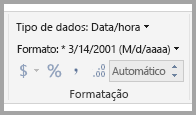
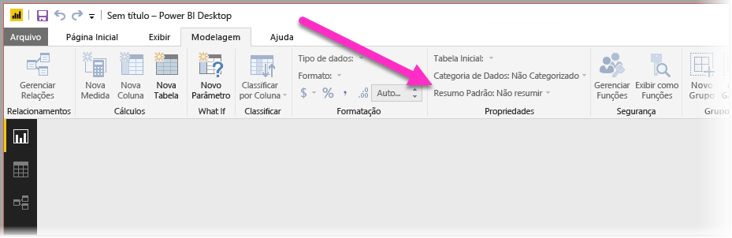
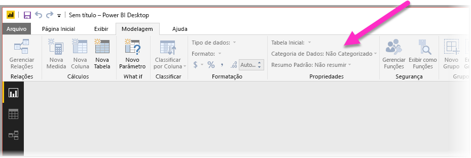
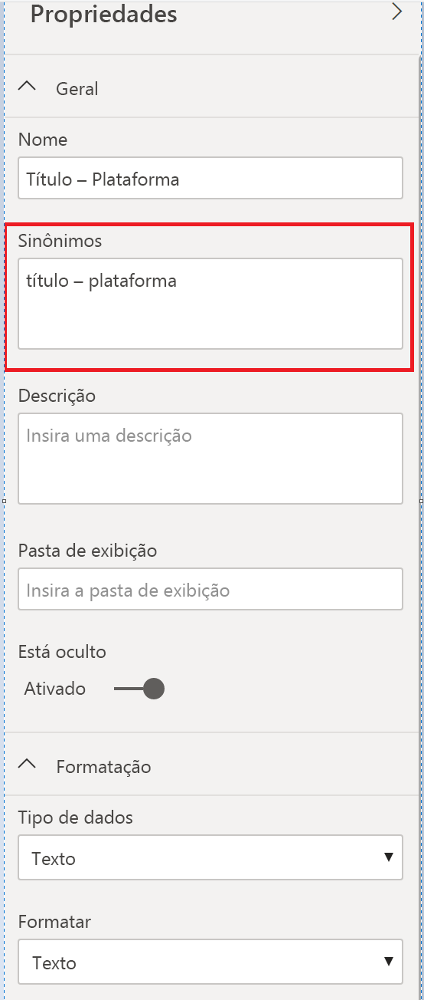

# Melhores práticas para otimizar a P e R no Power BI
Usar linguagem natural e expressões comuns para fazer perguntas sobre seus dados é eficiente. Ainda mais avançado é quando os seus dados dão as respostas, exatamente o que a P e R no Power BI faz.

Para habilitar P e R para interpretar com êxito a coleção de perguntas a qual é capaz de responder, a seção de P e R deve fazer suposições sobre o modelo. Se a estrutura do modelo não atender a uma ou mais dessas suposições, ajuste o modelo. Esses ajustes para P e R são as mesmas otimizações de práticas recomendadas para qualquer modelo no Power BI, independentemente se você usar P e R.

Nas seções a seguir, descrevemos como ajustar o modelo para que funcione bem com P e R no Power BI.

## Ajustes automáticos feitos pela P e R

### Tabelas de medidas

Nas versões anteriores da P e R, as tabelas de medidas confundiam a P e R, pois a tabela subjacente era desconectada. A P e R funciona corretamente com as tabelas de medidas agora.

### Nomes de tabelas em conflito com nomes de colunas

Nas versões anteriores da P e R, se uma tabela e uma coluna tinham o mesmo nome, a tabela tinha preferência. Esse problema foi resolvido e, portanto, você não precisa mais corrigir esse problema em seus modelos.

## Etapas manuais para melhorar a P e R

### Use as novas ferramentas de P e R para corrigir suas perguntas

Com as ferramentas de P e R, você pode ensinar seus principais termos comerciais à P e R e corrigir as perguntas feitas pelos usuários finais. Às vezes, algumas perguntas ainda não podem ser respondidas, porque os dados estão ausentes ou formatados incorretamente. Nesse caso, leia as outras seções abaixo para ajudar você a otimizá-los. Leia mais sobre as [Ferramentas de P e R](q-and-a-tooling-intro.md).

## Adicionar relacionamentos ausentes

Se o modelo tiver relações ausentes entre as tabelas, nem os relatórios do Power BI nem a P e R poderão interpretar como uni-las. Relacionamentos são a base de um bom modelo. Por exemplo, você não poderá solicitar o “total de vendas para clientes de Seattle” se a relação entre a tabela *orders* e a tabela *customers* estiver ausente. As imagens a seguir mostram um modelo que precisa de trabalho e um modelo que está pronto para a P e R. 

**Precisa de trabalho**

Na primeira imagem, não há nenhuma relação entre as tabelas Customers, Sales e Products.

**Pronto para P e R**

Na primeira imagem, as relações são definidas entre as tabelas.

## Renomear tabelas e colunas

A escolha de tabelas e colunas é importante para P e R. Por exemplo, digamos que você tenha uma tabela chamada *ResumoClientes* que contenha uma lista de seus clientes. Você precisaria fazer perguntas como "Liste os resumos de clientes em Chicago" em vez de "Listar os clientes em Chicago". 

Embora a P e R possa fazer uma separação básica de palavras e a detecção de plurais, ela pressupõe que os nomes da tabela e da coluna refletem com precisão o conteúdo.

Considere outro exemplo. Imagine que você tenha uma tabela chamada *Efetivo* que contenha nome e sobrenome e números de funcionários. Você tem outra tabela chamada *Funcionários* que contém números de funcionários, números de trabalho e datas de início. Pessoas familiarizadas com o modelo talvez entendam essa estrutura. Alguém que pergunta "contagem dos funcionários" vai ter uma contagem das linhas da tabela "Funcionários". Provavelmente, esse resultado não é o que a pessoa tinha em mente, pois é uma contagem de todos os trabalhos dos quais todos os funcionários já participaram. Seria melhor renomear essas tabelas para refletir realmente o que elas contêm.

**Precisa de trabalho**

Nomes de tabelas como *StoreInfo* e *Product List* precisam de trabalho.

**Pronto para P e R**

Tabelas chamadas *Store* e *Products* funcionam melhor.

## Corrigir os tipos de dados incorretos

Dados importados podem ter tipos de dados incorretos. Em particular, as colunas *data* e *número* que são importadas como *cadeias de caracteres* não são interpretadas por P e R como datas e números. Certifique-se de selecionar o tipo de dados correto em seu modelo do Power BI.

## Marcar colunas de ano e identificador como Não resumir

O Power BI agrega agressivamente colunas numéricas por padrão, portanto perguntas como "total de vendas por ano" às vezes podem resultar em um total geral de vendas junto com o total de anos. Se você tiver colunas específicas nas quais não deseja que o Power BI exiba esse comportamento, defina a propriedade **Resumo Padrão** na coluna como **Não Resumir**. Lembre-se das colunas **ano**, **mês**, **dia** e **ID**, pois elas são os problemas mais frequentes. Outras colunas que não são convenientes para soma, como *age*, também podem se beneficiar da configuração **Resumo Padrão** como **Não Resumir** ou **Média**. Essa configuração está na guia **Modelagem**.

## Escolher uma categoria de dados para cada coluna de data e geografia

A **Categoria de Dados** fornece conhecimento semântico adicional sobre o conteúdo de uma coluna além de seu tipo de dados. Por exemplo, você pode marcar uma coluna de inteiro como um CEP, uma coluna de cadeia de caracteres como uma cidade, um país/uma região etc. A P e R usa essas informações de duas maneiras importantes: Para seleção de visualização e para desvios de idioma.

Em primeiro lugar, P e R usa as informações de **Categoria de Dados** para ajudar a tomar decisões sobre qual tipo de exibição visual será usado. Por exemplo, ela reconhece que colunas com **Categorias de Dados** de data ou hora geralmente são uma boa escolha para o eixo horizontal do gráfico de linhas ou o eixo de reprodução de um gráfico de bolhas. E pressupõe que os resultados que contém colunas com **Categorias de Dados** geográficos podem ter uma boa aparência em um mapa.

Em segundo lugar, P e R faz algumas suposições informadas sobre como os usuários falarão sobre as colunas de data e geografia, para ajudá-los a entender determinados tipos de perguntas. Por exemplo, "quando" em "Quando John Smith foi contratado?" é quase certo para mapear para uma coluna de data e "Brown" em "Contagem de clientes em Brown" é mais provável de ser uma cidade que uma cor de cabelo.

## Escolher uma classificação por coluna para as colunas relevantes

A propriedade **Classificar por Coluna** permite a classificação em uma coluna para classificar automaticamente uma coluna diferente. Por exemplo, quando pedir "classificar clientes por tamanho de camisa", você provavelmente desejará que a coluna de tamanho de camisa classifique pelo número de tamanho subjacente (XS, S, M, L, XL) em vez de em ordem alfabética (L, M, S, XL, XS).

## Normalizar seu modelo

Tenha certeza de que não estamos sugerindo que você precisa alterar a forma do modelo inteiro. No entanto, certas estruturas são tão difíceis que as P e R não as manipula bem. Se você executar uma normalização básica da estrutura do modelo, a usabilidade dos relatórios do Power BI aumentará consideravelmente, junto com a precisão dos resultados da P e R.

Siga esta regra geral: cada "item" exclusivo abordado pelo usuário deve ser representado por exatamente um objeto do modelo (tabela ou coluna). Portanto, se seus usuários falam sobre clientes, deve haver um objeto *cliente*. Se os usuários falam sobre vendas, deve haver um objeto *vendas*. Bem simples, não é? Dependendo da forma dos dados com os quais você está iniciando, pode ser. Há recursos avançados de modelagem de dados disponíveis no **Editor de Consultas** se você precisar, embora muitas das transformações mais simples possam ocorrer simplesmente usando cálculos no modelo do Power BI.

As seções a seguir contêm algumas transformações comuns que talvez você precise executar.

### Criar novas tabelas para entidades de várias colunas

Se você tiver várias colunas que atuam como uma única unidade distinta dentro de uma tabela maior, essas colunas deverão ser divididas em sua própria tabela. Por exemplo, digamos que você tenha uma coluna Nome do contato, Cargo do contato e Telefone do contato na tabela *Empresas*. Um design melhor seria ter uma tabela *Contatos* separada para conter o Nome, o Cargo e o Telefone, e um link para a tabela *Empresas*. Isso facilita muito para fazer perguntas sobre contatos independentemente de perguntas sobre empresas para as quais eles são o contato e aumenta a flexibilidade de exibição.

**Precisa de trabalho**

**Pronto para P e R**

### Dinamizar para eliminar pacotes de propriedade

Se você tiver *recipientes de propriedades* no modelo, eles deverão ser reestruturados para ter uma única coluna por propriedade. Embora os pacotes de propriedade sejam convenientes para gerenciar grandes números de propriedades, eles têm várias limitações inerentes que nem os relatórios do Power BI nem P e R são projetados para encontrar uma solução alternativa.

Por exemplo, considere uma tabela *CustomerDemographics* com as colunas CustomerID, Property e Value, em que cada linha representa uma propriedade diferente do cliente (por exemplo, idade, estado civil, cidade etc.). Ao sobrecarregar o significado da coluna Valor com base no conteúdo da coluna Propriedade, P e R não consegue interpretar a maioria das consultas que fazem referência a ela. Uma pergunta simples, como "mostrar a idade de cada cliente" pode funcionar, desde que ela possa interpretada como "mostrar os clientes e os dados demográficos do cliente em que a propriedade é idade". No entanto, a estrutura do modelo simplesmente não dá suporte a perguntas um pouco mais complexas como "idade média dos clientes em Chicago". Embora os usuários que criam diretamente os relatórios do Power BI possam, às vezes, encontrar formas inteligentes de obter os dados que procuram, P e R só funciona quando cada coluna tem apenas um único significado.

**Precisa de trabalho**

**Pronto para P e R**

### União para eliminar o particionamento

Se você particionou seus dados em várias tabelas ou dinamizou os valores em várias colunas, é difícil ou impossível para os usuários executar várias operações comuns. Considere primeiro uma tabela típica de particionamento: uma tabela *Sales2000-2010* e uma tabela *Sales2011-2020*. Se todos os relatórios importantes forem restritos a uma década específica, provavelmente você poderia deixar desta forma para relatórios do Power BI. Porém, a flexibilidade da P e R leva os usuários a esperar respostas a perguntas como “total de vendas por ano”. Para que essa consulta funcione, você precisará unir os dados em uma única tabela de modelo do Power BI.

Da mesma forma, considere a possibilidade de uma coluna de valor dinâmico típico: uma tabela *BookTour* contendo as colunas Autor, Livro, Cidade1, Cidade2 e Cidade3. Com uma estrutura semelhante a essa, até mesmo perguntas simples como "contagem de livros por cidade" não podem ser interpretadas corretamente. Para que essa consulta funcione, crie uma tabela *BookTourCities* separada, que une os valores de cidade em uma única coluna.

**Precisa de trabalho**

**Pronto para P e R**

### Dividir colunas formatadas

Se a fonte da qual você está importando os dados contiver colunas formatadas, os relatórios do Power BI (e a P e R) não acessarão o interior da coluna para analisar o conteúdo dela. Portanto, se tiver, por exemplo, uma coluna **Endereço Completo** que contém o endereço, a cidade e o país, você também deverá dividi-la em colunas de Endereço, Cidade e País para que os usuários possam consultá-las individualmente.

**Precisa de trabalho**

**Pronto para P e R**

Da mesma forma, se você tiver colunas de nome completo de uma pessoa, adicione as colunas **Nome** e **Sobrenome**, caso alguém queira fazer perguntas usando nomes parciais. 

### Criar novas tabelas para colunas com vários valores

Também em uma situação semelhante, se a fonte da qual você está importando os dados contiver colunas com vários valores, os relatórios do Power BI (e a P e R) não acessarão o interior da coluna para analisar o conteúdo. Portanto, se você tiver, por exemplo, uma coluna Compositor que contém os nomes de vários compositores de uma música, divida-a em várias linhas em uma tabela *Compositores* separada.

**Precisa de trabalho**

**Pronto para P e R**

### Desnormalizar para eliminar relacionamentos inativos

Uma exceção à regra de "normalização é melhor" ocorre quando há mais de um caminho para ir de uma tabela a outra. Por exemplo, se você tiver uma tabela *Voos* com colunas SourceCityID e DestinationCityID, cada uma delas estará relacionada à tabela *Cidades*. Uma dessas relações precisa ser marcada como inativa. P e R só podem usar relacionamentos ativos, você não pode fazer perguntas sobre origem ou destino, dependendo do que você escolher. Se você desnormalizar as colunas de nome de cidade na tabela *Voos*, pode fazer perguntas como: "listar os voos de amanhã tendo Seattle como cidade de origem e São Francisco como cidade de destino".

**Precisa de trabalho**

**Pronto para P e R**

### Adicionar sinônimos a tabelas e colunas

Esta etapa aplica-se especificamente a P e R (e não a relatórios do Power BI em geral). Os usuários geralmente têm uma variedade de termos que eles usam para se referir à mesma coisa, como total de vendas, vendas líquidas, total de vendas líquidas. Você pode adicionar esses sinônimos a tabelas e colunas no modelo do Power BI. 

Esta etapa pode ser importante. Mesmo com nomes de tabelas e colunas simples, os usuários da P e R fazem perguntas usando o vocabulário que é primeiramente apresentado a eles. Eles não fazem escolhas em uma lista predefinida de colunas. Quanto mais sinônimos sensatos você adicionar, melhor será a experiência dos usuários com o seu relatório. Para adicionar sinônimos, no Power BI Desktop, acesse a exibição Modelo, selecione a guia Modelagem e selecione um campo ou uma tabela. O painel Propriedades mostra a caixa **Sinônimos**, em que é possível adicionar sinônimos.

 Tenha cuidado ao adicionar sinônimos. A adição do mesmo sinônimo a mais de uma coluna ou tabela introduz ambiguidade. A P e R usa o contexto quando possível para escolher entre sinônimos ambíguos, mas nem todas as perguntas têm contexto suficiente. Por exemplo, quando o usuário pergunta sobre a “contagem de clientes”, se há três itens com o sinônimo “cliente” no modelo, talvez ele não receba a resposta que está buscando. Nesses casos, garanta que o sinônimo primário seja exclusivo, pois é ele que será usado na redefinição. Ele pode alertar o usuário da ambiguidade (por exemplo, uma reformulação de "mostrar o número de registros de clientes arquivados"), orientando-os a perguntar de maneira diferente.
