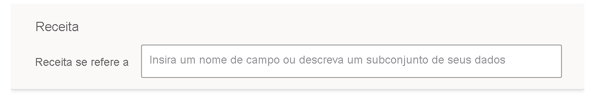

# Ensinar as P e R para entender as perguntas e os termos em P e R do Power BI

Na seção **Ensinar P e R** da configuração de P e R, você treina o P e R para entender as perguntas e os termos em idioma natural que ele não reconheceu. Para começar, você envia uma pergunta que contém uma ou mais palavras que o P e R não reconheceu. O P e R então solicita que você defina esse termo. Você pode inserir um filtro ou um nome de campo que corresponde ao que a palavra representa. O P e R então reinterpreta a pergunta original. Se estiver satisfeito com os resultados, salve-os.

> [!NOTE]
> A funcionalidade de Ensinar P e R só dá suporte ao modo de importação. Ela também ainda não dá suporte para a conexão a uma fonte de dados local ou Azure Analysis Services. Essa limitação deverá ser removida em versões subsequentes do Power BI.

## Comece a ensinar P e R

1. No Power BI Desktop, na faixa de opções **Modelagem**, selecione **Configuração de P e R** > **Ensinar P e R**.

    

2. Digite uma frase com um termo que P e R não reconheça e selecione **Enviar**.

3. Selecione a palavra sublinhada em vermelho. 

    O recurso de P e R oferece sugestões e solicita que você informe a definição correta do termo. 
    
3. Em **Definir os termos que P e R não entendeu**, forneça uma definição.

    

4. Selecione **Salvar** para visualizar o visual atualizado.

5. Insira a próxima pergunta ou selecione o **X** para fechar.

Os consumidores de seu relatório não verão essa alteração até que você publique o relatório de volta para o serviço.

## Definir substantivos e adjetivos

Você pode ensinar as P e R dois tipos de termos:

- Substantivos
- Adjetivos

### Definir um sinônimo de substantivo

Ao trabalhar com os dados, muitas vezes há nomes de campos que poderiam ser chamados por nomes alternativos. Um exemplo seria "Vendas". Várias palavras ou frases podem se referir a vendas, como "receita". Se uma coluna for chamada "Vendas" e os consumidores de relatório digitarem "receita", o P e R poderá não escolher a coluna correta para responder à pergunta adequadamente. Neste caso, você deseja informar o P e R de que "Vendas" e "Receita" referem-se à mesma coisa.

P e R detecta automaticamente quando uma palavra não reconhecida é um substantivo usando o conhecimento do Microsoft Office. Se o P e R detectar um substantivo, ele o informará da seguinte maneira:

- <your term> **refere-se a** 

Você preenche a caixa com o termo de seus dados.

Se você fornecer algo diferente de um campo do modelo de dados, poderá obter resultados indesejáveis.

### Definir uma condição de filtro de adjetivo

Às vezes você pode querer definir termos que atuem como uma condição nos dados subjacentes. Um exemplo poderia ser "Editores incríveis". "Incrível" pode ser uma condição que seleciona apenas Editores que publicaram X números de produtos. O P e R tenta detectar adjetivos, mostrando um prompt diferente:

- <field name> **que têm**  

Você preenche a caixa com a condição.

Alguns exemplos de condições que você pode definir são:

- País, que é EUA
- País, que não é EUA
- Produtos > 100
- Produtos maior que 100
- Produtos = 100
- Produtos é igual a 100
- Produtos < 100
- Produtos menor que 100

Nestes exemplos, 'Produtos' pode ser um nome de coluna ou uma medida. 

Também é possível especificar uma agregação na expressão de P e R em si. Por exemplo, se 'produtos populares' forem produtos com pelo menos 100 unidades vendidas, você poderá definir produtos com 'soma de unidades vendidas > 100' como populares.  

:::image type="content" source="media/q-and-a-tooling-teach-q-and-a/power-bi-qna-popular-products.png" alt-text="Definir 'produtos populares'":::

Você só pode definir uma única condição em ferramentas. Para definir condições mais complexas, use DAX para criar uma coluna ou medida calculada e, em seguida, use a seção de ferramentas para criar uma só condição para a coluna ou medida calculada.

## Gerenciar termos

Depois de fornecer as definições, você pode voltar para ver todas as correções feitas e editá-las ou excluí-las. 

1. Em **Configuração de P e R**, vá para a seção **Gerenciar termos**.

2. Exclua os termos que você não queira mais. No momento, não é possível editar termos. Para redefinir um termo, exclua o termo e defina-o.

    

## Próximas etapas

Há diversas melhores práticas para melhorar o mecanismo de linguagem natural. Para obter mais informações, confira as [Melhores práticas de P e R](q-and-a-best-practices.md).
