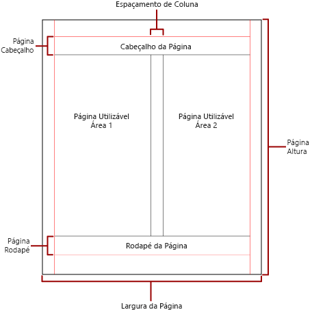

# Paginação em relatórios paginados no Power BI

 *Paginação* refere-se ao número de páginas em um relatório e à maneira como os itens do relatório estão organizados nessas páginas. A paginação nos relatórios paginados do Power BI varia dependendo da extensão de renderização usada para exibir e entregar o relatório. Quando você executa um relatório no servidor de relatório, ele usa o renderizador HTML. O HTML segue um conjunto específico de regras de paginação. Se exportar o mesmo relatório para PDF, por exemplo, você estará usando o renderizador de PDF, que usa um conjunto de regras diferente. Portanto, o relatório é paginado de forma diferente. É necessário entender as regras usadas para controlar a paginação nos relatórios paginados do Power BI. Em seguida, você poderá criar um relatório de fácil leitura e otimizá-lo para o renderizador que planeja usar para entregar o relatório de maneira bem-sucedida.  
  
 Este tópico aborda o impacto do tamanho da página física e do layout do relatório sobre como a quebra de página impressa renderiza o relatório. É possível definir propriedades para modificar o tamanho e as margens da página física e dividir o relatório em colunas usando o painel **Propriedades do Relatório**, o painel **Propriedades** ou a caixa de diálogo **Configuração da Página**. Acesse o painel **Propriedades do Relatório** clicando na área azul fora do corpo do relatório. Acesse a caixa de diálogo **Configuração da Página** clicando em **Executar** na guia Início e, em seguida, clicando em **Configuração da Página** na guia Executar.  
  
> [!NOTE]  
>  Se você criou um relatório para ter o tamanho de uma página, mas ele é renderizado em várias delas, verifique se a largura do corpo do relatório, incluindo as margens, não é maior do que a largura do tamanho da página física. Para impedir que páginas vazias sejam adicionadas ao seu relatório, reduza o tamanho do contêiner arrastando o canto dele para a esquerda.  

## O corpo do relatório  
 O corpo do relatório é um contêiner retangular exibido como espaço em branco na superfície de design. Ele pode aumentar ou diminuir para acomodar os itens de relatório contidos dentro dele. O corpo do relatório não reflete o tamanho da página física e, de fato, o corpo do relatório pode aumentar para além dos limites do tamanho da página física para abranger várias páginas do relatório. Alguns renderizadores, como o Microsoft Excel, Word, HTML e MHTML, renderizam relatórios que aumentam ou diminuem dependendo do conteúdo da página. Os relatórios renderizados nesses formatos são otimizados para exibição baseada em tela, como em um navegador da Web. Esses renderizadores adicionam quebras de página verticais quando necessário.  
  
 Você pode formatar o corpo do relatório com uma cor, estilo e largura de borda. Você também pode adicionar uma cor e uma imagem da tela de fundo.  
  
## A página física  
 O tamanho da página física é o tamanho do papel. O tamanho do papel especificado para o relatório controla a maneira como ele é renderizado. Os relatórios renderizados em formatos de quebra de página física inserem quebras de página horizontal e verticalmente com base no tamanho físico da página. Essas quebras de página fornecem uma experiência de leitura otimizada ao imprimir ou exibir os relatórios em um formato de arquivo com quebra de página física. Os relatórios renderizados em formatos de quebra suave de página inserem quebras de página horizontalmente com base no tamanho físico. Novamente, as quebras de página fornecem uma experiência de leitura otimizada ao exibir o relatório em um navegador da Web.  
  
 Por padrão, o tamanho da página é de 8,5 x 11 polegadas, mas você pode alterá-lo no painel **Propriedades do Relatório** ou na caixa de diálogo **Configuração da Página** ou alterando as propriedades PageHeight e PageWidth no painel **Propriedades**. O tamanho da página não aumenta ou diminui para acomodar o conteúdo do corpo do relatório. Se desejar que o relatório seja exibido em uma única página, todo o conteúdo dentro do corpo do relatório deverá se ajustar na página física. Se ele não se ajustar e você usar o formato de quebra de página impressa, então o relatório exigirá mais páginas. Se o corpo do relatório ultrapassar a borda direita da página física, a quebra de página será inserida horizontalmente. Se o corpo do relatório ultrapassar a borda inferior da página física, a quebra de página será inserida verticalmente.  
  
 Se desejar substituir o tamanho da página física definido no relatório, poderá especificar o tamanho da página física usando as configurações de Informações do Dispositivo para o renderizador específico que você está usando para exportar o relatório. Para obter uma lista completa, confira [Configurações de Informações do Dispositivo para Extensões de Renderização](https://docs.microsoft.com/sql/reporting-services/device-information-settings-for-rendering-extensions-reporting-services?view=sql-server-2017) na documentação do SQL Server Reporting Services.  
  
### Margens

 As margens são desenhadas da borda das dimensões da página física para dentro de acordo com a configuração da margem especificada. Se o item de relatório se estender para a área da margem, ele será recortado para que a área de sobreposição não seja renderizada. Se você especificar tamanhos de margem que fazem a largura horizontal ou vertical da página ser igual a zero, o padrão das configurações da página será zero. As margens são especificadas no painel **Propriedades do Relatório** ou na caixa de diálogo **Configuração da Página** ou alterando as propriedades TopMargin, BottomMargin, LeftMargin e RightMargin no painel **Propriedades**. Se desejar substituir o tamanho da margem definido no relatório, poderá especificar o tamanho da margem usando as configurações de Informações do Dispositivo para o renderizador específico que você está usando para exportar o relatório.  
  
 A área da página física que permanece depois que o espaço é alocado para as margens, o espaçamento da coluna e o cabeçalho e o rodapé da página, é chamada de *área de página utilizável*. As margens são aplicadas somente quando você renderiza e imprime relatórios em formatos de renderizador de quebra de página impressa. A imagem a seguir indica a margem e a área utilizável da página de uma página física.  
  
 
  
### Colunas no estilo de boletim informativo  

 Seu relatório pode ser dividido em colunas, como colunas de um jornal. As colunas são tratadas páginas *lógicas* renderizadas na mesma página *física*. Elas são organizadas da esquerda para a direita, de cima para baixo e são separadas por espaço em branco entre cada coluna. Se o relatório for dividido em mais de uma coluna, cada página física será dividida verticalmente em colunas e cada coluna será considerada uma página lógica. Por exemplo, suponha que você tenha duas colunas em uma página física. O conteúdo do relatório preenche a primeira coluna e, em seguida, a segunda. Se o relatório não se ajustar inteiramente nas primeiras duas colunas, ele preencherá a primeira e a segunda colunas na próxima página. As colunas continuam sendo preenchidas, da esquerda para a direita, de cima para baixo, até que todos os itens de relatório sejam renderizados. Se você especificar tamanhos de coluna que fazem a largura horizontal ou vertical ser igual a zero, o padrão do espaçamento da coluna será zero.  
  
 Especifique as colunas no painel **Propriedades do Relatório** ou na caixa de diálogo **Configuração da Página** ou alterando as propriedades TopMargin, BottomMargin, LeftMargin e RightMargin no painel **Propriedades**. Se desejar usar um tamanho de margem que não esteja definido, especifique o tamanho da margem usando as configurações de Informações do Dispositivo para o renderizador específico para o qual você está exportando o relatório. As colunas são aplicadas somente quando você renderiza e imprime relatórios em PDF ou em formatos de imagem. A imagem a seguir indica a área utilizável da página de uma página que contém colunas.  
  

  
## Quebras e nomes de página

 Um relatório pode ser mais legível e seus dados serem mais fáceis de auditar e exportar quando ele tem nomes de página. O Reporting Services fornece propriedades para relatórios; regiões de dados de tabela, matriz e lista; grupos; e retângulos no relatório para controlar a paginação, redefinir números de página e fornecer novos nomes de página de relatório em quebras de página. Esses recursos podem aprimorar relatórios, independentemente do formato no qual os relatórios são renderizados, mas são especialmente úteis ao exportar relatórios para pastas de trabalho do Excel.

> [!NOTE]
> As regiões de dados de tabela, matriz e lista são realmente o mesmo tipo de região de dados nos bastidores: um *tablix*. Portanto, você pode encontrar esse nome. 

 A propriedade InitialPageName fornece o nome da página inicial do relatório. Se o relatório não incluir nomes de página para quebras de página, o nome da página inicial será usado para todas as páginas criadas por quebras de página. Não é necessário usar um nome de página inicial.  
  
 Um relatório renderizado pode fornecer um novo nome de página para a nova página que a quebra de página cria. Para fornecer o nome da página, defina a propriedade PageName de uma tabela, matriz, lista, grupo ou retângulo. Não é necessário especificar nomes de página em quebras. Caso contrário, o valor de InitialPageName é usado no lugar. Se InitialPageName também estiver em branco, a nova página não terá nome.  
  
 Regiões de dados de tabela, matriz e lista, grupos e retângulos dão suporte a quebras de página.  
  
 A quebra de página inclui as seguintes propriedades:  
  
- **BreakLocation** fornece o local da quebra para o elemento de relatório habilitado para quebra de página: no início, no fim ou no início e no fim. Em grupos, BreakLocation pode estar localizado entre grupos.  
  
- **Disabled** indica se uma quebra de página aplica-se ao elemento de relatório. Se a propriedade for avaliada como True, a quebra de página será ignorada. Essa propriedade é usada para desabilitar dinamicamente quebras de página com base em expressões quando o relatório é executado.  
  
- **ResetPageNumber** indica se o número de página deve ser redefinido como 1 quando ocorre uma quebra de página. Se a propriedade for avaliada como True, o número da página será redefinido.  
  
 Você pode definir a propriedade BreakLocation nas caixas de diálogo **Propriedades do Tablix**, **Propriedades do Retângulo** ou **Propriedades do Grupo**, mas você deve definir as propriedades Disabled, ResetPageNumber e PageName no painel de Propriedades do Construtor de Relatórios. Se as propriedades no painel Propriedades estiverem organizadas por categoria, você as encontrará na categoria **PageBreak**. Para grupos, a categoria **PageBreak** está dentro da categoria **Group**.  
  
 Você pode usar constantes e expressões simples ou complexas para definir o valor das propriedades Disabled e ResetPageNumber. No entanto, você não pode usar a expressão com a propriedade BreakLocation. Para saber mais sobre como escrever e usar expressões, confira [Expressões no Construtor de Relatórios do Power BI](report-builder-expressions.md).  
  
 No relatório, você pode escrever expressões que referenciem os nomes de página ou os números de página atuais usando a coleção **Globais**. Para saber mais, confira [Referências Internas de Usuários e Globais](https://docs.microsoft.com/sql/reporting-services/report-design/built-in-collections-built-in-globals-and-users-references-report-builder?view=sql-server-2017) na documentação do Construtor de Relatórios e do Reporting Services.
  
### Nomear guias de pasta de trabalho do Excel

 Essas propriedades são úteis quando você exporta relatórios para pastas de trabalho do Excel. Use a propriedade InitialPage para especificar um nome padrão para o nome da guia da pasta de trabalho quando você exporta o relatório e quebras de página e a propriedade PageName para fornecer nomes diferentes para cada pasta de trabalho. Cada nova página do relatório, definida por uma quebra de página, é exportada para uma pasta de trabalho diferente nomeada pelo valor da propriedade PageName. Se PageName estiver em branco, mas o relatório tiver um nome de página inicial, todas as planilhas na pasta de trabalho do Excel usarão o mesmo nome, o nome da página inicial.  
  
 Para saber mais sobre como essas propriedades funcionam quando relatórios são exportados para o Excel, confira [Exportar para o Microsoft Excel](https://docs.microsoft.com/sql/reporting-services/report-builder/exporting-to-microsoft-excel-report-builder-and-ssrs) na documentação do Construtor de Relatórios e do Reporting Services.  
  
## Próximas etapas

- [Exibir um relatório paginado no serviço do Power BI](../consumer/paginated-reports-view-power-bi-service.md)
- [Evitar páginas em branco ao imprimir relatórios paginados](../guidance/report-paginated-blank-page.md)
- Mais perguntas? [Experimente a Comunidade do Power BI](https://community.powerbi.com/)
