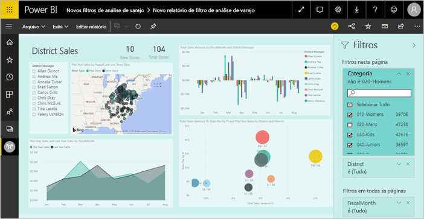
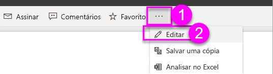
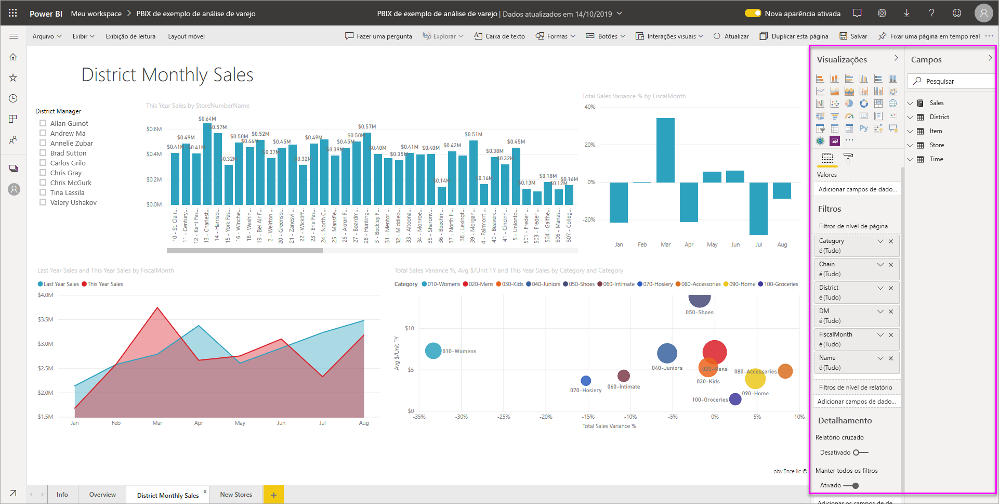
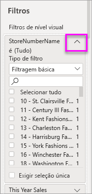
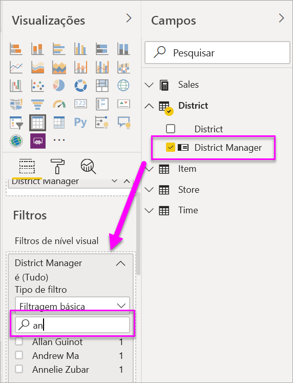
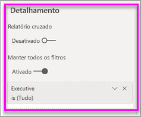
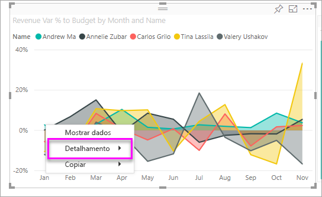
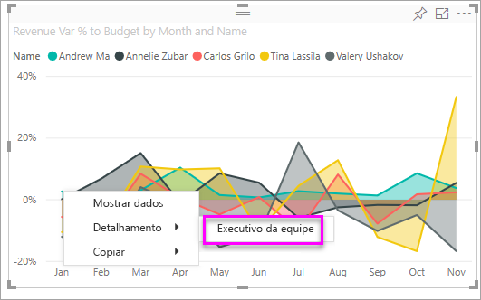

# Adicionar um filtro a um relatório no Power BI

[!INCLUDE [power-bi-service-new-look-include](includes/power-bi-service-new-look-include.md)]

Este artigo explica como adicionar um filtro de página, um filtro de visualização, um filtro de relatório ou um filtro de detalhamento a um relatório no Power BI. Os exemplos neste artigo estão no serviço do Power BI. As etapas são quase idênticas no Power BI Desktop.

**Você sabia?** O Power BI tem uma nova experiência de filtro. Leia mais sobre [a nova experiência de filtro em relatórios do Power BI](power-bi-report-filter.md).

O Power BI oferece uma série de tipos de filtro diferentes, de manuais a automáticos, para o detalhamento e a passagem. Leia sobre os [diferentes tipos de filtro](power-bi-report-filter-types.md).

## Filtros no modo de exibição de Edição ou no modo de exibição de Leitura
Você pode interagir com relatórios em dois modos de exibição diferentes: Leitura e Edição. Os recursos de filtragem disponíveis dependem de qual modo você está. Leia tudo [sobre filtros e realce em relatórios do Power BI](power-bi-reports-filters-and-highlighting.md) para obter detalhes.

Este artigo descreve como criar filtros no **modo de exibição de Edição** de relatório.  Para saber mais sobre filtros no modo de exibição de Leitura, confira [Interagir com filtros no modo de exibição de Leitura de relatórios](consumer/end-user-report-filter.md).

Como os filtros *persistem*, quando você sai do relatório, o Power BI mantém o filtro, a segmentação e outras alteração de exibição de dados que você realizou. Portanto, você pode continuar onde parou quando retornar ao relatório. Se não quiser que as alterações do filtro persistam, selecione **Redefinir para padrão** na barra de menus superior.

## Níveis de filtros no painel Filtros
Independentemente de você estar usando o Power BI Desktop ou o serviço do Power BI, o painel Filtros é exibido no lado direito da tela do relatório. Caso não veja o painel Filtros, selecione o ícone ">" no canto superior direito para expandi-lo.

Você pode definir filtros em três níveis diferentes para o relatório: filtros de nível visual, nível de página e nível de relatório. Também é possível definir filtros de detalhamento. Este artigo explica os diferentes níveis.

## Adicionar um filtro a um visual
Você pode adicionar um filtro de nível visual a um visual específico de duas maneiras diferentes. 

* Filtre um campo que já está sendo usado pela visualização.
* Identifique um campo que ainda não esteja sendo usado pela visualização e adicione esse campo diretamente ao bucket **Filtros no nível do visual**.

A propósito, esse procedimento usa o exemplo de Análise de Varejo, caso você queira baixá-lo para acompanhar. Baixe o pacote de conteúdo de [exemplo de Análise de Varejo](sample-retail-analysis.md#get-the-content-pack-for-this-sample).

### Filtrar os campos no visual

1. Selecione **Mais opções (...)**  > **Editar relatório** para abrir seu relatório no modo de exibição de Edição.
   
   

2. Abra o painel de visualizações e filtros e o painel Campos (se ainda não estiverem abertos).
   
   
3. Selecione um visual para ativá-lo. Todos os campos que estiverem sendo usados pelo visual serão identificados no painel **Campos** e também listados no painel **Filtros**, sob o cabeçalho **Filtros no nível do visual**.
   
   
4. Agora, vamos adicionar um filtro a um campo que já está sendo usado pela visualização. 
   
    Role para baixo até a área de **Filtros de nível visual** e selecione a seta para expandir o campo que você deseja filtrar. Neste exemplo, vamos filtrar **StoreNumberName**.
     
     
    
    Defina os controles de filtro **Básico**, **Avançado** ou **N superior**. Neste exemplo, pesquisaremos na filtragem Básica por **cha** e selecionaremos esses cinco armazenamentos.
     
     
   
    O visual é alterado para refletir o novo filtro. Se você salvar o relatório com o filtro, os leitores do relatório verão o visual filtrado a princípio, e poderão interagir com o filtro no modo de exibição de Leitura, marcando ou desmarcando valores.
     
    
    
    Quando você usa o filtro em um campo usado no Visual em que o campo é agregado (por exemplo, soma, média ou contagem), está filtrando o valor *agregado* em cada ponto de dados. Portanto, pedir para filtrar o visual acima, em que **Vendas deste ano > 500.000** significaria ver apenas o ponto de dados **13 – Charleston Fashion Direct** no resultado. Filtrar em [medidas de modelo](desktop-measures.md) sempre se aplica ao valor agregado do ponto de dados.

### Filtrar com um campo que não está no visual

Agora, vamos adicionar um campo novo à nossa visualização como um filtro no nível do visual.
   
1. No painel Campos, selecione o campo que você deseja adicionar como um novo filtro no nível do visual e arraste-o até a **área de Filtros no nível do visual**.  Neste exemplo, arrastaremos **Gerente Regional** para o bucket **Filtros no nível do visual**, pesquisaremos por **an** e selecionaremos os três gerentes.
     
    

    Observe que o **Gerente Regional***não* é adicionado à visualização em si. A visualização ainda é composta por **StoreNumberName** como o eixo e **Vendas Deste Ano** como o valor.  
     
    

    E a própria visualização agora é filtrada para mostrar apenas as vendas desses gerentes neste ano para as lojas especificadas.
     
    

    Se você salvar o relatório com o filtro, os leitores do relatório poderão interagir com o filtro **Gerente regional** no modo de exibição de Leitura, marcando ou desmarcando valores.
    
    Se você arrastar uma *coluna numérica* para o painel de filtro para criar um filtro de nível visual, o filtro será aplicado às *linhas de dados subjacentes*. Por exemplo, adicionar um filtro no campo **UnitCost** e defini-lo em que **UnitCost** > 20 só mostraria dados para as linhas de produtos em que o custo unitário fosse maior que 20, independentemente do custo total da unidade para os pontos de dados mostrados no visual.

## Adicionar um filtro a uma página inteira

Também é possível adicionar um filtro de nível de página a uma página inteira.

1. No serviço Power BI, abra o relatório de análise de varejo e vá para a página **Vendas Mensais do Distrito**. 

2. Selecione **...**  > **Editar relatório** para abrir o relatório no modo de exibição de Edição.
   
   
2. Abra o painel de visualizações e filtros e o painel Campos (se ainda não estiverem abertos).
3. No painel Campos, selecione o campo que você deseja adicionar como um novo filtro de nível de página e arraste-o para a área **Filtros no nível da página**.  
4. Selecione os valores que você deseja filtrar e defina os controles de filtragem **Básico** ou **Avançado**.
   
   Todas as visualizações na página serão redesenhadas para refletir a alteração.
   
   

    Se você salvar o relatório com o filtro, os leitores do relatório poderão interagir com o filtro no modo de exibição de Leitura, marcando ou desmarcando valores.

## Adicionar um filtro de detalhamento
Com o detalhamento no serviço do Power BI Desktop e do Power BI Desktop, você pode criar uma página de relatório de *destino* que tem como foco uma entidade específica, como um fornecedor, cliente ou fabricante. Agora, de outras páginas de relatório, os usuários podem clicar com o botão direito do mouse em um ponto de dados da entidade em questão e executar uma consulta drill-through na página focalizada.

### Criar um filtro de detalhamento
Para continuar, baixe o [exemplo de Rentabilidade do Cliente](sample-customer-profitability.md#get-the-content-pack-for-this-sample). Vamos supor que você deseja uma página concentrada em áreas de negócios executivos.

1. No serviço Power BI, abra o relatório de análise de varejo e vá para a página **Vendas Mensais do Distrito**.

2. Selecione **Mais opções (...)**  > **Editar relatório** para abrir seu relatório no modo de exibição de Edição.
   
   

1. Adicione uma nova página ao relatório e chame-a de **Equipe Executiva**. Essa será a página de *destino* do detalhamento.
2. Adicione visualizações que acompanham as principais métricas das áreas de negócios executivos da equipe.    
3. Na tabela **Executivos**, arraste **Executivo** para a caixa de filtros de detalhamento.    
   
    
   
    Observe que o Power BI adiciona uma seta para voltar à página do relatório.  Selecionar essa seta faz com que os usuários retornem à página do relatório de *origem*: a página que eles estavam quando aceitaram o detalhamento. No modo de exibição de Edição, mantenha pressionada a tecla Ctrl para selecionar a seta para voltar
   
     

### Usar o filtro de detalhamento
Vejamos como funciona o filtro de detalhamento.

1. Inicie a página do relatório **Scorecard da Equipe**.    
2. Vamos supor que você é Andrew Ma e deseja ver a página do relatório Equipe Executiva filtrada somente com os seus dados.  No gráfico de áreas do canto superior esquerdo, clique com o botão direito do mouse em qualquer ponto de dados verde para abrir a opção de menu Detalhamento.
   
    
3. Selecione **Detalhamento > Equipe Executiva** executar uma consulta drill-through na página de relatório chamada **Equipe Executiva**. A página é filtrada para mostrar informações do ponto de dados no qual você clicou com o botão direito do mouse, nesse caso, Andrew Ma. Quaisquer filtros na página de origem são aplicados à página do relatório de detalhamento.  
   
    

## Adicionar um filtro de nível de relatório para filtrar um relatório inteiro

1. Selecione **Editar relatório** para abrir o relatório no modo de exibição de Edição.
   
   

2. Abra o painel de visualizações e filtros e o painel Campos,se ainda não estiverem abertos.
3. No painel Campos, selecione o campo que você deseja adicionar como um novo filtro no nível do relatório e arraste-o para a área **Filtros no nível do relatório**.  
4. Selecione os valores que você deseja filtrar.

    Os visuais na página ativa e em todas as páginas do relatório são alterados para refletir o novo filtro. Se você salvar o relatório com o filtro, os leitores do relatório poderão interagir com o filtro no modo de exibição de Leitura, marcando ou desmarcando valores.

1. Selecione a seta para voltar para retornar à página do relatório anterior.

## Considerações e solução de problemas

- Se você não vir o painel Campos, verifique se você está no [Modo de Exibição de Edição](service-interact-with-a-report-in-editing-view.md) do relatório    
- Se você tiver feito muitas alterações nos filtros e quiser retornar para as configurações padrão do autor do relatório, selecione **Redefinir para padrão** na barra de menus superior.

## Próximas etapas
[Faça um tour pelo painel Filtros do relatório](consumer/end-user-report-filter.md)

[Filtros e realce em relatórios](power-bi-reports-filters-and-highlighting.md)

[Diferentes tipos de filtros no Power BI](power-bi-report-filter-types.md)

Mais perguntas? [Experimente a Comunidade do Power BI](https://community.powerbi.com/)

